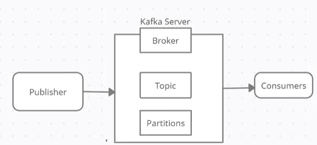
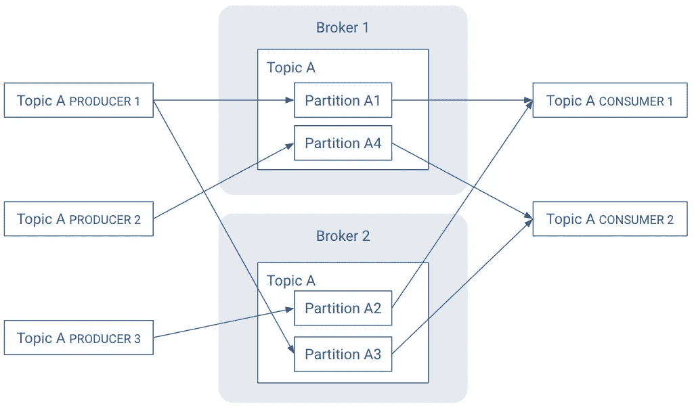
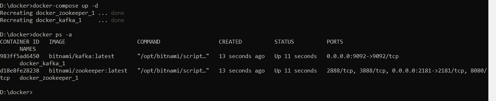
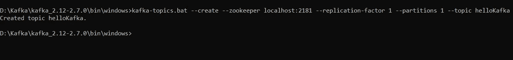
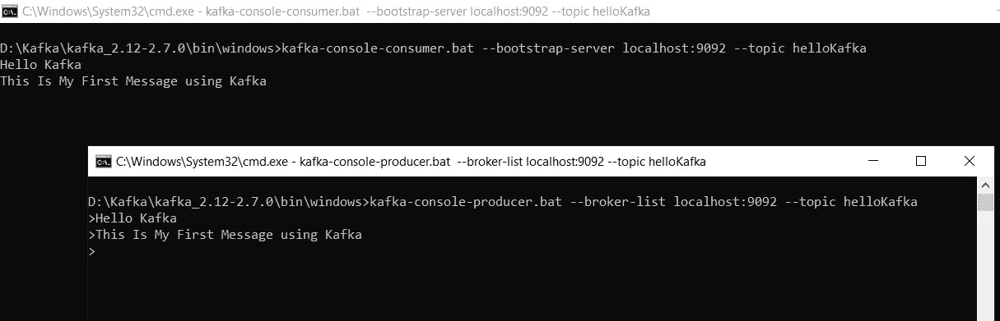
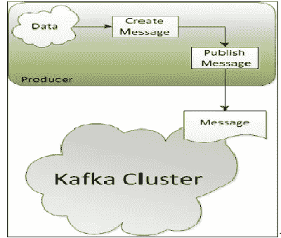
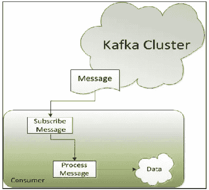

# Docker 和 Java 中的卡夫卡入门

> 原文：<https://medium.com/javarevisited/getting-started-with-kafka-in-docker-and-java-2051ccef1ca7?source=collection_archive---------0----------------------->

如今，几乎每个企业都由数据驱动。每个应用程序都会创建数据，无论是日志消息、指标、用户活动、传出消息还是其他什么。数据的每个字节都有一些信息。我们接受信息，分析它，处理它，然后创造更多的输出。

## 卡夫卡是什么

Kafka 是开源软件，它提供了一个存储、读取和分析数据流的框架。今天，任何来源产生的数据和日志都在被实时处理、再处理、分析和处理，这就是为什么 [Apache Kafka](/javarevisited/top-10-apache-kafka-online-training-courses-and-certifications-621f3c13b38c) 在数据流中发挥着重要作用。卡夫卡提供了三个主要功能。

*   发布和订阅记录流，类似于消息队列或企业消息传递系统。
*   按照记录生成的顺序有效地存储记录流。
*   实时处理记录流。

Kafka 主要用于构建实时流数据管道和适应数据流的应用程序。它结合了消息传递、存储和流处理，允许存储和分析历史和实时数据。

[](https://javarevisited.blogspot.com/2018/04/top-5-apache-kafka-course-to-learn.html)

## 卡夫卡是如何工作的

名为**生产者**的应用向 Kafka 节点**代理**发送消息**记录**，所述消息由名为**消费者**的其他应用处理。消息存储在一个**主题**中，消费者订阅该主题以接收新消息。

[](https://javarevisited.blogspot.com/2015/07/how-to-use-wait-notify-and-notifyall-in.html)

这些是卡夫卡体系的主要部分:

**消息和批次:【Kafka 内的数据单位称为消息。与消息最相似的是一行或一条记录。消息
只是一个字节数组，因此其中包含的数据对于 Kafka 来说没有特定的格式或意义。一个消息可以有一个可选的
位元数据，它被称为一个键。**

为了效率，消息被批量写入卡夫卡。批处理只是消息的集合，所有这些消息都被生成到同一个主题和分区。批处理越大，单位时间内可以处理的消息就越多，但是单个消息传播的时间就越长。

**模式:**一致的数据格式在 Kafka 中很重要，因为它允许写和读消息分离。消息模式有许多选项，这取决于应用程序的个人需求，比如 JSON 或 XML 易于使用且易于阅读。

**生产者和消费者** : Kafka 客户端是系统的用户，有两种基本类型生产者和消费者。还有用于数据集成的高级客户端 APIsKafka Connect API 和用于流处理的 Kafka Streams。高级客户端使用生产者和消费者作为构建块，并在其上提供更高级别的功能。

[](https://javarevisited.blogspot.com/2017/02/how-to-consume-json-from-restful-web-services-Spring-RESTTemplate-Example.html)

生产者创造新的信息。在其他发布/订阅系统中，这些可以被称为发布者或作者。一般来说，会针对特定主题生成一条消息。

消费者阅读信息。在其他发布/订阅系统中，这些客户端可以被称为订阅者或读者。消费者订阅一个或多个主题，并按照消息产生的顺序阅读消息。消费者通过跟踪偏移量来跟踪它已经消费了哪些消息。

**主题和分区:**卡夫卡的信息被分类成主题。与主题最相似的是数据库表或文件系统中的文件夹。生产者应用程序将数据写入主题，消费者应用程序从主题中读取数据。

[](https://javarevisited.blogspot.com/2020/05/top-16-jms-java-messaging-service-interview-questions-answers.html)

主题被分成几个部分。一个分区是一个日志。消息以仅附加的方式写入其中，并按照从开始到结束的顺序读取。一个主题可以有多个分区。分区允许通过跨多个代理将数据分成特定的主题来并行化主题。每个分区可以托管在不同的服务器上，这意味着单个主题可以跨多个服务器进行水平扩展，以提供远远超出单个服务器能力的性能。

**代理和集群**:Kafka 集群由一台或多台服务器组成，每台 Kafka 服务器称为一个代理。一个 Kafka 经纪人接收来自生产者的信息，并将它们存储在一个磁盘上。Kafka 代理允许消费者通过主题、分区和偏移量获取消息。我们可以创建多种类型的集群，如下所示:

*   单一节点:单一代理集群
*   单个节点:多个代理集群
*   多个节点:多个代理集群

Zookeeper : Kafka 提供了默认的简单的 Zookeeper 配置文件，用于跟踪 Kafka 集群节点的状态，同时也跟踪 Kafka 主题、分区等。ZooKeeper 有五个主要功能。具体来说，ZooKeeper 用于控制器选举、集群成员资格、主题配置、访问控制列表和配额。

1 控制器选举。如果某个节点关闭，ZooKeeper 会确保其他副本充当分区领导者的角色，取代正在关闭的节点中的分区领导者。

2 集群成员。ZooKeeper 保存了集群中所有正常运行的代理的列表。

3 话题配置。ZooKeeper 维护所有主题的配置，包括现有主题的列表、每个主题的分区数量、副本的位置等。

4 个访问控制列表(ACL)。ZooKeeper 还维护所有主题的 ACL。这包括谁或什么被允许读/写每个主题、消费者团体信息。

5 个配额。ZooKeeper 访问每个客户端允许读/写多少数据。

## 如何在 Docker 中启动 Kafka 服务器

**Apache** Kafka 是用 [**Scala**](/javarevisited/5-best-scala-and-functional-programming-books-to-learn-in-2021-97ec9e56f2bd) 和 [**Java**](/javarevisited/10-books-java-developers-should-read-in-2020-e6222f25cc72) **开发的使用流处理的软件总线的框架实现。**在 Windows 上的 [Docker](/javarevisited/top-5-free-courses-to-learn-docker-for-beginners-best-of-lot-b2b1ad2b98ad) 中设置 Kafka 服务器的先决条件是 java，一个正在运行的 Docker 实例，一个正在运行的 Zookeeper 实例。这是一个非常简单的例子。在本例中，我们将创建一个节点，即一个代理集群。

1.  在 Windows 上安装 Docker 桌面[https://hub . Docker . com/editions/community/Docker-ce-Desktop-Windows/](https://hub.docker.com/editions/community/docker-ce-desktop-windows/)
2.  下载卡夫卡式[https://www.apache.org/dyn/closer.cgi?path =/Kafka/2 . 7 . 0/Kafka _ 2.12-2 . 7 . 0 . tgz](https://www.apache.org/dyn/closer.cgi?path=/kafka/2.7.0/kafka_2.12-2.7.0.tgz)
3.  启动 Docker 引擎
4.  创建一个名为“D:\docker”的目录
5.  在上面的目录中创建一个 docker-compose.yml 文件

6.启动动物园管理员和卡夫卡' docker-compose up -d '。它将下载 Kafka 和 zookeeper 的图像，并为它们创建和运行一个实例。

[](https://www.java67.com/2018/02/5-free-docker-courses-for-java-and-DevOps-engineers.html)

7.现在卡夫卡和动物园管理员都在跑。现在，我们使用在步骤 2 中下载的 Kafka 创建一个主题。我们将解压它，进入目录/bin/window/并从那里打开 cmd 和创建主题的命令。

```
kafka-topics.bat --create --zookeeper localhost:2181 --replication-factor 1 --partitions 1 --topic helloKafkaorkafka-topics.bat --create --bootstrap-server localhost:9092 --replication-factor 1 --partitions 1 --topic helloKafka
```



8.主题“helloKafka”已经创建，现在我们需要创建一个生产者和消费者来访问这个主题。从位置<\ Kafka _ 2.12–2 . 7 . 0 \ bin \ windows >打开两个命令提示符，一个用于生产者，另一个用于消费者。在每个命令提示符下创建生产者和消费者。现在在生产者上键入一些消息。生产者将该消息发送到消费者订阅的主题“helloKafka ”,我们将在消费者的屏幕上看到该消息。

```
1)kafka-console-producer.bat --broker-list localhost:9092 --topic helloKafka2)kafka-console-consumer.bat --bootstrap-server localhost:9092 --topic helloKafka
```



## Kafka Java API

无论您是将 Kafka 用作队列、消息总线还是数据存储平台，您都将通过编写向 Kafka 写入数据的生产者、从 Kafka 读取数据的消费者或服务于这两种角色的应用程序来使用 Kafka。Apache Kafka 带有内置的客户端 API，开发人员可以在开发与 Kafka 交互的应用程序时使用这些 API。

Kafka 有五个针对 Java 和 Scala 的核心 API:

Kafka 包括五个核心 API:

1.  **Producer API** 允许应用程序向 Kafka 集群中的主题发送数据流。
2.  **ConsumerAPI** 允许应用程序从 Kafka 集群中的主题读取数据流。
3.  **流 API** 允许将数据流从输入主题转换成输出主题。
4.  **Connect API** 允许实现连接器，这些连接器不断地从某个源系统或应用程序拉入 Kafka，或者从 Kafka 推入某个接收系统或应用程序。
5.  管理 API 允许管理和检查主题、代理和其他 Kafka 对象。

## 如何打造卡夫卡制作人

生产者是创建消息并将其发布给 Kafka 代理以供进一步消费的应用程序。



Kafka Producer API 用于创建定制的生产者应用程序，该应用程序生成消息并将其发送给代理。重要的接口和类如下。

**接口生产者< K，V > :** 这是 KafkaProducer
**类 KafkaProducer < K，V > :** 这个类用于创建一个 Kafka 客户端，作为向 Kafka 集群发布记录的生产者。
**Class Producer config:**这用于为 Kafka 生产者 **类 ProducerRecord < K，V > :** 一个要发送给 Kafka 的键/值对进行配置。这包括记录要发送到的主题名、可选的分区号以及可选的键和值。

1.  我们需要定义一些属性来与 Kafka broker 建立连接，并将这些属性传递给 Kafka producer:

```
properties.put(ProducerConfig.*BOOTSTRAP_SERVERS_CONFIG*, "localhost:9092");
properties.put(ProducerConfig.*KEY_SERIALIZER_CLASS_CONFIG*, StringSerializer.class);
properties.put(ProducerConfig.*VALUE_SERIALIZER_CLASS_CONFIG*, StringSerializer.class);
```

**生产者配置。BOOTSTRAP_SERVERS_CONFIG** :这个属性告诉生产者需要连接到发布的代理。

**生产者配置。KEY_SERIALIZER_CLASS_CONFIG 和 ProducerConfig。VALUE _ SERIALIZER _ CLASS _ CONFIG:**该属性告知在准备将消息从生产者传输到代理时需要使用的序列化程序类。

2.如下创建一个生产者实例，我们需要传递我们在上面定义的属性

```
Producer<String, String> producer = new KafkaProducer<>(properties);
```

3.需要创建一个将发送的 **ProducerRecord** 的实例。

```
ProducerRecord<String, String> record = new ProducerRecord<>("TopicName", Key, Value);
*//produce the record* producer.send(record);
```

完整的程序如下所示

## 如何创造卡夫卡式的消费者

消费者是使用 Kafka 生产者发布的消息并处理从中提取的数据的应用程序。

[](https://javarevisited.blogspot.com/2017/12/top-5-courses-to-learn-big-data-and.html#axzz6mKbga8XV)

1.  我们需要定义一些属性来与 Kafka 代理建立连接，并将这些属性传递给 Kafka 消费者

```
properties.put(ConsumerConfig.*BOOTSTRAP_SERVERS_CONFIG*, "localhost:9092");
properties.put(ConsumerConfig.*GROUP_ID_CONFIG*, "my-first-consumer-group");
properties.put(ConsumerConfig.*KEY_DESERIALIZER_CLASS_CONFIG*, StringDeserializer.class);
properties.put(ConsumerConfig.*VALUE_DESERIALIZER_CLASS_CONFIG*, StringDeserializer.class);
properties.put(ConsumerConfig.*AUTO_OFFSET_RESET_CONFIG*, "earliest");
properties.put(ConsumerConfig.*ENABLE_AUTO_COMMIT_CONFIG*, false);
```

完整的消费者应用程序看起来像

到目前为止，我在这里所做的都是 Kafka 的基础知识，比如什么是 Kafka，Kafka 的重要组件，如何在窗口机器上创建单节点-单代理类型的集群。如何创造卡夫卡生产者和消费者？

Kafka 在实时应用中有不同的用例。考虑一个网站的使用案例，其中需要跟踪连续的安全事件，如用户身份验证和访问安全资源的授权，并且需要针对任何安全漏洞实时做出决策。使用任何典型的面向批处理的数据处理系统(首先需要收集所有数据，然后进行分析/处理以揭示模式),将会为时过晚，无法确定 web 应用程序是否存在任何安全威胁。这些是实时数据处理的经典用例。

物联网设备由各种传感器组成，这些传感器具有多个以高频率收集的数据点。一个简单的恒温器在与房间或汽车连接时，每分钟可以产生几个字节的数据。这些海量数据集用于存储、转换、处理、查询和分析。

Kafka 的另一个非常重要的用例是捕获用户点击流数据，如页面浏览、搜索等，作为实时发布-订阅提要。由于数据量非常大，这些数据被发布到中心主题，每个活动类型一个主题。这些主题可供包括实时处理和监控在内的各种应用的许多消费者订阅。

我希望这个基本介绍能帮助你了解和理解 [Apache Kafka](/javarevisited/top-5-big-data-frameworks-java-developers-can-learn-in-2021-9a3e20437c8c) ，它的基本原理，以及它的用例。在下一篇文章中，我将尝试解释如何使用其他 Kafka API，如 Kafka Stream API、Kafka Admin API，如何在将消息存储到 Kafka 集群之前拦截它，如何将 Kafka 与 Storm 集成。

如果你喜欢这些信息，请仔细阅读，并通过评论和建议分享你的知识和理解。

# 资源

1.  [卡夫卡文献](https://kafka.apache.org/documentation/):伟大、广泛、高质量的文献
2.  【https://www.confluent.io/learn/kafka-tutorial/ 