# Spring Boot rabbit MQ 入门

> 原文：<https://medium.com/javarevisited/getting-started-with-rabbitmq-in-spring-boot-6323b9179247?source=collection_archive---------0----------------------->


这只是我出于审美目的拍摄的一张照片，:D

RabbitMQ 是部署最广泛的开源消息代理。它为您提供了一些很好的特性，帮助您使您的应用程序异步，并卸载一些关键逻辑，以便您可以专注于您的业务代码。在本文中，我已经展示了在 [spring boot 项目](/javarevisited/10-best-java-microservices-courses-with-spring-boot-and-spring-cloud-6d04556bdfed?source=rss-bb36d8439904------2&utm_source=dlvr.it&utm_medium=linkedin)中开始使用 RabbitMQ、自动创建队列和交换、在消费者上配置重试能力、处理错误和分布式跟踪的最简单方法。

我来分享一个搞笑的事件。当我第一次开始使用 rabbitMQ 时，我去了网站，发现了那个[教程](https://www.rabbitmq.com/getstarted.html)页面。在那个页面上有 6 个不同语言的常见场景的教程。嘿！Java 教程就在 python 下面。它看起来还是一样的…

[](https://javarevisited.blogspot.com/2014/03/top-10-websphere-mq-series-interview-questions-answers-active-rabbit.html)

然后我浏览了几页 java 教程，惊讶于它的易用性。只需要创建一个连接工厂，声明通道，用 channels basicPublish 方法发布，用 delivery 回调接收。

是的，这些步骤帮助我整合了我的用例，甚至将我的应用程序部署到生产中。然后在另一个项目中，我也以这种方式开始，在我脑海中的某个地方，我不断听到一个声音..“应该有更干净的办法！，应该有更好的办法！!"。相信我，更好的方法总是在我眼前，但我却看不见。在同一个教程页面上有…

[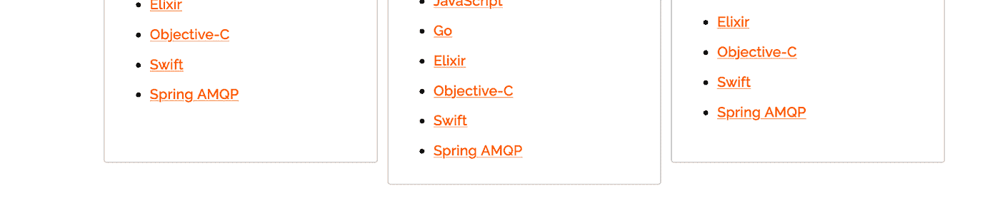](https://javarevisited.blogspot.com/2020/05/top-16-jms-java-messaging-service-interview-questions-answers.html)

**每个教程的春季 AMQP** 版本正是我所需要的，但从来不知道它的存在。

[Spring AMQP](https://spring.io/projects/spring-amqp) 让 RabbitMQ 的开发更有弹性。它提供了监听器容器、rabbitTemplate 和 rabbitAdmin。所以让我们来看看一些行动吧！

# 设置 RabbitMQ

因此，在做任何事情之前，我们需要有一个 RabbitMQ 实例运行，以便与它进行交互，如果您没有这样的实例的话。你可以使用下面的 docker compose 快速得到一个。

```
version: '3.1'

services:
 rabbitmq:
   image: rabbitmq:management
   restart: no
   ports:
     - "5672:5672"
     - "15672:15672"
```

这里 5672 端口由应用程序使用，在 15672 上我们得到一个用于管理的 web 界面。

打开你的浏览器，点击 localhost:15672，你会看到下面的页面:

[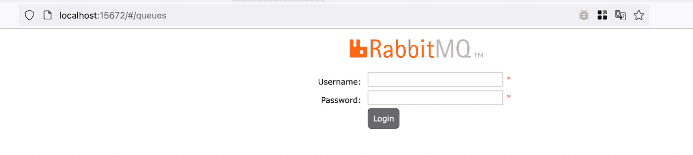](https://javarevisited.blogspot.com/2020/11/why-devops-engineer-learn-docker-kubernetes.html)

使用 guest/guest 作为用户名和密码。如果您正在将 rabbitmq 部署到生产环境中，那么更改默认凭证总是一个好主意。但是现在应该没事了。

# 在 Spring boot 应用程序中添加依赖关系

要使用 rabbitMQ，我们需要添加 **spring-boot-starter-amqp** 依赖项。由于我使用的是 maven，我将在 pom.xml 中添加以下内容:

```
<dependency>
   <groupId>org.springframework.boot</groupId>
   <artifactId>spring-boot-starter-amqp</artifactId>
</dependency>
```

我还需要在配置文件中添加以下配置:

```
spring:
 rabbitmq:
   host: localhost
   port: 5672
   username: guest
   password: guest
```

现在 spring amqp 知道我们的 rabbitMQ 在哪里，以及使用哪个凭证来连接它。

为了让我在这里展示的例子有关联，我们要做的是。我们将公开一个**用户注册** [控制器](https://javarevisited.blogspot.com/2021/09/how-to-return-different-http-status-from-sprnig-mvc-controller.html)，接收包含姓名、电子邮件等的有效载荷，然后在队列中发布。我们假设注册一个用户需要调用一些其他的服务和[API](https://javarevisited.blogspot.com/2018/01/top-20-libraries-and-apis-for-java-programmers.html)，所以我们把它做成异步的，消费者会做所有这些。

# 将消息发布到队列

现在我已经创建了一个控制器类，并为此添加了其他相关的类。控制器看起来是这样的:

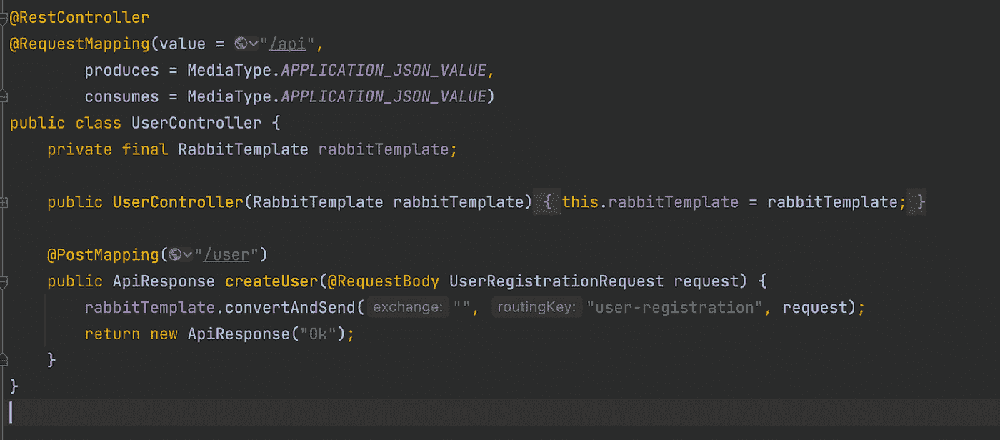

注意，我已经在控制器中添加了 RabbitTemplate，并在 createUser 方法中使用它来发布消息。现在我们需要创建一个队列。为此，我登录了 rabbitMQ 管理控制台。导航到队列选项卡，有一个**添加新队列**选项。

[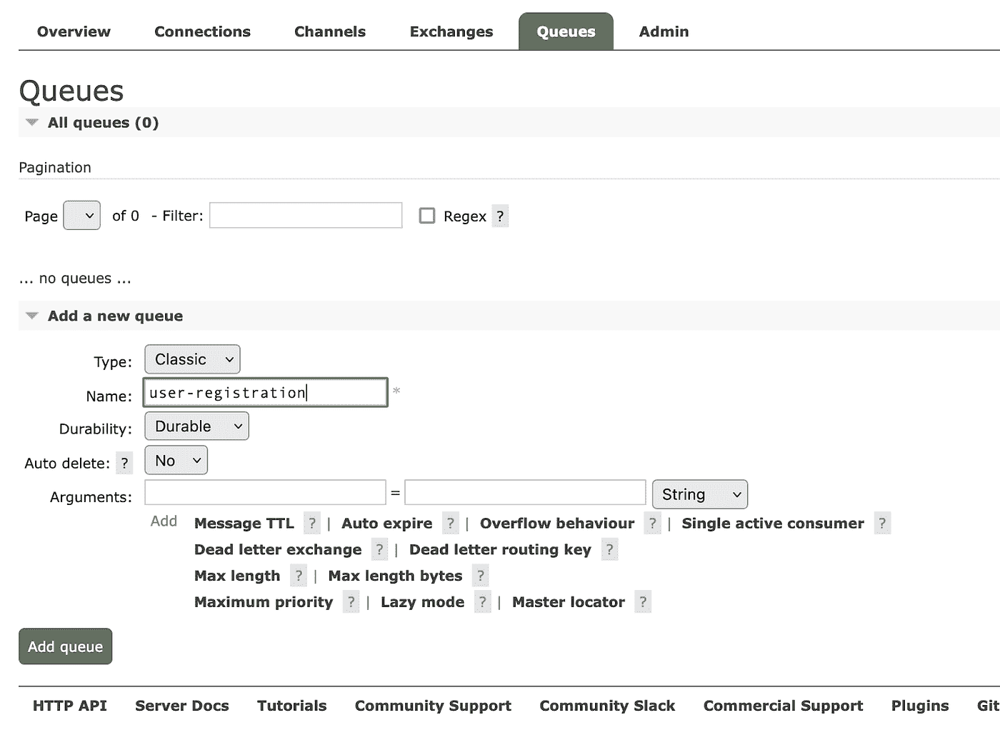](https://javarevisited.blogspot.com/2022/02/-stack-and-queue-data-structure-interview-questions.html)

只需保持其他字段为默认，并将名称设置为**用户注册**。

现在启动应用程序，并使用适当的有效负载访问 api。对我来说是这样的:

```
curl --location --request POST 'http://localhost:8091/api/user' \--header 'Content-Type: application/json' \--data-raw '{"username":"Johnson","email":"johnsn@mail.com","mobileNumber": "017000000111"}'
```

如果一切正常，我们将能够在队列中看到 1 条就绪消息:

[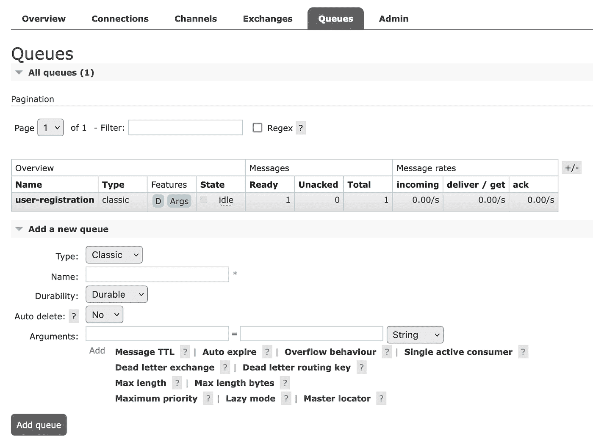](https://javarevisited.blogspot.com/2020/02/top-5-postman-tutorials-and-courses-for-web-developers.html)

要查看消息，单击队列名称并点击获取**消息**选项，哦！有效负载不可读。它在 base64 forma 中。我保证稍后我们会处理它。现在回到编码上来。我用这句话发布了我的信息:

rabbitTemplate.convertAndSend("，"用户注册"，请求)；

这里第一个参数是**交换**，第二个是**路由关键字**，最后一个是有效载荷。但是队列在哪里呢？

在 rabbitMQ 世界中，交换就像一个邮局，队列就像物理位置，路由关键字就是该位置的地址。当我们创建队列并且不与任何交换绑定时，默认的交换会自动与它绑定，并将路由关键字作为队列的名称。这种使用空字符串和队列名作为路由关键字的方法将消息发布到队列中。生产者从不直接向队列发送消息。

# 自动创建队列

目前，通过管理控制台创建和配置队列工作正常。但在现实世界中，这并不理想。想象一下，有 10 个不同的队列。

每当一个新的队友上船，或者你改变你的设备，你需要创建队列。应用程序从开发环境进入测试环境，您需要创建队列。应用程序进入生产阶段，需要有人来创建它们。这将变得乏味且容易出错。Spring AMQP 为我们提供了 rabbitMQ admin 来自动化这些任务。

最好的部分是，您只需要创建一个返回包含队列名称的队列对象的 [Bean](https://javarevisited.blogspot.com/2022/03/how-autowiring-of-beans-works-in-spring.html) 。将所有与 rabbitMQ 相关的 beans 保存在同一个配置文件中是一个很好的做法。现在我的 RabbitMQConfig 看起来像这样:

```
@Configuration
public class RabbitMQConfig {
    @Bean
    public Queue createUserRegistrationQueue() {
        return new Queue("q.user-registration");
    }
}
```

以 **q.** 开始命名队列是 rabbitMQ 的惯例。

继续操作，从管理门户中删除任何以前的队列，然后重启应用程序并点击 api，应该会创建队列并传递消息。

# 添加消费者以处理消息

如果发布的消息没有消费者，那么只有发布者也只是一半的乐趣。拥有一个消费者就像用 *@RabbitListener* 注释一个方法并提到队列一样简单。我的用户注册请求看起来像这样:

```
@Service
@Slf4j
public class UserRegistrationListener {
          @RabbitListener(queues = {"q.user-registration"})
    public void onUserRegistration(UserRegistrationRequest event) {
            log.info("User Registration Event Received: {}", event);
    }
}
```

如果您点击 api 端点进行注册，然后检查日志，您将能够看到以下内容:

[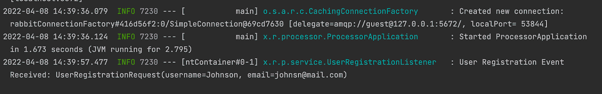](https://javarevisited.blogspot.com/2021/04/top-5-tools-to-test-rest-apis-in-java.html#axzz7CGBoUS1n)

看起来不错！我在消费者中接收预期的有效载荷，rabbitMQ 在内部处理序列化和反序列化，这样我就可以使用一个漂亮的 java 对象。但是，如果我们想直接从管理门户查看消息，我们仍然会看到 base64 格式的消息。这对于开发和故障排除来说并不理想。我们希望看到人类可读格式的信息。

为了实现这一点，我们需要声明一个**Jackson 2 jsonmessageconverter**bean，并将其设置为 rabbitTemplate 中需要转换的消息。需要在我们的 RabitMQConfig 文件中添加这些 beans:

[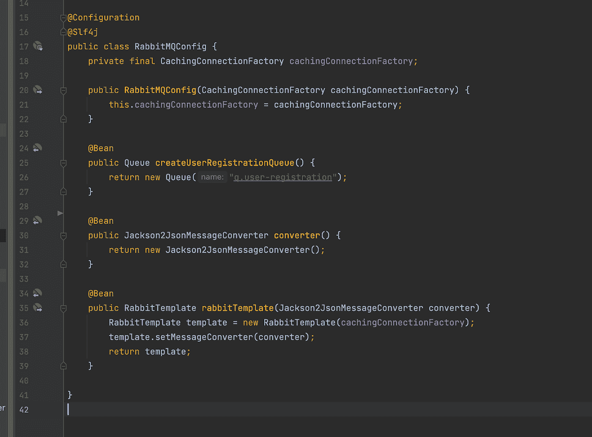](https://javarevisited.blogspot.com/2022/03/3-examples-to-parse-json-in-java-using.html)

注意，我们在构造 rabbitTemplate 时使用了默认的 cachingConnectionFactory。为此，我们需要通过构造函数注入 cachingConnectionFactory。之后，注释掉侦听器以检查门户中的消息。否则，它将在我们有机会看到之前就在消费者方法中被交付。

如果我们现在点击 api，并检查队列，我们将能够从管理门户看到有效负载的文本。

[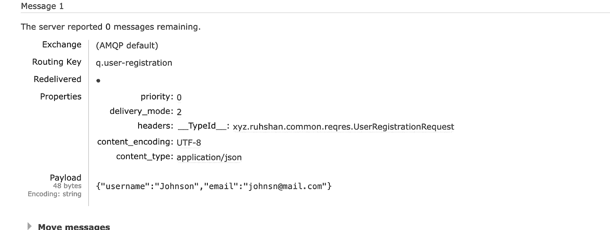](https://javarevisited.blogspot.com/2020/04/top-5-courses-to-learn-java-collections-and-streams.html)

# 注册后通过电子邮件和短信通知用户

假设在完成用户注册后，我们想通过电子邮件和短信通知用户。当然，我们可以编写相应的服务，并在注册后调用它们。那么我们的代码可能如下所示:

```
@RabbitListener(queues = {"q.user-registration"})
public void onUserRegistration(UserRegistrationRequest event) {

        log.info("User Registration Event Received: {}", event);

        /*
        Relevant business logic for user registration
        */

        emailService.sendEmail(event.getEmail());
        smsService.sendSms(event.getMobileNumber());

}
```

但是这种方法存在一些问题。您的通知系统与注册系统紧密结合在一起。如果处理不当，senEmail 方法中的异常也可能会中断 sms 传递。您可能不希望将执行用户注册等繁重任务的同一应用程序的计算资源用于发送电子邮件等轻量级任务。我们在这里能做什么？兔子来了。

我们将创建两个队列，用 RabbitListener 注释我们的方法，提到指定的队列。然后，我们将创建一种特殊类型的交换，称为扇出交换，以绑定队列。这个交换的特点是:不管路由关键字是什么，绑定到这个交换的每个队列都接收消息。

我们需要在 rabbitMQ 配置中添加以下 Bean。

```
@Bean
public Declarables createPostRegistartionSchema(){

return new Declarables(
                new FanoutExchange("x.post-registration"),
                new Queue("q.send-email" ),
                new Queue("q.send-sms"),
                new Binding("q.send-email", Binding.DestinationType.QUEUE, "x.post-registration", "send-email", null),
                new Binding("q.send-sms", Binding.DestinationType.QUEUE, "x.post-registration", "send-sms", null));

}
```

在这里的第一行，我们声明交换，按照惯例交换的名字以 x 开头。

在接下来的两行中，我们声明了队列。然后在最后两行中，我们用这个 *x.post-registration* 交换声明了队列的绑定。

重启应用程序后，转到管理门户的**交易所**选项卡，您会看到有一个以我们给定的名称创建的交易所以及其他交易所。

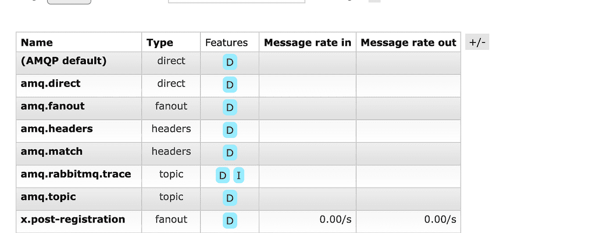

点击它，你会看到绑定:

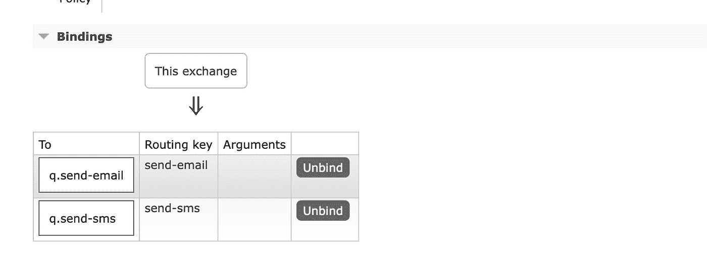

现在我添加了两个消费者，一个用于短信，一个用于邮件:

```
@Service
@Slf4j
public class SendSmsService {
    @RabbitListener(queues = "q.send-sms")
    public void sendSms(UserRegistrationRequest request) {

        log.info("Sending sms to {} ", request.getMobileNumber());
    }
}
--------------------------------------------------------------------
@Service
@Slf4j
public class SendEmailService {

    @RabbitListener(queues = "q.send-email")
    public void sendEmail(UserRegistrationRequest request) {

        log.info("Sending email to {}", request.getEmail());
    }
}
```

最后，在 userRegistrationListener 中添加以下行:

rabbit template . convertandsend(" x . post-registration "，""，event)；

然后重新启动应用程序并点击 api，应该可以看到以下日志:

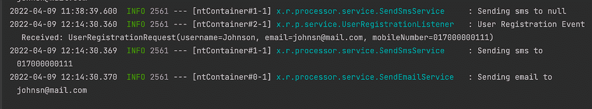

酷吧？提交一次并在多个消费者中接收。现在，这些看起来已经正确解耦了。

# 启用正常重试机制

如前所述，注册用户是一个极其复杂的过程。在某些情况下，可能会引发一些异常，对于这些异常，重试可能是一个好的选择。您可以通过抛出该异常来解决重试 rabbitMQ 的问题。让我们模拟一下这个场景:

```
@RabbitListener(queues = {"q.user-registration"})
public void onUserRegistration(UserRegistrationRequest event)  {
    log.info("User Registration Event Received: {}", event);

    executeRegistration(event);

    rabbitTemplate.convertAndSend("x.post-registration","", event);
}

private void executeRegistration(UserRegistrationRequest event) {
    log.info("Executing User Registration Event: {}", event);

    throw new RuntimeException("Registration Failed");

}
```

我们从侦听器中调用 **executeRegistration** 方法，在这个方法中，我们生成一个 RunTimeException。现在重启应用程序并点击 api。哇！正在重试…问题已解决！但是等等…..它会重试多长时间？直到例外消失。在这种情况下，我们可以更改代码并重启，但在现实世界中这是不可能的。如果异常持续发生，我们需要在某个点停止，并在两次尝试之间等待。你注意到了吗，现在重试太快了？

为了解决这个问题，我们需要声明两个 beans。一个**SimpleRabbitListenerContainerFactory**和另一个**retryoperations interceptor**。然后将这个拦截器添加到 listenerContainerFactory 的通知链中。

```
@Bean
public RetryOperationsInterceptor retryInterceptor(){
    return RetryInterceptorBuilder.stateless().maxAttempts(3)
            .backOffOptions(2000, 2.0, 100000)
            .build();
}

@Bean
public SimpleRabbitListenerContainerFactory rabbitListenerContainerFactory(SimpleRabbitListenerContainerFactoryConfigurer configurer) {
    SimpleRabbitListenerContainerFactory factory = new SimpleRabbitListenerContainerFactory();
    configurer.configure(factory, cachingConnectionFactory);
    factory.setAcknowledgeMode(AcknowledgeMode.AUTO);
    factory.setAdviceChain(retryInterceptor());
    return factory;
}
```

现在重启应用程序并点击 api。它应该只在初次尝试后重试 2 次。两秒后第一次，四秒后第二次。

这里有一个问题，命名 bean**rabbitListenerContainerFactory**覆盖默认的监听器容器工厂。因此，这个重试机制将为所有侦听器激活。如果您不希望这样，并且希望这种机制仅用于 UserRegistrationListener，请执行以下操作。将工厂重命名为其他名称..like:registrationListenerContainerFactory 然后在 RabbitListener 注释行中提到它:

```
@RabbitListener(queues = {"q.user-registration"}, containerFactory = "registrationListenerContainerFactory")
```

请注意，在重试程序耗尽之后，消息将被丢弃。因此，如果在重试过程中不断出现异常，消息将会丢失。对于许多情况来说，这可能不是理想的情况。我们可能希望跟踪故障，以便将来进行进一步的处理或调查。

# 为失败的注册添加死信队列

死信队列只是另一个队列，它的特别之处在于我们何时或如何使用它。首先，我们将为此声明一个模式。

```
@Bean
public Declarables createDeadLetterSchema(){
    return new Declarables(
        new DirectExchange("x.registration-failure"),
        new Queue("q.fall-back-registration"),
        new Binding("q.fall-back-registration", Binding.DestinationType.QUEUE,"x.registration-failure", "fall-back", null)
    );
}
```

只是一个正常的交换，队列和它们的绑定。我已经将路由键设置为“fall-back ”,稍后会用到它。

现在我们将配置我们的 **q.user-registration** ，以便它知道它有一个死信队列。最好删除之前的队列。否则更新的配置可能不会反映。

```
@Bean
public Queue createUserRegistrationQueue() {

    return QueueBuilder.durable("q.user-registration")
        .withArgument("x-dead-letter-exchange","x.registration-failure")
        .withArgument("x-dead-letter-routing-key","fall-back")
        .build();
}
```

这里我们用死信配置声明了队列。这里的论点是不言自明的。

拼图的最后一块。为了确保 rabbitMQ 将消息传达给 DLX，我们需要从侦听器中抛出一个**amqprechectanddontrequeueexception**。但是我们不能现在就扔掉它，因为我们正在使用一个重试拦截器。相反，我们将告诉重试拦截器在用尽时抛出这个异常。像这样:

```
@Bean
public RetryOperationsInterceptor retryInterceptor(){
    return RetryInterceptorBuilder.stateless().maxAttempts(3)
            .backOffOptions(2000, 2.0, 100000)
            .recoverer(new RejectAndDontRequeueRecoverer())
            .build();
}
```

现在，我们必须添加一个侦听器来接收队列中的消息:

```
@Service
@Slf4j
public class FallBackRegistrationService {

    @RabbitListener(queues = {"q.fall-back-registration"})
    public void onRegistrationFailure(UserRegistrationRequest failedRegistration){
        log.info("Executing fallback for failed registration {}", failedRegistration);
  }

}
```

现在重启应用程序并检查日志。在重试尝试的条目之后，将会出现如下新行:

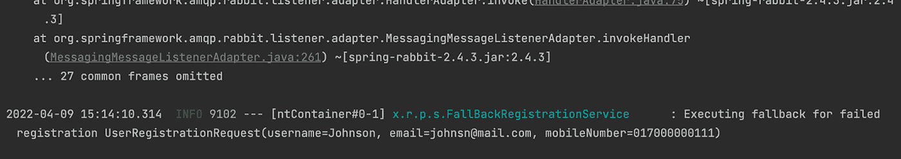

现在就看你想在这里做什么了。您可以将它保存在数据库中，调用其他服务，或者在另一个队列中重新排队。

# 添加分布式跟踪

这是最简单的部分。只需在您的依赖项中添加 sleuth，您将看到跟踪 id 在所有日志中传播。

```
<dependency>
    <groupId>org.springframework.cloud</groupId>
    <artifactId>spring-cloud-starter-sleuth</artifactId>
</dependency>
```

如果涉及不同的应用程序或微服务，这尤其有用。

今天到此为止。

这个演示的所有代码都可以在[这里](https://github.com/Ruhshan/rabbitmq-spring-demo)获得。

支持我👇

[](https://www.buymeacoffee.com/ruhshan)