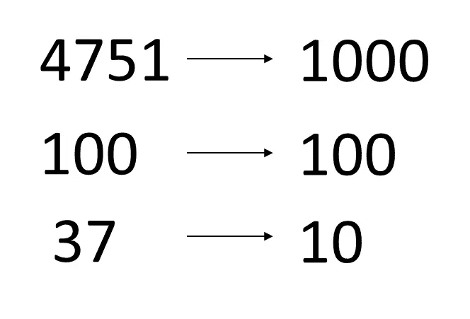

# 给定 N，找出位数相同的最小数

> 原文：<https://medium.com/javarevisited/given-n-find-the-smallest-number-with-the-same-number-of-digits-d0f4d990ae5d?source=collection_archive---------1----------------------->

写一个方法，给定一个原始数 n，返回相同位数的最小数。

例如，给定 N=4751，该方法返回 1000。给定 N=100，该方法应该返回 100。给定 N=1，该方法应该返回 0。

找出位数相同的最小数字。

也许我们想到的第一个想法是从给定的数字开始迭代…