# Google API 证书:自动刷新实用指南 Java 语言

> 原文：<https://medium.com/javarevisited/google-api-credentials-practical-guide-to-automatic-refresh-in-java-3b470bdd6535?source=collection_archive---------1----------------------->

## 利用已经提供的 GoogleCredentials 类

[Rubaitul Azad](https://unsplash.com/@rubaitulazad?utm_source=medium&utm_medium=referral) 在 [Unsplash](https://unsplash.com?utm_source=medium&utm_medium=referral) 上拍摄的照片

## **简介**

仅举几个例子，Gmail API、Google Sheets API 和 Docs API 都是需要从开发人员控制台生成凭证才能访问的 Google APIs。在后台，这些凭据通常用于获取过期时间为 1 小时的身份验证令牌。

在本文中，我们将了解如何利用 Google API 的客户端——特别是处理自动访问令牌刷新的 GoogleCredential 类。记住这一点，让我们来看看我们将经历的一些事情:

*   在 Google 开发者控制台中创建凭证
*   获取刷新令牌
*   为凭证准备一个 [JSON 文件](https://javarevisited.blogspot.com/2014/12/how-to-read-write-json-string-to-file.html)
*   利用 GoogleCredentials 类进行自动刷新

## 在 Google 开发者控制台中创建凭证

让我们前往[https://console.developers.google.com/](https://console.developers.google.com/)——然后点击侧面导航上的`Credentials`:

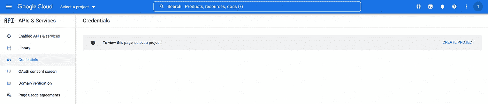

我们可以看到，这个帐户是新创建的；事实上，这是一个虚拟场景——让我们从一开始就模拟这个场景。首先，让我们使用页面左上角的`Create Project`按钮创建一个项目:

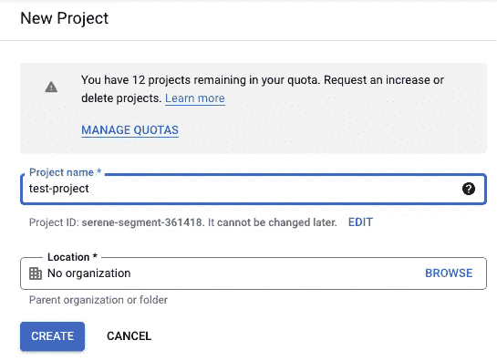

接下来，让我们创建一个`OAuth Client ID`凭证:

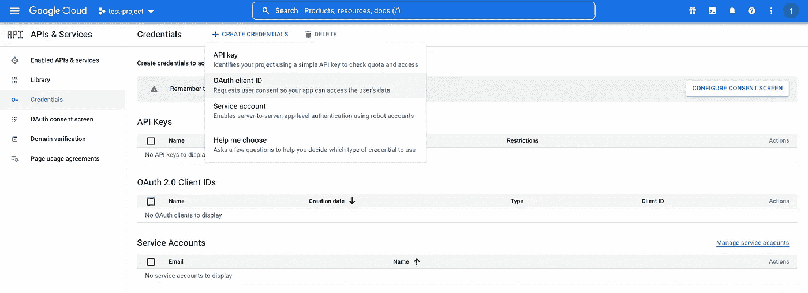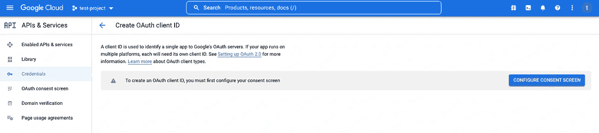

看来我们必须先配置`OAuth consent screen`，所以让我们先这样做:

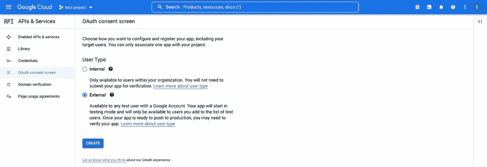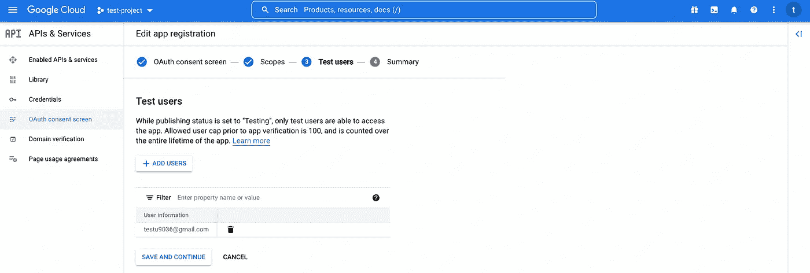

现在，让我们回到创建一个`OAuth Client ID`凭证:

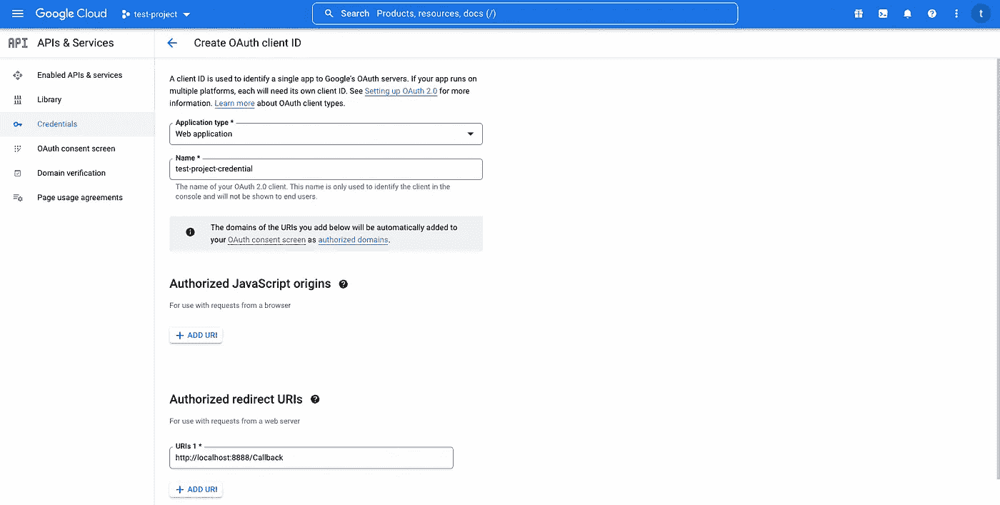

现在，我们可以下载凭证作为`JSON file`或者复制`Client ID`和`Client Secret`:

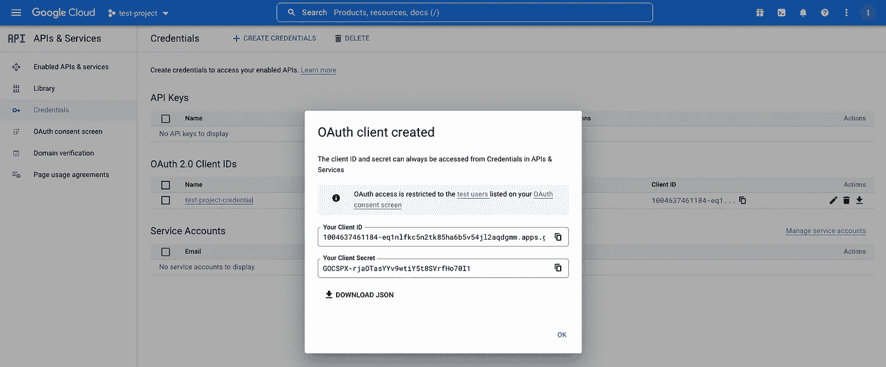

## **获得刷新令牌**

给定我们的`client ID`和`Secret`，现在让我们尝试请求一个刷新令牌。虽然当然可以通过 curl/postman 请求来实现，但另一种直接的方法是使用 Google 的 API 客户端——让我们试试:

运行上述代码后，我们将在控制台上获得一个授权链接:

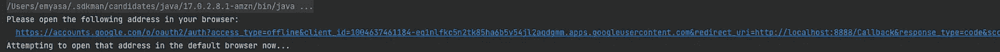

让我们继续吧:

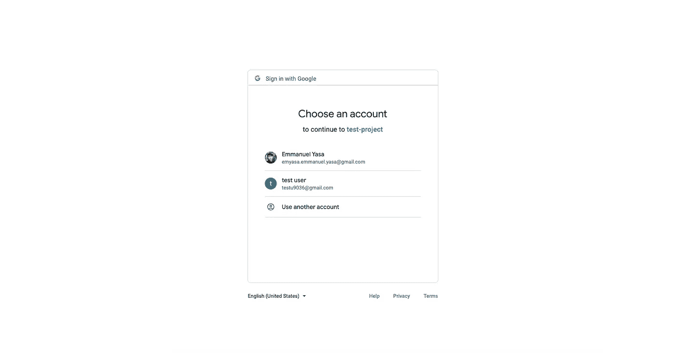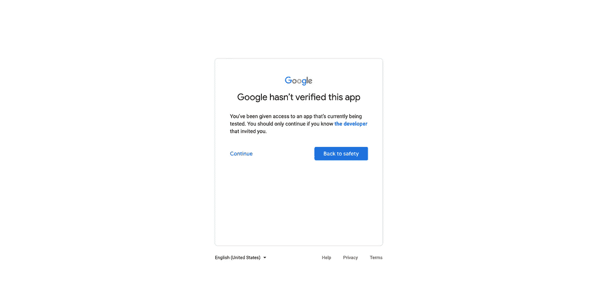

现在，让我们再次检查我们的控制台，看看我们是否成功地打印出了刷新令牌——正如预期的那样，这就是:

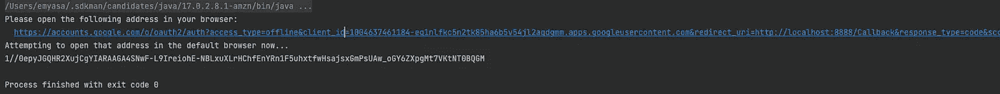

## **为凭证准备 JSON 文件**

我们将利用 GoogleCredentials 类—我们需要它:

正如我们所看到的，这个文件是不言自明的；所以是的，就是这样。让我们继续实现。

## 利用 GoogleCredentials 类进行自动刷新

其实现非常简单——就像创建一个 JSON 凭证文件的输入流，然后使用它创建一个 GoogleCredentials 对象一样简单。从那里，我们可以实例化一个 HttpCredentialsAdapter，并将其用于我们选择的 google 服务。

话虽如此——没有更多的东西，所以我们为什么不在一个实际的用例上尝试一下呢？也许，像用 Gmail API 发邮件让它更有趣。

首先，我们不要忘记从 Google 开发者控制台启用 Gmail API:

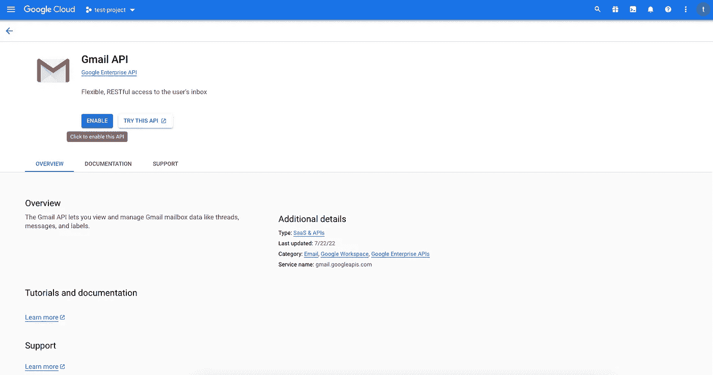

接下来，让我们利用 GoogleCredentials 类，然后使用 Gmail 类的实例发送一封电子邮件:

一切就绪后，让我们运行代码并检查我们的收件箱——酷！现在我们知道了:

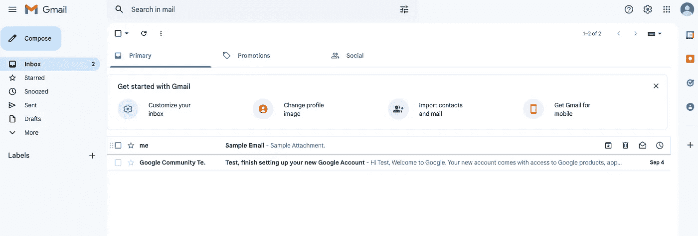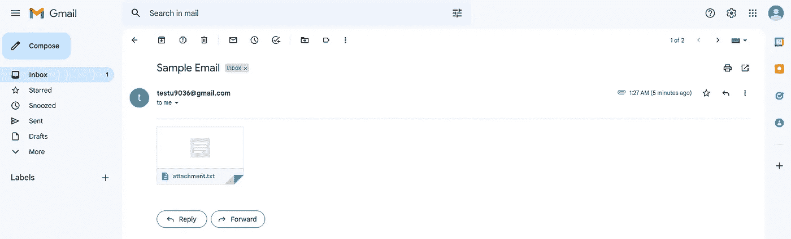

像往常一样，完整的源代码总是可以在 [GitHub](https://github.com/emyasa/medium-articles/tree/master/google-api) 上获得。