# Google OAuth 2.0:保护您的邮件抓取应用

> 原文：<https://medium.com/javarevisited/google-oauth-2-0-securing-your-mail-scraping-application-b5520ef0f390?source=collection_archive---------0----------------------->

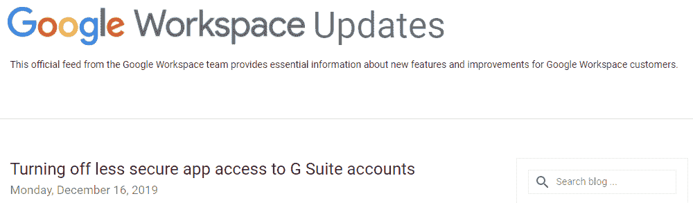

来自谷歌官方博客的截图

> 免责声明:本文是对该解决方案的严格概述。详细的实现和设计超出了本文的范围。
> 
> 嘿伙计们！谢谢你阅读这篇文章。我将发表一系列文章，一步步指导你将 Gmail 抓取应用从不太安全的应用程序迁移到安全的应用程序。

对于所有的软件专业人士，尤其是与提供 SaaS 解决方案的组织一起工作的人来说，这是为你们所有人准备的。我相信我的假设没有错，你们所有在运营后端工作的人，在职业生涯中都曾敬畏地注视着客户的数据在几秒钟内自动进入你们的系统。认为这很酷，然后你会发现这只是一个 [cron 工作](https://www.java67.com/2017/08/how-to-backup-and-load-crontab-from-file-Linux-example.html)定期抓取邮件服务器，或者充其量是一个 [webhook](https://en.wikipedia.org/wiki/Webhook) 注册，触发抓取服务。

几乎所有邮件抓取的工作方式都是存储客户端的加密凭证，并用解密的凭证访问邮件服务器进行身份验证和授权。这是一种不太安全的方式。

**🛈** *本文讨论了* ***Google 作为服务提供商*** *和* ***Gmail 服务作为用例*** *在其范围内。*

# 不太安全的应用程序！什么？

正如这个词所描述的，这些应用程序(或服务)以一种 ***不太安全的方式*** 连接到服务提供商的(这里是谷歌的 Gmail)服务器(这里是邮件服务器)。主要问题:

*   *在你端存储客户凭证*:

这实际上让您负责他们凭证的安全性。在云上工作，一切都归结为一个保存客户端凭证的网络调用(内部网或互联网)。够脆弱！现在你需要管理一个 ***开销的加密流*** ( ***带密钥轮换*** )来保护原始凭证。

*   *申请无处不在*:

一旦使用凭证进行了身份验证，应用程序就可以控制一个真实的人所能做的一切。 ***无粒度授权*** 限制应用程序访问用户 GSuite 数据的特定区域。

默认情况下，Gmail 会阻止这些类型的连接请求，Gmail 域的管理员必须手动允许不太安全的应用程序(LSA)连接。

# LSA 呼叫冲锋队。为什么？

这是让我们感谢疫情的为数不多的事情之一。我的心以任何方式触及受疫情影响的灵魂。我之所以这么说，是因为谷歌准备从 2020 年 6 月开始 ***关闭对 LSA****的支持，并将 2021 年 2 月作为所有 LSA 迁移到安全应用的最后期限。*

*值得庆幸的是，作为对疫情效应的回应，谷歌将过渡推迟到“另行通知”。*

**

*来自谷歌官方博客的截图*

# *让我们迁徙吧！*

*多亏了 Google，我们现在有了一个完整的路线图来为上述用例迁移到更安全的替代方案。*

****OAuth 2.0 是解决这一问题的方法*！***

*对于我们这些不知道 OAuth 是什么的人来说， [*这篇文章*](https://www.blogger.com/blog/post/edit/1146479294431978500/8482043211346360669#) 将带你深入了解它。显然不是每个人都有时间深入研究，所以让我在这里给你所有要点。*

# *OAuth！什么？*

*OAuth 是一种 ***认证和授权协议*** ，是几乎所有科技行业都遵循的标准。基本上，应用程序 ***代表最终客户与第三方供应商建立信任*** 的一种方式。这与之前应用程序向第三方供应商发送终端客户端凭证时建立的信任相同。我想这会让你对我们要解决的问题有一个大致的了解。*

*为了对我们刚刚讨论的内容有一个真实的了解，您可以想象一个 SSO 框架。同一个单点登录，使我们能够享受所有的谷歌服务，如驱动器，Gmail 等，只需一次登录到我们的帐户。现在，澄清一下，SSO 和 OAuth 是两个不同的东西，讨论超出了本文的范围。*

*基本上就是试图 ***冒充最终用户*** ，就是这样！*

## *行动中的 OAuth*

*OAuth 的灵魂只是两个代币。是的，就是它，只要两个代币，你就大功告成了。OAuth 的机制依赖于 ***访问和刷新令牌*** 。这些令牌是代表终端客户端的应用程序的成功认证和授权的结果。请记住这 4 个角色/实体，以便更好地理解工作:*

*   ****资源所有者*** :*

*能够授权访问受保护资源的实体。当资源所有者是一个人时，它被称为最终用户。*

*   ****资源服务器*** :*

*托管受保护资源的服务器，能够使用访问令牌接受和响应受保护资源请求。*

*   ****客户端*** :*

*代表资源所有者并经其授权发出受保护资源请求的应用程序。术语“客户端”并不暗示任何特定的实现特征(例如，应用程序是在服务器、桌面还是其他设备上执行)。*

*   ****授权服务器*** :*

*在成功认证资源所有者并获得授权后，服务器向客户端颁发访问令牌。*

*[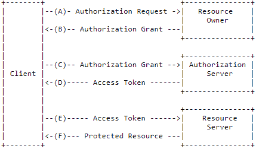](https://javarevisited.blogspot.com/2018/01/how-http-basic-authentication-works-in.html#axzz6hB6A1qlY)*

*等等，刷新令牌呢？*

*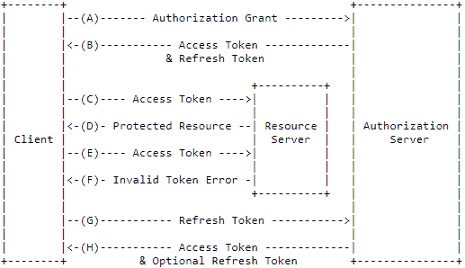*

## *安全了吗？*

*回到我们的主题，现在我们知道应该遵循什么标准，让我们试着理解 Google OAuth 中的类比。我们将互换使用以下术语，您将看到它们各自的意义。*

*   ****客户端*** →您的应用*
*   ***资源服务器 →Gmail***
*   ****资源所有者*** →您的最终客户*
*   ****授权服务器*** →谷歌*

*现在，有两种广泛的方法来实现 OAuth 设置。*

1.  *首先是通过一个 ***OAuth 客户端****
2.  *第二次通过 ***服务账号****

*这两种方法都是特定于 Google OAuth 实现的，并没有推广这个概念。*

*为了简单和更好地理解，服务帐户方法超出了本文的范围。只是为了避免到处都是，我们将采取这一次。到目前为止，本文将严格关注 OAuth 2.0 迁移的高级路线图，将具体的实现留给后面的文章！*

## *初步设置*

*为了能够开始迁移，需要进行以下设置。让我们一个一个来看:*

*   *通过您的公司 Gmail id 创建一个 [*GCP 开发者控制台*](https://www.blogger.com/blog/post/edit/1146479294431978500/8482043211346360669#) 帐户。*

*[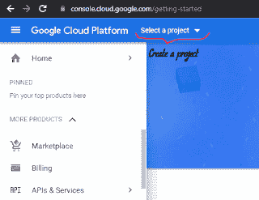](https://javarevisited.blogspot.com/2020/06/top-5-course-to-crack-google-cloud-professional-data-engineer-certification.html)

*一切都应该在项目的背景下** 

*   *你现在需要一个 [*谷歌开发者控制台项目*](https://www.blogger.com/blog/post/edit/1146479294431978500/8482043211346360669#) 。*

*[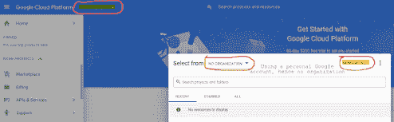](https://javarevisited.blogspot.com/2020/05/top-5-course-to-crack-google-cloud-associate-cloud-engineer-certification-exam.html?m=1)

*使用个人账户后未显示组织** 

*   *创建一个项目并跟踪单个项目 中一个用例 ***所需的所有资源，这始终是一个最佳实践。例如，将客户端迁移到 [OAuth 2.0](/javarevisited/top-10-courses-to-learn-spring-security-and-oauth2-with-spring-boot-for-java-developers-8f0222d6066d) 是一个用例，为客户端提供云计算解决方案是使用 Google cloud developer console 的另一个用例。对于我们的用例，我们将需要来自控制台的 API &服务部分的资源，我们将在单个项目中维护这些资源。****

*[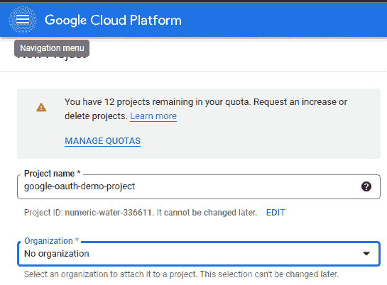](https://www.java67.com/2020/07/5-free-courses-to-learn-google-cloud-platform-and-concepts.html)

*项目名称不言自明** 

*   *给你的项目起一个有意义的名字。*

**

**您的项目名称应该显示在这里**

*   *一旦您有了控制台访问权限和项目设置，您将需要为您的项目启用 API(此处为 Gmail API ),以便当您的应用程序尝试通过此控制台项目连接到 Gmail API 时，请求不会立即被阻止:*
*   *转到控制台上“API 和服务”部分下的“仪表板”部分。*

*[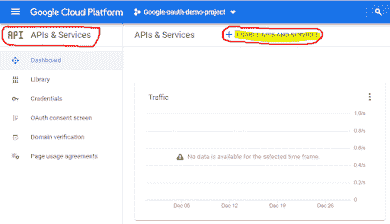](https://medium.com/javarevisited/8-free-google-cloud-data-engineer-certification-courses-and-practice-tests-594f31643b58)

*“API&服务”是云控制台*的特定部分* 

*   *单击顶部的“启用 API 和服务”按钮。*

*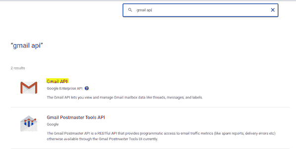*

*   *将 Gmail API 添加到列表中，并为您的项目启用它。*

*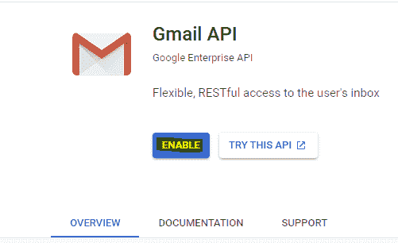*

*到现在为止，你一定已经开始凭直觉猜测我们将走向何方，我可以毫不害羞地说，你的直觉实际上是正确的。到目前为止，所有这些工作都是为了让 ***授权服务器*** 做好准备。现在，我们将启动服务器。*

## *OAuth 客户端方法*

*既然您已经知道了“API 和服务”仪表板，那么您一定会在屏幕上看到一个叫做凭证的东西。导航到该部分，您会注意到您可以创建大致 3 个类别的凭据。显然，这些凭证是为你在[谷歌云](/javarevisited/5-best-courses-to-learn-google-cloud-platform-gcp-in-2021-169093a3771a)上的资源准备的(比如电子邮件)。不管怎样，其中之一是 OAuth 客户端 ID。*

*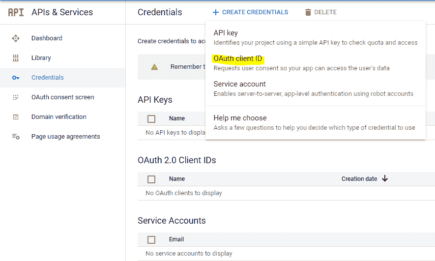*

**我们将继续使用 OAuth 2.0 客户端**

*OAuth 客户端 ID 代表我们类比中的 ***客户端*** ，即您的应用程序。它唯一地识别和验证试图连接到 google APIs 的应用程序。*

***设置***

*现在让我们追溯到我们发现 OAuth 类似于 SSO 的那一部分。我希望你现在明白了。当有一个 OAuth 客户端设置供应用程序访问最终客户端的资源时，必须有一种最终客户端可以授权应用程序这样做的方法。试着回想一下我们是如何在 SSO 框架中通过像 Google 这样的授权提供者来授权应用程序的。*

*同样，为此我们也需要提供一种方式，通过这种方式，最终客户可以同意将他们的资源访问到我们的应用程序。为此，我们在同一个控制台中有一个叫做 ***的同意屏幕*** 。*

**

*同意屏幕是由谷歌为最终客户制作的现成可用的屏幕，其中将有所有必要的细节，如范围，他们的行动按钮，应用程序的名称等。因此，他们知道他们实际上登录的是什么。这些信息必须由您(开发人员)提供，这就是你所做的“配置同意屏幕”。*

*一旦你点击上面的按钮，你将被引导通过一个表格，你必须填写所有必要的信息。虽然这个表格不言自明，但我还是会给你它的要点。请注意，所有这些信息对最终客户都是可见的:*

*选择您的应用 的 ***性质:****

*   ****【内部(推荐)*** :这表示您的应用程序将只对您组织内部的用户可用。*
*   *外部:这意味着任何拥有 google 帐户的用户都有资格使用您的应用程序。*

> **🛈为了演示的目的，我把我的应用程序放到了外部。因此，我需要添加测试用户，只有这些用户的应用程序将可用。此外，默认情况下，我的应用程序将处于“测试”阶段，因为它没有被谷歌验证。*一旦通过验证，我就可以将我的应用程序置于“生产”阶段。***

*   *填写您的申请信息:*

*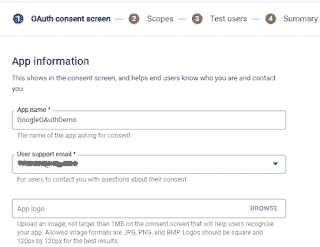*

*   *填写开发商联系人，即您的联系人:*

*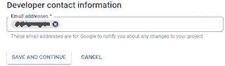*

*   *为您的应用程序添加作用域(我建议阅读关于 [*Google OAuth 作用域*](https://www.blogger.com/blog/post/edit/1146479294431978500/8482043211346360669#) ):*

*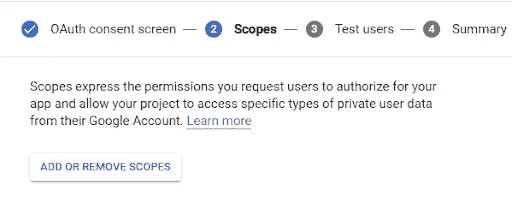*

**我更喜欢给* [*增量访问*](https://www.blogger.com/blog/post/edit/1146479294431978500/8482043211346360669#) *。从添加只读范围*开始*

*   *(可选)添加测试用户(如果您的应用程序类型为外部)。*

*那好吧！你差不多准备好了。*

*这是一个样本同意屏幕的快照:*

*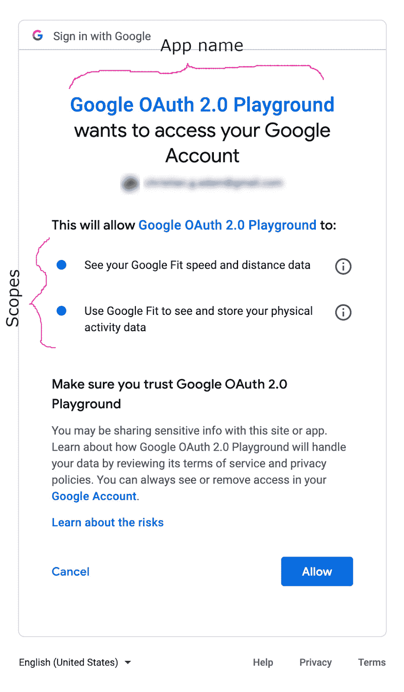*

***我们来创造吧！***

*在一些操作之前，最后一步是从控制台创建一个 OAuth 客户机 ID。为此，我们从凭证列表中选择 OAuth 客户端 ID 选项，如上图所示。记住，这样生成的 OAuth 客户机 ID 是您的应用程序 到认证过程的 ***入口点。让我们深入了解一下:****

*   *为您的应用程序选择应用程序类型:*

*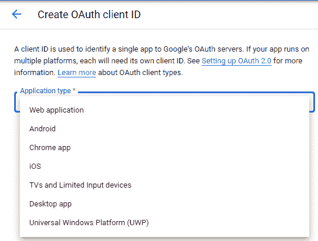*

**理想情况下，应该选择 Web 应用**

*   *为 OAuth 2.0 客户端命名:*

*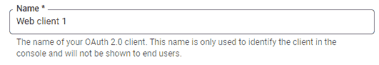*

*   *添加可信的重定向 URL:*
*   *这是什么？重定向 URL 是您的 web 应用程序中的一个页面的地址，它可以 ***理解由 Google OAuth 2.0 服务器生成的*** ***授权代码*** 作为对成功授权的响应。如果您还记得，这是我们需要与授权服务器交换的代码，以便接收访问和刷新令牌。*

*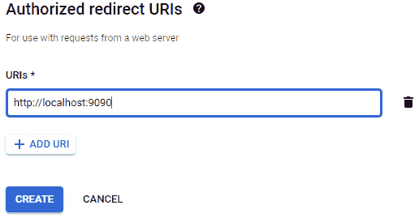*

*至此，您已经成功地创建了 OAuth 2.0 客户端。现在，您应该会在屏幕上弹出一个客户端 ID 和客户端密码对。下载 JSON 文件并妥善保管。这将用于识别您的应用程序。*

**

***行动！***

*设置好 OAuth 2.0 客户端 id 后，您现在只需使用正确的参数集点击正确的 Google API，您的应用程序就安全了。*

*   *向 Google OAuth 2.0 服务器发出授权请求:*
*   *谷歌 OAuth 的端点是[https://accounts.google.com/o/oauth2/v2/auth](https://accounts.google.com/o/oauth2/v2/auth)*

*推荐参数包括:*

*   **范围* = <逗号分隔的范围>*
*   **访问 _ 类型* = <离线/在线>*
*   **响应 _ 类型*=代码*
*   **重定向 _uri* = <重定向 URI >*
*   **客户端 id* = <客户端 ID >*

> **这里是🛈，* **scope** *接受应用程序需要的 OAuth 作用域，* access_type *接受离线/在线值(离线的访问类型表示应用程序可以在终端客户端不在浏览器上的情况下刷新访问令牌，反之亦然，值在线时亦然)，* response_type *接受“code”作为 web 应用程序的值，* redirect_uri *接受同意屏幕中提到的完全相同的 URL，**

*点击后，终端将在浏览器上显示同意屏幕。不言而喻，终端客户必须使用正确的 Gmail ID 登录。*

*如果终端客户点击“Allow”，授权码将作为参数发送回重定向 URI，在请求中标记。URL 看起来像这样:*

**

> **🛈需要注意的一件重要事情是，访问和刷新令牌对特定于终端客户端，即物理用户。可以直观地认为它们是特定于应用程序的。**

*如果请求参数中的值与同意屏幕中输入的值不匹配，浏览器屏幕上会显示错误。*

*现在您已经有了授权码，您需要用它来交换访问和刷新令牌。由于 ***access_type*** 被设置为离线，所以在您的应用程序第一次用授权码交换令牌时，Google 授权服务器将被指示返回一个刷新和一个访问令牌。*

*   *谷歌令牌端点:【https://oauth2.googleapis.com/token *

*包括适当的参数:*

*   **代码* = <授权代码>*
*   **客户端 id* = <客户端 ID >*
*   **客户端 _ 秘密* = <客户端秘密>*
*   **redirect_uri* = <重定向 URL >*
*   **授权类型*=授权代码*

> **🛈在这里，* code *接受先前接收的授权码，* client_id *接受来自下载的 JSON 的客户端 id，* client_secret *接受来自下载的 JSON 的客户端秘密值，* redirect_uri *接受同意屏幕中提到的确切重定向 URL，* grant_type *根据* [OAuth 2.0 规范](https://www.blogger.com/blog/post/edit/1146479294431978500/8482043211346360669#)接受值“authorization_code”*

*是啊！您现在已经成功地保护了您的应用程序。这可以通过观察服务器的最终响应来确定，下面是一个示例:*

```
*{“access_token”: “1/fFAGRNJru1FTz70BzhT3Zg”,“expires_in”: 3920,“token_type”: “Bearer”,“scope”: “https://www.mail.google.com/",“refresh_token”: “1//xEoDL4iW3cxlI7yDbSRFYNG01kVKM2C-259HOF2aQbI”}*
```

> **🛈需要记住的一件重要事情是，访问令牌寿命较短，而刷新令牌寿命较长。您不应该假设相同的访问令牌将在整个应用程序会话中起作用。使用响应中提供的到期时间来跟踪到期时间，并相应地使用相应的刷新令牌来刷新访问令牌。**

# *漏洞检查*

*现在让我们回到开始时的主要问题，陈述迁移的原因:*

*   *存储原始凭据:*

*显然，在我们的整个讨论中，我们没有讨论任何关于客户的用户名和密码的问题。即使我们仍然依赖于暴露在互联网上的网络调用，我们也在传输客户端 ID，或者充其量是客户端机密作为其中的数据。无论如何，这是由最终客户给出的同意书支持的。所以你在这里很好！*

*   *粒度访问:*

*你现在知道它的重要性了。我们定义了应用程序访问的确切范围。现在，您的最终客户完全知道他们登录的目的。*

# *潜在的挫折*

*好吧，你想出的每一个解决方案，都有自己的方式让你失望。这也不例外。在这里，我们看到了我们的应用程序如何需要最终客户的同意来代表他们获取资源。*

*这可以是一把 ***双刃剑*** 。这是怎么回事:*

*虽然只有在应用程序第一次访问终端客户端的资源时才需要同意，但是有一个警告。每当您的终端客户决定更改他们的密码时(一般的经验法则是每 90 天更换一次密码)，您就陷入了困境。我这样说是因为这将需要为终端客户重新发放刷新令牌，这只有在他们的 ***手动干预*** 给予同意之后才有可能。现在，这对一家公司来说可能是一个挫折，因为它扰乱了客户的无缝体验。*

# *下一步是什么？*

*接下来，我将使用[*Google API client library for Java*](https://www.blogger.com/blog/post/edit/1146479294431978500/8482043211346360669#)编写一个使用 Google OAuth 2.0 客户端方法的示例应用程序的实际实现。小心那个！*

# *参考*

*[https://developers . Google . com/identity/protocols/oauth 2/we B- server](https://www.blogger.com/blog/post/edit/1146479294431978500/8482043211346360669#)*

*[https://datatracker.ietf.org/doc/html/rfc6749](https://datatracker.ietf.org/doc/html/rfc6749)*