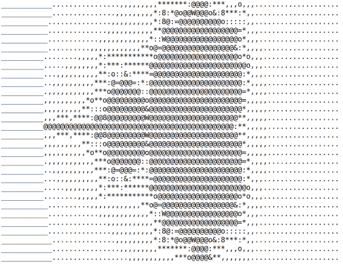
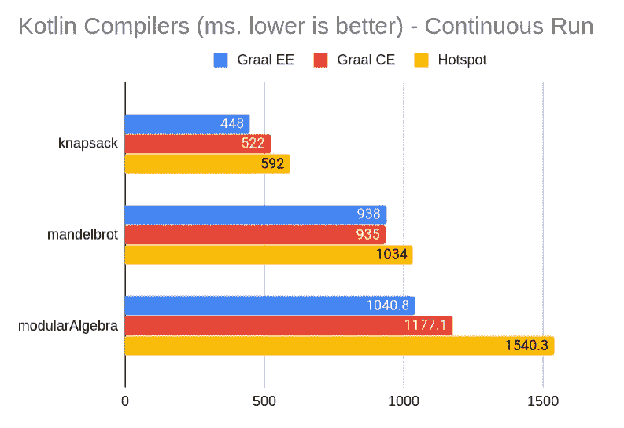

# 格拉尔和 C2 谁跑得更快？

> 原文：<https://medium.com/javarevisited/graal-vs-c2-who-runs-kotlin-faster-82f03f1b11dd?source=collection_archive---------1----------------------->

## 看看新的编译器如何让 Kotlin 运行得更快


由[亚历克斯·霍利奥克](https://unsplash.com/@stairhopper?utm_source=unsplash&utm_medium=referral&utm_content=creditCopyText)在 [Unsplash](https://unsplash.com/?utm_source=unsplash&utm_medium=referral&utm_content=creditCopyText) 拍摄的照片

一年多前，我为 2018 年 [Java 降临节日历](https://www.javaadvent.com/2018/12/comparing-kotlin-performance-with-graal-and-c2.html)写了一篇关于 Kotlin 中 GraalVM 性能的文章。

是时候使用新的 GraalVM v.20.0 以及 GraalVM 的 Community Edition 和 Enterprise Edition 来重新评估结果了。

您可能听说过 Graal，它是用 Java 编写的 JVM 的新 JIT 编译器。从 Java10 开始，它就可以在 JDK 内部使用，并且在将来的某个时候可能成为 JDK 的标准编译器。

如果你有兴趣，你可以在这里找到更多信息:[https://www.infoq.com/articles/Graal-Java-JIT-Compiler](https://www.infoq.com/articles/Graal-Java-JIT-Compiler)

## 快速介绍

因为 Java 1.3 HotSpot 包含了两个即时编译器:一个非常快速的叫做 **C1** ，另一个缓慢但是生产更优化的代码叫做 **C2** 。JVM 使用 C1 来快速启动，而 C2 在稍后用于提高性能。

Graal 是用 Java 编写的 JVM 字节码的新编译器。它使用 Java9 中引入的 JVMCICompiler 接口。它可以以 JIT 或提前模式运行，以生成本机应用程序。

[**GraalVM**](https://www.graalvm.org/) 是对使用 Graal 编译器和其他相关技术(如块菌、基质)的标准 JDK 的完全替代。

那么我们怎样才能给 Graal 一个机会呢？从 Java 10 开始，你可以简单地使用两个 VM 选项`-XX:+UnlockExperimentalVMOptions -XX:+UseJVMCICompiler`在任何 JDK 上激活 Graal 编译器。不幸的是，JDK 中包含的 Graal 编译器并不总是最新的版本，所以更好的解决方案是切换到 GraalVM 作为 JDK。

如果你已经安装了 SdkMa n，你只需要三个命令:

```
sdk list java
//choose the right GraalVM versionsdk install java 20.0.0.r11-grl
//install itsdk use java 20.0.0.r11-grl
//select it as current JDK
```

如果你没有安装 [SdkMan](https://sdkman.io) ，你可以从甲骨文网站下载 Graal，在某个地方展开并设置`JAVA_HOME` …但是说真的，为什么不直接安装 [SdkMan](https://sdkman.io/install) ？

GraalVM 有两种风格:CE 和 EE。你可以在[这里](https://www.graalvm.org/docs/faq/)了解一下，但大意是 CE 是完全开源的，而 EE 只是免费供评估和非生产使用。EE 是在 CE 的基础上做了一些额外的优化，正如我们将要看到的，这对你来说可能重要也可能不重要。

要下载企业版，您需要在 Oracle 上注册并签署许可协议。

我准备了三种算法来测试编译器:Mandelbrot 集生成器、背包解算器和模代数计算器。完整代码可在 [Github](https://github.com/uberto/kotlin-perf) 上获得。

我试图用最习惯的 Kotlin 方式编写代码，利用扩展函数、数据类、上下文编程来处理每个循环。不仅生成的代码非常易读，而且性能也不比使用类似“C”的语法慢很多。

我选择了这三种算法来实现一些非常不同的 CPU 密集型任务的实际例子，代码完全是用 Kotlin 编写的，没有使用任何 Java 库。

**曼德布洛特集合**

Mandelbrot 集合可能是最著名的分形形状，即使你不知道它的名字，你也可能见过它。

数学上定义为复平面中函数 z

因为这里的目标是性能而不是图形，所以我用文本图形来保持简单。

让我们开始看看 Mandelbrot 集合的代码。下面是表示复数的类型的定义:

```
**data class** Complex(**val r**: Double, **val i**: Double){
    **operator fun** times(other: Complex) =
        Complex(
            r = **this**.**r** * other.**r** - **this**.**i** * other.**i**,
            i = **this**.**i** * other.**r** + **this**.**r** * other.**i** )
    **operator fun** plus(other: Complex) =
        Complex(r = **this**.**r** + other.**r**, i = **this**.**i** + other.**i**)
    **operator fun** minus(other: Complex) =
        Complex(r = **this**.**r** - other.**r**, i = **this**.**i** - other.**i**)
    **fun** squared() = **this** * **this
    fun** squaredModule() = **r** * **r** + **i** * **i
    fun** Double.toComplex() = Complex(r=**this**, i=0.0)
}
```

然后对集合中的每个点进行实际计算:

```
**fun** mandelSet(initZ: Complex, c:Complex, maxIter: Int): Int {
    **var** z = initZ
    (1..maxIter).*forEach***{** z = z.squared() + c
        **if** (z.squaredModule() >= 4)
            **return it
    }
    return** maxIter
}
```

您可以在这里看到使用运算符重载和数据类来表示复数是如何真正简化代码并使其更容易理解的。

一旦我们在 Complex 类中定义了对复数进行运算的规则，mandelSet 函数只需检查运算 z

在 AsciiArt 中呈现的输出中，您可以看到 Mandelbrot 集的典型心形:



## 背包问题

背包[问题](https://en.wikipedia.org/wiki/Knapsack_problem)可以用几种方式定义。想象一个小偷刚刚闯入一家钟表店。只要不超过背包所能承载的最大重量，他可以偷尽可能多的手表。

作为一个理性的小偷，他肯定想优化背包里手表的价值。每块手表都有价格和重量。因此，我们需要一种算法来找到给定重量下总价最高的那组手表。

这种算法的实际应用包括优化数控机床的切割和材料，以及分配广告预算的营销策略。

例如，让我们从一家只有 3 只手表的商店开始，定义如下:

```
val shop = Knapsack.shop(
    Watch(weight = 1, price = 1),
    Watch(weight = 3, price = 2),
    Watch(weight = 1, price = 3)
)
```

如果我们的最大重量为 1，我们最好拿起第三块手表，而不是第一块，因为价值更高。

如果我们的最大权重为 3，我们可以选择数字 2(价格 2)或数字 1 和 3(价格 1 + 3)。在这种情况下，最好选择 1 和 3，即使它们的总重量小于最大值。

这些是该商店的完整解决方案:

```
assertEquals(3, selectWatches(shop, maxWeight = 1))
assertEquals(4, selectWatches(shop, maxWeight = 2))
assertEquals(4, selectWatches(shop, maxWeight = 3))
assertEquals(5, selectWatches(shop, maxWeight = 4))
assertEquals(6, selectWatches(shop, maxWeight = 5))
```

如你所见，随着手表数量的增加，可供选择的数量会非常、非常快地增加。这是一个经典的 NP 难问题。

为了在合理的时间内解决这个问题，我们需要欺骗一下，使用动态编程。我们可以为每组手表建立一个已经优化的解决方案图，这样我们就可以避免每次都重新计算。

通用算法是基于递归的穷举搜索。这是解决它的 Kotlin 代码，分记忆函数和递归搜索最大值。

```
typealias Memoizer = MutableMap<String, Int>fun priceAddingElement(memo: Memoizer, shop: Set<Watch>, choice: Set<Watch>, maxWeight: Int, priceSum: Int): Int =
    shop.filter { !(it in choice) && it.weight <= maxWeight }
        .map {
            selectWatches(
                memo,
                shop,
                maxWeight - it.weight,
                choice + it,
                priceSum + it.price) }
        .filter { it > priceSum }
        .max() ?: priceSum fun selectWatches(memo: Memoizer, shop: Set<Watch>, maxWeight: Int, choice: Set<Watch>, priceSum: Int): Int =
    memoization(memo, generateKey(choice)) {
        priceAddingElement(memo, shop, choice, maxWeight, priceSum)} private fun memoization(memo: Memoizer, key: String, f: () -> Int): Int = when (val w = memo[key]) {
        null -> f().also { memo[key] = it }
        else -> w
    }
```

我真的很喜欢 Kotlin 允许清楚地表达意图，而不必重复自己。

## 模代数

[模代数](https://en.wikipedia.org/wiki/Modular_arithmetic)是一个非常有用和有趣的数学分支。它也被称为“时钟代数”，因为它类似于时钟中小时的运算，例如，7 + 6 通常等于 13，但如果我们谈论的是时间，它将等于 1。这里的时钟是模 12 代数，但我们可以将其推广到任何数字。

它有很多有趣的性质，例如，保持添加一个模为素数的数将生成一个所有数都达到模的序列。这意味着，如果我们在时钟代数中给 12 加上一个素数，我们将生成一个包含所有小时的序列。例如，5 是 12 的最小质数，5 在模 12 中的序列是:5，10，3，8，1，6，11，4，9，2，7，0，然后它重复自己。

这是定义一个模数及其运算的类。请注意，在模代数中，除法[很成问题](https://www.doc.ic.ac.uk/~mrh/330tutor/ch03.html)，我使用了一种强力方法作为捷径:

```
**data class** ModularNumber***(*val num**: Int, **val modulo**: Int***)***: Comparable<ModularNumber>  ***{* override fun** compareTo***(***other: ModularNumber***)***: Int = **num**.compareTo***(***other.**num*)* operator fun** plus***(***other: ModularNumber***)*** = ***(*num** + other.**num*)***.*toModularNumber*()
    **operator fun** minus***(***other: ModularNumber***)*** = ***(*num** - other.**num*)***.*toModularNumber*()
    **operator fun** times***(***other: ModularNumber***)*** = ***(*num** * other.**num*)***.*toModularNumber*()
    **operator fun** div***(***other: ModularNumber***)*** = ***((***1..**modulo*)***.*first* **{ *(*it** * other.**num*)*** % **modulo** == ***(*this**.**num** % **modulo*)* }*)***.*toModularNumber*()
    **operator fun** inc() = ***(*num** + 1***)***.*toModularNumber*()

    **fun** squared() = ***(*num*****num*)***.*toModularNumber*()

    **fun** Int.toModularNumber(): ModularNumber =
        ModularNumber***(*this** % **modulo**, **modulo*)

}***
```

这么迷人的代数我们能做什么？我们可以画出[好看的图案](https://maxwelldemon.com/2011/11/20/22-1-patterns-in-modular-arithmetic/)！为了得到它们，我们只需要在模代数中比较两个数的平方。

```
**data class** PlaneGrid***(*val size**: Int, **val initPredicate**: ***(***Int***)*** -> Boolean***) {* private val grid** = BooleanArray***(*size*****size**, **initPredicate*)* operator fun** get***(***x: Int, y: Int***)***: Boolean = **grid**[coord***(***x,y***)***]

    **private fun** coord***(***x: Int, y: Int***)*** = ***(***y-1***)*** * **size** + x -1

    **fun** count(): Int = **grid**.*count* **{it}
*}* val** *compareSquares*: ***(***ModularNumber, ModularNumber***)*** -> Boolean =
    **{** x, y **->** x.squared() >= y.squared() **}

fun** compareSquares***(***size: Int, modulo: Int***)***: Int =
    ModularField***(***modulo***)***.applyFunction***(****compareSquares****)(***size***)***.count()

**fun** sumOfFunction***(***from: Int, to: Int, f: ***(***Int***)*** -> Int***)*** =
    ***(***from..to***)*** .*map* **{** f***(*it*)* }** .*sum*()**data class** ModularField***(*val modulo**: Int***) {*** **fun** applyFunction***(***f: ***(***ModularNumber, ModularNumber***)*** -> Boolean***)***:    ***(***Int***)*** -> PlaneGrid =
        **{** size **->** PlaneGrid***(***size***)* {** index **->
                val** xMod = ***(***index % size***)***.*toModularNumber*()
                **val** yMod = ***(***index / size***)***.*toModularNumber*()
                f***(***xMod, yMod***)* }
        }** **fun** Int.toModularNumber(): ModularNumber =
        ModularNumber***(*this** % **modulo**, **modulo*)
}***
```

这些是由上述函数生成的模块化模式的一些示例:

```
Modulo 5              Modulo 15            Modulo 12
@@@@@@@@@@@@@@@@@@@@  @@@@@@@@@@@@@@@@@@@@ @@@@@@@@@@@@@@@@@@@@
@@@@ @@@@ @@@@ @@@@   @@@@@@@@@@@@@@ @@@@  @@@@@ @@@@@ @@@@@ @
@@   @@   @@   @@     @@ @@@@@@ @@   @@    @@@   @@@   @@@
@@   @@   @@   @@     @ @    @ @     @     @     @     @
@@@@ @@@@ @@@@ @@@@   @@@@@@@@@@@@@@ @@@@  @@@   @@@   @@@
@@@@@@@@@@@@@@@@@@@@  @    @               @@@@@ @@@@@ @@@@@ @
@@@@ @@@@ @@@@ @@@@   @ @@  @@ @     @     @@@@@@@@@@@@@@@@@@@@
@@   @@   @@   @@     @@ @@@@@@ @@   @@    @@@@@ @@@@@ @@@@@ @
@@   @@   @@   @@     @@ @@@@@@ @@   @@    @@@   @@@   @@@
@@@@ @@@@ @@@@ @@@@   @ @@  @@ @     @     @     @     @
@@@@@@@@@@@@@@@@@@@@  @    @               @@@   @@@   @@@
@@@@ @@@@ @@@@ @@@@   @@@@@@@@@@@@@@ @@@@  @@@@@ @@@@@ @@@@@ @
@@   @@   @@   @@     @ @    @ @     @     @@@@@@@@@@@@@@@@@@@@
@@   @@   @@   @@     @@ @@@@@@ @@   @@    @@@@@ @@@@@ @@@@@ @
@@@@ @@@@ @@@@ @@@@   @@@@@@@@@@@@@@ @@@@  @@@   @@@   @@@
@@@@@@@@@@@@@@@@@@@@  @@@@@@@@@@@@@@@@@@@@ @     @     @
@@@@ @@@@ @@@@ @@@@   @@@@@@@@@@@@@@ @@@@  @@@   @@@   @@@
@@   @@   @@   @@     @@ @@@@@@ @@   @@    @@@@@ @@@@@ @@@@@ @
@@   @@   @@   @@     @ @    @ @     @     @@@@@@@@@@@@@@@@@@@@
@@@@ @@@@ @@@@ @@@@   @@@@@@@@@@@@@@ @@@@  @@@@@ @@@@@ @@@@@ @
```

## 基准

现在是你一直期待的部分。我们来比较一下两个编译器的性能吧！

让我们记住 Graal 是用 Java 编写的，它利用了编译器领域的新研究，但它仍然相对年轻。另一方面，C2 非常协调和成熟。

现在谈谈测试方法:所有测试都是在我的笔记本电脑上进行的，i7 4.4Ghz，32Gb。我用不同的参数运行了几次测试，结果是一致的。图中的实际值是在没有其他应用程序运行的同一会话中获得的。

我在每个项目中运行一个名为 PerformanceTest 的测试，该测试持续执行端到端基准测试。这样，编译器无法针对特定情况优化代码。然后我选择更快的结果，假设它是没有 GC 和 OS 暂停的结果。所有测试都是单线程运行的。

以下是多次运行的平均结果，单位为微秒:



这些结果与显示使用 Graal 优于 Hotspot 的明确性能增益是一致的。主要原因是更复杂的[内联和转义分析优化](/graalvm/under-the-hood-of-graalvm-jit-optimizations-d6e931394797)。

在某些情况下，Graal EE 特殊优化(如[循环展开](/wix-engineering/an-interesting-case-of-loop-unrolling-8ea04cf08959))给了它更大的优势。

作为一种方法，我总是建议从端到端的连续运行基准开始，因为这是收集性能指标最安全的方法。它将为我们提供生产性能的最佳近似值。

如果我们想更好地理解瓶颈在哪里，我们需要创建更具体的微观基准。对我们来说幸运的是，有一个非常好的库可以做到这一点。

## JMH

进入 Java 微基准线束。JMH 是一个库，它简化了正确实现 Java 微基准的任务。JMH 是由一些 JVM 开发者创建的，用于 JVM 内部性能测试。我们可以认为这是其质量的一个很好的标志。

如何使用格雷尔(和科特林)设置 JMH？你只需要编辑你的 build.gradle 文件。首先，添加依赖项:

```
testImplementation(**"org.openjdk.jmh:jmh-core:1.23"**)
testImplementation(**"org.openjdk.jmh:jmh-generator-annprocess:1.23"**)
```

然后，添加格雷尔·JMH 插件:

```
plugins **{** kotlin(**"jvm"**) version **"1.3.70"** id(**"me.champeau.gradle.jmh"**) version **"0.5.0"
}**
```

最后，添加一个包含要设置的属性的部分。你可以在这里找到完整的名单[。](https://github.com/melix/jmh-gradle-plugin)

```
jmh **{** jmhVersion = **"1.23"**jvmArgs = listOf(
        **"-Xms6g"**,
        **"-Xmx6g"**,
        **"-Dgraal.ShowConfiguration=info"**,
        **"-XX:+AlwaysPreTouch"**,
        **"-XX:+UnlockExperimentalVMOptions"**,
        **"-XX:+UseJVMCICompiler"** )
    warmupForks = 0
    fork = 2
    warmupIterations = 5
    iterations = 5
**}**
```

## 如何为 JMH 创建一个测试？

要创建一个新的基准，我们只需要在一个函数周围放置一个注释。

```
@Benchmark
**fun** knapsack***(***blackhole: Blackhole***) {*** blackhole.consume***(***Knapsack.selectWatches***(*shop**, 199***))
}***
```

基准注释有许多可能的可选参数，默认模式是计算一秒钟的操作数，但也有许多其他可能的方法来运行测试。

在这个测试中，你可以看到我们使用了`blackhole`类来防止编译器认为基准测试是“死代码”,因为我们没有对计算结果做任何事情。

让我们看看结果:


从这个图中，我们可以看到原始 CPU 性能比连续运行测试中有更大的差异。

一个不同之处是，JMH 使用一些技术来避免垃圾收集周期，这就是为什么一段时间后(通常从几秒钟到几分钟)的连续运行会填满所有内存并需要一个完整的 GC 周期。

Graal 垃圾收集目前没有 Hotspot 垃圾收集好，所以这可以部分解释这个结果。积极的一面是，RedHat 目前正在投资将他们伟大的 [Shenandoah](https://www.youtube.com/watch?v=WU_mqNBEacw) 垃圾收集器引入 GraalVM。当这一切发生时，期待新的基准！

作为参考，以下是每个测试的确切设置:

热点/C2

```
# JMH version: 1.23
# VM version: JDK 11.0.6, OpenJDK 64-Bit Server VM, 11.0.6+9-jvmci-20.0-b02
# VM invoker: /home/ubertobarbini/.sdkman/candidates/java/20.0.0.r11-grl/bin/java
# VM options: -Xms6g -Xmx6g -Dgraal.ShowConfiguration=info -XX:+AlwaysPreTouch -XX:+UnlockExperimentalVMOptions -XX:-UseJVMCICompiler
# Warmup: 1 iterations, 10 s each
# Measurement: 1 iterations, 10 s each
# Timeout: 10 min per iteration
# Threads: 1 thread, will synchronize iterations
# Benchmark mode: Throughput, ops/timeBenchmark                                  Mode  Cnt   Score   Error  Units
PerformanceMicroBenchmark.knapsack        thrpt   10  12.686 ± 0.719  ops/s
PerformanceMicroBenchmark.mandelbrot      thrpt   10  49.591 ± 1.796  ops/s
PerformanceMicroBenchmark.modularAlgebra  thrpt   10  37.240 ± 3.422  ops/s
```

Graal 20.0 CE

```
# JMH version: 1.23
# VM version: JDK 11.0.6, OpenJDK 64-Bit Server VM, 11.0.6+9-jvmci-20.0-b02
# VM invoker: /home/ubertobarbini/.sdkman/candidates/java/20.0.0.r11-grl/bin/java
# VM options: -Xms6g -Xmx6g -Dgraal.ShowConfiguration=info -XX:+AlwaysPreTouch -XX:+UnlockExperimentalVMOptions -XX:+UseJVMCICompiler
# Warmup: 5 iterations, 10 s each
# Measurement: 5 iterations, 10 s each
# Timeout: 10 min per iteration
# Threads: 1 thread, will synchronize iterations
# Benchmark mode: Throughput, ops/timeBenchmark                                  Mode  Cnt   Score    Error  Units
PerformanceMicroBenchmark.knapsack        thrpt   10  19.060 ±  1.854  ops/s
PerformanceMicroBenchmark.mandelbrot      thrpt   10  85.828 ±  4.836  ops/s
PerformanceMicroBenchmark.modularAlgebra  thrpt   10  71.653 ± 10.713  ops/s
```

Graal 20.0 EE

```
# JMH version: 1.23
# VM version: JDK 11.0.6, Java HotSpot(TM) 64-Bit Server VM, 11.0.6+8-LTS-jvmci-20.0-b02
# VM invoker: /home/ubertobarbini/jvm/graalvm-ee-java11-20.0.0/bin/java
# VM options: -Xms6g -Xmx6g -Dgraal.ShowConfiguration=info -XX:+AlwaysPreTouch -XX:+UnlockExperimentalVMOptions -XX:+UseJVMCICompiler
# Warmup: 5 iterations, 10 s each
# Measurement: 5 iterations, 10 s each
# Timeout: 10 min per iteration
# Threads: 1 thread, will synchronize iterations
# Benchmark mode: Throughput, ops/timeBenchmark                                  Mode  Cnt    Score     Error  Units
PerformanceMicroBenchmark.knapsack        thrpt   10   24.595 ±   2.797  ops/s
PerformanceMicroBenchmark.mandelbrot      thrpt   10   92.343 ±   8.087  ops/s
PerformanceMicroBenchmark.modularAlgebra  thrpt   10  170.381 ± 106.960  ops/s
```

## 结论

去年 Graal 是一项值得关注的有趣的新技术，现在我认为它已经到了生产时间，或者至少是值得认真考虑的时候了。有趣的是，使用 Kotlin 消除了 Graal 采用的一个主要障碍，即支持的 java 版本。目前 Graal 有两种风格:Java8 或 Java11。Graal 与当前的 JDK 版本持平还需要一段时间，但对于 Kotlin 开发者来说，这不是一个大问题。

像往常一样，你可以在我的 GitHub [库](https://github.com/uberto/kotlin-perf)上找到这篇文章的所有代码。

如果你对更多类似的帖子感兴趣，请点击这里或我的 twitter 账户@ [ramtop](https://twitter.com/ramtop) 关注我