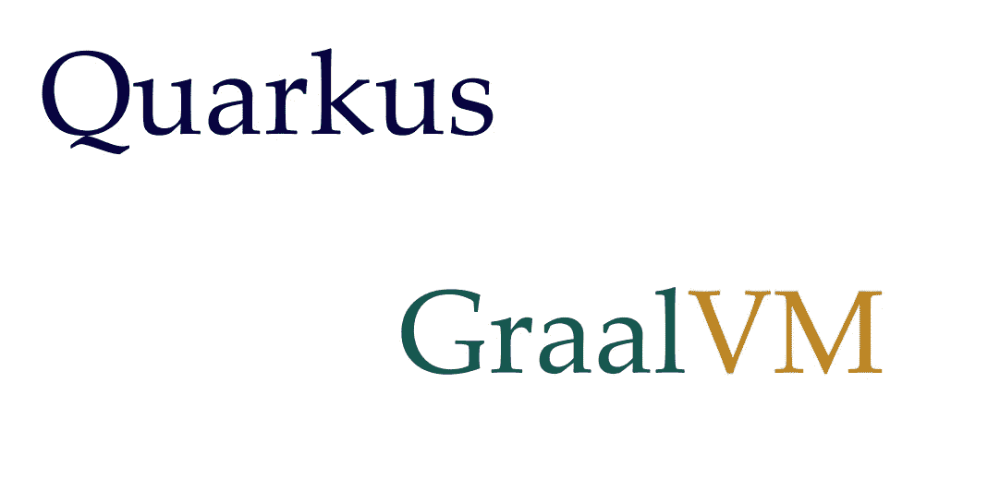

# GraalVM 和 quar kus:Java 初学者简介

> 原文：<https://medium.com/javarevisited/graalvm-and-quarkus-a-brief-introduction-for-java-beginners-c74d663c5a89?source=collection_archive---------2----------------------->

当我开始编码时，我不明白为什么 Java 代码需要一个虚拟机(JVM)。如果你也对此感到困惑，请阅读下面三段。其他人可以跳过。

一次构建，随处运行。

这是 Java 的口头禅。无论你在哪里写代码，无论是 Mac 还是 Linux，当你用 JDK 编译它时，它会创建一个字节码(你的类文件)。您可以将您的类文件打包到一个 jar 文件中，并将其传输到任何平台上运行。

这非常有帮助，因为这确保了传统应用服务器的更快发布。您只需确保用于编译的 java 版本和目标机器上的 Java 运行时是兼容的。这意味着运行时 java 版本不应低于编译器 Java 版本。否则，你会得到 [*java。郎。UnsupportedClassVersionError*](http://javarevisited.blogspot.com/2015/05/fixing-unsupported-majorminor-version.html#axzz54cnqJy3L)

但是这个字节码不是本机可执行文件，您不能在目标机器上单独运行它。

所以有了 [Java](/javarevisited/10-best-spring-framework-books-for-java-developers-360284c37036) ，你实际上需要一个与主机操作系统对话的中介来执行你写的应用程序。我们称这个中介为 JVM。它被称为虚拟机，因为它执行操作系统的功能，如[垃圾收集](https://javarevisited.blogspot.com/2011/04/garbage-collection-in-java.html#axzz4zt6jlTWS)或[内存管理](https://javarevisited.blogspot.com/2019/04/top-5-courses-to-learn-jvm-internals.html)，线程调度等等。有多种 JVM 实现，最流行的是 Hotspot JVM。

JVM 很有帮助，但是初始启动需要更多的时间。

在像 [Kubernetes](/javarevisited/7-free-online-courses-to-learn-kubernetes-in-2020-3b8a68ec7abc) 这样的云原生环境中，pods 在几秒钟内就启动了增加的负载。如果一个 Java 应用程序启动需要几秒钟，那将会令人失望。这也是 [Java](/javarevisited/top-10-frameworks-full-stack-java-developers-can-learn-in-2020-5995021401e5) 在无服务器世界不太流行的原因(臭名昭著的冷启动问题)。

此外，当每个人都将他们的代码打包成容器映像时，我们就不必担心平台兼容性了。如果可能的话，我们可以发送优化的本机映像本身，而不是将 Jar 文件复制到 Java 映像中并发送出去。这就是我们所说的云原生技术。

## 什么是 GraalVM？

GraalVM 是一个高级运行时，具有许多针对性能进行了调整的特性，比如提前编译。JVM 只能运行字节码语言，如 [Java](https://javarevisited.blogspot.com/2018/07/10-reasons-to-learn-java-programming.html) 、[科特林](/javarevisited/top-5-courses-to-learn-kotlin-in-2020-dfc3fa7706d8?source=---------16------------------)、[Scala](/javarevisited/5-best-scala-and-functional-programming-books-to-learn-in-2021-97ec9e56f2bd)；但是 GraalVM 可以与一系列编程语言一起工作，如 [R](/javarevisited/10-best-r-programming-courses-for-data-science-and-statistics-8f84ebec4974) 、 [Python](/javarevisited/10-free-python-tutorials-and-courses-from-google-microsoft-and-coursera-for-beginners-96b9ad20b4e6) 、 [NodeJS](/javarevisited/top-10-online-courses-to-learn-node-js-in-depth-8ef0e31ca139) 等等。Truffle 语言实现框架用于拥有这种多语言功能。GraalVM 通过原生映像技术多方面提高了 java 启动时间。

## 什么是原生映像？

本地映像是一个特定于平台的独立可执行文件，由基于 JVM 的语言创建，如 [Java](https://javarevisited.blogspot.com/2018/07/top-5-websites-to-learn-coding-in-java.html) 、 [Kotlin](/javarevisited/7-free-courses-to-learn-kotlin-in-2020-327c3872c1e1?source=collection_home---4------2-----------------------) 或 [Scala](/javarevisited/why-java-developer-should-learn-scala-programming-in-2020-3ca01a47eb0d) 。可选地，其他来宾语言也可以被编译到其中。

GraalVM 提供了一个名为 native-image 的实用程序来创建这些本机映像。也很少有 Java 框架将应用程序代码编译成本机可执行文件，而不是 jar 或 war 包。

## 夸库斯是什么？

Quarkus 是一个 java 框架，它以各种方式被创建和优化，以与云和高性能环境一起工作。借助 Netty 和 Vert.x 进行命令式和反应式开发， [Quarkus](https://javarevisited.blogspot.com/2020/09/top-5-courses-to-learn-dropwizard-Micronaut-Quarkus-Java-Microservices.html#axzz6iNNhKZui) 还支持将 java 代码编译成本地可执行文件。

Quarkus 需要安装 GraalVM 来构建本地可执行文件。在这里可以看到夸尔库斯的短暂性能差异[。](https://www.redhat.com/en/resources/quarkus-infographic-supersonic-subatomic-java)