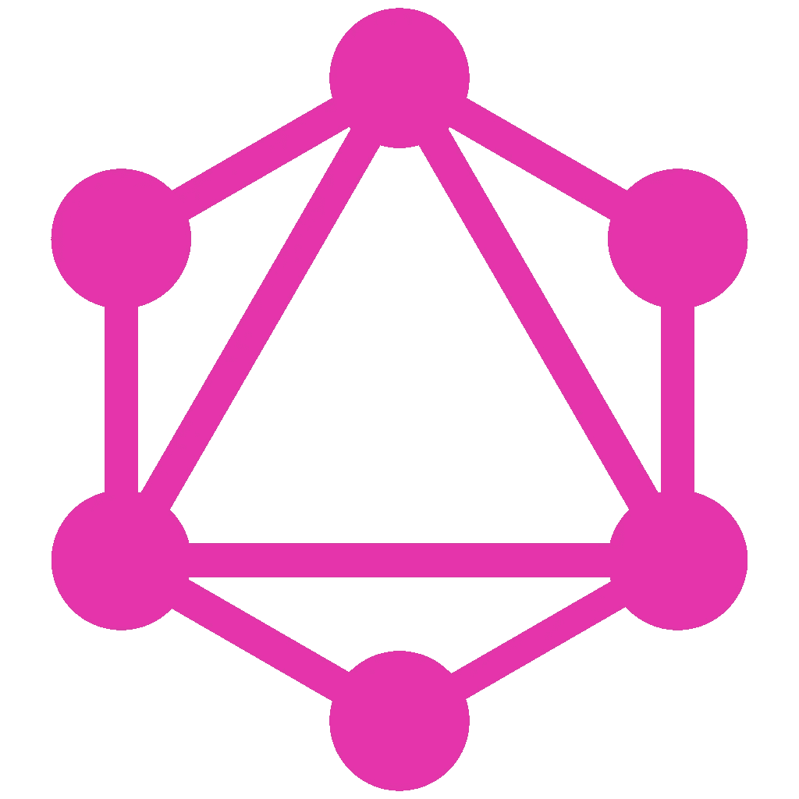
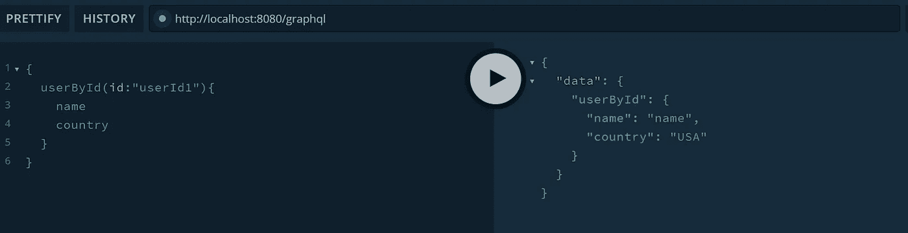
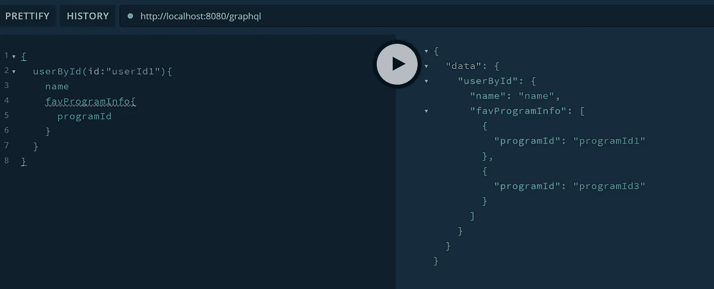

# 带 Java 的 GraphQL

> 原文：<https://medium.com/javarevisited/graphql-with-java-8b8c9ec5971e?source=collection_archive---------3----------------------->

我们为什么需要它，什么时候需要它？

在深入细节之前，让我们先举个例子。

考虑到我们正在构建一个 OTT 平台。每个用户都有一个账户，可以保存自己喜欢的节目。他应该能够从移动应用程序或浏览器等不同平台访问他的帐户。

每个平台都有自己的网络界面，有些是精简的，有些是扩展的。

为了便于学习，让我们假设用户模型只有以下细节:

ProgramInfo 将提供以下详细信息:

现在，当我们使用 [Rest API](/javarevisited/why-spring-is-the-best-framework-for-developing-rest-apis-in-java-784590e484a4) 时，如果我们只需要账户的名称和国家，下面是我们的选项:

*   我们将需要一个最小的模型和一个单独的 API 来获得所需的细节
*   获得整个用户的详细信息(假设用户已经将许多节目保存为收藏夹)，使得通信消息变得沉重

正如您在这里看到的，客户机无法控制它想要什么，只有服务器决定客户机需要在服务器上查询什么。

但是如果我们在服务器中使用 [GraphQL](/javarevisited/top-5-graphql-tutorials-and-courses-for-beginners-fb5543506fc2?source=---------75------------------) ，客户端可以请求它需要访问的信息。我正在使用 [Graphql playground 工具](https://github.com/graphql/graphql-playground)与我创建的 Graphql 应用程序进行通信。

下面是上述场景的查询和结果。

或者，如果客户端想要用户最喜欢的程序的 programIds，下面是它将如何进行。

很有趣，不是吗？

现在让我们实现代码来实现这一点。第一步是拥有一个 graphql 模式。下面是我为我们的用例定义的模式。根据我的实现，这需要放在资源文件夹中。

我已经声明了两个定制模型，User 和 ProgramInfo。ProgramInfo 是用户模型的一部分。

接下来，声明了一个查询，该查询(userById)将在 Id 上。为了接收用户模型，客户机需要提供一个 userId 来标识所请求的资源。他可以选择在用户模型中提供他想要接收的值。

现在，我们将实现模式，我使用的是 graphql-java 库。我将使用带有 maven build 的 spring-boot 应用程序。下面的依赖关系需要添加到我们的 pom.xml 中。我正在使用 guava 库解析模式文件。

使用上面定义的模式，我们需要创建服务于客户端请求的连接。下面是创建 GraphQL 实例所需的基本实现。

1.  读取定义的模式
2.  解析模式并创建连接
3.  从解析的模式创建一个 GraphQL 实例

现在我们已经为我们定义的模式初始化了一个 GraphQL 实例。启动应用程序，通过 graphql playground tool 点击下面的 [url](http://localhost:8080/graphql) ,请求正文包含所需的信息。

# 参考资料:

GraphQL 网站:【https://graphql.org/learn/ 

作者的 github 资源库:【https://github.com/mrajaian/graphqlExample 