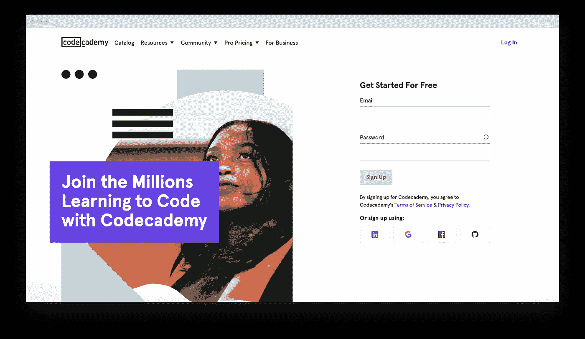

# 贪婪还是精明:学习 Java 有没有一点付出？

> 原文：<https://medium.com/javarevisited/greedy-or-savvy-is-there-a-point-to-pay-for-java-learning-b95b5324c93?source=collection_archive---------3----------------------->

互联网包含如此多的信息，我们可以从字面上了解一切。任何语法、任何编程语言、任何专门化——没有什么是不可能的。据 [TechJury](https://techjury.net/blog/how-much-data-is-created-every-day/#gref) 报道，人们每天会产生大约 2.5 万亿字节的数据！任何人都可以免费获取大量的信息。

我是一名 Java 开发人员，我确信任何人都可以从免费博客、YouTube 视频和不同教育平台上的免费课程中学习 Java。

然而，这并不总是最好的选择，我将解释为什么我们需要付费教育服务，以及何时从免费在线教育转向付费教育。

# 可能的陷阱

原因是，免费在线学习有其不利之处。其中之一是缺乏结构。当然，你可以找到几乎每个问题的答案，但你可能会在上面花很多时间，而且学习本身看起来就像你一点一点拼凑起来的马赛克。

第二个问题是内容的质量。你不能相信任何一个创造内容的陌生人，所以你必须花一些时间来检查她的声誉。此外，大多数免费课程是为初学者准备的。当然，没有人会纠正你的错误，指导你，或者帮助你练习。

尽管如此，上面提到的所有问题都不能阻止你开始学习如何编写代码。相反，我们会给你如何免费学习的建议，并决定是时候让你转向付费服务了。

# 有时间——参与免费学习

如果你刚刚开始[学习 Java 编程](/javarevisited/top-5-java-online-courses-for-beginners-best-of-lot-1e1e240a758)，做好投入大量时间的准备。对于应该兼顾工作、家庭、学习的人来说，可能需要长达数年的时间。但是免费在线教育值得一试，尤其是在这样的情况下:

*   你正在考虑一个[程序员](/javarevisited/top-10-free-interactive-programming-courses-from-educative-for-beginners-to-learn-in-2021-713cbf96d4eb)或 QA 专员的职业，但仍然不确定它是否适合你。
*   你有一个成为[开发者](/javarevisited/top-10-online-courses-to-become-a-fullstack-web-developer-in-2020-d608a6b63232)的长期目标，但与此同时，并不着急:你有充足的时间去实现它(一年多)。

# 自学小贴士

首先，找到几个你可以信任的来源是至关重要的。你可以在各种视频课程、有任务(或没有任务)的文本课程、免费书籍或教程等中进行选择。我可以推荐几个可靠有趣的来源:

*   YouTube 上的 [Java 初学者教程](https://www.youtube.com/watch?v=NBIUbTddde4&list=PLZPZq0r_RZOMhCAyywfnYLlrjiVOkdAI1)。在这里你可以找到一些基本的信息，比如什么是 JDK (Java 开发工具包)，如何下载，什么是 IDE(集成开发环境)，如何安装等等。该视频中的信息非常生动，包含丰富的示例、有用的提示和技巧。
*   [Java 教程](https://www.tutorialspoint.com/java/index.htm)在 TutorialsPoint 网站。在这里，您可以学习所有的基础知识:从初学者的环境设置和语法到对象、类、变量类型、方法等等。此外，你甚至可以在这里学习[高级 Java】(当然，如果你足够自律的话)。这个网站的显著优势是它收集了大量的例子。](/javarevisited/11-advanced-core-java-online-courses-to-join-in-2021-46011661257a)
*   w3schools.com 网站上的 Java 教程。您也可以从这些 Java 课程中受益。他们解释了所有的基本概念(方法、类、文件处理等。).此外，您还可以做练习，参加小测验，并在完成 Java 课程后获得证书。
*   赫尔辛基大学创建的免费 [Java 编程](https://java-programming.mooc.fi/)课程。每个人(即使你以前从未尝试过编程)都可以参加，并经历两个部分:Java 编程 I 和 Java 编程 II。所有课程都包含练习。课程结束时，你可以获得结业证书。

**二、**有必要在你的作息时间表中拨出一些时间来有规律地学习，即使你工作和/或家庭都很忙。学习 Java 的最好方法是每天花一些时间阅读和做练习。如果这对你来说太难，每周至少安排三次学习。

第三，记住，你应该优先考虑的不是理论，而是编码本身。为许多有时看起来毫无意义的无聊任务做好准备。

事实是，它们无论如何都是有用的，你完成的越多，你进步的就越快。如果你需要额外的动力，找到它(例如，用一些好的东西奖励自己做另外五个练习)。

# 向前迈进的时刻到了

免费在线课程可以是一个很好的起点，但在某些时候，你可能会觉得这还不够。这种不满可以以不同的形式出现。以下是其中的一些:

-你严重缺乏学习时间，同时，你需要学习 Java 并快速找到工作。在这种情况下，越早选择付费选项越好。通常，这些课程的目标是帮助你尽快取得切实的成果。另外，你会体验到更大的动力(这就是人类大脑的工作方式:我们更看重我们所付出的)。此外，坚持时间表会更容易，因为所有的[课程](https://javarevisited.blogspot.com/2020/11/top-10-udemy-courses-you-can-buy-in.html)都有截止日期。

-你失去了动力，想要放弃。或者你学习，甚至可能定期学习，但是你看不到你努力的回报。你仍然没有准备好解决复杂的任务，甚至不能想你什么时候会申请第一份工作。在这种情况下，转到付费课程也会有所帮助。最有可能的是，你会获得一个更清晰的视角:你什么时候结束学习，什么时候开始找工作。

-你觉得你在做错事。你完成了一两门免费课程，但你不确定它们是否让你进步了。你想继续发展你的技能，成为一个[更好的程序员](/javarevisited/10-tips-to-become-a-better-programmer-and-software-developer-a48037519182)——但是除了 Java 基础知识之外，你不知道在哪里可以找到相关的和有用的信息。大概这是选择付费课程的绝佳时机。

# 付费课程的优势

通过支付 Java 课程的费用，你得到的不仅仅是知识。除此之外，您还可以购买:

*   **信息的质量和新鲜度。**没有任何个人因素，只是商业因素:开设课程的公司试图将课程做得尽可能好，并定期更新课程。你不会像在免费教程中那样冒险找到过时的内容。还有，几乎所有的付费课程都有很多免费的附加资源。
*   **开车。你不仅为一大堆课程，也为坚持时间表的冲动付了一大笔钱。如果你错过了最后期限，你将失去你的美元，这对每个人来说都是一种非常不愉快的感觉(如果你不是，跳过这一点，去尝试杀死莎拉·寇娜)。**
*   **纪律。每门课程都有时间表，它让你更有条理。你将不得不计划你所有的活动，将课程融入你的日常生活，并最终为自己完成了所有事情而感到非常自豪。**
*   **社区和支持。有些课程有导师，他们可以帮助你继续学习，检查你的任务等。还有一个选项是与其他学生交谈，分享问题和担忧，交流技巧和成功经验。**

# 一些可供考虑的选项

如果您不知道从哪里开始选择付费课程，您可以查看以下选项:

*   CodeGym 采用游戏化的方法，让学习变得更有吸引力、更有成效。当然，你可以在这里学习所有的 [Java 基础](https://www.java67.com/2018/03/top-50-core-java-interview-questions.html)、对象等等，但是更重要的是你将解决超过 1200 个编码任务，体验像玩视频游戏一样的学习。您解决任务，获得积分，并通过新的课程和练习解锁新的级别。可以按月或按年付款。

主要优点是实用性。任务量令人印象深刻，嵌入式代码验证器节省了大量时间(如果你犯了一个错误，你会得到提示)。T4 的编码任务从最简单的到创建真正的应用程序(例如，小型视频游戏)都有。还有就是有一个强大的社区，有问题可以求助。最大的缺点是没有截止日期，除了订阅的结束日期。

*   [CodeCademy](https://www.codecademy.com/) 是一个大平台，你可以在这里学习几种编程语言。课程很实用，有很多练习。你可以按月或按年付款。

主要的优势是方便和获得大量不同语言的课程。该平台的缺点是课程的某些部分缺乏理论知识，有时提示过多。

*   [Coursera 上的 Java 编程与软件工程基础](https://ru.coursera.org/specializations/java-programming)。如果你喜欢更传统的方法，你可能会发现杜克大学的这门课程(实际上是 5 门课程的集合)很有帮助。它是为初学者设计的，侧重于每个开发人员都需要的核心概念和基本技能，而不考虑专业。你必须准备一个专题来完成这门课程。

主要优势:传统方式，多国语言字幕，有机会获得证书。最大的缺点:如果你曾经尝试过完成 Coursera 的课程，你就会知道这需要多少纪律和动力。

今天，我们有多种方法来学习 Java，我们不必局限于一两种。尝试什么最适合你，对新的可能性保持开放的心态，重新考虑不同的选择——这是获得梦想工作的成功之路，甚至比埃隆·马斯克提出他的下一个伟大想法还要快。