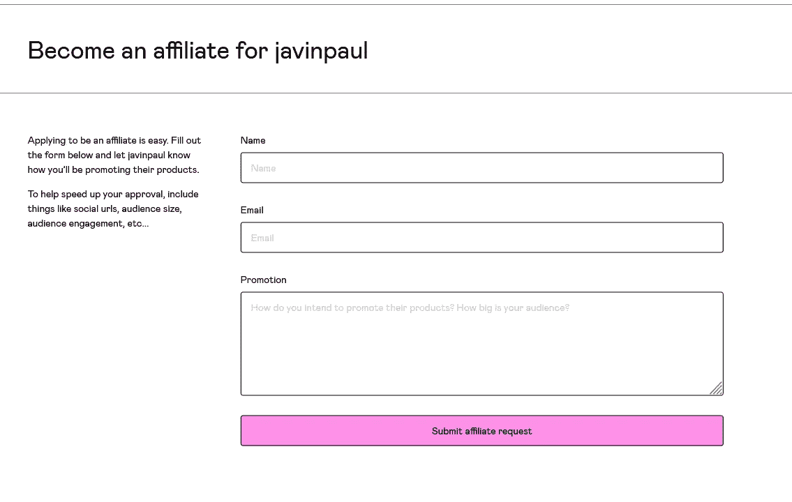
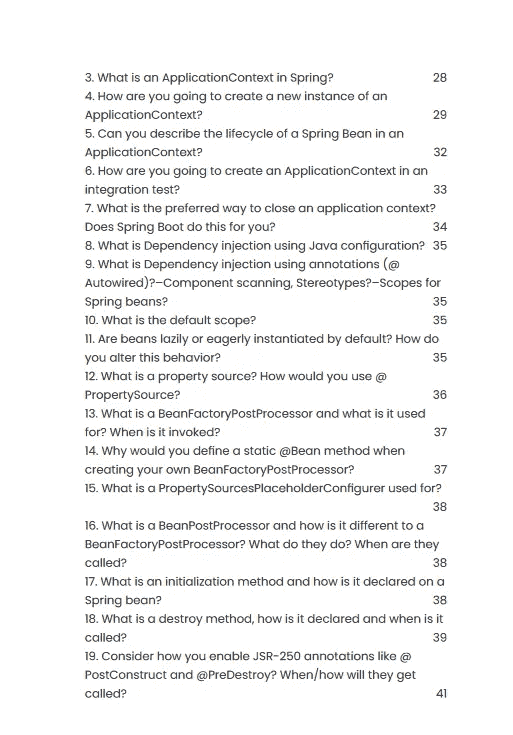
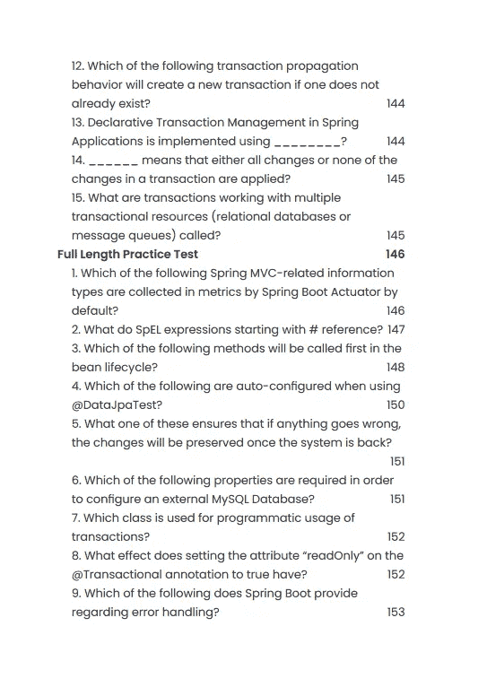

# 爪哇和 Spring Boot 代销商优惠—赚取 50%的佣金

> 原文：<https://medium.com/javarevisited/grokking-java-and-spring-boot-affiliate-offer-earn-50-commission-3e1fb0081d36?source=collection_archive---------2----------------------->

## 你有一个 Java 或编程博客，想加入我的联盟来推广我的 Java 和 Spring 书籍吗？现在你可以加入我给我的合伙人 50%的丰厚佣金。

大家好，

我正在为我的书寻找合作伙伴和合作伙伴， [*寻找 Java 面试*](https://gumroad.com/l/QqjGH) ， [*寻找 Spring Boot 面试*](https://gumroad.com/l/hrUXKY) ，以及 [*春季认证练习题*](https://javinpaul.gumroad.com/l/spring-practice-questions) ns。

> 你促成的任何销售我都会给你 50%的佣金。

这意味着我的课程包的正常价格是 39 美元，而你每卖出一本就能得到 19.5 美元；你所需要的就是努力分享这本书。

假设你有一个博客或时事通讯，或者你想在 Twitter、脸书或 YouTube 等社交媒体上推广它。

在这种情况下，它变得更容易，你可以写一篇文章，发布一个社交帖子，或者制作一个视频，介绍这本书如何帮助你破解 Java 面试，你将为自己带来一笔被动收入。

如果你有兴趣推广和分享我的书，请填写这张表格，我会将你添加为会员:

**立即加入并获得 50%的佣金—**[https://javinpaul.gumroad.com/affiliates](https://javinpaul.gumroad.com/affiliates)

顺便说一句，你需要一个 Gumroad 账户来获得报酬并有资格成为会员，所以如果你还没有的话，一定要创建一个 Gumroad 账户。

你可以在这里了解更多关于我的书-

**探寻 Java 面试—**[https://gumroad.com/l/QqjGH](https://gumroad.com/l/QqjGH)

***https://gumroad.com/l/hrUXKY 采访 Spring Boot****——*

**弹簧框架练习题—**[https://javinpaul.gumroad.com/l/spring-practice-questions](https://javinpaul.gumroad.com/l/spring-practice-questions)

问候

贾文