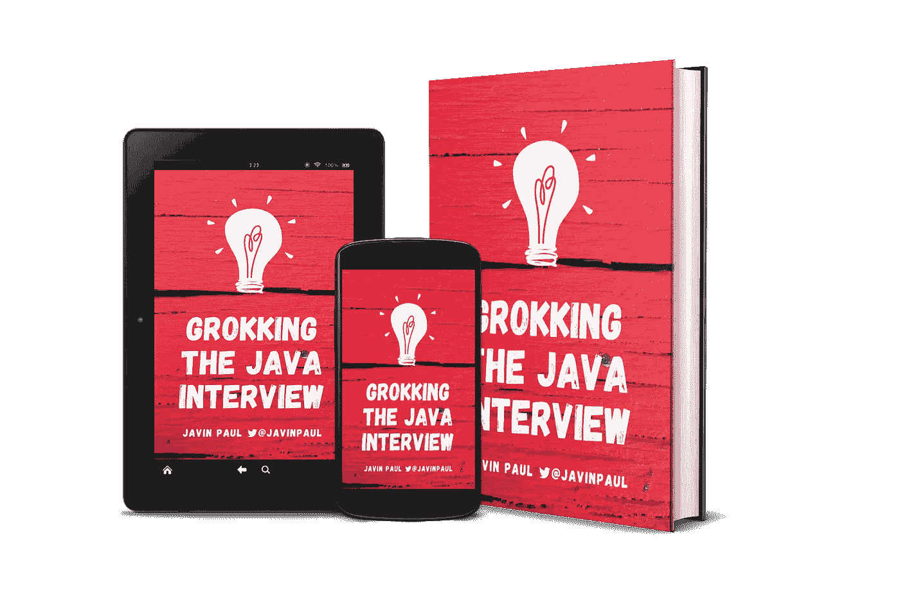
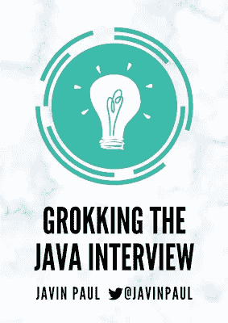
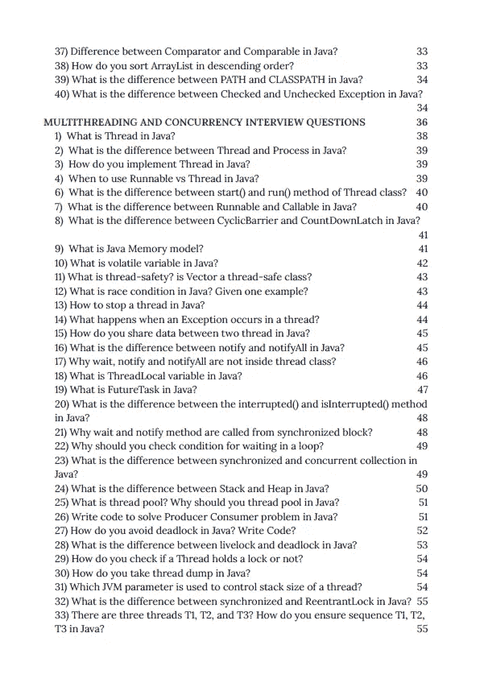
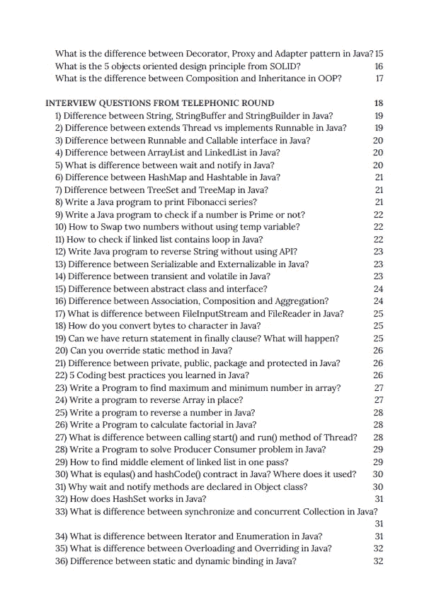

# 搜索现在可用的 Java 访谈书籍

> 原文：<https://medium.com/javarevisited/grokking-the-java-interview-book-available-now-ba6482ff25c1?source=collection_archive---------1----------------------->

## 我作为 Java 博客作者写了 10 年博客后的第一本书

在 Gumroad 上购买—[https://gumroad.com/l/QqjGH](https://gumroad.com/l/QqjGH)

大家好，我很兴奋地宣布我写了 10 年 Java 文章和 Java 面试问题的第一本书[的出版，虽然我写博客已经有 10 年了，但我从未真正卖出过任何东西，没有任何书，当然，也没有任何数字产品。](https://javarevisited.blogspot.com/2020/11/grokking-java-interview-my-first-book.html#axzz6f3SHu1sN)

最后，现在我有了我的第一本书，它将帮助 Java 开发人员破解面试——[**破解 Java 面试**](https://gumroad.com/l/QqjGH) 。这是我长久以来的愿望，让我的内容以一种结构化和有组织的方式提供更多的价值，这本书做到了。它提供了一种结构化的方法来准备 Java 面试和学习基本的核心 Java 概念。

老实说， [*破解 Java 面试*](https://javarevisited.blogspot.com/2017/01/how-to-prepare-for-java-interviews.html) 并不容易，其中一个主要原因就是 Java 非常庞大。有那么多概念要学，API 要掌握。

这就是为什么很多基本功很好的人比如[数据结构与算法](/hackernoon/50-data-structure-and-algorithms-interview-questions-for-programmers-b4b1ac61f5b0)、[系统设计](/javarevisited/25-software-design-interview-questions-to-crack-any-programming-and-technical-interviews-4b8237942db0)、 [SQL、数据库](/hackernoon/top-5-sql-and-database-courses-to-learn-online-48424533ac61)第一次尝试就无法破解 Java 面试的原因。

其中一个主要原因是因为他们没有花时间去学习核心的 Java 概念和基本的 API 和软件包，如 [Java 集合框架](/javarevisited/7-best-java-collections-and-stream-api-courses-for-beginners-in-2020-3ad18d52c38)、[多线程](/javarevisited/8-best-multithreading-and-concurrency-courses-for-experienced-java-developers-8acfd3b25094)、 [JVM 内部](https://javarevisited.blogspot.com/2019/04/top-5-courses-to-learn-jvm-internals.html)、 [JDBC](/javarevisited/top-5-courses-to-learn-jdbc-and-database-connectivity-for-java-developers-free-and-best-of-lot-7945156fcc3?source=---------9------------------) 、[设计模式](/javarevisited/7-best-online-courses-to-learn-object-oriented-design-pattern-in-java-749b6399af59)和[面向对象编程](/javarevisited/my-favorite-courses-to-learn-object-oriented-programming-and-design-in-2019-197bab351733?source=---------103------------------)。

这本 Java 面试书旨在解决这个问题，并从基本 Java 主题向您介绍经典的 Java 面试问题。这本书是我最好的 Java 访谈文章的汇编，这些文章已经被数百万开发者阅读过。

通过阅读这些问题和主题，您不仅可以扩展您的知识，还可以为下一次 Java 面试做好准备。

[**探寻 Java 面试**](https://www.amazon.com/dp/B08P55JZBX/?tag=javamysqlanta-20) 书籍包含了重要主题的常见 Java 问题，如:

1。面向对象编程

2。Java 基础

3。Java 合集

4。Java 多线程

5。碎片帐集

6.JDBC

7。仿制药

8。设计模式

9.电话面试问题

如果您正在准备[核心 Java 面试](https://javarevisited.blogspot.com/2015/10/133-java-interview-questions-answers-from-last-5-years.html)，那么我强烈建议您在电话面试或面对面面试之前仔细阅读这些 Java 面试问题，您不仅会获得回答任何 Java 问题的信心和知识，还会学会如何让 Java 面试对您有利。

是的，这是我破解 Java 面试的最大秘密，你需要鼓励面试官从你擅长的领域提问，这样你就可以展示你知识的深度。

记住，面试需要 1 个小时或稍多一点的时间，不可能在一个小时内检查完所有内容，每个人都有自己的强项和弱项。通过专注于你的优势并推动面试，你可以做得比等待下一个问题好得多。如果你对这本书感兴趣，那么你可以在 Gumroad 上以特价**$ 10.99****【55%折扣】**购买，直到本周它才恢复到 19.99 美元的正常价格。如果您有任何反馈或问题，请随时在这里、通过电子邮件或在 Twitter 上提问，我很乐意回答。

这里是购买这本书的链接— [**搜 Java 面试**](https://gumroad.com/l/QqjGH)

我还想感谢所有在预售和发行时购买这本书的人。非常感谢你的支持。这本书现在也可以在亚马逊 Kindle 上阅读，这样更多的人可以阅读。如果你是 Kindle 阅读器，那么你可以下载这本书并在你最喜欢的设备上阅读。

这里是在**亚马逊**——[**搜索 Java 访谈**](https://www.amazon.com/dp/B08P55JZBX/?tag=javamysqlanta-20) 上购买这本书的链接

<https://www.amazon.com/dp/B08P55JZBX/?tag=javamysqlanta-20>  

如果你在阅读这本书时遇到任何问题，你也可以给我发邮件或者在 Twitter 上给我发消息。

这是目录的截图，你可以在这里查看完整的目录。

感谢阅读这篇文章，如果你喜欢我的书，请考虑留下评论。您的反馈非常重要，因为它将帮助我提供更多价值。我真心感谢你的支持。

您可能喜欢的其他**编程和课程文章**

*   程序员的五大黑色星期五和网络星期一交易
*   [完整的 Java 开发者路线图](https://javarevisited.blogspot.com/2019/10/the-java-developer-roadmap.html#axzz6N3akNoox)
*   [Udemy vs CocdeCademy vs one month？](https://javarevisited.blogspot.com/2019/09/codecademy-vs-udemy-vs-onemonth-which-is-better-for-learning-code.html#axzz6VYKcmyZz)
*   [向谷歌和 IBM 等顶级科技公司学习的 18 门 Coursera 课程](/javarevisited/18-coursera-courses-you-can-join-in-2020-to-learn-from-the-worlds-top-tech-companies-google-74af46967d1e?source=collection_home---4------0-----------------------)
*   [Udemy vs Educative vs Codecademy？新手用哪个比较好](/javarevisited/codecademy-or-pluralsight-which-is-a-better-platform-to-learn-coding-skills-59251a080642)
*   [程序员十大课程](https://javarevisited.blogspot.com/2020/08/top-10-coursera-courses-specilizations-and-certifications.html)
*   [Udemy vs 复数视线？哪个学习平台比较好？](https://javarevisited.blogspot.com/2019/10/udemy-vs-pluralsight-review-which-is-better-to-learn-code.html)
*   [学习数据科学的 10 大 Coursera 课程](https://javarevisited.blogspot.com/2020/08/top-10-coursera-certifications-to-learn-Data-Science-Visualization-and-Data-Analysis.html)
*   [为了更好地学习 Python，你可以做的 8 个项目](/javarevisited/8-projects-you-can-buil-to-learn-python-in-2020-251dd5350d56)
*   [Udemy vs Coursera？学理工和编程哪个好](https://javarevisited.blogspot.com/2020/01/coursera-vs-udemy-which-is-better-for-programming-tech.html)
*   [学习 Python 的 10 个 Coursera 专业化和认证](https://javarevisited.blogspot.com/2020/02/10-best-coursera-courses--for-python.html)
*   [Coursera 证书对工作和事业有帮助吗](https://javarevisited.blogspot.com/2020/02/does-udemy-coursera-edx-educative-or.html)
*   [5 个最佳 Coursera 程序员职业证书](https://javarevisited.blogspot.com/2019/10/top-5-coursera-professional-certificates-for-programmers-IT-professionals.html)
*   开始职业生涯的十大 Coursera 认证
*   [面向程序员和开发人员的 Coursera 十大项目](https://javarevisited.blogspot.com/2020/08/top-10-coursera-projects-to-learn-essential-programming-skills.html)
*   [Coursera 的 10 项数据科学和机器学习认证](/javarevisited/top-10-machine-learning-and-data-science-certifications-and-training-courses-for-beginners-and-a6308497b764)
*   [课程创建者和内容创建者的两个最佳黑色星期五优惠](https://javarevisited.blogspot.com/2020/11/2-best-black-friday-deals-for-educators.html#axzz6f3SHu1sN)

**p . s .**——如果你正在寻找在黑色星期五促销中可以买到的最好的 Udemy 课程，那么你也可以看看我列出的在黑色星期五促销中可以买到的 [**10 个最好的 Udemy 课程**](https://javarevisited.blogspot.com/2020/11/top-10-udemy-courses-you-can-buy-in.html#axzz6enw6Ycw1) 。包含了最好的 Udemy 课程，学习 Docker、微服务、Spring Boot、MERN 栈、SQL、Python、网页设计，以及其他软件开发所需的必备技能。

</javarevisited/15-best-udemy-courses-programmers-can-buy-on-black-friday-and-cyber-monday-2020-a803874f41d9> 