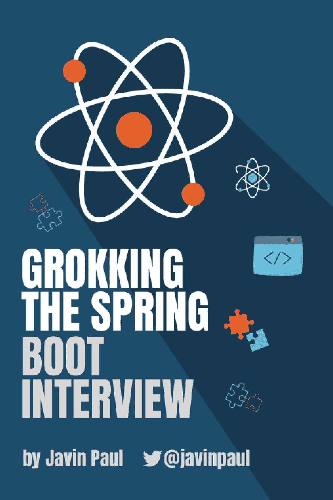
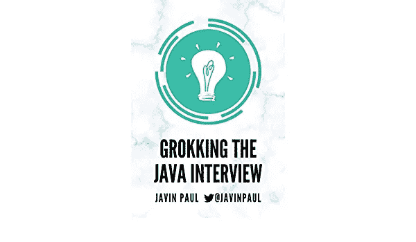
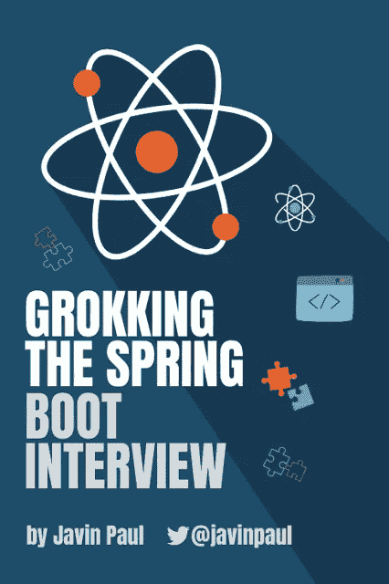

# 搜寻 Spring Boot 面试、破解 Java 的指南和春季面试

> 原文：<https://medium.com/javarevisited/grokking-the-spring-boot-interview-coming-soon-a31824b0ee0c?source=collection_archive---------2----------------------->

## 经过许多艰苦的工作和辛勤的劳动，我很高兴地宣布我的下一本书《Java 访谈》, Grokking the Spring book 现在已经上市，只需 10.90 美元就可以买到

大家好，经过几个月的辛勤工作和辛劳，我非常兴奋地宣布，我的新书《寻访 Spring Boot 的**的预购现已开放，你可以在 [Gumroad](https://medium.com/u/4e3295cc7a0b?source=post_page-----a31824b0ee0c--------------------------------) 以特价 **$10.90** 预购。**

**自从我谈到写一本关于 Spring 框架和 Spring book 的书，我收到了很多积极的回应，这激励我写这本书，我真的希望我的关于 Java 面试的书能帮助你找到你一直渴望的 Java 开发人员工作。**

**如果你最近接受过 Java 采访，那么你可能知道 Java 采访是出了名的难搞。不是因为他们像谷歌或亚马逊一样问不可能的算法问题，而是因为 Java API、框架和库的巨大性质。**

**对你来说，仅仅了解 Java 并期望你能通过 Java 面试是不够的。为了破解 Java 编程面试，您还应该了解基本的 Java 框架，如 Spring、Spring Boot 和 Hibernate。**

**在我的上一本书 [**探索 Java 面试**](https://gumroad.com/l/QqjGH) 中，我谈到了基本的核心 Java 主题，如集合、多线程和 Java 基础知识，在本书中，我分享了工作面试中常见的 Spring 框架问题。**

****

**[Spring Framework](/javarevisited/10-best-online-courses-to-learn-spring-framework-in-2020-f7f73599c2fd) 是最流行的，几乎是开发 java 应用程序的标准框架，包括运行在 Tomcat 等服务器上的核心 Java 和 Java web 应用程序。**

**和 Java 一样，Spring 框架也非常庞大，有几个子项目，比如容器，核心 Spring 概念比如 IoC 和依赖注入，**[Spring MVC](/javarevisited/21-spring-mvc-rest-interview-questions-answers-for-beginners-and-experienced-developers-21ad3d4c9b82)[Spring Boot](/javarevisited/10-advanced-spring-boot-courses-for-experienced-java-developers-5e57606816bd?source=collection_home---4------0-----------------------)， [Spring Data JPA](https://www.java67.com/2021/01/spring-data-jpa-interview-questions-answers-java.html) ， [Spring Cloud](https://www.java67.com/2021/01/spring-cloud-interview-questions-with-answers-java.html) ， [Spring Boot 测试](https://javarevisited.blogspot.com/2021/02/-spring-boot-testing-interview-questions-answers-java.html)， [Spring Security](https://javarevisited.blogspot.com/2021/02/spring-security-interview-questions-answers-java.html#axzz6lIcZ8tnd) ， [Spring Boot 执行器](https://www.java67.com/2021/02/spring-boot-actuator-interview-questions-answers-java.html)，Spring Boot 自动配置， [Spring AOP](https://javarevisited.blogspot.com/2021/03/spring-aop-interview-questions-answers.html#axzz6nwXUSoGH) ，以及各种 Spring APIs。****

****这本书触及了所有这些主题，并有问题来测试你对这些主题的了解。你可以用这些问题快速修改那些基本的 Spring 概念，也可以用这些问题进一步探索 [Spring 框架](/javarevisited/top-10-free-courses-to-learn-spring-framework-for-java-developers-639db9348d25)和 [Spring Boot](/javarevisited/top-10-courses-to-learn-spring-boot-in-2020-best-of-lot-6ffce88a1b6e?source=---------39------------------) 。****

****这本书包含了一些常见的问题，这些问题来自基本的 Spring 主题，比如****

****1.容器、依赖项和 IOC****

****2.春豆生命周期****

****3.面向方面编程(AOP)****

****4.Spring MVC****

****5.Spring Boot 简介****

****6.Spring Boot 汽车配置****

****7.Spring Boot 起动机依赖****

****8.Spring Boot 执行器****

****9.Spring Boot CLI****

****10.Spring Boot 测试****

****11.春云提问****

****12.春季数据 JPA****

****13.春天安全****

****这些问题是我最好的 Spring Boot 文章的汇编，这些文章已经被数百万 Java 开发人员阅读，也是我 10 年来撰写 Java 和 Spring 文章、教程和采访问题的经验。****

****如果你正在准备 *Java 和 Spring Boot 面试*，那么我强烈建议你在电话面试或面对面面试之前仔细阅读这些 Spring Boot 和春天的问题，你不仅会获得回答问题的信心和知识，还会学会如何让 Java 面试对你有利。****

******这是现在特价 10.99 美元的预购链接**——[正在进行春装面试](https://gum.co/hrUXKY)****

********

****如果你喜欢在亚马逊上购物，那么这本书现在也可以在亚马逊 Kindle 上预购，如果你喜欢从亚马逊订购，那么你可以使用这个链接— [**在亚马逊上搜索 Spring Boot 访谈**](https://www.amazon.com/dp/B08V1NN4LW/?tag=javamysqlanta-20)****

**** [## 苦读 Spring Boot 的采访

### Spring Boot 访谈- Kindle 版。下载一次，然后在你的 Kindle 设备上阅读…

www.amazon.com](https://www.amazon.com/dp/B08V1NN4LW/?tag=javamysqlanta-20) 

这本书对于准备 [Spring 专业认证考试](https://javarevisited.blogspot.com/2018/08/how-to-crack-spring-core-professional-certification-exam-java-latest.html#axzz5j90KOik7)的 Java 开发人员也很有用，因为我已经尝试回答了官方 Spring 认证考试指南中的大部分问题。这意味着您也可以将此作为春季认证准备的复习学习指南。

如果你喜欢我的工作，这是我给你的其他书籍和课程

1.  [钻研 Java 面试](https://gumroad.com/l/QqjGH)
2.  [Udemy 春季认证实务考试](https://www.udemy.com/course/spring-professional-practice-test-questions-vmware-edu-certification/?couponCode=5DAYPROMO)
3.  [Udemy 上的 AZ 300 模拟测试](https://www.udemy.com/course/az-303-microsoft-azure-architect-technologies-practice-tests/?couponCode=5DAYSPECIAL)
4.  Udemy 上的 ACP-100 模拟测试
5.  [Java 基础考试 1Z0- 811 模拟考试](https://www.udemy.com/course/java-foundations-exam-1z0-811-practice-tests-new/?referralCode=FE9DD7923503304B7EE3)
6.  [AZ-900 Azure 基础练习测试](https://www.udemy.com/course/az-900-practice-test-azure-fundamentls-certification-exam/?referralCode=C335B28D838A48DEDFA1)
7.  [1z 0–819 的 Java SE 17 认证实践测试](https://www.udemy.com/course/1z0-819-certification-oracle-java-17-exam-practice-test/?referralCode=8CCD5C00F8AE1259BBF1)

再次感谢大家的爱和支持。我非常感谢你对我第一本书的回应。如果您有任何反馈或疑问，请随时提问。

**附言——**如果你正在准备春季认证，那么你也可以在 Udemy 上参加我的 [**春季认证实践课程**](https://www.udemy.com/course/spring-professional-practice-test-questions-vmware-edu-certification/?referralCode=7419B0A2C8AB79F0520E) 。它包含 5 个完整长度考试的 250 多个高质量问题，以测试您在真实考试中的知识。

 [## 春季认证考试模拟测试[250 题]

### 我们是一个拥有扎实技术技能的团队，对在线教学充满热情。我一直在把我对 Java 的想法写在…

www.udemy.com](https://www.udemy.com/course/spring-professional-practice-test-questions-vmware-edu-certification/?referralCode=7419B0A2C8AB79F0520E)****