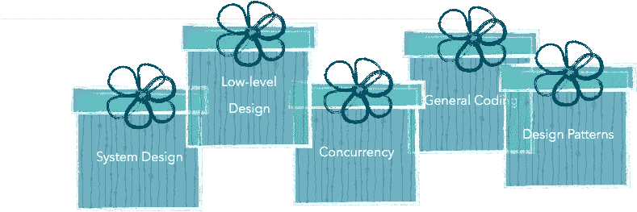

# 成长的烦恼——成为中级开发人员

> 原文：<https://medium.com/javarevisited/growing-pains-becoming-an-intermediate-developer-6108a00211d5?source=collection_archive---------0----------------------->

所以你在工作中变得有点自在了。部署生命周期不再是魔术。代码评审比你的代码要短。你已经运了一些东西。

希望你有动力去拓展和学习更多。但是资源的绝对数量是令人难以置信的！

> 一种务实的方法是坚持那些也有助于你更好地面试的东西。

这样，你会有一种进步感和一个持续关注的目标。

关注这 5 个领域—
1。低级/库设计
2。系统设计
3。并发
4。设计模式
5。一般编码实践

我所列出的资源将会是 Java 占主导地位的，但是您应该能够找到其他语言的对等物。无论如何，大多数设计概念都是语言不可知的。

# 低级/库设计

如果你看看优步、亚马逊等公司过去的 SDE2/3 面试问题，你会发现至少有一轮倾向于问这样的低级设计。我听说过的两个 commons 是—
1。**设计一个记录器库**2
。用 Java 实现流框架

我特别喜欢 Logger 的问题；根据受访者的熟练程度，你可以期待一系列的答案。

停下来试一试。一旦你完成了，问你自己以下的问题—

*   你把你的实现分解成不同的接口了吗？还是一个什么都有的超一流？
*   你知道你的类的线程安全吗？
*   你的伐木工是单身吗？懒装还是急装？为什么？
*   是可插拔的吗？第三方可以用替代实现来扩展你的库吗？
*   垃圾收集呢？你是否创建了太多的对象？

Log4j2 在记录自己的设计方面做得非常出色。做完这道题后，去看一看<https://logging.apache.org/log4j/2.0/manual/architecture.html>*。*

*我还没能找到任何其他低设计的好资源。如果你发现任何有用的东西，请在下面的评论中留言。*

# *系统设计*

*这更符合开发者在有人说“设计问题”时倾向于想到的东西。这里的两个共同点是。设计一个 URL 缩短系统
2。设计 Twitter 的新闻订阅系统*

*扎实的入门方法是 [***多恩马丁的设计入门***](https://github.com/donnemartin/system-design-primer) 。这很长，但是这是一个很好的广度优先的方法，可以让你更好地适应系统设计。*

*至少，你应该对—
1 感到舒服。异步垂直/同步写入；消息队列
2。一致性模式——尤其是最终一致性
3。数据库类型(SQL v/s NoSQL)和扩展模式
4。不同级别的缓存
5。将问题陈述分解成不同的独立服务*

*一个很棒的后续资源就是 [***钻研系统设计面试***](https://www.educative.io/collection/5668639101419520/5649050225344512) 。它详细讨论了具体的系统设计问题，比如我上面提到的两个问题。这是一个付费的资源，但也是一个很好的资源。*

**

*[来源:[https://github.com/donnemartin/system-design-primer](https://github.com/donnemartin/system-design-primer)*

# *并发*

*并发性是另一个将初级工程师与高级工程师区分开来的话题。想做对却出奇的难。*

****【Java 并发实践】*** 应该是必读。你会对—
1 有更好的理解。Java 的内存模型
2。发生之前的关系
3。虚假唤醒呼叫
4。波动 v/s 同步
5。线程安全、等待和通知等等*

*如果你用不同的语言编码，找一本同等的书。没有彻底掌握概念的调试竞态条件将会 ***非常*** 痛苦。*

*[***Java 多线程与并发***](https://www.educative.io/collection/5307417243942912/5707702298738688) by Educative 是很棒的后续资源。通读概念；然后盯着几个已经解决的面试问题。这将比尝试冷火鸡容易得多。*

# *设计模式*

*你不太可能在这些问题上被突击测验。但是当你解决不同的设计问题时，你会看到它们的出现。*

*一旦你对它们有所了解，你会发现它们无处不在。几个例子—
1。Adapter — Arrays.asList()
2。decorator—collections . synchronized collection(新数组列表< > ())
3 .prototype—immutables . copy of()
4。命令—可运行接口
5。策略—[Java . util . comparator # compare()](http://docs.oracle.com/javase/8/docs/api/java/util/Comparator.html#compare-T-T-)*

*StackOver 在 Java 的核心库中有一个庞大的模式列表[这里](https://stackoverflow.com/a/2707195)。*

*我试着阅读 GoF 的传奇书籍——设计模式:可重用的面向对象软件的元素，但是我承认我无法读懂它。*

*相反，我先尝试了 ***头像设计图案*** 。它看起来一点也不像一本技术书，但实际上是一本很好的读物。*

*不同的古怪故事粘在一起，很好地梳理出相似模式的微妙之处。我用了一个周末的时间完成了这本书，笑着看完了书中的大部分内容。*

*几个月后，我会再试一次。其中的讨论可能更符合经验。*

# *通用编码*

## *书，书，书*

****【有效爪哇】*** 。这是习惯 Java 习惯用法和最佳实践的一个极好的方法。它被分成 90 个独立的主题，每个主题有几页长。所以你可以阅读与你工作相关的部分。*

****【干净代码】*** —最后一个我保证！—是另一个很好的读物，当你开始审查别人的代码时非常方便。它会帮你在心跳中分辨出代码的味道。像“有效的 Java”一样，现在只浏览你认为相关的部分。*

## *熟悉您的 IDE*

*好吧，这通不过“让你更擅长面试”的测试。但实际上，熟练使用 IDE 会让编码变得非常有趣！*

*我使用 IntelliJ，它有一个漂亮的 ***“关键启动子 X”***插件。每次你用鼠标而不是键盘快捷键时，它都会对你尖叫。几个星期后，你应该会觉得自己像个专业人士(而且非常烦躁)。如果您正在使用另一个 IDE，请尝试在那里找到等效的 IDE。或者用 IntelliJ，很牛逼。*

*[***42 IntelliJ 点子技巧和窍门***](https://www.youtube.com/watch?v=eq3KiAH4IBI) 是 Youtube 上的一个会议谈话。这是一个有趣的方式来了解那里最常用的功能。*

*这是一个很大的列表——里面有书！不要急着完成事情，想想每天通过做这些事情来提高一点。祝你好运！*

*哦，顺便说一下，我假设大多数读者有 0-4 年的经验。如果你还没有开始工作，坚持 LeetCoding。稍后再来讨论这个问题。*

*直到你在现实世界中使用过几个系统，设计概念才会被理解。*

## *附录*

*<https://logging.apache.org/log4j/2.0/manual/architecture.html>  <https://github.com/donnemartin/system-design-primer>  <https://www.educative.io/collection/5668639101419520/5649050225344512>  <https://www.educative.io/collection/5307417243942912/5707702298738688>  <https://stackoverflow.com/a/2707195>  

[https://www.youtube.com/watch?v=eq3KiAH4IB](https://www.youtube.com/watch?v=eq3KiAH4IBI)—关于使用智能智能的技巧和诀窍的有趣演讲。

> **书籍**
> 我喜欢在每个基础领域挑选一本好书，并确保每本书都与其他的正交。

1.  [**有效的 Java**](https://www.goodreads.com/book/show/105099.Effective_Java_Programming_Language_Guide)—Java 最佳实践入门。非常容易阅读。
2.  [**干净的代码**](https://www.goodreads.com/book/show/3735293-clean-code)——编码的好经验法则
3.  [**Java 并发实践**](https://www.goodreads.com/book/show/127932.Java_Concurrency_in_Practice) —掌握并发的基础书
4.  [**头先设计模式**](https://www.goodreads.com/book/show/58128.Head_First_Design_Patterns)**——有趣、有效的面向对象设计思维方式**
5.  **[**设计数据密集型应用**](https://www.goodreads.com/book/show/23463279-designing-data-intensive-applications)——我见过的评分最高的技术书籍。伟大的系统设计，但 huuuuge。最好一次读一点。***