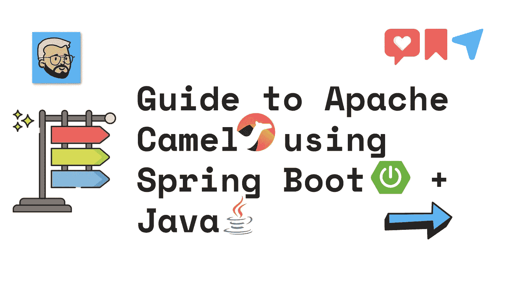

# 使用 Spring Boot + Java 的 Apache Camel 指南

> 原文：<https://medium.com/javarevisited/guide-to-apache-camel-using-spring-boot-java-6d57f7440542?source=collection_archive---------0----------------------->

## 阿帕奇骆驼[版本 0.1]

你好🤟，我是[罗汉·拉温德拉·卡达姆](https://medium.com/u/a1b33b7cda75?source=post_page-----6d57f7440542--------------------------------)，全栈开发者 [↗️](https://znap.link/rohankadam)

今天我们要去参观

使用 Spring Boot + Java 的阿帕奇骆驼指南？

## ➡️Introduction

在直接进入示例和用例之前，让我们试着了解更多关于 Apache Camel 和 Spring Boot 的知识。

## ✅What 是春天的靴子？

它用于创建独立的、生产级的基于 spring 的应用程序。提供自以为是的“初学者”依赖项，以简化您的构建配置。尽可能自动配置 Spring 和第三方库。不需要代码生成和 XML 配置。

<https://spring.io/projects/spring-boot>  

## ✅什么是阿帕奇骆驼？

Camel 是一个开源集成框架，使您能够快速轻松地集成各种使用或产生数据的系统。它基于企业集成模式。它可以独立运行在任何地方，这使得它更容易使用。它们包含数百个用于访问数据库和消息队列的组件&帮助我们集成一切。

<https://camel.apache.org/>  

## ➡️UseCase

## ✅Apache 骆驼🦒:如何写第一条路线？

<https://rohankadam965.medium.com/apache-camel-how-to-write-first-route-7f7767c86c2a>  

## ✅How 使用 Apache Camel 实现异常处理？

</javarevisited/how-to-implement-exception-handling-using-apache-camel-26faad831e8f>  

## ✅How 将使用 Apache Camel 消费公共 API？

</javarevisited/how-to-consume-public-api-using-apache-camel-70f7382959ab>  

## ✅How 使用选择和当在阿帕奇骆驼？

</javarevisited/how-to-use-choice-and-when-in-apache-camel-4f16c67bfa80>  

## ✅How 将在 Apache Camel 中实现多播模式？

</javarevisited/how-to-implement-multi-cast-pattern-in-apache-camel-8626518b8044>  

## ✅How 将在阿帕奇骆驼上创建可重复使用的路线？

</javarevisited/how-to-create-re-usable-routes-in-apache-camel-c4e57956e6e3>  

## ➡️Conclusion

在本文中，我们试图理解 Apache Camel 及其用例。如果觉得这篇文章有用，请分享和喜欢。请关注我的媒体 [Rohan Ravindra Kadam](https://medium.com/u/a1b33b7cda75?source=post_page-----6d57f7440542--------------------------------) 和[其他平台](https://znap.link/rohankadam)。

谢谢— [罗汉·拉温德拉·卡达姆](https://medium.com/u/a1b33b7cda75?source=post_page-----6d57f7440542--------------------------------)