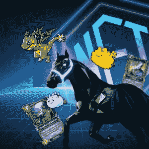
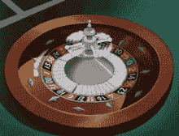
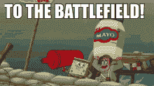
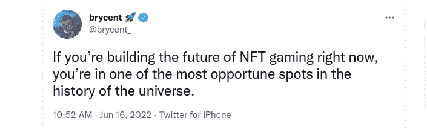

# 指导您启动 NFT 游戏平台开发

> 原文：<https://medium.com/javarevisited/guide-you-through-launch-an-nft-gaming-platform-f71a6980832c?source=collection_archive---------4----------------------->

NFT 游戏平台

你已经知道了[NFT](/javarevisited/10-best-nfts-courses-and-certifications-for-beginners-to-learn-non-fungible-tokens-in-2022-3f36a4374ba)，这是一种数字资产，代表现实世界中的物体，如艺术品、游戏中的物品、视频、图像、迷因、音乐和我们周围的一切。 [NFTs](https://javarevisited.blogspot.com/2021/12/top-5-courses-to-learn-about-nfts-non.html) 的人气飙升已经彻底改变了许多领域，包括游戏、体育、时尚、艺术、娱乐等等。

博彩业就有这样一个显著的积极影响。镇上众所周知的 NFT 游戏有 Axie Infinity、Splintyerlands、Cryptokitties、Sorare、 [**沙盒**](https://www.sandbox.game/en/) 、 [**外星世界**](https://alienworlds.io/) 、 [**被解放的神**](https://godsunchained.com/) 等等，还有很多要添加到这个列表中。了解 NFT 顶级游戏，它的突出点燃了企业家们潜入 NFT 游戏世界的火花。

如果你对推出一款 NFT 游戏如此好奇，那就和 NFT 游戏开发公司一起迈出第一步，为 NFT 爱好者和游戏玩家提供一次惊人的交易体验，交易游戏中的物品。在此之前，获取关于它的深刻知识。看一眼就有见解了！

# **NFT 博彩发展适合您的需求，无论利基是什么**

NFT 游戏平台是一个用户可以购买游戏道具和玩游戏的空间。它的性能或功能是在利用智能合约时预定义的。

这只不过是一组部署在区块链技术上的自动执行代码。下面这一节来谈谈 [**NFT 游戏平台的发展**](https://www.appdupe.com/nft-gaming-development?utm_source=Medium&utm_medium=blog&utm_id=VIbin) 与你的利基相一致。

事先知道:让我们举个例子(例如)，Axie Infinity 是 NFT 的一个游戏平台，拥有 3 个 Axie 的注册用户可以参加战斗，如果他们赢了就可以获得奖励。此外，它们可以繁殖后代。一件有趣的事情是，他们有特权将土地令牌化并在市场上出售。

NFT 博彩业有几个利基市场。通过选择任何特定的细分市场来缩小目标受众的范围。以下是 NFT 游戏类别下的各种利基。it 快速概述:

🔥**纸牌&赌场游戏**

赌场游戏

改造传统的一张 [**扑克牌或赌场游戏**](https://en.wikipedia.org/wiki/Card_game) 与 NFTs 的结合方式。它将让游戏玩家或用户用 NFT 而不是法定货币玩游戏。不管这些因素是什么，在线纸牌和赌场游戏都非常突出，因此 NFT 纸牌游戏的利基市场非常重要。

🔥**动作&冒险游戏**

动作游戏

动作与冒险游戏的 NFT 将确保用户购买游戏中的物品，如

角色、工具和装备、化妆品和任何其他特殊能力。这类游戏似乎是游戏产业中最大的部分。

🔥**战斗游戏**

战场游戏

来有趣的部分是 PvP 对战游戏；“玩到赚”的概念给予用户购买数字游戏资产和参与战斗的特权。游戏内物品包括等级、技能、服装、武器、门票、力量升级等。一些 PvP 区块链游戏是银河搏击俱乐部，Axie Infinity，Krabots 和众神被解放。

🔥**其他游戏类别**

所有游戏

街机游戏、桌游、建筑游戏、教育游戏、逃生游戏、电竞游戏、恐怖游戏、赛车游戏等。

来源:推特

# 👉**NFT 博彩业发展的特点**

✨Transparency 是 NFT 游戏开发<https://www.appdupe.com/nft-gaming-development?utm_source=Medium&utm_medium=blog&utm_id=VIbin>**的关键。用户可以选择购买数字资产，并以透明的方式进行访问。每笔交易的详细信息都将存储在区块链上，因此，如果需要，可以进行检查。**

**✨The 交易在交易者和开发者之间是可验证的。这种透明的交易确保了用户或游戏玩家在使用 NFT 游戏平台时会得到额外的好处和信任。**

**✨Instant &更好的流动性将是吸引新来者的一个有吸引力的因素。具有即时交易性的数字资产总是会带来较大的流动性。这一特性或特征非常重要，因为它完全基于玩家与 NFT 游戏平台交互的持续时间。**

**✨The 安全性是显著的特征之一，它将极大地消除安全漏洞，确保 NFT 游戏平台上代币的安全交易。这完全依赖于平台的配置。**

# **👉**从构思到 NFT 游戏开发****

**见证了 NFTs 的受欢迎程度的上升，不可否认的是，现在进入 NFT 领域被认为是一个明智的决定。首先，你接触谁最重要，也就是说，选择一个合适的&最好的 NFT 游戏开发公司。**

**此后，该公司将提供支持的权利，从构思，直到创造 NFT 游戏的预期。正如本文前面所讨论的，选择区块链发展网络，可以是[以太坊](https://javarevisited.blogspot.com/2021/11/top-5-courses-to-learn-ethereum-for.html)、币安智能链、EOS、Flow 等。**

**必须考虑 NFT 游戏的前端和后端。更重要的是，集成了加密钱包，用于以安全的方式存储[NFT](https://www.courserevisited.com/2022/02/10-best-courses-to-learn-nft-in-2022.html)，甚至无缝地发送和接收数字资产。**

**NFT 游戏平台开发完成后，需要对平台进行不同阶段的测试，这将确保性能令人满意，不会发现任何故障。完成了吗？推出面向游戏玩家的 NFT 游戏平台，让他们玩游戏并获得奖励。**

# **👉推出 NFT 游戏平台就足够了吗？**

**当然，这是一个很大的问题。看到 NFTs 的巨大潜力和突出地位，存在巨大的竞争，使得宣传更加高涨。尽管镇上有大量的 NFT 游戏，NFT 圈仍然为企业家提供了一个广阔的机会和空间来开发他们的 NFT 游戏平台。**

**然而，要让 NFT 游戏平台引起正确受众的注意，还需要相当大的努力。是的，NFT 营销在这里扮演着重要的角色。通过恰当有效的营销策略，将 NFT 游戏平台带给目标受众，并获得知名度。**

## ****结束，****

**NFT 游戏开发公司开启了一条在 NFT 世界探索越来越多机会并赚钱的道路。无论你是依靠现有的游戏概念，还是想出一个独特的概念， [**推出 NFT 游戏平台**](https://www.appdupe.com/nft-gaming-development?utm_source=Medium&utm_medium=blog&utm_id=VIbin) 的利基将为享受利益铺平道路。**

**<https://savingsfunda.blogspot.com/2022/05/top-10-online-courses-to-learn-nfts-non-fun.html>  <https://www.java67.com/2022/03/top-5-free-courses-to-learn-nft-non-fun.html>  <https://javarevisited.blogspot.com/2021/12/top-5-courses-to-learn-about-nfts-non.html> **