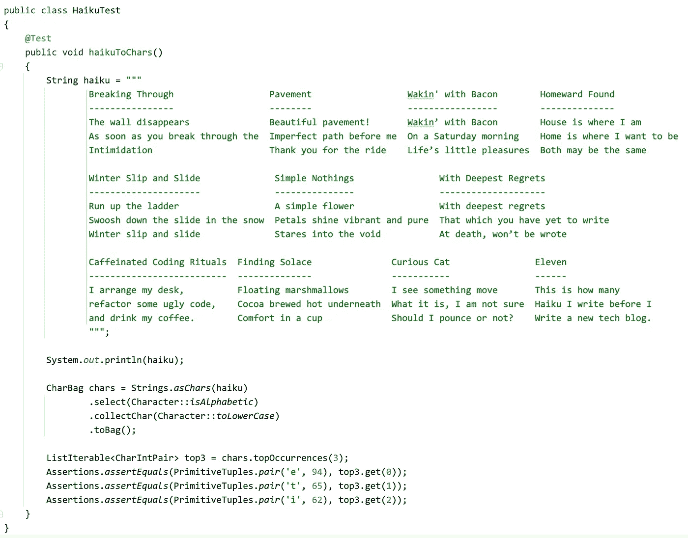
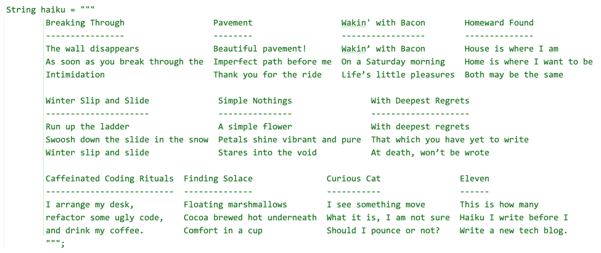
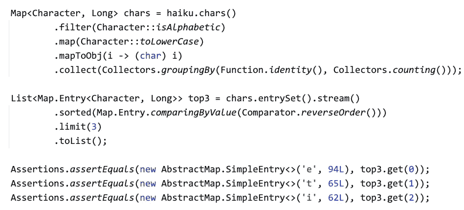
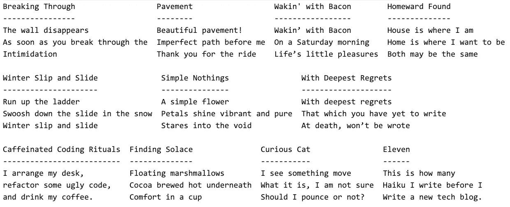

# 使用文本块的 Java 俳句

> 原文：<https://medium.com/javarevisited/haiku-for-java-using-text-blocks-6b7862ccd067?source=collection_archive---------1----------------------->

创意写作遇到 Java 文本块和 Eclipse 集合

使用文本块将 11 个俳句转换成 Java 字符串，并使用 Eclipse 集合计算字符数

# 我的俳句月

2021 年 9 月，我休了一个月的博客技术写作假。这个月我尝试写俳句。俳句是一种有结构的诗歌形式，共有十七个音节，第一行五个，第二行七个，第三行五个。

这是我在 Medium 上的俳句列表，我把我写的俳句和我在 Unsplash 上找到的精选图片进行了匹配。

唐纳德·拉布

## 俳句

[View list](https://donraab.medium.com/list/haiku-beef84828470?source=post_page-----6b7862ccd067--------------------------------)11 stories

# 使用文本块将俳句转换成 Java 字符串

我把俳句整理成三排，四、三、四个俳句。文本块如下所示:

带有俳句的 Java 文本块

# 使用 Eclipse 集合计数`chars`

一旦我将所有的俳句存储在一个字符串中，我希望看到我在写作中使用的前三个字母。这是受最近的一个现象的启发。我很想知道在我自己的创作中，哪些字母是我最常用的。对我来说，最简单的方法是使用 [Eclipse 集合](https://github.com/eclipse/eclipse-collections)。

我使用的算法非常简单。将`String`转换为`CharAdapter`，过滤掉非字母字符，将剩余字符转换为小写，将字符转换为`CharBag`(对它们进行计数)，然后向`CharBag`索要`topOccurrences`(前三个字母)。

使用 Eclipse 集合计算前三个字母的算法

# 使用 Java 流计数`Characters`

使用 Java 流也可以对`Character`实例进行计数。方法上的差异是微妙的。今天的 Java 中没有`Bag`数据结构或者`topOccurrences`算法，所以我不得不使用一个`Map`模拟一个`Bag`，并使用`Map`上的`entrySet`的排序和限制来计算`topOccurrences`。

使用 Java 流计算前三个字母的算法

# Eclipse 集合和 Java 流之间的区别

Eclipse 集合和 Java 流方法之间的差异是微妙的。Eclipse Collections 版本没有将`char`值封装为`Character`对象。Eclipse Collections 也没有将`int`算作`Long`对象。Eclipse 集合中的一个`CharBag`由一个`CharIntMap`支持。方法`topOccurrences`也可以处理平局(让开发人员去处理平局)，而限制方法将总是`limit`结果为三。

# 作为输出的俳句

我在代码中添加了一个`System.out.println(haiku)`来查看文本块的输出是否与输入看起来一样，确实如此。

所有 11 首俳句作为`System.out.println()`的输出

# 源代码

我在下面的要点中增加了一些额外的例子。我计算所有俳句中不同的字母，以及所有俳句中重复和独特的字母。我使用 Eclipse 集合和 Java 流解决了这些问题。

**更新:**我在下面的源代码中添加了一些测试，在俳句文本块中查找单词(5 个字母的单词，不是缩写)。我从斯图亚特·马克斯、弗拉德·扎哈罗夫和何塞·保马德那里得到了一些想法和帮助。在讨论中，我从 Stuart 那里了解到这个关于扫描仪的很棒的博客。

HaikuTest 的源代码

# 最后的想法

2021 年 9 月，我很好地摆脱了技术写作，并享受了写俳句的乐趣。直到现在我才真正有机会使用 Java 文本块，这被证明是一个有趣的实验。

我希望你喜欢阅读博客！

*我是*[*Eclipse Collections*](https://github.com/eclipse/eclipse-collections)*OSS 项目在*[*Eclipse Foundation*](https://projects.eclipse.org/projects/technology.collections)*的项目负责人。* [*月食收藏*](https://github.com/eclipse/eclipse-collections) *是开投* [*投稿*](https://github.com/eclipse/eclipse-collections/blob/master/CONTRIBUTING.md) *。如果你喜欢这个库，你可以在 GitHub 上让我们知道。*

## 您可能喜欢的其他 Java 文章

 [## 2022 年 Java 开发人员可以学习的微服务开发 5 大框架

### Java 程序员们好，2022 新年快乐。如果你正在考虑用 Java 进行微服务开发，并且正在寻找…

medium.com](/javarevisited/top-5-frameworks-java-developers-can-learn-for-microservices-development-in-2022-848da66d6651)  [## 2022 年 Java 程序员和架构师可以学习的 25 项基本技能

### Java 开发人员可以在 2022 年学习的 22 项基本技术技能，以进一步改善他们的形象，并成为…

medium.com](/javarevisited/top-22-skills-professional-java-programmers-can-learn-in-2022-to-upgrade-themselves-bc3da73d7491)  [## 2022 年 Java 程序员路线图

### 2022 年成为 Java 开发人员的图解指南，包含相关课程的链接

medium.com](/javarevisited/the-java-programmer-roadmap-f9db163ef2c2)