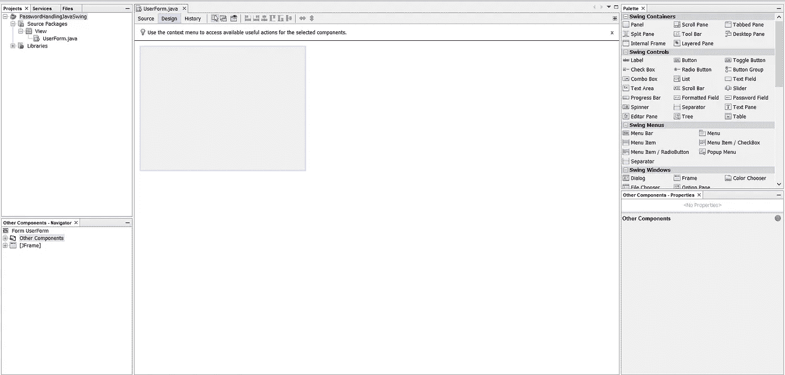
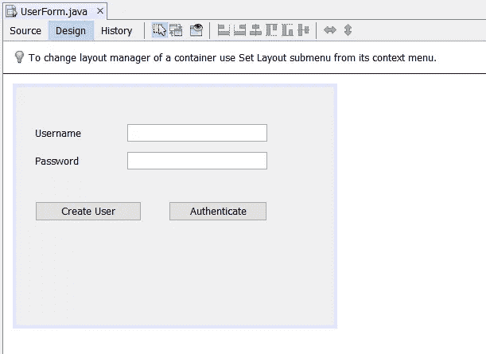
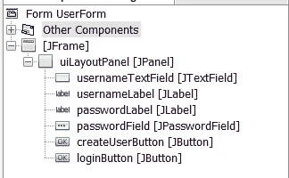
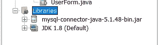
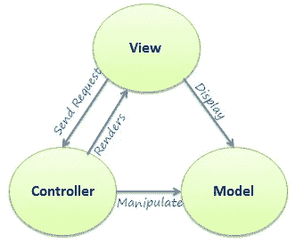
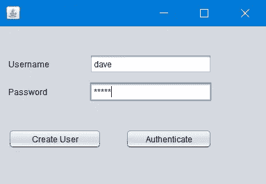
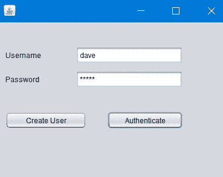
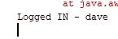

# 在 Java Swing 和 SQL 中处理密码

> 原文：<https://medium.com/javarevisited/handling-passwords-in-java-swing-and-sql-f0e52002a04c?source=collection_archive---------1----------------------->


密码被认为是安全存储的东西，并且被认为是用户的敏感信息。因此，必须安全地处理和存储这些敏感数据，不得出于任何不道德的原因滥用这些数据。

在本文中，我将提供一个演示，演示如何从 Java Swing GUI 中检索输入，并认为密码可以安全地存储在 SQL 数据库中。

我们将了解从 GUI 读取密码，将其存储在数据库中，以及从数据库中检索密码以验证用户身份。我将重点使用 Java Swing 密码字段和 SHA-256 加密(通过 Java)来存储密码。

***然而，对于企业级应用程序，不推荐使用这种方法，但是如果有人希望深入了解在 Java 应用程序中处理密码的一种可能方式，可以使用这种方法。***

**步骤 1)创建 Java Swing GUI**

首先，我们需要为用户设计一个 GUI 来输入数据。为此，我将使用 Netbeans 作为我的 IDE，并将使用 Java 8.0。此外，我将使用构建器来设计 Netbeans 上的 GUI。

a.Netbeans 项目窗口



项目窗口— Netbeans

一旦在 Netbeans 上创建了一个全新的 JForm，您将会看到以下内容。

为了设计 UI，我们需要一个**文本字段**来检索用户名，一个**密码字段**来检索用户输入的密码。此外，将需要两个按钮来**创建**和**验证**用户。

一旦你设计了用户界面，它看起来应该如下图所示。



已完成的 JForm



使用的组件

**步骤 2)创建数据库和用户表**

一旦成功创建了用户界面，就必须创建数据库**“密码演示”**和表格**“用户”**。为此，我将使用 MySQL Workbench 和 SQL Server。

工具可以在这里下载[。](https://dev.mysql.com/downloads/mysql/)

为了创建数据库和表，将执行下面的脚本。

```
create database PasswordDemo;
use PasswordDemo;create table User (
id integer primary key auto_increment,
username varchar(255) not null,
user_password varchar(255) not null);
```

这些脚本将创建一个数据库，并在数据库中创建一个表“User ”,该表使用一个自动递增的 ID 作为主键，后跟两列“username”和“user_password ”,可以接受 255 个字符。

**步骤 3)用 JDBC 配置 JForm】**

为了允许客户端应用程序与数据库交互，我将使用 JDBC (Java 数据库连接)驱动程序 Java。这个可以在这里下载[。从我个人使用 JDBC 的经验来看，我发现版本`5.1.48`在 Java 8.0 上工作得最好，因为我在用不同版本的 JDBC 连接数据库时遇到了几个错误。](https://downloads.mysql.com/archives/c-j/)

驱动程序下载后，需要添加到项目中。



JDBC 司机补充道

这样做之后，让我们创建两个独立的包，分别命名为“**控制器**和“**模型**”。这样做是为了确保客户端应用程序不直接与模型通信，而首先请求被发送到控制器，控制器将请求委托给模型，以便遵循 MVC(模态-视图-控制器)架构。



MVC 架构

**模型**将有三个类“User”(实体类)和一个“Database”(管理数据库连接的类)以及一个“DAO”(执行数据库 CRUD 操作的数据访问器对象类)。

**a .成功创建模型包**

1.  **用户—实体类**

```
package Model;public class User {private String username;
    private char[] password;public User(String username, char[] password) {
        this.username = username;
        this.password = password;
    }public String getUsername() {
        return username;
    }public void setUsername(String username) {
        this.username = username;
    }public char[] getPassword() {
        return password;
    }public void setPassword(char[] password) {
        this.password = password;
    }
}
```

**2。数据库—数据库连接类**

我将使用 Singleton 设计模式创建`Database`类，以确保只创建一个到数据库的连接，并在必要时重用。

```
package Model;import java.sql.Connection;
import java.sql.DriverManager;
import java.util.logging.Level;
import java.util.logging.Logger;public class Database {private Connection theConnection;
    private final String URL = "YOUR_URL";
    private final String USERNAME = "YOUR_USERNAME";
    private final String PASSWORD = "YOUR_PASSWORD";
    private static Database theDatabase = new Database();private Database() {
        try {
            Class.forName("com.mysql.jdbc.Driver"); //class name for MySQL Driver
            this.theConnection = DriverManager.getConnection(URL, USERNAME, PASSWORD); //retrieve database connection
        } catch (Exception ex) {
            Logger.getLogger(Database.class.getName()).log(Level.SEVERE, null, ex);
        }
    }public static Database getDB() {
        return theDatabase; //retrieve eager instantiated single instance of Database
    }public Connection getConnection() {
        return this.theConnection; //retrieve the re-usable connection object
    }
}
```

在成功创建了`Database`类之后，让我们继续前进到 DAO 类。

**3。DAO(数据访问器对象)类**

为此，我们需要检索数据库连接，并创建两个查询:创建一个用户和检索一个用户，我们将需要一种方法来加密密码到 SHA-256 格式，然后再存储它。

这个 DAO 类如下图所示。代码的所有实现都在代码本身进行了解释，因此请参考行内注释来理解底层算法。

关于加密算法的实现，请参考 Java [文档](https://docs.oracle.com/javase/7/docs/api/java/security/MessageDigest.html)或这篇[文章](https://www.baeldung.com/sha-256-hashing-java)

```
package Model;import java.nio.charset.StandardCharsets;
import java.security.MessageDigest;
import java.sql.Connection;
import java.sql.PreparedStatement;
import java.sql.ResultSet;public class DAO {private Connection theConnection;public DAO() {
        try {
            this.theConnection = Database.getDB().getConnection(); //retrieve the single instance of the database
        } catch (Exception ex) {
            System.out.println(ex.getMessage());
        }
    }public boolean createUser(User theUser) {
        try {
            //prepare the insert query
            PreparedStatement theStatement = theConnection.prepareStatement("insert into User (username,user_password) values (?,?)");//attach the values to be inserted into the database through the query
            theStatement.setString(1, theUser.getUsername());
            theStatement.setString(2, new String(theUser.getPassword()));//execute the query and return the boolean to denote the status
            theStatement.execute();
            return true;
        } catch (Exception ex) {
            //if error return false
            return false;
        }
    }public User getUser(User theUser) {
        try {
            //prepare the insert query
            PreparedStatement theStatement = theConnection.prepareStatement("select * from User where username = ? and user_password = ?");
            //attach the values to be inserted into the database through the query
            theStatement.setString(1, theUser.getUsername());
            theStatement.setString(2, new String(theUser.getPassword()));//execute the query to get the record for the user
            ResultSet queryResult = theStatement.executeQuery();if (queryResult.next()) {
                //if query has results, return the user record 
                return new User(queryResult.getString("username"), queryResult.getString("user_password").toCharArray());
            } else {
                return null;
            }
        } catch (Exception ex) {
            //if error return false
            return null;
        }
    }public String encryptPass(String password) {
        try {
            //retrieve instance of the encryptor of SHA-256
            MessageDigest digestor = MessageDigest.getInstance("SHA-256");//retrieve bytes to encrypt
            byte[] encodedhash = digestor.digest(password.getBytes(StandardCharsets.UTF_8));
            StringBuilder encryptionValue = new StringBuilder(2 * encodedhash.length);//perform encryption
            for (int i = 0; i < encodedhash.length; i++) {
                String hexVal = Integer.toHexString(0xff & encodedhash[i]);
                if (hexVal.length() == 1) {
                    encryptionValue.append('0');
                }
                encryptionValue.append(hexVal);
            }//return encrypted value
            return encryptionValue.toString();} catch (Exception ex) {
            return ex.getMessage();
        }
    }
}
```

在实现了创建和检索用户的方法以及加密密码的方法之后，我们现在可以实现控制器与数据库的交互。

**b .成功创建控制器包**

1.  **创建“用户控制器”**

这个类将负责处理来自 UI 的请求。UI 将请求 UserController 检索数据/向模型发送数据，发送回控制器的响应将用于更新模型。
这允许我们维护 MVC 架构设计模式。

```
package Controller;import Model.DAO;
import Model.User;public class UserController {

    private DAO theDAO;

    public UserController() {
        this.theDAO = new DAO();
    }

    public boolean createUser(User theUser) {
        String encryptedPassword = theDAO.encryptPass(new String(theUser.getPassword()));
        theUser.setPassword(encryptedPassword.toCharArray());
        return theDAO.createUser(theUser);
    }

    public User getUser(User theUser) {
        String encryptedPassword = theDAO.encryptPass(new String(theUser.getPassword()));
        theUser.setPassword(encryptedPassword.toCharArray());
        return this.theDAO.getUser(theUser);
    }
}
```

每当我们创建一个新用户，我们将检索输入的密码，然后我们将加密密码，并将加密的密码存储在数据库中。

当我们检索用户时，我们将首先加密密码，并执行一个查询来检查这两个加密值。如果这两个匹配，我们将检索用户信息。

成功创建控制器类后，我们可以继续 UI 实现。

**b .成功创建与视图的连接**

*   为此，我们需要向 Create 和 Authenticate user 按钮添加 click 侦听器，以便在引发 click 事件时可以执行一个函数。

1.  创建用户

```
private void createUserButtonActionPerformed(java.awt.event.ActionEvent evt) {                                                 
        UserController theController = new UserController();
        String username = usernameTextField.getText();
        char[] password = passwordField.getPassword();
        System.out.println("Created - "+theController.createUser(new User(username, password)));
    }
```

调用`passwordField`的`getPassword()`方法有一个特殊的原因。这个方法返回一个`char[]`，而不是一个`String`。这有助于安全。这主要是由于字符串的不变性。

**由于** `**String**` **是一种不可变的数据类型，因此在** `**String Pool**` **上创建了一个值之后，就不能对其进行更改。过一会儿这个会被** `**Java Garbage Collection Process**` **自动删除。在此之前，该值将继续存在于堆中。**

因此，`char[]`用于存储密码。这是因为字符数组可以在使用后立即清除为空数组。因此，它不会存储在堆中，因此没有未经授权的用户可以访问堆并检索输入的密码。

因此，在创建用户时，密码将在使用后被安全地处理和处置。

2.正在检索用户

要执行这个操作，需要检索输入的用户名和密码，然后将它们传递给控制器，控制器将与模型进行交互，为客户机提供所需的输出。

```
private void loginButtonActionPerformed(java.awt.event.ActionEvent evt) {                                            
        UserController theController = new UserController();
        String username = usernameTextField.getText();
        char[] password = passwordField.getPassword();
        User loggedIn = theController.getUser(new User(username, password));System.out.println("Logged IN - " +loggedIn.getUsername());
    }
```

最后，让我们测试一下，看看它是否如预期的那样工作。

**步骤 3)测试**

***a .创建用户***

*   用户名—戴夫
*   密码-大卫



测试输入


测试输出—数据库

***a .认证用户***

*   用户名-戴夫
*   密码-大卫



测试输入



测试输出

**结论**

在本文中，有一个关于使用 Java `MessageDigest`为 SHA-256 加密模式在 JForms 和 SQL 上处理密码的广泛演练。这是一个演练，旨在帮助您了解加密在 Java 中的工作方式。

为了理解这一点，GitHub 回购可在[这里](https://github.com/lakindu2002/PasswordHandlingJava)获得。

谢谢你。