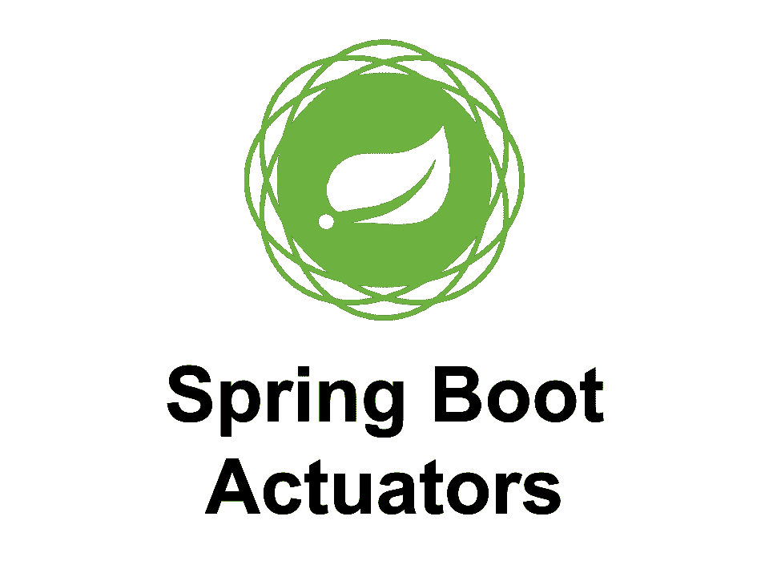

# 使用 Spring Boot 执行器进行健康检查(高效和模块化)

> 原文：<https://medium.com/javarevisited/health-checks-using-spring-boot-actuator-efficient-and-modular-4ed06b123a07?source=collection_archive---------1----------------------->

不用说，当你构建一个原生云应用时。系统应该公开健康检查端点。它将支持其他云服务(如 AWS Cloudwatch、 [Kubernetes](http://V) 等)。)来持续监控应用程序的健康状况，并通过监听特定指标来触发相应的警报。在这篇文章中，让我们看看如何写一个简单而有效的…