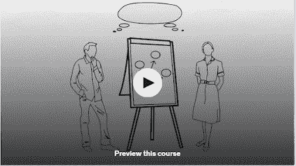
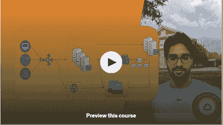
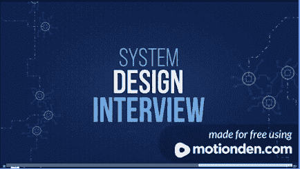
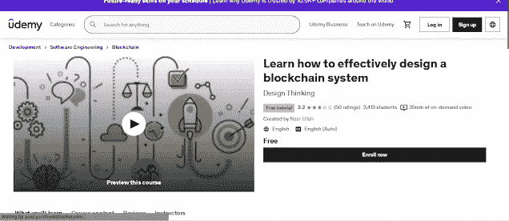
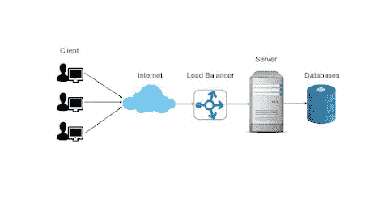
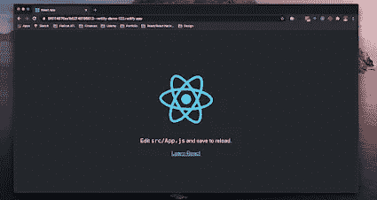
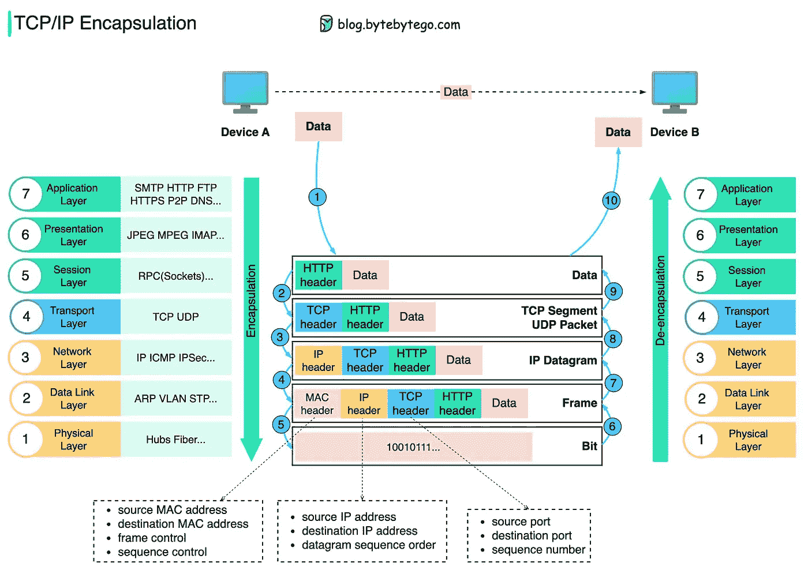

# 2023 年 10 大免费系统设计课程和教程

> 原文：<https://medium.com/javarevisited/hello-guys-if-you-are-preparing-for-system-design-interview-or-just-want-to-improve-your-software-7bc0034ac015?source=collection_archive---------1----------------------->

## 这些是你可以用于系统设计面试和超越它的最好的免费在线课程和教程。

image_credit —设计大师

大家好，如果你正在准备系统设计面试，软件架构面试，或者只是想提高你的软件设计技能，并寻找最好的免费资源，如教程和免费在线课程，那么你来对地方了。

过去，我曾分享过 [**最佳系统设计课程**](/javarevisited/10-best-system-design-courses-for-coding-interviews-949fd029ce65)[书籍](https://javarevisited.blogspot.com/2022/06/best-system-design-and-analysis-books.html)[网站](https://javarevisited.blogspot.com/2022/08/top-7-websites-to-learn-system-design.html)和[热门系统设计问题](https://www.java67.com/2018/05/top-20-system-design-interview-questions-answers-programming.html)但是你们中的很多人要求免费资源，这就是为什么我要分享我在网上找到的最佳免费系统设计课程。

这些在线课程完全免费，提供不同系统设计概念和过程的多样化知识。它们也是由经历过相同过程的经验丰富的培训师和老师创作的，可在可信的在线平台上获得，如 [**Udemy**](https://click.linksynergy.com/deeplink?id=JVFxdTr9V80&mid=39197&murl=https%3A%2F%2Fwww.udemy.com%2F) 和 YouTube。

你可以参加一个或多个免费的系统设计课程，不仅可以提高你的软件设计技能，还可以为你的下一次系统设计面试做准备。

在我们开始 **10 个最好的免费系统设计在线课程**之前，让我告诉你一些关于系统设计的事情。

[系统设计](https://javarevisited.blogspot.com/2022/08/top-7-websites-to-learn-system-design.html)基本上是根据一组特定的要求定义系统元素的过程，包括系统的模块、架构、组件、接口和数据。它也可以指定义、开发和设计系统的过程。这些设计必须满足公司或组织的特定需求。

作为一个系统设计师，你必须利用所有不同的建模语言来表达系统结构中的信息和知识。这个系统必须由一套一致的规则和定义来定义。它也可以用文本或图形建模语言来定义。

有不同种类的图形建模语言，如统一建模语言、 [UML](/javarevisited/5-best-uml-books-and-courses-for-java-programmers-13c551a9235d) 、流程图、业务流程建模符号和系统建模语言。

还有不同类型的设计方法可供您使用。它们包括架构设计、逻辑设计和物理设计。

顺便说一句，如果你能花几块钱，那么我也建议你加入一个专门的系统设计平台，如 Alex Yu 的[**【ByteByteGo】**](https://bytebytego.com?fpr=javarevisited)**，**《流行的[系统设计访谈——内部人员指南](https://www.amazon.com/System-Design-Interview-insiders-Second/dp/B08CMF2CQF/?tag=javamysqlanta-20)书的作者。

ByteByteGo 平台是一本书的数字版本以及更多内容。也可以看看类似 [**如何设计 YouTube**](https://bytebytego.com/courses/system-design-interview/design-youtube?fpr=javarevisited) 和 [*如何设计 WhatsApp*](https://bytebytego.com/courses/system-design-interview/design-a-chat-system?fpr=javarevisited) 这样的免费章节来个大概。

顺便说一下，如果价格是一个问题，那么你也可以在 Udemy 上查看系统设计课程，比如亚马逊前招聘经理 Frank Kane 的 [**掌握系统设计面试**](https://click.linksynergy.com/deeplink?id=JVFxdTr9V80&mid=39197&murl=https%3A%2F%2Fwww.udemy.com%2Fcourse%2Fsystem-design-interview-prep%2F) 。你可以在 Udemy 上只花 10 美元买到它，它的价值远不止这些，我强烈推荐你加入这个，当你在系统设计面试中表现出色时，你会感谢我的。

# 2023 年 10 门最佳免费系统设计课程

所以，现在你知道什么是系统设计，为什么它对技术面试很重要，是时候进入最好的免费系统设计课程了，你不仅可以学习基本概念，还可以练习 [*流行的系统设计问题*](/javarevisited/top-30-system-design-interview-questions-and-problems-for-programmers-417e89eadd67) 并在下一次软件开发人员面试中脱颖而出。

这里我们整理了一份系统设计和面向对象设计的 10 门最佳免费课程的清单。请继续阅读，了解更多信息。

## 1.Exponent 的 YouTube 频道

Exponent 是一个准备系统设计的领先地方，而他们最出名的是他们的 [**系统设计面试课程**](https://www.youtube.com/watch?v=VvZf7lISfgs) ，其中有很棒的课程和视频以及真实的面试例子，他们还有一个很棒的 YouTube 频道，你可以用它来准备系统设计面试。

他们在 YouTube 上展示了许多流行系统设计问题的解决方案，如

1.  停车场设计
2.  网飞设计
3.  抖音设计，等等

如果你正在准备系统设计面试，那么我强烈推荐你观看指数 YouTube 频道。他们还运营一项名为 **Pramp** 的免费服务，为软件工程师提供数据结构和系统设计方面的点对点面试，在他们的 [**付费项目**](https://www.tryexponent.com/?ref=javinpaul2) 中，他们提供一对一辅导和面对面学习课程

## 2.FreeCodeCamp YouTube 频道初学者系统设计

虽然 YouTube 上有许多系统设计课程，我也在本文中包含了其中的一些，但这可能是互联网上免费提供的最好、最全面的 [*系统设计课程*](https://www.java67.com/2019/09/top-5-courses-to-learn-system-design.html) 。

本课程为软件开发人员和工程师提供了系统设计的详细介绍。您将学习如何构建像谷歌、脸书、亚马逊和 Twitter 这样的大规模分布式系统，因为它需要对计算机科学原理的深入理解和解决现实世界问题的聪明想法。

您将学习如何设计系统，以在硬件故障的情况下同时处理数百万用户，同时您还将学习系统设计的基本概念，如需求选择、API 设计、数据库设计、网络协议、容错、设计权衡、解决方案权衡和底层设计。

你可以在这里或者 YouTube 上观看这个课程

## 3.[系统设计面试案例分析](https://click.linksynergy.com/deeplink?id=JVFxdTr9V80&mid=39197&murl=https%3A%2F%2Fwww.udemy.com%2Fcourse%2Fcase-studies-for-system-design-interviews%2F)【Udemy】

这是一门很棒的课程，它会教你所有你需要知道的关于系统设计的知识，同时让你从零开始准备系统设计面试。

这样的话，对于完全的初学者来说绝对是完美的。对于希望进入令人惊叹的系统设计世界的初学者来说，这是一个完美的入门指南。

以下是加入这一免费课程的链接— [系统设计面试案例分析](https://click.linksynergy.com/deeplink?id=JVFxdTr9V80&mid=39197&murl=https%3A%2F%2Fwww.udemy.com%2Fcourse%2Fcase-studies-for-system-design-interviews%2F)

## 4.[系统设计基础](https://click.linksynergy.com/deeplink?id=JVFxdTr9V80&mid=39197&murl=https%3A%2F%2Fwww.udemy.com%2Fcourse%2Fsystem-design-fundamentals%2F)【Udemy】

本课程将是对系统设计这个令人惊奇的世界的一个很好的简要介绍。它非常适合初学者，因为你将从零开始学习系统设计。

你将确切地了解什么是系统设计以及为什么要使用它。本课程将教你所有你需要知道的系统设计基础知识和设计大型系统的策略。

这里是免费加入的链接— [系统设计基础](https://click.linksynergy.com/deeplink?id=JVFxdTr9V80&mid=39197&murl=https%3A%2F%2Fwww.udemy.com%2Fcourse%2Fsystem-design-fundamentals%2F)

## 5.[系统设计介绍面试](https://click.linksynergy.com/deeplink?id=JVFxdTr9V80&mid=39197&murl=https%3A%2F%2Fwww.udemy.com%2Fcourse%2Fintro-system-design-interviews%2F)【Udemy】

这是一门很棒的课程，它将帮助你把你的系统设计技能提升到另一个层次。通过了解他们可以从系统设计面试中得到什么，你将能够做到这一点。

这门课程将教你如何找到一份高薪的系统设计工作。您还将学习需要什么样的编程技能，以及在系统设计面试中可能遇到的不同类型的问题。

这里是免费加入的链接— [系统设计面试介绍](https://click.linksynergy.com/deeplink?id=JVFxdTr9V80&mid=39197&murl=https%3A%2F%2Fwww.udemy.com%2Fcourse%2Fintro-system-design-interviews%2F)

## 6.YouTube 上面向初学者的系统设计速成班

这是另一个免费学习系统设计的好资源。YouTube 上的这个免费系统设计速成班涵盖了你理解系统设计基础所需的一切。

你将从学习为什么像谷歌、脸书、微软和其他大公司首先需要使用分布式系统开始。然后我们将看看分布式系统的优缺点，如何扩展 web 应用程序，然后看看系统设计中使用的各个组件。

最后，你将通过设计 YouTube 以一个面试风格的系统设计问题结束。以下是 YouTube 上免费系统设计课程的主要内容

⭐目录⭐

1.  什么是分布式系统
2.  系统设计的性能指标
3.  水平与垂直缩放
4.  负载平衡器
5.  数据库设计和扩展
6.  贮藏
7.  系统设计面试问题

你可以在这里或者 YouTube 上观看这个课程

## 7.[了解如何有效设计区块链系统](https://click.linksynergy.com/deeplink?id=JVFxdTr9V80&mid=39197&murl=https%3A%2F%2Fwww.udemy.com%2Fcourse%2Feffectively-design-blockchain-system%2F)【Udemy】

本课程将作为现代系统设计惊人世界的一个很好的简介。它非常适合初学者，因为你将从零开始学习系统设计。你将确切地了解什么是系统设计以及为什么要使用它。

下面是加入这个系统设计课程的链接——[如何有效设计一个区块链系统](https://click.linksynergy.com/deeplink?id=JVFxdTr9V80&mid=39197&murl=https%3A%2F%2Fwww.udemy.com%2Fcourse%2Feffectively-design-blockchain-system%2F)

## 8.[系统设计介绍](https://click.linksynergy.com/deeplink?id=JVFxdTr9V80&mid=39197&murl=https%3A%2F%2Fwww.udemy.com%2Fcourse%2Fintroduction-to-system-design%2F)【Udemy】

在这个奇妙的课程中，你将学习系统设计的所有核心特性。你也会成为系统设计领域非常高级的专家。你将能够掌握运营管理中的系统设计。

本课程结束时，你将成为系统设计专家。

## 9.[React——使用 React 系统设计快速构建 React 应用程序](https://click.linksynergy.com/deeplink?id=JVFxdTr9V80&mid=39197&murl=https%3A%2F%2Fwww.udemy.com%2Fcourse%2Fcreative-tim%2F)

这是一门很棒的课程，它将帮助你把面向对象系统设计的技能提升到另一个层次。通过使用面向对象的系统设计，而不是传统的系统设计技术，你将能够做到这一点。

这门课程将教你如何通过系统设计面试。你还将学习如何在谷歌找到工作。脸书、微软和亚马逊。

## 10.面向初学者的系统设计课程——免费[YouTube]

如果你正在寻找一个免费的系统设计课程，那么你会喜欢这个免费的 YouTube 课程。我在 YouTube 上随机搜索关于[系统设计](https://dev.to/javinpaul/8-best-free-and-paid-websites-to-learn-system-design-and-software-design-2ig4)的时候发现了这个课程，并且非常喜欢它。

YouTube 上的这个免费系统设计课程涵盖了理解系统设计基础所需的一切，既考察了有助于你找到工作的实用技能，也考察了帮助你更深入理解概念的较低层次的细节。

你将从学习为什么像谷歌、脸书、微软和其他大公司首先需要使用分布式系统开始。然后我们将看看分布式系统的优缺点，如何扩展 web 应用程序，然后看看系统设计中使用的各个组件。

最后，我们将通过设计 YouTube 以一个面试风格的系统设计问题结束，这是[流行的系统设计面试问题](/@somasharma_81597/7-system-design-problems-to-crack-software-engineering-interviews-in-2023-13a518467c3e)之一。

⭐目录⭐

1.  什么是分布式系统
2.  系统设计的性能指标
3.  信封背面的数学
4.  水平与垂直缩放
5.  负载平衡器
6.  贮藏
7.  数据库设计和扩展
8.  [系统设计面试问题](https://www.java67.com/2018/05/top-20-system-design-interview-questions-answers-programming.html)

最初你可能会觉得讲师的声音很低很沉闷，但不要放弃，只要坚持下去，你就会知道内容质量真的很好。你也可以在这里观看免费的系统设计课程

## 11. [ByteByteGo](https://bytebytego.com?fpr=javarevisited)

如果你不介意花几块钱学习像系统设计这样的重要技能，那么我强烈推荐你去看看 Alex Xu 的这个名为 ["ByteByteGo"](https://bytebytego.com?fpr=javarevisited) 的网站，他是受欢迎的系统设计书 [*《系统设计访谈——内部人员指南第 1 和第 2 部分*](https://www.amazon.com/System-Design-Interview-insiders-Second/dp/B08CMF2CQF/?tag=javamysqlanta-20) 的作者。

这个网站是用易语言学习系统设计概念的最好地方之一。Alex 分享了解释体系结构的精美、详细的图表，以及用于扩展系统的概念，以便于学习。

这个网站不仅仅是他的两本系统设计书籍 的数字版，还有他在时事通讯上分享的更多内容，如果你想学习面试系统设计，我建议你去看看他的网站。他还实施了平价定价，这意味着如果你来自印度，你可能会支付更低的价格。

**这里是了解更多** — [字节跳动](https://bytebytego.com?fpr=javarevisited)的链接

以上是关于**最好的免费系统设计课程和教程**你可以加入，为系统设计面试做好准备。如果你喜欢这 10 个最好的免费系统设计课程和教程，请随意与你的朋友和家人分享。

我毫不怀疑这门课程会在几周或几个月内把你从一个完全的新手变成一个专家系统设计师。如果您对系统设计有任何疑问，您也可以发表评论，我们将立即回复您。

您可能喜欢的其他**编程文章和教程**

*   [如何准备系统设计面试](https://javarevisited.blogspot.com/2022/03/how-to-prepare-for-system-design.html)
*   [完整的 Java 开发者路线图](https://javarevisited.blogspot.com/2019/10/the-java-developer-roadmap.html)
*   [5 个免费学习 Python 的网站](https://javarevisited.blogspot.com/2019/09/5-websites-to-learn-python-for-free.html)
*   [免费学习 Java 编码的五大网站](https://javarevisited.blogspot.com/2018/07/top-5-websites-to-learn-coding-in-java.html)
*   [深入了解 React.js 的五大网站](https://javarevisited.blogspot.com/2020/10/top-5-websites-to-learn-react-for-free.html)
*   [Java 程序员应该学习的 10 件事](https://javarevisited.blogspot.com/2017/12/10-things-java-programmers-should-learn.html#axzz5atl0BngO)
*   [深入学习 Linux 的五大网站](https://javarevisited.blogspot.com/2021/06/5-websites-to-learn-linux-command-line.html)
*   [你可以学习的 10 种编程语言](http://www.java67.com/2017/12/10-programming-languages-to-learn-in.html)
*   [每个 Java 开发人员都应该知道的 10 个工具](http://www.java67.com/2018/04/10-tools-java-developers-should-learn.html)
*   [10 个免费学习 Git 和 Github 的网站](https://javarevisited.blogspot.com/2019/05/10-free-websites-to-learn-git-online.html)
*   [21 个网站免费在线学习编码](https://www.java67.com/2018/06/21-websites-to-learn-how-to-code-for.html)
*   Java 和 Web 开发人员应该学习的 10 个框架
*   [学习 Java 编程语言的 10 个理由](http://javarevisited.blogspot.sg/2013/04/10-reasons-to-learn-java-programming.html)
*   [需要深入学习的 5 大 Java 框架](http://javarevisited.blogspot.sg/2018/04/top-5-java-frameworks-to-learn-in-2018_27.html)
*   [5 个免费在线学习 SQL 的网站](https://javarevisited.blogspot.com/2015/06/5-websites-to-learn-sql-online-for-free.html)
*   [完整的 DevOps 工程师路线图](/hackernoon/the-2018-devops-roadmap-31588d8670cb)
*   [5 个免费学习数据结构和算法的网站](https://javarevisited.blogspot.com/2017/02/5-websites-for-practicing-data-structure-algorithms-for-coding-interviews.html)
*   [程序员 50+数据结构面试问题](/hackernoon/50-data-structure-and-algorithms-interview-questions-for-programmers-b4b1ac61f5b0)
*   [ByteByteGo 系统设计课程值得吗？](https://javarevisited.blogspot.com/2022/12/is-bytebytego-by-alex-xu-worth-it-for.html)

感谢您阅读本文。如果你知道任何像网站或编程平台这样的优秀在线资源来学习系统设计和软件设计，特别是对于初学者，你认为这是对这两个网站的补充，那么请随意分享。每个人都喜欢伟大的资源和快乐的学习系统设计。

如果你正在寻找一个最好的在线课程来深入学习系统设计，那么我也建议你去看看 Udemy 上 Frank Kane 的 [**掌握系统设计面试**](https://click.linksynergy.com/deeplink?id=JVFxdTr9V80&mid=39197&murl=https%3A%2F%2Fwww.udemy.com%2Fcourse%2Fsystem-design-interview-prep%2F) 课程。弗兰克是一名前招聘经理，知道如何才能通过那些大型 FAANG 公司的系统设计面试。

或者，你也可以加入 Alex Yu 的 [*系统设计面试——知情者指南*](https://www.amazon.com/System-Design-Interview-insiders-Second/dp/B08CMF2CQF/?tag=javamysqlanta-20) 和 ByteByteGo，进行完整的系统设计面试准备。

 [## ByteByteGo | Ace 您的下一次系统设计面试

### 让您的系统设计技能更上一层楼所需的一切

bytebytego.com](https://bytebytego.com?fpr=javarevisited)