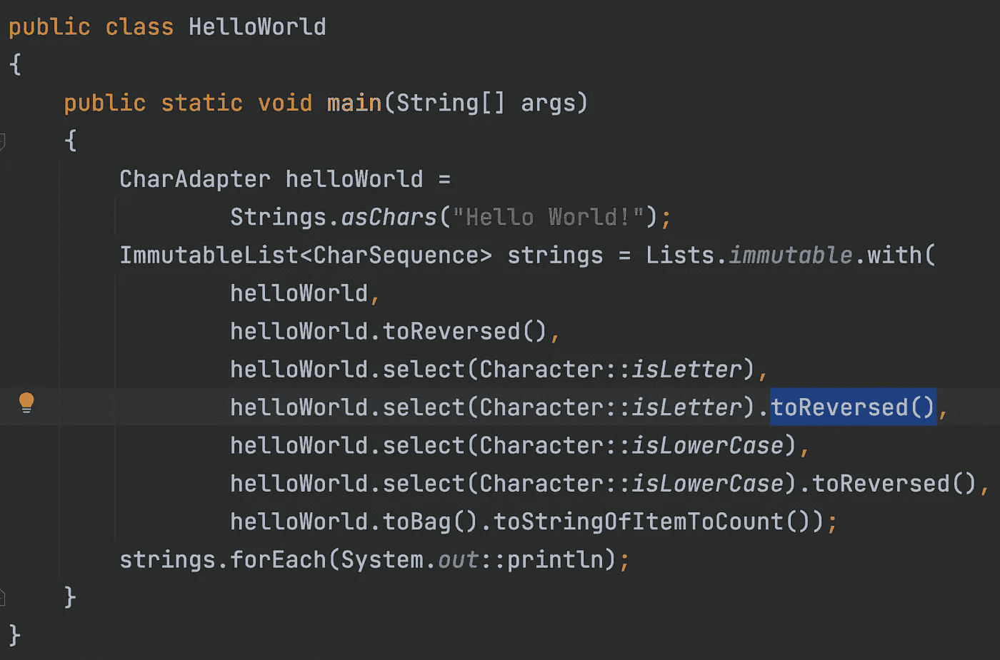

# 你好世界！

> 原文：<https://medium.com/javarevisited/hello-world-22b5c25fe0c3?source=collection_archive---------3----------------------->

使用 [Eclipse 集合](https://github.com/eclipse/eclipse-collections)的简单 Java 程序

打印不同 Hello worlds 的集合

产出:

输出

这个代码示例可以通过使用`toReversed`而不是`asReversed`来进一步简化。输出保持不变。`toReversed`方法返回一个`CharAdapter`。`CharAdapter`器物`java.lang.CharSequence`。

*我是由*[*Eclipse Foundation*](https://projects.eclipse.org/projects/technology.collections)*管理的*[*Eclipse Collections*](https://github.com/eclipse/eclipse-collections)*OSS 项目的创建者和提交者。Eclipse Collections 为* [*投稿*](https://github.com/eclipse/eclipse-collections/blob/master/CONTRIBUTING.md) *打开。*

## 您可能喜欢的其他 Java 文章

 [## 如何在 2022 年成为一名 Java 程序员？您需要的所有工具、技能、框架和库

### Java 开发人员可以在 2022 年学习的 22 项基本技术技能，以进一步改善他们的形象，并成为…

medium.com](/javarevisited/top-22-skills-professional-java-programmers-can-learn-in-2022-to-upgrade-themselves-bc3da73d7491)  [## 2022 年 Java 程序员路线图

### 2022 年成为 Java 开发人员的图解指南，包含相关课程的链接

medium.com](/javarevisited/the-java-programmer-roadmap-f9db163ef2c2)  [## 2022 年免费在线学习 Java 的 10 个最佳地点

### 我最喜欢的免费在线学习 Java 的网站，适合初学者和想学习 Java 编码的人…

medium.com](/javarevisited/10-best-places-to-learn-java-online-for-free-ce5e713ab5b2)