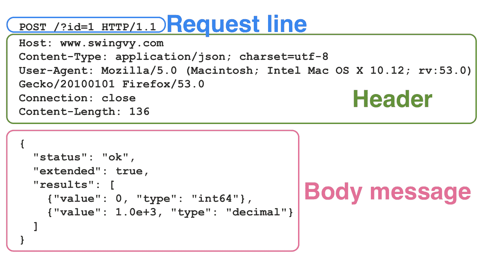
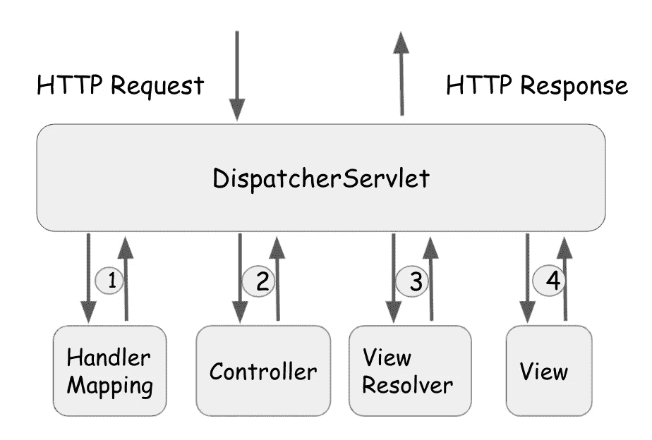

# 什么是 HTTP 请求和 Spring MVC？

> 原文：<https://medium.com/javarevisited/here-we-will-discuss-dab31e2440b2?source=collection_archive---------1----------------------->

在这里，我们将讨论以下一些基本概念:

*   HTTP 请求
*   HTTP 方法
*   URL +参数
*   HTTP 标题
*   消息正文
*   Spring Web MVC 框架雏形

# HTTP 请求

HTTP 请求包括:

*   HTTP 方法
*   URL +参数
*   HTTP 标题
*   消息正文
*   可选消息体(`GET`或`HEAD`方法没有这个)



请求消息的示例

# HTTP 方法

当设计 API 端点时，总是需要指定使用什么 HTTP 方法在服务器上进行 CRUD (创建、读取/检索、更新、删除)操作。通常，这可以归结为:

*   创建— [**帖子**](https://javarevisited.blogspot.com/2012/03/get-post-method-in-http-and-https.html)
*   读取/检索— **获取/标题**
*   [更新—**放/贴**](https://javarevisited.blogspot.com/2016/10/difference-between-put-and-post-in-restful-web-service.html)
*   删除— **删除**

`GET`:使用 GET 的请求应该只用于检索数据，对数据没有任何其他影响。

`HEAD`:HEAD 和 [GET](https://www.java67.com/2014/08/difference-between-post-and-get-request.html) 的唯一区别是，对于 HEAD，**服务器只返回 header 部分，不返回 body。**

`POST`:它主要用于**创建**一个新的资源(不管它是否被复制)。

`PUT`:检查资源是否存在，然后**更新**，否则创建一个新的资源。

`PATCH`:用于资源的部分更新。也就是说，它修补资源—更改其属性。当您使用`PUT`发送请求时，您必须发送完整的有效载荷，而使用`PATCH`，您只需发送您想要更新的参数。

`DELETE`:用于**删除**一个资源。

HTTP 请求元素有六类参数:**查询参数、** [**URI 路径参数、**](https://www.java67.com/2020/04/how-to-get-current-url-path-and-hash-using-jQuery.html) **、表单参数、cookie 参数、头参数和矩阵参数。**

最常见的参数是:

*   查询参数，如`/users?role=admin`
*   路径参数，如`/users/{id}`
*   表头参数，如`X-MyHeader: Value`

# URL +参数

## 查询参数

查询参数是最常见的参数类型。一个查询由请求 URL 中的`?`后的`&`分隔的`name=value`对组成。它经常在过滤、排序或分页 HTTP GET 请求时使用。


例如，在上面的 URL 中，查询参数名是`limit and page.` `10 and 0 are` 的值。

```
🚨**IMPORTANT:** The name/value pairs used in query strings are visible in the URL. For this reason, passing sensitive information like username or password to the server in this manner is not recommended.`
```

# 路径参数

Path 参数指定要获取的资源，但是这些参数不会以任何方式对资源进行过滤/排序。


例如，在上面的端点中，`{id}`和`{resumeId}`是必需的路径参数。当客户端进行 API 调用时，每个路径参数都必须替换为实际值。

```
🚨**IMPORTANT:** Order matters in path parameters.
```

# HTTP 标题

**请求**和**响应**头让客户端和服务器交换附加信息。通常与授权有关(如 APIKey)。与查询和路径参数不同，标头参数不会出现在请求的 URL 中。

# 消息正文

消息体对于 HTTP 消息是可选的，但是如果它可用，那么消息的内容对应于实体体，并且通常 **Content-Type** 和 **Content-Length** 头行指定实体的
体中数据的性质。

# Spring Web MVC(模型-视图-控制器)框架

Spring Web 模型-视图-控制器(MVC)框架是围绕[*dispatcher servlet*](https://javarevisited.blogspot.com/2017/09/dispatcherservlet-of-spring-mvc-10-points-to-remember.html)处理所有 HTTP 请求和响应而设计的。DispatcherServlet 是 Spring MVC 的主干，充当将 HTTP 请求定向到相应 Spring 控制器的主控制器。

对应于对 *DispatcherServlet* 的传入 HTTP 请求的工作流是:

[](https://javarevisited.blogspot.com/2017/06/how-spring-mvc-framework-works-web-flow.html)

图片总结了 Spring 的工作流程

1.  一旦[**dispatcher servlet**](https://www.java67.com/2017/06/what-is-use-of-dispatcherservlet-in-spring-mvc.html)*接收到 HTTP 请求，就会交给 **HandlerMapping** 调用相关的**控制器**。*
2.  *[**控制器**](https://javarevisited.blogspot.com/2017/11/difference-between-component-service.html) 处理用户请求，并根据使用的 GET 或 POST 方法调用适当的**服务**方法。服务方法将视图名称和模型返回给 **DispatcherServlet** 。*
3.  ***DispatcherServlet** 将联系 [**ViewResolver**](https://javarevisited.blogspot.com/2017/08/what-does-internalresourceviewresolver-do-in-spring-mvc.html) 以找到实际视图来呈现输出。*
4.  *视图完成后， **DispatcherServlet** 将呈现的输出作为响应传递给客户机。*

*涉及👉 [**此处**](https://docs.spring.io/spring-framework/docs/3.2.x/spring-framework-reference/html/mvc.html) 👈对于 Spring web MVC 的基本应用。*