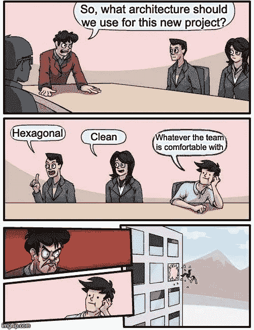
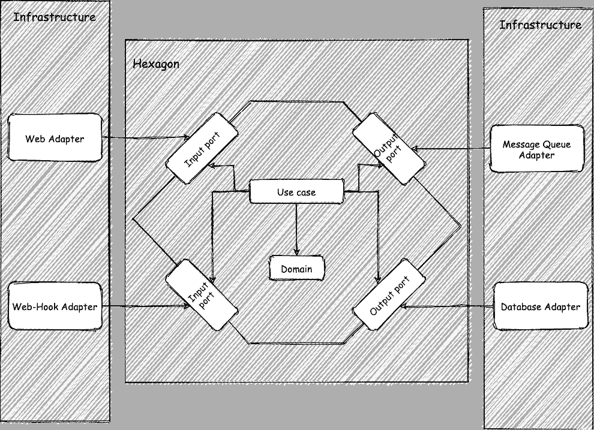
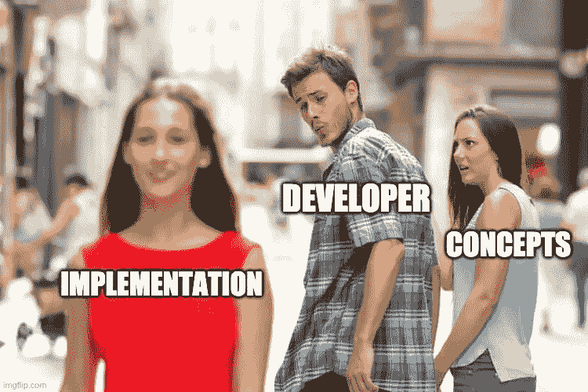
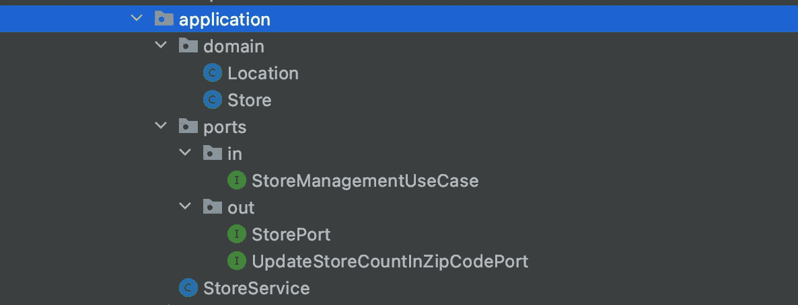
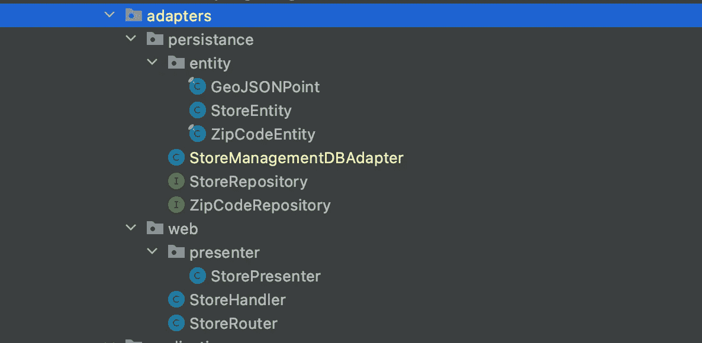
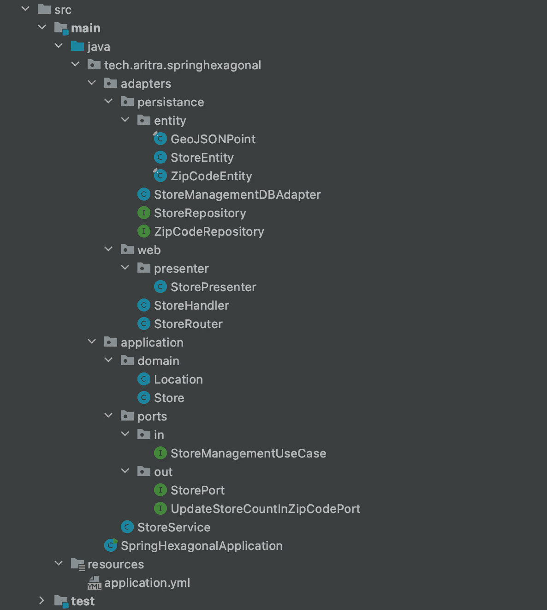

# Spring WebFlux 上具有域、呈现者和实体分离的六边形架构

> 原文：<https://medium.com/javarevisited/hexagonal-architecture-with-domain-presenter-entity-segregation-on-spring-webflux-ef053a495bdc?source=collection_archive---------0----------------------->

通过[https://imgflip.com/](https://imgflip.com/)生成的迷因

是的，没错，今天可用的大多数架构在某种程度上都是相似的。在你操之过急，用“T4，你什么都不知道”来教训我之前，让我解释一下为什么这么说。

首先，所有这些架构主要试图实现的是**关注点分离**。现在，这又回到了古老的 [**S.O.L.I.D** 原则](/javarevisited/10-oop-design-principles-you-can-learn-in-2020-f7370cccdd31)，其中**单一责任原则**建议每个人都应该做一件事，并完美地完成，这样当你必须改变某件事时，它就仅限于该组件，而不会影响系统中的其他任何东西(为了节省时间，我将跳过许多好处)。

这也适用于现代网络服务。如果你想从 [REST](/javarevisited/21-spring-mvc-rest-interview-questions-answers-for-beginners-and-experienced-developers-21ad3d4c9b82) 转移到 [gRPC](/javarevisited/5-best-google-protocol-buffer-and-gprc-courses-for-beginners-22633658983e) ，你应该不必接触你的数据库访问代码，如果你正在添加一些新的验证规则，你应该不必改变你的控制器。您需要更改的内容越少，引入新 bug 的可能性就越小，如果有什么地方出了问题，您就知道该去哪里找了。

因此，对于所有这些架构，您基本上是在对系统进行分层，以便

1.  您的核心业务逻辑不依赖于其领域之外的任何东西，并为消费者代码提供了统一的 DSL。因此，您在核心逻辑内部所做的任何更改都会打乱消费者代码，反之亦然。
2.  您的核心逻辑代码很容易测试，因为它不依赖于任何框架。
3.  您的核心逻辑并不取决于您如何检索数据，因此，如果您明天选择使用 [DynamoDB](https://www.java67.com/2020/08/top-5-courses-to-learn-aws-s3-and-dynamoDB-in-depth.html) 而不是 [MongoDB](/javarevisited/5-best-mongodb-courses-to-learn-nosql-for-beginners-in-2020-42df5af5496c) 也没关系。不管您使用存储过程、数据库查询还是 ORM 框架。对于核心逻辑来说，数据访问只是一种抽象。

因此，您的业务规则得到了保护，并且很少受到变化的影响。无论是[干净的架构](/javarevisited/clean-architecture-a-must-read-software-design-book-for-developers-41189b8ca122)、六边形架构、洋葱架构，每个人都能够实现这一点，只是它们的分层策略不同，因此它们看起来不同。

所以使用你想要的任何架构，如果你的团队能够始终如一地遵循它，那么你就是优秀的。所有架构都有一些权衡，这很好，因为[软件设计](/javarevisited/top-5-courses-to-learn-software-architecture-in-2020-best-of-lot-5d34ebc52e9)就是关于权衡的😛

# 六角形建筑

即使我已经声明所有的架构都是相同的，我们仍然要学习六边形架构，因为文章的标题要求我这样做😝

六角形架构，试图将核心应用程序逻辑与基础设施或纯技术代码隔离开来。这样我们就可以更换任何我们需要的基础设施。

也正是因为这种隔离，任何变化的影响仅限于该组件。随着不同组件的清晰分离，每个人都主要依赖于接口，我们也有了很好的内置[抽象](https://javarevisited.blogspot.com/2010/10/abstraction-in-java.html)。

这是一个六边形结构，也称为端口和适配器。让我们来理解图中不同玩家的意思。

## 1.六边形

hexagon 是我们的应用程序的核心，它封装了所有的商业智能和核心功能逻辑。它们缺乏纯粹的技术或基础设施代码。六边形通常是下面描述的这三个部分的抽象。

1.  领域:这些是核心业务对象，封装了业务数据和业务逻辑。它们不依赖于任何框架，只做逻辑计算。最重要的是，他们没有任何依赖性。
2.  **用例:**这些是系统支持的操作集合。我喜欢把它们看作主要包含应用程序业务逻辑的编排器。他们通常会与域、其他用例以及存储库进行通信，以完成业务操作。
3.  **端口:**这些是位于六边形边界上的简单接口。它们使通信/数据流能够进出六边形。六边形之外的任何东西都依赖于一个输入端口来调用用例的任何方法。类似地，用例必须依赖输出端口来访问六边形之外的任何东西。

## 2.适配器

适配器是六边形层之外的类，它们与六边形通信，以驱动系统或为六边形提供支持。它们是基础设施代码。

例如，我们可以有一个 HTTP 适配器，它只不过是一个 [REST 控制器](https://javarevisited.blogspot.com/2017/08/difference-between-restcontroller-and-controller-annotations-spring-mvc-rest.html#ixzz6OYNB9oii)，它将调用一个输入端口来执行业务操作。类似地，可以有一个数据库适配器，它将实现一个输出端口，然后用例可以调用该输出端口将数据推入数据库。

# 依赖结构

这里有一个简单的图表来描述一个六边形应用程序中不同组件之间的关系。

1.  REST 适配器依赖于输入端口，因此它可以调用六边形内部的操作。
2.  输入端口是一个接口，它建立六边形或应用程序支持的操作的契约。
3.  用例实现输入端口，因此提供所有支持的操作的实现。它还依赖于输出端口，因此它可以调用在那里定义的方法。
4.  输出端口也是为 hexagon 的出站操作建立契约的接口。
5.  数据库适配器在输出端口提供方法的实现。这意味着它们实际上处理所有与数据库相关的代码。

> 你是否注意到六边形不依赖于任何其他东西，但是系统的其他部分依赖于六边形来执行操作？这是因为六边形定义了端口，这些端口基本上是你所有操作的契约，并反过来控制系统。您的适配器变成了简单的与基础设施相关的代码，没有任何业务逻辑，您所有的业务智能现在都被六边形抽象出来了。这建立了一个非常好的边界和抽象。现在系统中一部分的变化不再影响其他部分，**关注点分离** yaaayyyyy！

> 尽管用例需要数据库方法，但它只依赖于六边形内部的端口，而不依赖于任何 repository/ [DAO 代码](https://javarevisited.blogspot.com/2013/01/data-access-object-dao-design-pattern-java-tutorial-example.html#axzz5b2noKDk3)。适配器实现该端口，将适配器的依赖关系转换为六边形。 [**依赖倒置**](https://javarevisited.blogspot.com/2012/12/inversion-of-control-dependency-injection-design-pattern-spring-example-tutorial.html) ，yaaayyyyy，接口能做的奇妙的东西。

在这一点上，我希望你已经理解了六边形架构的基础，以及我们想要达到的目标。

# 域、演示者和实体

通过[https://imgflip.com/](https://imgflip.com/)生成的迷因

F 或者那些已经受够了这么多理论并想知道代码在哪里的人，*坚持住伙计*，我保证过一会儿我会展示一些代码。

现在你已经理解了六边形架构，你可能会想知道这是什么动物的领域，主持人，实体隔离了。六边形架构只是一种风格，当你实际设计你的应用程序时，你仍然可以在它的基础上构建。以及域、展示者和实体。让我先解释一下它们是什么，以及我们为什么需要它们。

1.  **域:**这仍然是我上面解释过的同一个域。它是现实生活中域对象的代码表示。例如，如果您的系统处理 Product，那么您至少应该有一个名为 Product 的域类。
2.  **Presenter:** 这是一个对象，它以用户可以理解的格式表示域，大多数时候只保存数据，而不保存任何行为。例如，如果您想将一个产品发送到下游系统，并使整个操作幂等，您需要添加一个 request-id。现在，您可以创建一个新对象，它具有域对象所具有的+ request-id，这将成为您的演示者。您的用户界面可能需要 GeoJSON 格式的数据，但其他一些上游 API 可能需要 WKT 格式的数据，您再次需要两个不同的演示者来表示您的响应。
3.  **实体:**实体是我所说的数据库中数据的表示。我的意思是，你可以在数据库中用不同的方式表示相同的数据，对于数据库查询来说，一种方式可能比另一种方式更好。因此，我们创建了另一个类似于 table(对于 [SQL DB](/hackernoon/top-5-sql-and-database-courses-to-learn-online-48424533ac61) )或 document(对于 document DB)的类，以便优化我们的数据库操作。

> 你看到我在那里做了什么吗？更多的关注点。你的域对象负责所有的业务规则，你的表示者负责上游系统的需求，你的实体负责数据库的需求。

把它和我们的六角形结构混合在一起，这就是数据流的样子

简单吧？如果您不完全理解，不要担心，通过代码示例，您将能够理解。

这是所有的概念，现在我们可以进入一些代码。又一个 yaaayyy 时刻😛。我将在下一节用 [Java + Spring WebFlux](/javarevisited/10-advanced-spring-boot-courses-for-experienced-java-developers-5e57606816bd?source=collection_home---4------0-----------------------) 编写代码。如果您既不了解 Java 也不了解 Spring，也不要担心，实现会非常简单并且容易理解。

# 弹簧腹板上的六角形通量

我们将为“商店”管理构建一个非常简单的 REST 应用程序。我们应该能够存储和检索数据，并运行不同的查询。最终的解决方案可以在这里找到。

 [## dev-ari tra/spring-六角形

### GitHub 是超过 5000 万开发人员的家园，他们一起工作来托管和审查代码、管理项目和构建…

github.com](https://github.com/dev-aritra/spring-hexagonal) 

假设我们当前任务的需求是。

1.  您应该能够将商店保存到数据库中。
2.  我们还必须维护一个特定邮政编码中有多少商店的计数，以便将来操作。因此，当我们将一个商店保存到[数据库](/javarevisited/7-free-courses-to-learn-database-and-sql-for-programmers-and-data-scientist-e7ae19514ed2)中时，我们增加了计数。

我将在解决方案中应用我们在上面学到的所有原则，让我们看看事情是如何形成的。

# 构建六边形

这是我的六边形完成后的样子

该应用程序是 hexagon 的基础包，其他一切都是不言自明的。

## 输入适配器

我们将首先创建输入适配器。它应该只有一个让我们保存存储的方法。

> 不要被看到的`Mono`难倒，它是一个最多可以发布 1 个事件的反应式流发布器。这个事件将包含简单的数据。没有必要理解反应式编程。你可以在这里阅读更多关于 Java 反应式编程的内容[https://projectreactor.io/](https://projectreactor.io/)

## 领域

这个核心商店领域模型

它还有一个子域`Location`,如下所示

为了更好的可读性和简单性，我们正试图将我们的领域建模为尽可能接近物理实体。

## 服务

现在让我们为用例编写实现，我称之为服务，但是你也可以称它为其他东西。

它检查域对象是否有效，如果有效，则进行一些数据库更改，否则抛出一个错误。

需要注意的几件事

1.  用例实现使用不同的端口与数据库交互。
2.  它已将验证任务委派给域对象。(Store 类实际上是 domain 类)。因为验证是应该由域处理的业务操作。

## 输出端口

我们有两个输出端口。一个用于插入存储，另一个用于增加存储计数。它们看起来像这样

这就结束了六边形内部的所有内容，是时候继续讨论适配器了。

# 建筑适配器

这是适配器的最终结构

## 数据库适配器

这是我们的数据库适配器

需要注意的几件事

1.  它实现了服务所需的两个端口。
2.  它使用不同的存储库在不同的实体上执行操作。

## 仓库

这些库是简单的 MongoRepositories，看起来像这样

## 实体

这就是实体和`GeoJSONPoint`子实体的样子。

如果你注意到了，坐标在域和实体中的表示是不同的。这是因为为了在`MongoDB`进行`geospatial`查询，你需要将你的地理数据设为`geojson`格式，并且我们可能希望在未来的 sprints 中支持地理空间查询。因此，我们能够非常容易地对我们的实体进行建模，从而在不改变领域模型的情况下支持它。了解域、实体和演示者分离的好处👯

## Web 适配器

我们在 web 适配器中有两个类。

1.  路由器，它将 web 请求路由到处理程序。
2.  处理程序，它调用用例来执行业务操作。

这是编写 web 处理程序的函数风格，而不是我们通常使用的[控制器](https://javarevisited.blogspot.com/2017/11/difference-between-component-service.html)。

如果您已经注意到，处理程序只处理 Presenter 对象。

## 提出者

我们的演示者非常简单，因为用户界面需要这样的数据。

相同的数据在 presenter、domain 和 entity 中的表示方式是完全不同的，并且针对它们所做的操作或它们的用途进行了优化，很棒吧？

> 如果你想知道为什么我没有使用 Lombok 为域生成 getter，原因是，域中的 getter 时不时会有一些逻辑。因此，我选择编写普通的 Java getters，而不是 lombok。但是您总是可以将 lombok 用于简单的 getters。

朋友们，这基本上完成了手头的任务。

现在整个包树是这样的

如果您不能连接所有的点，您可以克隆这个回购并在本地运行它来查看整个流程。

 [## dev-ari tra/spring-六角形

### GitHub 是超过 5000 万开发人员的家园，他们一起工作来托管和审查代码、管理项目和构建…

github.com](https://github.com/dev-aritra/spring-hexagonal) 

# 但是

总而言之，这些概念和架构非常强大，并且有很多好处。但是如果你正在开发一个简单的 CRUD API，所有这些对你来说可能都是多余的和额外的开销。如果你正在开发一个复杂的 API，你需要维护它更长的时间，并且需要敏捷性，那么使用这些风格是有意义的。

# 外卖食品

1.  使用你的团队熟悉的架构风格。因为引入一个新的架构很容易，但难的是虔诚地遵循它。
2.  我们理解六边形建筑的概念。
3.  我们了解领域、展示者和实体分离的好处。
4.  我们还利用 Spring WebFlux 中的所有这些概念开发了一个全功能的 REST API。

感谢阅读！

> 我是 Aritra Das，我是一名软件开发人员，非常喜欢构建分布式系统。如有任何与科技相关的问题，请随时在 [Linkedin](https://www.linkedin.com/in/aritra-das-03843a8b/) 或 [Twitter](https://twitter.com/aritra__das) 上联系我。
> 
> 快乐学习…