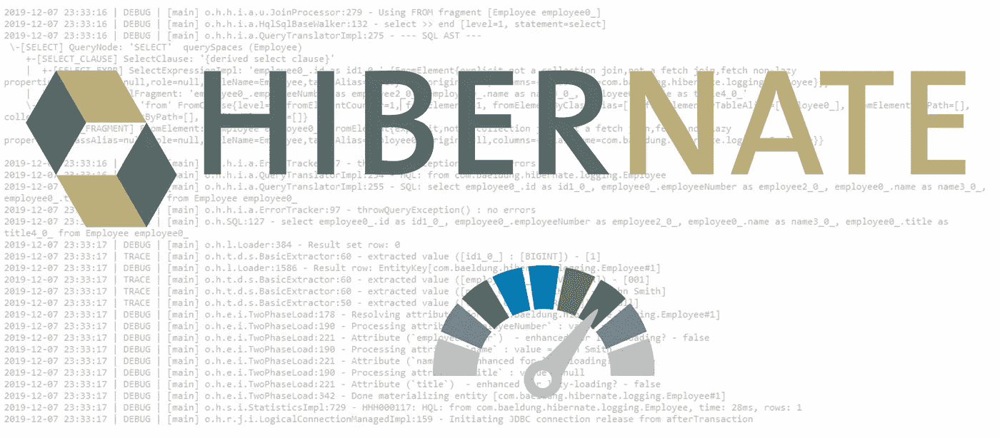

# Hibernate:不要使用 show_sql 来记录 sql 查询

> 原文：<https://medium.com/javarevisited/hibernate-dont-use-show-sql-to-log-sql-queries-8698cb3013b9?source=collection_archive---------1----------------------->

## 选择正确日志选项的简单指南

面试过程中关于 Hibernate 最常见的一个问题就是如何正确记录 SQL 语句。同理，最常见的答案是将`persistence.xml`文件中的`true`参数设置为真。这个答案是没有错的，但我们有更多的选择这样做，我们会谈谈…