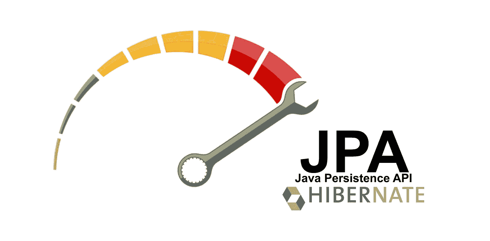

# Hibernate:用无状态会话提高应用程序性能

> 原文：<https://medium.com/javarevisited/hibernate-improving-application-performance-with-statelesssession-11536ebe9f80?source=collection_archive---------2----------------------->

## 使用无状态会话提高应用程序性能

几乎每一个有几年经验的 Java 开发人员在使用 JPA 时都面临过糟糕的实体定义的问题。循环引用、错误映射等等。