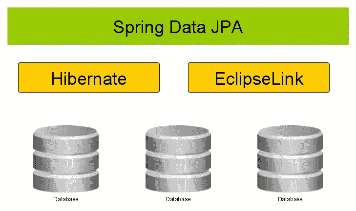

# Hibernate vs JPA vs Spring Data JPA

> 原文：<https://medium.com/javarevisited/hibernate-vs-jpa-vs-spring-data-jpa-ff4485aaa780?source=collection_archive---------0----------------------->

大家好。在本文中，我们将看到 JPA、 [Hibernate](/javarevisited/top-5-hibernate-online-training-courses-for-beginners-and-advance-java-programmers-469460596b2b) 和 [Spring Data JPA](/javarevisited/5-best-spring-data-jpa-courses-for-java-developers-45e6438be3c9) 的区别。

## ORM 框架

ORM 代表对象关系映射，它将数据库中的数据映射到称为实体的 Java 类。不仅如此，ORM 还在实体级别保留了表之间的关系。