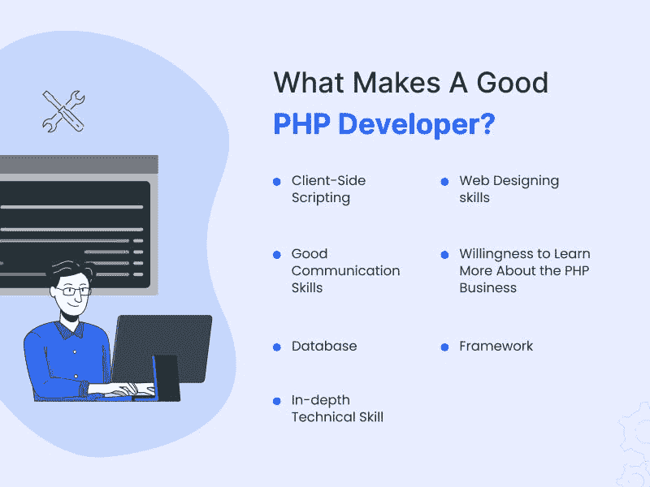
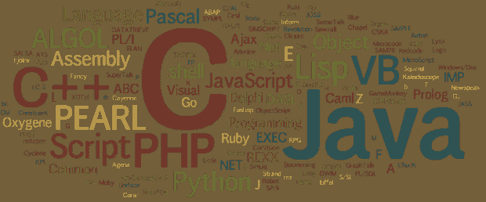

# 雇佣 PHP 开发人员是一件令人头痛的事情:通过了解一些雇佣 PHP 开发人员的技巧来减少它

> 原文：<https://medium.com/javarevisited/hiring-php-developer-is-headache-reduce-it-by-knowing-few-tips-to-hire-php-developers-8432d6f1ba0d?source=collection_archive---------0----------------------->

图片来源:eTatvasoft

你是一个寻求外包 PHP 开发的企业主吗？嗯，可能会很头疼。有这么多的 PHP 开发人员。你怎么知道哪一个是合适的呢？

这篇博文讨论了一些有助于简化流程和减少出错几率的技巧。遵循这些提示，你将会为你的项目找到完美的 PHP 开发人员！

# 谁是 PHP 开发人员？

PHP 开发人员开发和维护用 PHP 编写的网站和 web 应用程序。 [PHP](/javarevisited/top-10-free-courses-to-learn-php-and-mysql-for-web-development-e96e69982675) ，一种服务器端脚本语言，被广泛用于创建动态网站和网络应用。

PHP 开发人员必须了解前端和后端技术，因为他们经常需要同时使用这两种技术。他们还必须能够处理数据库，因为 PHP 经常与 [MySQL](/javarevisited/top-5-courses-to-learn-mysql-in-2020-4ffada70656f) 一起使用。

***也可以理解为:*** [***对于 Web 项目来说，PHP 比它的其他替代品好得多***](https://www.valuecoders.com/blog/technology-and-apps/how-is-php-better-than-its-other-alternatives-for-web-projects/)

# 怎样才能成为一名优秀的 PHP 开发人员？

当你打算雇佣一个 PHP 开发人员时，你应该寻找一些特质:

**深入了解 PHP:** PHP 是一门复杂的语言，一个好的 PHP 开发人员应该对它的工作原理有深刻的理解。他们将能够编写干净、组织良好、易于维护的代码。

**创建配置文件:** PHP 开发人员应该能够创建配置文件。配置文件用于存储特定于您的网站或应用程序的信息，如数据库连接详细信息。

**熟悉 PHP 框架:** PHP 开发者应该熟悉流行的 PHP 框架，比如 [Laravel](/javarevisited/7-best-laravel-online-courses-for-beginners-and-php-developers-61deac95f6b4) 和 Symfony。这些框架通过提供一组可用于构建 PHP 应用程序的工具和库，有助于加快开发过程。

**调试技巧:** PHP 开发人员要有过硬的调试技巧。他们应该能够快速找到并修复代码中的错误。

**使用数据库:** PHP 开发人员必须能够使用数据库，因为 PHP 经常与 [MySQL](https://www.java67.com/2018/02/5-free-php-and-mysql-courses-for-web-developers.html) 结合使用。他们应该能够编写 [SQL 查询](https://javarevisited.blogspot.com/2017/02/top-6-sql-query-interview-questions-and-answers.html)，并了解如何优化它们的性能。

**使用 PHP 核心函数:** PHP 开发人员要熟悉 PHP 的核心函数。这些功能可用于执行常见任务，如访问文件和与数据库交互。

**熟悉其他语言:** PHP 开发人员也要熟悉其他语言，比如 [HTML](/javarevisited/top-10-free-courses-to-learn-html-5-css-3-and-web-development-872d62d97a97) 、 [CSS](/javarevisited/10-best-css-online-courses-for-beginners-and-experienced-developers-54aa2e8c0253) 、 [JavaScript](https://javarevisited.blogspot.com/2018/06/top-10-courses-to-learn-javascript-in.html) 。这将允许他们建立动态网站和网络应用程序。

这些只是 PHP 开发人员应该具备的一些素质。当你为下一个项目雇用 PHP 开发人员时，一定要询问他们的经验和技能，以更好地了解他们是否适合你的项目。

***也可阅读:***[***2022 年 21 大 PHP Web App 开发公司***](https://www.valuecoders.com/blog/technology-and-apps/top-php-web-development-companies/)

# 为你的项目雇佣完美的 PHP 开发人员的技巧

既然我们已经讨论了 PHP 开发人员应该具备的一些品质，让我们来讨论一些雇用 PHP 开发人员的技巧和诀窍；他们会帮你为你的项目雇佣完美的 PHP 开发人员。

1.  **专业从事网站开发和维护**

你正在寻找一个可以帮助你的项目开发人员，寻找精通网站开发和维护的人。这将确保您的网站符合当今的所有标准。如果你的网站有任何漏洞或错误，他们可以很快修复。

**2。最好的而不是最便宜的**

雇佣廉价员工可能是你最大的错误。要求专家的投资组合，不要爱上一个只有几个花很短时间完成的项目的人。

确保你花时间招聘，因为这是任何业务的一个重要方面，尤其是在网站开发方面。

但最重要的是，先找经验，因为经验不仅更重要，而且更有价值。它可能以各种形式出现，比如从事类似的项目或完成正式的编程教育。

**3。对后端和前端技术有很好的理解**

当你在寻找一个 PHP 开发人员时，确保他们了解后端和前端技术。这将有助于他们理解你的网站应该如何运作。

理解他们在说什么至关重要，反之亦然。他们还应该能够解释事情，让你能够理解。

PHP 是一种[后端语言](https://javarevisited.blogspot.com/2019/01/top-5-online-courses-to-become-web-developer.html)，但它经常与 [HTML](/javarevisited/10-best-html-and-css-courses-for-beginners-in-2021-6757eec00032) 、 [CSS](https://javarevisited.blogspot.com/2020/09/top-5-css-cascading-style-sheet-courses-for-beginners.html) 和 [JavaScript](/javarevisited/my-favorite-free-tutorials-and-courses-to-learn-javascript-8f4d0a71faf2) 一起使用，以创建动态网站和 web 应用。因此，PHP 开发人员应该对这四种技术都有很好的理解。

而且，要找专门的 PHP 开发者，联系最好的 [**PHP web 开发公司**](https://www.valuecoders.com/php-development-services-company?utm_source=php_com&utm_medium=Guest_blog&utm_id=NKY) **。**

**4。有效沟通**

你不想雇佣一个很难沟通或者英语说得不够好的 PHP 开发人员来清楚地解释他们的过程。你雇佣的人能有效地沟通。

这很重要，因为你需要理解他们在说什么，反之亦然。他们还应该能够解释事情，让你能够理解。

如果他们不能和你交流，那就没有必要雇佣他们。 [PHP 开发人员](/javarevisited/top-10-free-courses-to-learn-php-and-mysql-for-web-development-e96e69982675)可以很容易地与客户沟通，了解他们的需求和要求。

**5。积极的态度**

如果有一件事是没有人想要的，那就是一个态度消极的人。这使得工作变得困难，并且给参与项目的每个人都制造了一个不舒服的环境。

寻找能够提供解决方案而不是问题的人，因为如果在开发过程中出现问题，可能会有很多这样的问题！如果他们有积极的态度，他们将能够快速有效地解决这些问题。

**6。独立**

你不想雇佣需要不断监督或指导他们下一步该做什么的 PHP 开发人员。他们应该能够采取主动，独立行动，而不是等着你告诉他们下一步该怎么做。

因为当你按小时付费时，每一分钟都很重要，所以找一个自我激励的人，知道如何在没有任何外界帮助或指导的情况下快速有效地完成工作。

他们应该知道如何从开始到结束最好地处理项目，以及每项任务平均需要多长时间，以便根据首先需要做什么和最迫切需要做什么来有效地确定优先级。

**7。不同编程语言的知识**

图片来源:沃特电子

您的开发人员必须使用许多不同的程序和技术。所以要确保他们有多种语言的经验，比如 HTML5、CSS3、JavaScript 和 MySQL。

这将确保他们可以创建一个移动友好的网站，并响应各种设备。他们还应该知道如何使用你的网站可能需要的任何框架，比如 Laravel 或 Symfony2。

如果他们不知道如何使用某些框架，他们至少应该能够自学，这样当你可以专注于开发的其他方面时，你就不必浪费时间自己教他们了。

**8。框架经验**

如果你正在使用一个像 CodeIgniter 或 Yii2 这样的框架，找一个以前用过它的人。他们应该了解它是如何工作的，以及如何最好地在你的网站上实现它，这样当开发真正开始时，就不会出现问题。

因为如果他们不知道他们在做什么，他们可能最终会犯错误，这将花费你的时间和金钱来修复。如果他们没有使用这些框架的经验，确保他们可以快速学习，这样你就不必浪费时间亲自教他们，而你可以专注于开发的其他方面。

***必读:*** [***PHP 指南:关于 PHP 你应该知道的至关重要的事情***](https://www.valuecoders.com/blog/technology-and-apps/php-guide-vital-things-you-should-know-about-php/)

# 结论

为你的创业或项目雇佣专门的 PHP 开发人员并不容易。在招聘过程中，我们不得不面对许多挑战。正如你所知道的，互联网上有很多免费的资源，但是，每次，对于一个企业家来说，为一个项目找到优秀的开发人员都变得很困难。

有一些工具像 oDesk，Freelancer 等。，它提供了一个优秀的平台，但是在那里也很难找到与您的需求完全匹配的，在这种情况下，最好按照提示和技巧雇用 PHP 开发人员。