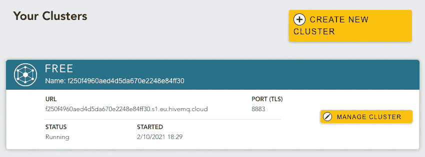
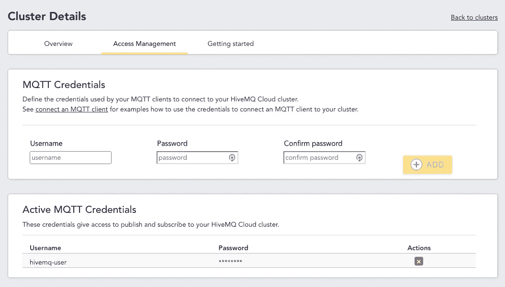
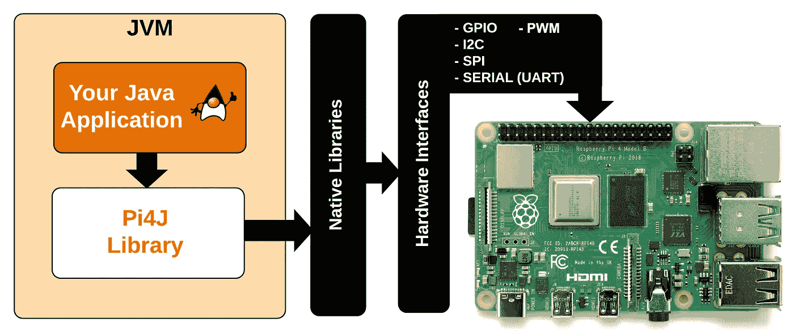
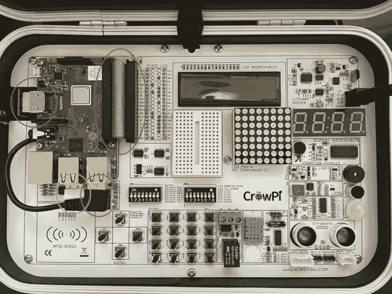
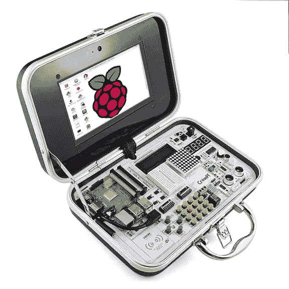
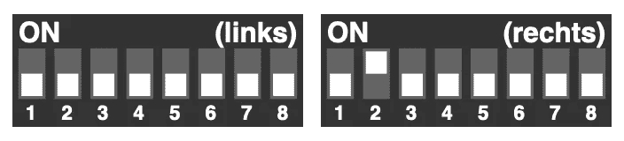
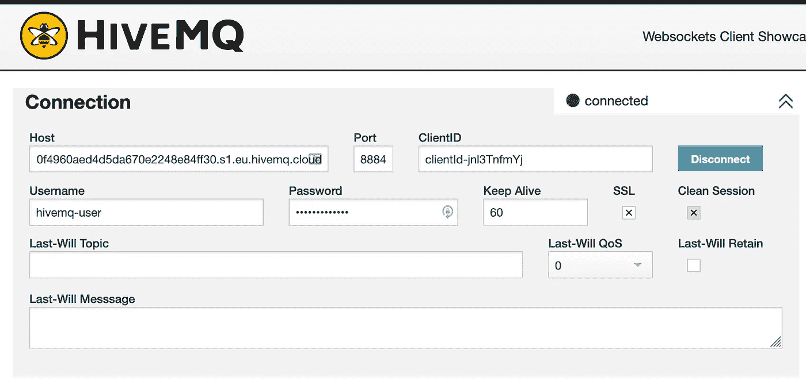
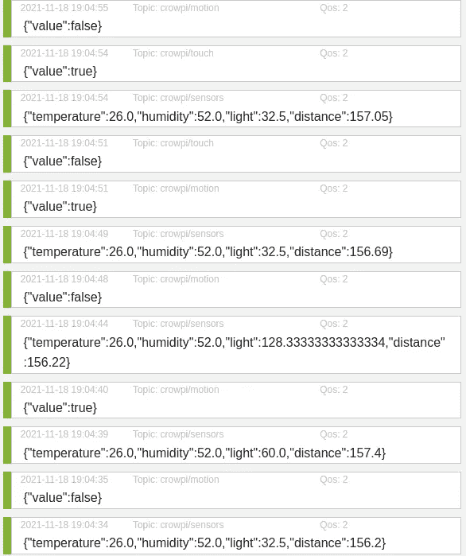

# HiveMQ Cloud，第 1 部分 Raspberry Pi 上的 MQTT，使用 Java 和 Pi4J 将传感器数据发送到 HiveMQ Cloud

> 原文：<https://medium.com/javarevisited/hivemq-cloud-part-1-mqtt-on-raspberry-pi-send-sensor-data-to-hivemq-cloud-with-java-and-pi4j-a92f0082a6fd?source=collection_archive---------0----------------------->

几年前，我用运行在 Raspberry Pi 上的 MQTT 服务器(Mosquitto)做了第一次实验，为我儿子的鼓室连接 Arduino 和 Raspberry Pi。完整的过程在我的书[“树莓 Pi 上的 Java 入门”](https://webtechie.be/books/)中有描述。


图书封面“在树莓 Pi 上开始使用 Java”

在这一系列的文章中，我们将采用一种不同的在线 MQTT 兼容服务方式: [HiveMQ Cloud](https://www.hivemq.com/mqtt-cloud-broker/) 。最大的优势:不需要永远在线的服务器，我们必须自己管理自己。是的，Mosquitto 运行在廉价的 Raspberry Pi 上，但如果我们将它用作分发数据的“中枢”,我们仍然需要保持它的正常运行。

还有一大优势:HiveMQ Cloud 最多 100 台设备完全免费！即使对最热情的制造商来说，这也是一大堆微控制器或计算机！

HiveMQ 网站上有许多编程语言的示例代码。在这篇文章和接下来的文章中，我们将重点讨论几个关于 Raspberry Pi 和 Java 的例子。

# 设置 HiveMQ 云帐户

先说我们免费的 HiveMQ 云账号。转到 [auth.hivemq.cloud](https://auth.hivemq.cloud) >“立即注册”并创建一个登录名。登录后，您将看到您的集群。通过点击“管理集群”按钮，您将被定向到包含 HiveMQ 云实例详细信息的视图。



转到“访问管理”部分，为我们将在应用程序中使用的凭证创建一个用户名和密码。



# 关于树莓派

树莓派不仅仅是一台适合所有人的小型廉价电脑。不，最新的版本 4 已经发展成为一个强大的机器，可以在许多情况下取代全尺寸的台式机或笔记本电脑。

Raspberry Pi 项目的最初目标是构建一台所有人都能负担得起的廉价 PC。第一个版本可以直接连接到电视上，为那些买不起显示器的人提供一台电脑。现在不同版本的 Raspberry Pi 已经上市，这取决于你的预算、你需要的连接、处理器、内存容量等等。

2019 年，树莓 Pi 4 发布，搭载 1.5 GHz 64 位四核 ARM 处理器。该主板提供 1、2、4 或 8GB 内存。价格从 25 到 90€不等。

在这个系列中，我将使用 Raspberry Pi 4，但您也可以使用其他类型的电路板。使用第一代 Raspberry Pi Zero(2021 年 11 月发布的新款)或更老的全尺寸主板时，唯一需要注意的是使用 ARMv6 兼容的 Java JDK 或运行时。更多信息参见[“如何在采用 ARMv6 处理器的 Raspberry Pi 板上安装和使用 Java 11 和 Java FX 11”](https://webtechie.be/post/2020-08-27-azul-zulu-java-11-and-gluon-javafx-11-on-armv6-raspberry-pi/)。

Raspberry Pi 的“神奇部分”是 40 引脚接头，它允许您连接各种电子组件，如 led、按钮、传感器、伺服系统、继电器、屏幕……这正是我们在本文中想要用来将传感器数据发送到 HiveMQ Cloud 的。

# 树莓派上的 Java

当你开始使用一个新的 Raspberry Pi 时，你需要将操作系统“烧录”到 SD 卡上。在树莓派网站的[软件页面，可以找到“成像仪”工具。使用此工具，您可以刻录一个预定义的操作系统版本，或者选择从另一个网站下载的映像。如果选择“Raspberry Pi OS(其他)”>“Raspberry Pi OS Full(32 位)”，你将拥有一个完整的 Linux 桌面环境，并带有额外的编程工具。](https://www.raspberrypi.com/software/)


而且对我们更重要的是，Java 也是预装的！当你打开终端并用`java -versions`检查版本时，你会得到这个结果(取决于 Raspberry Pi OS 的构建):

```
$ java -version
openjdk version "11.0.12" 2021-07-20
OpenJDK Runtime Environment (build 11.0.12+7-post-Raspbian-2deb10u1)
OpenJDK Server VM (build 11.0.12+7-post-Raspbian-2deb10u1, mixed mode)
```

这意味着我们已经为在我们的 Raspberry Pi 上开发和运行 Java 应用程序做好了充分准备！

# Pi4J

Pi4J 项目(始于 2012 年)旨在将 Java 编程与电子学结合起来。通过在项目中使用 Pi4J 依赖性，连接到 Raspberry Pi 的 GPIO 引脚(通用输入/输出)的电子组件可以作为 Java 代码中的对象进行控制。Pi4J 使用本地库来控制 GPIOs，因此作为程序员，您不需要完全了解与硬件通信相关的所有“魔法”。



## 历史

2021 年初发布了 Pi4J 的两个新版本:

*   2021 年 1 月发布的 1.3 版本增加了对最新的 Raspberry Pi 板(4400 和 Compute 4)的支持
*   2021 年 3 月发布的 1.4 版本针对 Java 11，并移除了对其他板和组件的支持

V1 的全部历史可以在 Pi4J 网站上找到。

自 2019 年以来，Pi4J 的全新版本 2 的工作一直在进行，以带来模块和改进的架构。这使得项目更容易维护、测试和发布。2021 年 8 月，这个新版本首次发布，这也是我们将在这里使用的版本。

## 证明文件

与这个 V2 一起，一个新的[文档网站发布了](https://pi4j.com)，在那里你可以找到很多关于电子学以及如何在 Raspberry Pi 上使用 Java 和 JavaFX 的信息。

# Java 项目

我们将创建的第一个应用程序是一个数据发布器，完整的源代码可以在 [GitHub](https://github.com/FDelporte/HiveMQ-examples) 上获得。我们将从不同的传感器读取数据，并将它们的值发送到 HiveMQ Cloud。因为每个“制造者”对一个项目都有自己的想法和愿望，所以我们不会关注组件和布线，而是使用一个非常适合这个演示项目的简单的初学者工具包:CrowPi。这种预连线套件使开始电子编程变得非常容易，因为所有组件都是预组装和连线的。所以至少这是一件你不需要担心或者会搞砸的事情；-).



CrowPi 版本 1 和 2

# 基于 FHNW 的 CrowPi 项目

来自瑞士 FHNW 大学的学生为 CrowPi 创建了一个完整的 Java 项目来演示如何用 Java 控制这个工具包中的所有组件。他们的部分文档已被翻译并可在 [Pi4J 网站](https://pi4j.com/getting-started/crowpi/)上获得，德语原版文档可在[“CrowPi Goes Java”](https://fhnw-ip5-ip6.github.io/CrowPiGoesJavaTutorial/de/)上找到。对于每个组件，他们创建了一个单独的应用程序，因此如何使用他们的代码作为自己项目的基础变得非常清楚。

本文中的概念验证应用程序使用了“CrowPi Goes Java”项目的某些部分，这些部分被重构以适合一个独立的应用程序，以便同时从不同的传感器读取数据，或者监听它们的更改事件并将数据发布到 HiveMQ。

# Maven pom.xml

Pi4J 库使用模块化方法，为 Raspberry Pi 构建一个项目会生成一个包含所有必需文件的目录。正因为如此，pom 文件看起来有点让人不知所措。

依赖关系包含:

*   HiveMQ MQTT 客户端来发布数据
*   Pi4J 核心和这个项目所需的插件
*   SLF4J 是 Pi4J 使用的日志框架
*   杰克逊和雅加达。JSON 用于 JSON 数据生成，简化数据传输

通过使用多个插件，采取以下步骤:

*   编译 Java 项目
*   定义可执行类
*   在发行目录中创建`jar`
*   在分发目录中复制一个`run.sh`脚本
*   在同一目录中添加运行时依赖项

# 密码

为了使代码易于理解，每个功能都被分成了自己的类。`HiveMqSender.java`是主类，所有的东西都在这里初始化，应用程序也在这里启动。

```
public class HiveMqSender {

    // Logger helper provided by Pi4J
    private static Console console;
    // Sends data to HiveMQ Cloud
    private static HiveMqManager hiveMqManager;
    // Initializes the sensors and reads the values
    private static SensorManager sensorManager;

    public static void main(String[] args) {
        console = new Console();
        hiveMqManager = new HiveMqManager(console);
        sensorManager = new SensorManager(console, hiveMqManager);

        while (true) {
            try {
                Thread.sleep(500);
            } catch (InterruptedException e) {
                e.printStackTrace();
            }
        }
    }
}
```

## 发布到 HiveMQ 主题

在文件`HiveMqManager.java`中，我们找到了连接 HiveMQ Cloud 和发布消息所需的所有代码。

我们使用 MQTT 第 5 版客户端，与第 3 版相比，它提供了多项改进，详见[“了解新的 MQTT 5 协议— MQTT 5 基础第 1 部分”](https://www.hivemq.com/blog/mqtt5-essentials-part1-introduction-to-mqtt-5/)以及该系列的后续文章。是的，你也会在那篇文章中发现，为什么没有第 4 版。:-)

多亏了 builder 方法，我们可以非常容易地配置客户端和连接。由于 HiveMQ Cloud 需要一个安全的连接，我们需要使用`sslWithDefaulftConfig()`并在连接中应用身份验证。

```
public class HiveMqManager {

    private static final String HIVEMQ_SERVER = "ID_OF_YOUR_INSTANCE.s1.eu.hivemq.cloud";
    private static final String HIVEMQ_USER = "YOUR_USERNAME";
    private static final String HIVEMQ_PASSWORD = "YOUR_PASSWORD";

    private static Console console;
    private static Mqtt5AsyncClient client;

    public HiveMqManager(Console console) {
        this.console = console;

        client = MqttClient.builder()
                .useMqttVersion5()
                .identifier("Java_" + UUID.randomUUID())
                .serverHost(HIVEMQ_SERVER)
                .serverPort(8883)
                .sslWithDefaultConfig()
                .buildAsync();

        client.connectWith()
                .simpleAuth()
                .username(HIVEMQ_USER)
                .password(HIVEMQ_PASSWORD.getBytes())
                .applySimpleAuth()
                .send()
                .whenComplete((connAck, throwable) -> {
                    if (throwable != null) {
                        console.println("Could not connect to HiveMQ: " + throwable.getMessage());
                    } else {
                        console.println("Connected to HiveMQ: " + connAck.getReasonCode());
                    }
                });
    }
}
```

为了让我们的传感器更容易发送数据，我们用一个`sendMessage`方法扩展了这个类。为了查看我们的消息是否成功发布，或者哪里出错了，我们使用了`whenComplete`方法。

```
public void sendMessage(String topic, String message) {
    client.publishWith()
            .topic(topic)
            .payload(message.getBytes())
            .qos(MqttQos.EXACTLY_ONCE)
            .send()
            .whenComplete((mqtt5Publish, throwable) -> {
                if (throwable != null) {
                    console.println("Error while sending message: " + throwable.getMessage());
                } else {
                    console.println("Message sent to '" + topic + "': " + message);
                }
            });
}
```

## 从传感器读取数据

所有传感器都在`SensorsManager.java`类中初始化。每个传感器被实现为一个`Component`。它们中的一些以由`TimerTask`开始的`SendMeasurements`的间隔被读取。其他的通过监听器发送改变，例如`SoundSensor`的`onNoise`。

```
public class SensorManager {

    private static final String TOPIC_MOTION = "crowpi/motion";
    private static final String TOPIC_NOISE = "crowpi/noise";
    private static final String TOPIC_TOUCH = "crowpi/touch";
    private static final String TOPIC_TILT = "crowpi/tilt";
    private static final String TOPIC_SENSORS = "crowpi/sensors";

    private static final String VALUE_TRUE = "{\"value\":true}";
    private static final String VALUE_FALSE = "{\"value\":false}";

    public SensorManager(Console console, HiveMqManager hiveMqManager) {
        Context pi4j = CrowPiPlatform.buildNewContext();

        PirMotionSensorComponent motionSensor = new PirMotionSensorComponent(console, pi4j);
        motionSensor.onMovement(() -> hiveMqManager.sendMessage(TOPIC_MOTION, VALUE_TRUE));
        motionSensor.onStillstand(() -> hiveMqManager.sendMessage(TOPIC_MOTION, VALUE_FALSE));

        SoundSensorComponent soundSensor = new SoundSensorComponent(console, pi4j);
        soundSensor.onNoise(() -> hiveMqManager.sendMessage(TOPIC_NOISE, VALUE_TRUE));
        soundSensor.onSilence(() -> hiveMqManager.sendMessage(TOPIC_NOISE, VALUE_FALSE));

        TouchSensorComponent touchSensor = new TouchSensorComponent(console, pi4j);
        touchSensor.onTouch(() -> hiveMqManager.sendMessage(TOPIC_TOUCH, VALUE_TRUE));
        touchSensor.onRelease(() -> hiveMqManager.sendMessage(TOPIC_TOUCH, VALUE_FALSE));

        TiltSensorComponent tiltSensor = new TiltSensorComponent(console, pi4j);
        tiltSensor.onTiltLeft(() -> hiveMqManager.sendMessage(TOPIC_TILT, "{\"value\":\"left\"}"));
        tiltSensor.onTiltRight(() -> hiveMqManager.sendMessage(TOPIC_TILT, "{\"value\":\"right\"}"));
        tiltSensor.onShake(() -> hiveMqManager.sendMessage(TOPIC_TILT, "{\"value\":\"shaking\"}"));

        HumiTempComponent dht11 = new HumiTempComponent(console, pi4j);
        LightSensorComponent lightSensor = new LightSensorComponent(console, pi4j);
        UltrasonicDistanceSensorComponent distanceSensor = new UltrasonicDistanceSensorComponent(console, pi4j);

        Timer timer = new Timer();
        TimerTask task = new SendMeasurements(hiveMqManager, dht11, lightSensor, distanceSensor);
        timer.schedule(task, 10_000, 5_000);
    }

    private static class SendMeasurements extends TimerTask {
        private final HiveMqManager hiveMqManager;
        private final HumiTempComponent dht11;
        private final LightSensorComponent lightSensor;
        private final UltrasonicDistanceSensorComponent distanceSensor;

        public SendMeasurements(HiveMqManager hiveMqManager,
                                HumiTempComponent dht11,
                                LightSensorComponent lightSensor,
                                UltrasonicDistanceSensorComponent distanceSensor) {
            this.hiveMqManager = hiveMqManager;
            this.dht11 = dht11;
            this.lightSensor = lightSensor;
            this.distanceSensor = distanceSensor;
        }

        @Override
        public void run() {
            var sensor = new Sensor(dht11.getTemperature(), dht11.getHumidity(),
                    lightSensor.readLight(2), distanceSensor.measure());
            hiveMqManager.sendMessage(TOPIC_SENSORS, sensor.toJson());
        }
    }
}
```

## Pi4J 的配置

正如您在前面的类中看到的，Pi4J 上下文是用`CrowPiPlatform.buildNewContext()`初始化的。Pi4J 使用插件结构，因此易于维护和扩展附加功能。在大多数情况下，我们可以依靠`Pi4J.newAutoContext()`进行初始化，但是因为我们明确需要 PiGpio 插件的功能，所以我们使用一个助手类来确保 Pi4J 加载正确的插件。PiGpio 是 Pi4J 用来处理 Gpio 的本地库(用 C 编写)。

```
public static Context buildNewContext() {
    // Initialize PiGPIO
    var piGpio = PiGpio.newNativeInstance();

    // Build Pi4J context with this platform and PiGPIO providers
    return Pi4J.newContextBuilder()
            .noAutoDetect()
            .add(new CrowPiPlatform())
            .add(
                    PiGpioDigitalInputProvider.newInstance(piGpio),
                    PiGpioDigitalOutputProvider.newInstance(piGpio),
                    PiGpioPwmProvider.newInstance(piGpio),
                    PiGpioI2CProvider.newInstance(piGpio),
                    PiGpioSerialProvider.newInstance(piGpio),
                    PiGpioSpiProvider.newInstance(piGpio)
            )
            .build();
}
```

## 传感器代码

如果你正在寻找一个特定的传感器，看一看这个项目的全部源代码或者 Pi4J CrowPi 项目。

在这篇文章中，我们来看看其中的一个组件:声音传感器。这是一个简单的`DigitalInput`传感器，它的所有代码都在`SoundSensorComponent.java`中实现。我们只需要实现一些方法来处理引脚在低电平(静音)和高电平(检测到声音)之间的变化。

pin 由以下代码部分初始化:

```
protected DigitalInputConfig buildDigitalInputConfig(Context pi4j, int address, long debounce) {
    return DigitalInput.newConfigBuilder(pi4j)
            .address(address)
            .id("BCM" + address)
            .name("SoundSensor")
            .pull(PullResistance.PULL_UP)
            .debounce(debounce)
            .build();
}
```

Pi4J 还提供了一个构建器模式来配置 GPIOs。对于这个属于`DigitalInput`的传感器，我们需要配置:

*   地址:它所连接的引脚 CrowPi 上的 BCM 24
*   唯一的 ID，因此 Pi4J 可以在它的生命周期内处理它
*   名称:供我们自己参考，例如在测井中
*   拉高或拉低:需要如何处理状态变化
*   去抖:状态变化之间的间隔，以避免状态变化之间过快的“乒乓”

# CrowPi OS

你可以在任何装有 Java 的 Raspberry Pi 操作系统上运行这个项目，但是当你在 CrowPi 上运行它时，你可以通过使用 Pi4J 项目的一部分 [CrowPi 操作系统](https://pi4j.com/getting-started/crowpi/crowpi-os/)来启动它(再次感谢 FHNW 大学)。

CrowPi 中的一些传感器(距离和湿度)需要非常严格的时间来获得可靠的数据结果。这在 Linux 系统上很难实现，无论是 Python 还是 Java。在 Linux 中可以进行一些调整来改善结果，这些是默认在 [CrowPi Os](https://pi4j.com/getting-started/crowpi/crowpi-os/) 中提供的，CrowPi Os 基于 Raspberry Pi OS，但对 CrowPi 进行了一些额外的改进。

但是即使做了这些调整，结果也不是 100%可靠。这种传感器更适合 Arduino 或 Raspberry Pi Pico 等微控制器。也可以使用实时操作系统，如 Cherie Tan 的[“Raspberry Pi 实时操作系统(RTOS):选择哪个”](https://all3dp.com/2/rtos-raspberry-pi-real-time-os/)所述。

最后一点:该项目使用倾斜传感器，需要通过 CrowPi 板上的 dip 开关来启用:



# 在 Raspberry Pi 上构建和运行

您可以在 PC 上开发一个 Java 项目，并将 jar 文件复制到 Raspberry Pi。或者复制源代码并在板上编译。或者当然在 Raspberry Pi 本身上开发(例如使用 Visual Studio 代码)。各有利弊。在[Pi4J-网站的“入门”部分](https://pi4j.com/getting-started/)中，提供了每种方法的更多信息。

如果您只想运行这个示例应用程序，最简单的方法可能是安装 Maven，下载源代码并在 Raspberry Pi 上构建和运行。如果您想快速入门，您可以克隆代码并在几行代码中运行它:

```
$ sudo apt install maven 
$ git clone https://github.com/FDelporte/HiveMQ-examples.git 
$ cd HiveMQ-examples/java-to-hivemq 
$ mvn package 
$ cd target/distribution 
$ sudo bash run.sh
```

在一些启动记录之后，您将看到不同传感器的预定消息和事件，例如在运动和噪声传感器事件下面。

```
Message sent to 'crowpi/sensors': {"temperature":12.0,"humidity":154.0,"light":170.0,"distance":159.57}
Message sent to 'crowpi/sensors': {"temperature":12.0,"humidity":154.0,"light":169.16666666666669,"distance":168.88}
Message sent to 'crowpi/motion': {"value":true}
Message sent to 'crowpi/sensors': {"temperature":12.0,"humidity":154.0,"light":169.16666666666669,"distance":167.44}
Message sent to 'crowpi/motion': {"value":false}
Message sent to 'crowpi/sensors': {"temperature":12.0,"humidity":154.0,"light":163.33333333333334,"distance":167.77}
Message sent to 'crowpi/noise': {"value":false}
Message sent to 'crowpi/noise': {"value":true}
```

# WebSocket 测试页面

我们的应用程序的日志显示数据被发布到 HiveMQ Cloud，但是我们希望在继续创建客户端之前进行确认…幸运的是，有一个 websocket 客户端，我们可以使用它非常容易地进行这个测试！前往[hivemq.com/demos/websocket-client/](http://www.hivemq.com/demos/websocket-client/)，用你的证件填写所有字段。确保选中`SSL`复选框！当所有内容都正确填写后，点击`Connect`按钮，你会在顶部看到一个绿色的`connected`指示。



现在，我们可以定义想要订阅的主题，例如“crowpi/motion”、“crowpi/sensors”…一旦从我们的 Raspberry Pi 推送消息，它们就会显示在这个 web 测试页面中。



太好了！我们有从我们的 Raspberry Pi 流向 HiveMQ Cloud 的数据！！！

# 结论

与往常一样，当您将 Java 与 Maven 结合起来时，这样的项目可以用最少的代码实现，并且仍然易于理解和管理。Pi4J 添加了必要的工具来隐藏处理 GPIOs 的复杂性，并将电子组件“转换”为 Java 对象。

多亏了 HiveMQ 云服务，我们可以将多达 100 台设备的数据免费发布到一个始终在线的免维护消息代理！结合便宜的树莓酱，一个充满机会的世界向所有制造商敞开。

在本系列的下一篇文章中，我们将在仪表板中可视化传感器的数据。当然，在 Raspberry Pi 上再次使用 Java(和 JavaFX )!

*本文应 HiveMQ 的要求而写，最初发表于 HiveMQ 的博客*[](https://www.hivemq.com/blog/mqtt-raspberrypi-part01-sensor-data-hivemqcloud-java-pi4j/)**。**