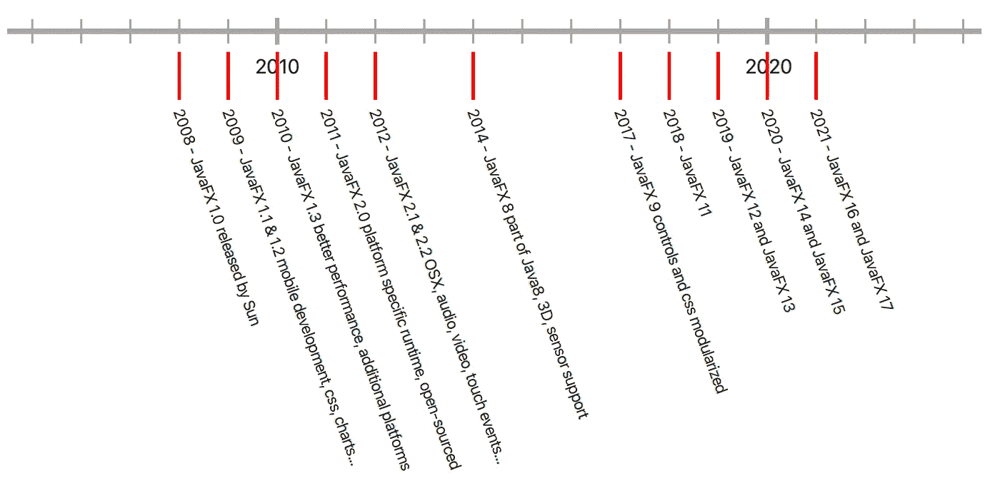
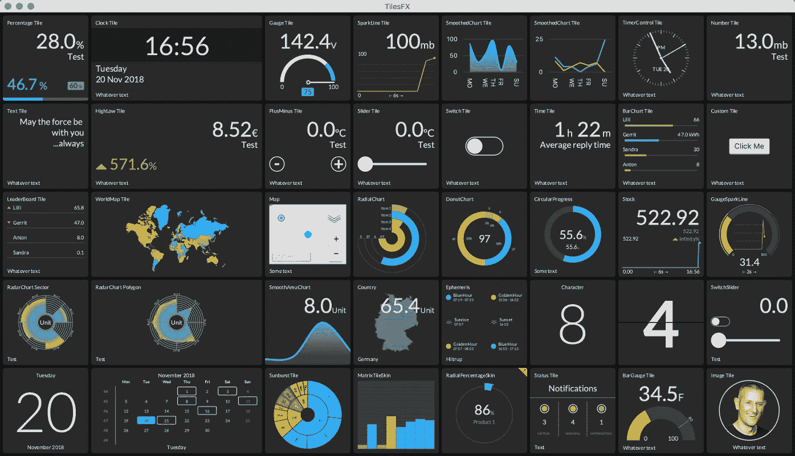
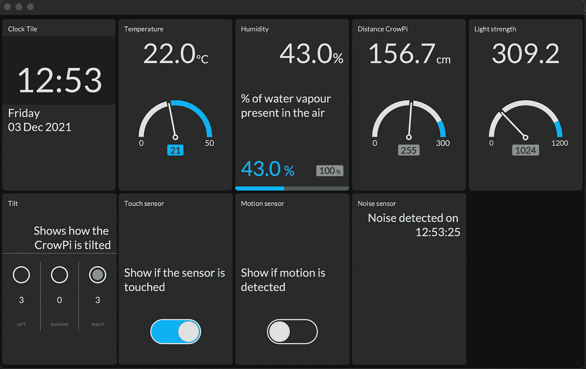
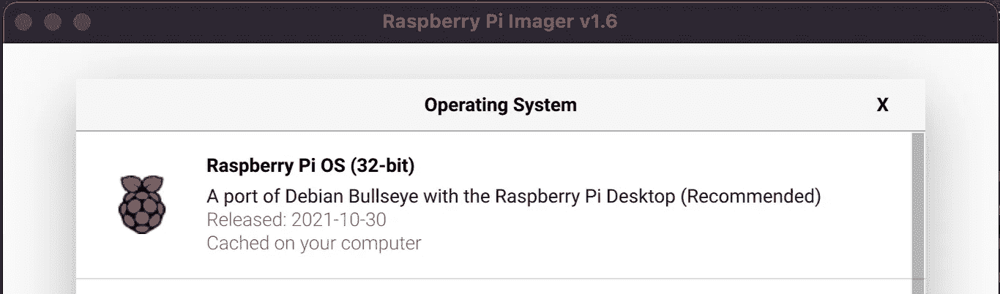

# HiveMQ 云，第 2 部分—使用 MQTT 和 Raspberry Pi 在 TilesFX 仪表板上可视化传感器数据

> 原文：<https://medium.com/javarevisited/hivemq-cloud-part-2-using-mqtt-and-raspberry-pi-to-visualize-sensor-data-on-a-tilesfx-dashboard-4189a3a5d4c?source=collection_archive---------3----------------------->

在[的上一篇文章](/javarevisited/hivemq-cloud-part-1-mqtt-on-raspberry-pi-send-sensor-data-to-hivemq-cloud-with-java-and-pi4j-a92f0082a6fd)中，我们在 Raspberry Pi 上开始了对 HiveMQ Cloud 和 Java 的探索。我们创建了一个应用程序，将各种传感器的测量结果发送到 HiveMQ Cloud MQTT 代理。使用在线 websocket 客户端，我们验证了消息的转换，并且可以看到数据被发布到这个在线消息队列。

现在，我们将进行下一步，订阅这些主题，以在使用 JavaFX 创建的仪表板中接收数据。

# 关于 JavaFX

JavaFX 是一组图形和媒体包，使开发人员能够设计、创建、测试、调试和部署在不同平台上一致运行的富客户端应用程序。

[JavaFX](/javarevisited/7-best-java-fx-online-courses-for-beginners-9e774ba6f996) 由太阳微系统公司创建，后来成为甲骨文公司的一部分，现在是 [openjfx.io](https://openjfx.io/) 上的一个开源项目。商业支持可以通过[GluonHQ](https://gluonhq.com/)获得，gluohq 也是项目的主要维护者，有很多贡献者(包括 Oracle)的支持。GitHub 上有[的源代码。从版本 11 开始，JavaFX 模块移出了 Oracle JDK。Java 的发布周期类似于 6 个月，JavaFX 的开发速度提高了，推动了新特性的发展。](https://github.com/openjdk/jfx)

[](https://javarevisited.blogspot.com/2020/06/top-5-courses-to-learn-java-fx-in-2020.html#axzz6u4HTHz4Z)

JavaFX 版本历史

[JavaFX](/javarevisited/6-free-courses-to-learn-servlet-jsp-and-java-fx-in-2020-best-of-lot-720201c84f63) 允许快速构建用户界面，同时使用您作为 Java 开发人员已经知道的语言和工具。这可以用 CSS 语法进行样式化，并且非常灵活和可扩展，甚至允许您绘制自己的布局元素，正如您在上面的历史图表中所看到的，可以在 [GitHub 上获得，作为我的书](https://github.com/FDelporte/JavaOnRaspberryPi/tree/master/Chapter_04_Java/javafx-timeline)[“在 Raspberry Pi 上开始使用 Java”](https://webtechie.be/books/)的来源的一部分。

# 树莓 Pi 上的 JavaFX

JavaFX 可以通过两种方式安装在 Raspberry Pi 上:

*   通过安装捆绑了 JavaFX 的 JDK。Azul 和 BellSoft 提供了这样的版本。
*   通过使用可从 GluonHQ 网站下载的最新版本单独安装它。

我个人更喜欢第二种方法，因为您肯定会使用最新的 JavaFX 运行时，包括嵌入式设备的所有改进。由于这是一个快速发展的市场，有很多正在发生的变化，如改进的渲染和直接渲染模式(DRM，也称为 Kiosk 模式)。关于这个主题的更多信息可以在[“在 Raspberry Pi 上以 Kiosk 模式运行的 JavaFX】中找到。](https://foojay.io/today/javafx-running-in-kiosk-mode-on-the-raspberry-pi/)

# TilesFX 库

这个伟大的库是由[杰瑞特·格伦瓦德](https://twitter.com/hansolo_)开发的，它提供了构建仪表板的瓦片。查看[的博客](https://harmoniccode.blogspot.com/)以获得更多 JavaFX 示例！

你可以在 GitHub 上找到[tiles FX 的源代码，它可以作为](https://github.com/HanSolo/tilesfx) [Maven 依赖项](https://mvnrepository.com/artifact/eu.hansolo/tilesfx)获得。作为 TilesFX 源代码的一部分，提供了一个演示应用程序来展示如何使用所有可用的图块。



TilesFX 演示应用程序

# Java 项目

让我们创建一个 JavaFX 应用程序，用我们在上一部分中创建的应用程序来可视化我们推送到 HiveMQ Cloud 的所有传感器值。

# 属国

与消息发送者相比，该项目需要一些不同的依赖项。当然，我们再次使用 HiveMQ MQTT 客户端。但是对于图形用户界面部分，我们需要一些 JavaFX 库(在应用程序中只使用了 controls，其他的由 TilesFX 引用)和 TilesFX 库本身。

```
<dependency>
   <groupId>com.hivemq</groupId>
   <artifactId>hivemq-mqtt-client</artifactId>
   <version>${hivemq.version}</version>
</dependency>
<dependency>
   <groupId>org.openjfx</groupId>
   <artifactId>javafx-controls</artifactId>
   <version>${javafx.version}</version>
</dependency>
<dependency>
   <groupId>org.openjfx</groupId>
   <artifactId>javafx-media</artifactId>
   <version>${javafx.version}</version>
</dependency>
<dependency>
   <groupId>org.openjfx</groupId>
   <artifactId>javafx-web</artifactId>
   <version>${javafx.version}</version>
</dependency>
<dependency>
   <groupId>eu.hansolo</groupId>
   <artifactId>tilesfx</artifactId>
   <version>${tilesfx.version}</version>
</dependency>
```

# GitHub 上的完整代码

这个应用程序的源代码[可以在 GitHub 上找到，与前一篇文章](https://github.com/FDelporte/HiveMQ-examples)在同一个存储库中。

## 启动 JavaFX 应用程序

我们需要从 JavaFX 应用程序扩展，在这种情况下，我们在 start-method 中配置 HiveMQ 客户端。这也可以在一个单独的类中完成，但是对于这个概念验证来说，很容易使用 client-reference 将它提供给子对象。

为了便于主题的维护，这里也定义了这些主题。

```
public class HiveMqClient extends Application {
   private static final Logger logger = 
      LogManager.getLogger(HiveMqClient.class.getName()); public static final String TOPIC_MOTION = "crowpi/motion";
   public static final String TOPIC_NOISE = "crowpi/noise";
   public static final String TOPIC_SENSORS = "crowpi/sensors";
   public static final String TOPIC_TILT = "crowpi/tilt";
   public static final String TOPIC_TOUCH = "crowpi/touch"; private static final String HIVEMQ_SERVER = 
      "ID_OF_YOUR_INSTANCE.s1.eu.hivemq.cloud"; private static final String HIVEMQ_USER = "YOUR_USERNAME";
   private static final String HIVEMQ_PASSWORD = "YOUR_PASSWORD";
   private static final int HIVEMQ_PORT = 8883; @Override
   public void start(Stage stage) {
      logger.info("Starting up...");
      Mqtt5AsyncClient client = MqttClient.builder()
         .useMqttVersion5()
         .identifier("JavaFX_" + UUID.randomUUID())
         .serverHost(HIVEMQ_SERVER)
         .serverPort(HIVEMQ_PORT)
         .sslWithDefaultConfig()
         .buildAsync(); client.connectWith()
         .simpleAuth()
         .username(HIVEMQ_USER)
         .password(HIVEMQ_PASSWORD.getBytes())
         .applySimpleAuth()
         .send()
         .whenComplete((connAck, throwable) -> {
             if (throwable != null) {
                logger.error("Could not connect to HiveMQ: {}",
                   throwable.getMessage());
             } else {
                logger.info("Connected to HiveMQ: {}", 
                    connAck.getReasonCode());
             }
         }); var scene = new Scene(new DashboardView(client), 1024, 620);
       stage.setScene(scene);
       stage.show();
   } public static void main(String[] args) {
       launch();
   }
}
```

## 可视化仪表板中的数据

在 DashboardView 中，我们定义了要添加到屏幕中的所有图块。请看看所有瓷砖的完整来源。在这里你可以找到其中两个的代码:

```
public class DashboardView extends FlowGridPane {
   private static final Logger logger = 
      LogManager.getLogger(DashboardView.class.getName()); private final ObjectMapper mapper = new ObjectMapper();
   private final Tile gaucheTemperature;
   private final Tile gaucheDistance;
   private final Tile gaucheLight;
   private final Tile percentageHumidity; public DashboardView(Mqtt5AsyncClient client) {
      super(5, 2); 
      logger.info("Creating dashboard view"); setHgap(5);
      setVgap(5);
      setAlignment(Pos.CENTER);
      setCenterShape(true);
      setPadding(new Insets(5));
      setBackground(new Background(
          new BackgroundFill(Color.web("#101214"), 
          CornerRadii.EMPTY, Insets.EMPTY))); ... gaucheTemperature = TileBuilder.create()
         .skinType(Tile.SkinType.GAUGE)
         .prefSize(TILE_WIDTH, TILE_HEIGHT)
         .title("Temperature")
         .unit("°C")
         .threshold(21)
         .maxValue(50)
         .build(); ... getChildren().addAll(
         clockTile,
         gaucheTemperature,
         percentageHumidity,
         gaucheDistance,
         gaucheLight,
         new TiltStatusTile(client, TOPIC_TILT),
         new SensorSwitchTile(client, TOPIC_TOUCH, 
             "Touch sensor", "Show if the sensor is touched"),
         new SensorSwitchTile(client, TOPIC_MOTION, 
              "Motion sensor", "Show if motion is detected"),
         new NoiseTextTile(client, TOPIC_NOISE)); ...
   } ...
}
```

戈谢温

温度是由 CrowPi 间隔发送的传感器值之一。订阅传感器主题后，我们将收到这些数据。通过使用与发送者应用程序中相同的传感器类，我们可以很容易地将接收到的字符串映射到 Java 对象。

GaucheTemperature-tile 和我们在构造函数中初始化的其他 tile 现在可以用接收到的数据进行更新。

```
...client.toAsync().subscribeWith()
   .topicFilter(TOPIC_SENSORS)
   .qos(MqttQos.AT_LEAST_ONCE)
   .callback(this::handleSensorData)
   .send();...private void handleSensorData(Mqtt5Publish message) {
   var sensorData = new String(message.getPayloadAsBytes()); logger.info("Sensor data: {}", sensorData); try {
      var sensor = mapper.readValue(sensorData, Sensor.class);
      gaucheTemperature.setValue(sensor.getTemperature());
      percentageHumidity.setValue(sensor.getHumidity());
      gaucheDistance.setValue(sensor.getDistance());
      gaucheLight.setValue(sensor.getLight());
   } catch (JsonProcessingException ex) {
      logger.error("Could not parse the data to JSON: {}",
         ex.getMessage());
   }
}
```

传感器开关

当传感器的状态改变时，其他数据由发布者发送。例如，当触摸或释放触摸传感器时，我们将接收到特定主题的真或假。为了能够容易地处理这一点，创建了从 Tile 类扩展的附加组件。

SensorSwitchTile 包含一个 SWITCH-tile，其活动状态根据每个接收到的消息中的值而改变。

```
public class SensorSwitchTile extends BaseTile {
   private final Tile statusTile; public SensorSwitchTile(Mqtt5AsyncClient client, String topic, 
      String title, String description) {
      super(client, topic); statusTile = TileBuilder.create()
         .skinType(SkinType.SWITCH)
         .prefSize(TILE_WIDTH, TILE_HEIGHT)
         .title(title)
         .description(description)
         .build(); getChildren().add(statusTile);
   } @Override
   public void handleMessage(Mqtt5Publish message) {
      var sensorData = new String(message.getPayloadAsBytes());
      logger.info("Boolean sensor data: {}", sensorData);
      try {
         var sensor = mapper.readValue(sensorData, 
            BooleanValue.class); Platform.runLater(() -> {
            statusTile.setActive(sensor.getValue());
         });
      } catch (JsonProcessingException ex) {
         logger.error("Could not parse the data to JSON: {}",
            ex.getMessage());
      }
   }
}
```

主题的订阅在 BaseTile 类中处理，以避免重复代码。

```
public class BaseTile extends Pane {
   protected static final Logger logger = 
      LogManager.getLogger(BaseTile.class.getName()); protected final ObjectMapper mapper = new ObjectMapper(); public static final int TILE_WIDTH = 200;
   public static final int TILE_HEIGHT = 300; public BaseTile(Mqtt5AsyncClient client, String topic) {
      client.toAsync().subscribeWith()
         .topicFilter(topic)
         .qos(MqttQos.AT_LEAST_ONCE)
         .callback(this::handleMessage)
         .send();
   } /**
   * Method to be overridden in each tile
   */
   protected void handleMessage(Mqtt5Publish message) {
      logger.warn("Message not handled: {}", 
         message.getPayloadAsBytes());
   }
}
```

如您所见，订阅 HiveMQ 云消息只需要很少的代码。

# 构建和运行应用程序

## 在开发人员电脑上

与之前的应用程序中的 GPIO 接口相比，这个项目没有调用任何 Raspberry Pi 特定的函数，所以我们可以在任何 PC 上运行它。此外，您可以选择使用包含 JavaFX 运行时依赖项的 JDK，或者单独下载。这两种方法在[“用 Gluon 工具启动 JavaFX 项目”](https://foojay.io/today/starting-a-javafx-project-with-gluon-tools/)中有更详细的描述。

另一方面，当从 IntelliJ IDEA 开始时，Maven 依赖项将为您处理所有这一切。



## 树莓派

为了在 Raspberry Pi 4 上运行这个应用程序，我从一个新的 SD 卡开始，使用标准的 Raspberry Pi 操作系统(32 位)。



这是 Raspberry Pi 操作系统的“最小”版本，不包括 Java，但这可以通过在终端中运行`sudo apt install openjdk-11-jdk`快速修复。

```
$ java -version
bash: java: command not found
$ sudo apt update
$ sudo apt install openjdk-11-jdk
$ java -version
openjdk version "11.0.13" 2021-10-19
OpenJDK Runtime Environment (build 11.0.13+8-post-Raspbian-1deb11u1)
OpenJDK Server VM (build 11.0.13+8-post-Raspbian-1deb11u1, mixed mode)
```

不错！现在我们已经可以在 Raspberry Pi 上运行 Java 代码了。但是对于 JavaFX，我们需要专门为 Raspberry Pi 编译的运行时。胶子通过他们的网站 gluonhq.com/products/javafx 提供这些版本。我们只需要下载一个文件，将其解压缩，并放在一个我们在启动应用程序时会引用的位置。

```
$ wget -O openjfx.zip https://gluonhq.com/download/javafx-17-ea-sdk-linux-arm32/ 
$ unzip openjfx.zip 
$ sudo mv javafx-sdk-17/ /opt/javafx-sdk-17/
```

由于这个 dashboard 应用程序是一个 Maven 项目，我们仍然需要安装它，然后我们可以获得完整的项目并在 Raspberry Pi 上构建它。请遵循以下步骤:

```
$ sudo apt install maven 
$ git clone https://github.com/FDelporte/HiveMQ-examples.git 
$ cd HiveMQ-examples/javafx-ui-hivemq 
$ mvn package 
$ cd target/distribution 
$ bash run.sh
```

`run.sh`脚本将编译后的应用程序 jar 与特定于平台的 JavaFX 运行时相结合，并启动应用程序。

# 结论

TilesFX 只是您可以在应用程序中使用的许多开源库之一，或者您可以创建自己的组件。杰瑞特·格伦瓦德和其他作家在 foojay.io 的多篇文章中解释了这种方法。

通过使用 JavaFX，您可以快速开发漂亮的用户界面，并与 HiveMQ Cloud 相结合，这将产生一个很好的仪表板应用程序来可视化传感器数据。

通过在 Raspberry Pi 上运行该应用程序，您可以以非常低的价格获得一个始终在线的仪表板屏幕。

*本文应 HiveMQ 的要求而写，最初发表于 HiveMQ 的博客*<https://www.hivemq.com/blog/mqtt-raspberrypi-part02-visualizing-sensor-data-on-a-tilesfx-dashboard/>**。**