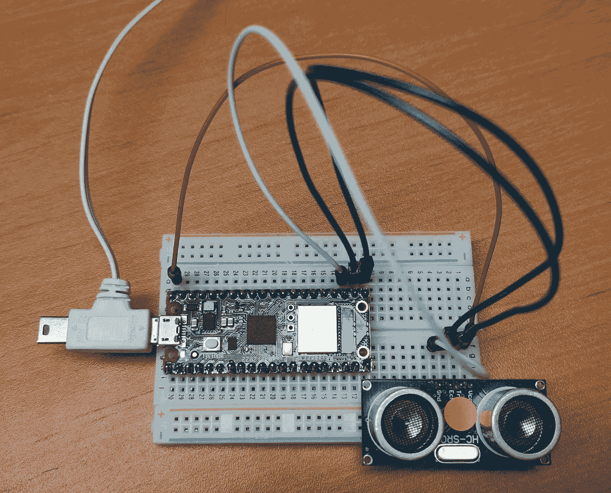
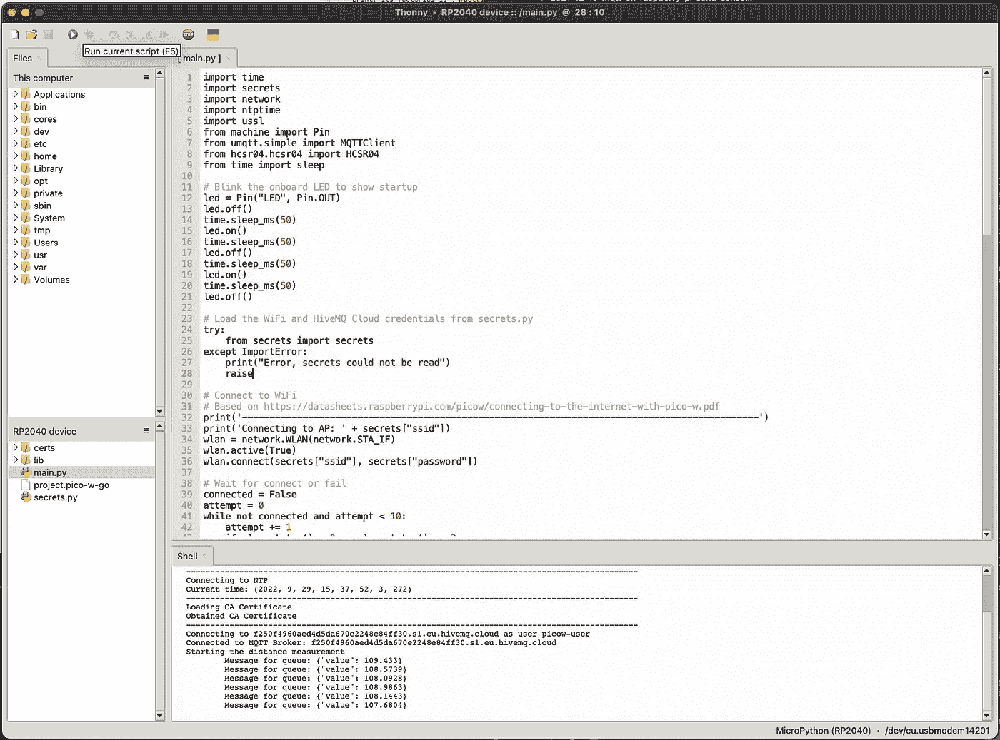

# HiveMQ 云，第 4 部分—将传感器数据从 Raspberry Pi Pico W 发送到 HiveMQ 云

> 原文：<https://medium.com/javarevisited/hivemq-cloud-part-4-sending-sensor-data-from-raspberry-pi-pico-w-to-hivemq-cloud-15c236651a69?source=collection_archive---------1----------------------->

整整一年前，2021 年 12 月，我发表了[三篇用 Raspberry Pi、Raspberry Pi Pico 和 HiveMQ Cloud](https://webtechie.be/tags/hivemq/) 进行 MQTT 消息传递的文章。2022 年 6 月 30 日，树莓派发布了一款新产品，这就是本文的主题: **Pico W** 。是的，原版 **Pico** 的新版本，但是有无线网络。新的主板售价为 6 美元，而原来的 Pico 为 4 美元。

在这篇文章中，我们将重新编写去年 12 月文章的第三个项目，其中使用 Pico、单独的 Wi-Fi 模块和距离传感器将数据发送到 HiveMQ Cloud。我们现在可以通过使用新的 Pico W 来简化该项目，不再需要单独的 Wi-Fi 模块。

这个项目和前面三个部分的来源都是在 GitHub 上可以找到的[。](https://github.com/FDelporte/HiveMQ-examples)

# 关于 HiveMQ 云

[HiveMQ Cloud](https://www.hivemq.com/mqtt-cloud-broker/) 是一项在线 MQTT 兼容服务，最多可对 100 台设备完全免费！即使对最热情的制造者来说，那也是一大堆微控制器或计算机！

在 HiveMQ 博客上，Kudzai Manditereza 发表了一篇[文章，也描述了如何使用 Pico W](https://www.hivemq.com/blog/iot-reading-sensor-data-raspberry-pi-pico-w-micropython-mqtt-node-red/) 。

# 关于树莓派

新款 Pico W 的外形与原来的 Pico 完全相同。由于板载 LED 的连接方式发生了变化，因此布线略有变化。您应该能够在大多数现有项目中切换到新版本，没有任何问题。

# 接线

# 试验板设置

拿一块试验板和一些电线来创建这个小测试设置。与之前的 Pico 和一个额外的 Adafruit AirLift Wi-Fi 相比，现在的设置简单多了。



唯一需要连接的部件是距离传感器。

# 距离传感器

只需要 4 根线，为了简单起见，连接到前一篇文章中使用的相同引脚，但当然你可以自由使用其他的，只要你在代码中使用正确的数字。

*   **Pico > HC-SR04**
*   VBUS > Vcc
*   GND > GND
*   GP16 >回声
*   GP17 >触发器

# MicroPython 项目

在之前的 Pico 项目中， [CircuitPython](https://circuitpython.org/) 用于编写程序。不幸的是，当我开始这个项目将 Pico W 连接到 HiveMQ Cloud 时，CircuitPython 还不支持 Pico W 的 WiFi 模块。GitHub 上的[票现在似乎已经关闭并解决了，所以我让你来尝试一下。在这篇文章中，我们将使用](https://github.com/adafruit/circuitpython/issues/6558) [MicroPython](https://micropython.org/) 。

*“MicroPython 是 Python 3 编程语言的一个精简而高效的实现，它包括 Python 标准库的一个小子集，并针对在微控制器和受限环境中运行进行了优化。”*。

为了**在 Pico W** 上安装 MicroPython，[按照 Raspberry Pi](https://www.raspberrypi.com/documentation/microcontrollers/micropython.html) 提供的步骤进行操作。

正如 HiveMQ Cloud 所要求的那样，建立安全连接是一个额外的挑战。最后，和大多数时候一样，只是找到正确的库和设置的问题。幸运的是，我得到了 HiveMQ 论坛[一些成员的支持，正如你在这个帖子](https://community.hivemq.com/t/getting-started-raspberry-pi-pico-w/1316)中看到的。

警告！如果您使用的是装有 macOS Ventura 的 Apple 电脑，连接到 Pico 可能会有问题。见[这篇博文](https://www.raspberrypi.com/news/the-ventura-problem/?mc_cid=54f69c07e7&mc_eid=787c121758)了解更多信息。

# 在 Mac 上安装 Thonny IDE

我尝试了几种 ide 来编写 Pico W，但是发现 Thonny 是最好的选择。它适用于 Windows、Mac 和 Linux。在 macOS 上你可以很容易地用`brew install --cask thonny`安装。安装后，请确保打开“查看>文件”，并在屏幕右下角选择您的主板“MicroPython (RP2040)”，如您在截图中所见。

[](https://javarevisited.blogspot.com/2022/03/3-examples-to-parse-json-in-java-using.html)

# 安装库

我们的应用程序将使用两个库来最小化我们需要自己编写的代码。

第一个给了我们一个 MQTTClient。从 MicroPython 项目中的 GitHub 上可以找到的文件[中复制代码，在 Thonny 中创建新文件，并将其作为文件`simple.py`保存到目录`/lib/umqtt/`中的 Pico W 中。](https://github.com/micropython/micropython-lib/blob/master/micropython/umqtt.simple/umqtt/simple.py)

MicroPython 提供的另一种安装库的方法是在 Thonny 中使用终端并运行以下两个命令:

```
>>> import upip
>>> upip.install('umqtt.simple')
Installing to: /lib/
Warning: micropython.org SSL certificate is not validated
Installing umqtt.simple 1.3.4 from https://micropython.org/pi/umqtt.simple/umqtt.simple-1.3.4.tar.gz
```

第二个库帮助我们使用 HC-SR04 传感器进行距离测量。再次，从 rsc1975 (Roberto) 的一个项目中复制 GitHub 的[这段代码，在 Thonny 中创建一个新文件，并作为文件`hcsr04.py`保存到目录`/lib/hcsr04/`中的 Pico W 中。](https://github.com/rsc1975/micropython-hcsr04/blob/master/hcsr04.py)

# 秘密

在 Pico W 的根目录下创建一个名为`secrets.py`的文件，包含以下内容(这个文件与前一篇文章中使用的 Pico 文件相同)。

```
secrets = {
   'ssid' : 'WIFI_NETWORK_NAME',
   'password' : 'WIFI_PASSWORD',
   'timezone' : 'Europe/Brussels',
   'mqtt_username' : 'HIVEMQ_USERNAME',
   'mqtt_key' : 'HIVEMQ_PASSWORD',
   'broker' : 'YOUR_INSTANCE.hivemq.cloud',
   'port' : 8883
}
```

# 项目代码

最后一部分是实际的应用程序代码。在 Pico W 的根目录下创建一个名为`main.py`的额外文件，内容如下:

```
import time
import secrets
import network
import ntptime
import ussl

from machine import Pin
from umqtt.simple import MQTTClient
from hcsr04.hcsr04 import HCSR04
from time import sleep

# Blink the onboard LED to show startup
led = Pin("LED", Pin.OUT)
led.off()
time.sleep_ms(50)
led.on()
time.sleep_ms(50)
led.off()
time.sleep_ms(50)
led.on()
time.sleep_ms(50)
led.off()

# Load the WiFi and HiveMQ Cloud credentials from secrets.py
try:
    from secrets import secrets
except ImportError:
    print("Error, secrets could not be read")
    raise

# Connect to WiFi
# Based on https://datasheets.raspberrypi.com/picow/connecting-to-the-internet-with-pico-w.pdf
print('----------------------------------------------------------------------------------------------')
print('Connecting to AP: ' + secrets["ssid"])
wlan = network.WLAN(network.STA_IF)
wlan.active(True)
wlan.connect(secrets["ssid"], secrets["password"])

# Wait for WiFi connection or failure
connected = False
attempt = 0
while not connected and attempt < 10:
    attempt += 1
    if wlan.status() < 0 or wlan.status() >= 3:
        connected = True
    if not connected:
        print("Connection attempt failed: " + str(attempt))
        time.sleep(1)
    else:
        print("Connected on attempt: " + str(attempt))

if not connected or wlan.ifconfig()[0] == "0.0.0.0":
    # Blink LED to show there is a WiFi problem
    print("Bad WiFi connection: " + wlan.ifconfig()[0])
    while True:
        # Endless loop as we don't have a WiFi connection
        led.off()
        time.sleep_ms(150)
        led.on()
        time.sleep_ms(150)

# As we end up here, we now we have a WiFi connection
print("WiFi status: " + str(wlan.ifconfig()))
led.on()

# To validate certificates, a valid time is required
# NTP is used to get the correct time
# https://en.wikipedia.org/wiki/Network_Time_Protocol
print('----------------------------------------------------------------------------------------------')
print('Connecting to NTP')
ntptime.host = "de.pool.ntp.org"
ntptime.settime()
print('Current time: ' + str(time.localtime()))

# Load the certificate for secure connection to HiveMQ Cloud
print('----------------------------------------------------------------------------------------------')
print('Loading CA Certificate')
with open("/certs/hivemq-com-chain_2_only.der", 'rb') as f:
    cacert = f.read()
f.close()
print('Obtained CA Certificate')

# Connect to HiveMQ Cloud
# Based on https://www.tomshardware.com/how-to/send-and-receive-data-raspberry-pi-pico-w-mqtt
print('----------------------------------------------------------------------------------------------')
print("Connecting to " + secrets["broker"] + " as user " + secrets["mqtt_username"])

# Use sslparams as defined below for a secure connection
# sslparams = {'server_side': False,
#             'key': None,
#             'cert': None,
#             'cert_reqs': ussl.CERT_REQUIRED,
#             'cadata': cacert,
#             'server_hostname': secrets["broker"]}

# When using the sslparams below, a connection can be made to HiveMQ Cloud, but it's not secure
sslparams = {'server_hostname': secrets["broker"]}

mqtt_client = MQTTClient(client_id="picow",
                    server=secrets["broker"],
                    port=secrets["port"],
                    user=secrets["mqtt_username"],
                    password=secrets["mqtt_key"],
                    keepalive=3600,
                    ssl=True,
                    ssl_params=sslparams) 
mqtt_client.connect()
print('Connected to MQTT Broker: ' + secrets["broker"])

# Send a test message to HiveMQ
mqtt_client.publish('test', 'HelloWorld')

# Continuously measure the distance and send the value to HiveMQ
# Based on https://randomnerdtutorials.com/micropython-hc-sr04-ultrasonic-esp32-esp8266/
hcsr04 = HCSR04(trigger_pin=17, echo_pin=16, echo_timeout_us=10000)
print("Starting the distance measurement")
killed = False
while not killed:
    # Measure distance
    distance = 0
    try:
        distance = hcsr04.distance_cm()
    except Exception as e:
        print("Distance measurement failure\n", e)

    # Send to HiveMQ Cloud
    try:
        json = "{\"value\": " + str(distance) + "}"
        print("\tMessage for queue: " + json)
        mqtt_client.publish("picow/distance", json)
    except Exception as e:
        print("\tMQTT publish Failed, retrying\n", e)
        killed = True
        continue

    # Sleep a second
    time.sleep(1)
```

当使用 Thonny 中的“Run current script”按钮执行上述代码时，您应该得到以下输出，显示设备连接到 Wi-Fi 并开始发送数据。

```
>>> %Run -c $EDITOR_CONTENT
----------------------------------------------------------------------------------------------
Connecting to AP: ***
Connected on attempt: 1
WiFi status: ('172.16.1.88', '255.255.255.0', '172.16.1.1', '172.16.1.1')
----------------------------------------------------------------------------------------------
Connecting to NTP
Current time: (2022, 9, 29, 16, 2, 20, 3, 272)
----------------------------------------------------------------------------------------------
Loading CA Certificate
Obtained CA Certificate
----------------------------------------------------------------------------------------------
Connecting to ***.s1.eu.hivemq.cloud as user picow-user
Connected to MQTT Broker: ***.s1.eu.hivemq.cloud
Starting the distance measurement
   Message for queue: {"value": 108.6254}
   Message for queue: {"value": 107.732}
   Message for queue: {"value": 14.10653}
   Message for queue: {"value": 16.95876}
```

# 结论

HiveMQ Cloud 需要一个 [TLS](/javarevisited/best-https-ssl-and-tls-courses-for-beginners-4437661250b3) (安全)连接，这对于这种小型电路板来说有点挑战性。但仍然可以很容易地建立连接，从那时起，可能性是无穷的，即使是 6 美元的小电路板。

*最初发布于*[*https://web techie . be*](https://webtechie.be/post/2022-12-07-sending-sensor-data-from-raspberry-pi-pico-w-to-hivemq-cloud/)*。*