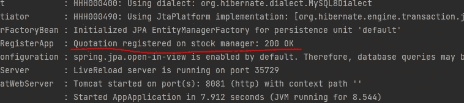

# 用@PostConstruct 怎么样？

> 原文：<https://medium.com/javarevisited/how-about-postconstruct-40fe1297e70d?source=collection_archive---------0----------------------->

在 Spring Boot 和 Java 中使用的有用注释


在某些情况下，您可能希望在程序中自动地实现一个动作一次。这个注释会有所帮助，我将给出两个例子。

我用的是 Spring Boot 2.7.1 和 Java 11。

## @PostConstruct

[Spring](/javarevisited/top-10-free-courses-to-learn-spring-framework-for-java-developers-639db9348d25) 在 bean 属性初始化后只调用一次用`@PostConstruct`标注的方法。列出一些特征很重要:

*   这些方法可以有任何访问级别；
*   这些方法不能[静止](https://javarevisited.blogspot.com/2017/02/5-difference-between-constructor-and-factory-method-in-java.html)；
*   这些方法要么在无事可做时运行，要么初始化。

例如:

```
@Slf4j
@Component
@RequiredArgsConstructor
public class PostConstructRegisterApp {

    private final RestTemplate restTemplate;
    private final AppProperties appProperties;
    private final Environment environment;

    **@PostConstruct**
    public void init() {
        var request = AppRegistrationRequestModel.*builder*()
                .port(Integer.*parseInt*(environment.getProperty("server.port")))
                .host("localhost")
                .build();
        var response = restTemplate.postForEntity(appProperties.getUri() + "/notification", request, Object.class);
        *log*.info("Quotation registered on stock manager: {}", response.getStatusCode());
    }

}
```

在这里，我用这个方法发送了一个请求:

[](https://javarevisited.blogspot.com/2020/05/top-20-spring-boot-interview-questions-answers.html)

但是另一个用例是在[数据库](/javarevisited/5-best-books-to-learn-sql-and-database-design-for-programmers-and-developers-1e7839df2f3e)中创建一些数据，就像一个临时用户:

```
@Component
@RequiredArgsConstructor
public class UserDBInitializer {

    private final UserRepository userRepository;

    @PostConstruct
    private void createTemporaryUser() {
        User admin = new User("admin", "pass");
        User user = new User("user", "pass");
        userRepository.save(admin, user);
    }}
```

该用户可用于首次登录，之后可删除。

[Spring](/javarevisited/10-best-online-courses-to-learn-spring-framework-in-2020-f7f73599c2fd) 也可以处理多个用@PostConstruct 注释的方法，就像这样:

```
@PostConstruct
public void init() {
    *log*.info("1111 tests");
}

@PostConstruct
public void init2() {
    *log*.info("2222 tests");
}
```

结果是:

[](https://www.java67.com/2012/08/spring-interview-questions-answers.html)

今天到此为止。