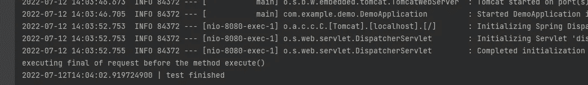
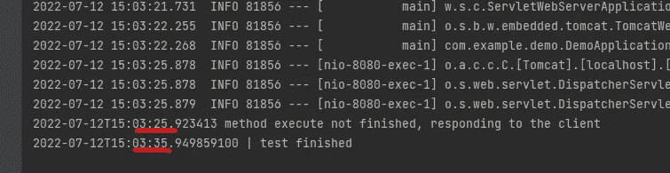
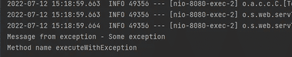

# 用@Async 怎么样？

> 原文：<https://medium.com/javarevisited/how-about-using-async-c0ae1cb7b5fd?source=collection_archive---------0----------------------->

有助于用 Spring Boot 和 Java 构建异步执行的注释

[](https://javarevisited.blogspot.com/2021/12/what-is-springboottest-annotation-in.html)

首先，官方文件就在这里【https://spring.io/guides/gs/async-method/ 

在这个例子中，我使用了 Spring Boot 2.7.1 和 Java 11。

有时我们可以在程序内部做一些动作，而不必等到程序结束。在这种情况下，您可以使用注释@Async。

**当你把@Async 放在一个方法上，这意味着这个方法将在一个单独的线程中执行，调用者不会等待这个叫做**的方法完成。

## 给我看看代码

我们如何实现这一点？

这边走:

```
**@EnableAsync**
@SpringBootApplication
public class DemoApplication {

   public static void main(String[] args) {
      SpringApplication.*run*(DemoApplication.class, args);
   }

}
```

`@EnableAsyn`显示 [Spring](/javarevisited/top-10-free-courses-to-learn-spring-framework-for-java-developers-639db9348d25) 存在一些@Async 注释的方法。如果需要，您可以创建一个配置类。

现在我们可以编写这样的代码:

```
import org.springframework.scheduling.annotation.Async;
import org.springframework.scheduling.annotation.AsyncResult;
import org.springframework.stereotype.Service;

import java.time.LocalDateTime;

@Service
public class ExampleService {

    @Async
    public void execute() {
        try {
            Thread.*sleep*(10000);
            System.*out*.println(LocalDateTime.*now*() + " | test finished");
        } catch (Exception e) {
            e.printStackTrace();
        }
    }

}
```

我们称这个方法为:

```
import org.springframework.web.bind.annotation.GetMapping;
import org.springframework.web.bind.annotation.RestController;

@RestController
public class TestController {

    private final ExampleService exampleService;

    public TestController(ExampleService exampleService) {
        this.exampleService = exampleService;
    }

    @GetMapping("test-async")
    public String test(){
        exampleService.execute();
        System.*out*.println("executing final of request before the method execute()");
        return "ok";
    }

}
```

在[http://localhost:8080/async-test](http://localhost:8080/async-test)上查看 GET 请求的结果

[](https://javarevisited.blogspot.com/2022/02/how-to-fix-autowired-no-qualifying-bean.html)

“在方法执行之前执行最终请求”向我们展示了控制器方法没有等到控制器方法完成。

一个有趣的用例:

*   [在请求期间发送电子邮件](https://www.java67.com/2018/01/4-examples-to-send-email-with.html),无需等待流程终止

## 深入

**异步结果类**

在我的例子中，我创建了一个 void 方法，但是如果你必须处理一些结果，你可以使用 AsyncResult 类并对返回做一些事情。

我将修改这段代码并登录[控制器类](https://javarevisited.blogspot.com/2022/05/how-to-return-json-xml-or-thymeleaf-.html)返回方法 *execute()。*

```
import java.time.LocalDateTime;
import java.util.concurrent.Future;

@Service
public class ExampleService {

    @Async
    public Future<String> execute() {
        try {
            Thread.*sleep*(10000);
            var response = new AsyncResult<String>(LocalDateTime.*now*() + " | test finished");
            System.*out*.println(response.get());
            return response;
        } catch (Exception e) {
            e.printStackTrace();
            return null;
        }
    }

}
```

AsyncResult 实现接口 Future，菱形可以是任何对象。

控制器类别:

```
import org.springframework.web.bind.annotation.GetMapping;
import org.springframework.web.bind.annotation.RestController;

import java.time.LocalDateTime;

@RestController
public class TestController {

    private final ExampleService exampleService;

    public TestController(ExampleService exampleService) {
        this.exampleService = exampleService;
    }

    @GetMapping("test-async")
    public String test(){
        try {
            var response = exampleService.execute();
            if(response.isDone()){
                System.*out*.println("method execute finished");
            } else {
                System.*out*.println(LocalDateTime.*now*() + " method execute not finished");
            }
            return "ok";
        } catch (Exception e) {
            return "nok";
        }
    }

}
```

结果是:

[](https://javarevisited.blogspot.com/2022/05/how-to-validate-incoming-payload-on-spring-.html)

响应是在方法 *execute()* 完成之前发送的。

## 异常处理

首先，我编写了一个实现 AsyncUncaughtExceptionHandler 的类:

```
import org.springframework.aop.interceptor.AsyncUncaughtExceptionHandler;
import java.lang.reflect.Method;

public class AsyncExceptionHandler implements AsyncUncaughtExceptionHandler {

    @Override
    public void handleUncaughtException(Throwable throwable, Method method, Object... obj) {
        System.*out*.println("Message from exception - " + throwable.getMessage());
        System.*out*.println("Method name " + method.getName());
    }

}
```

其次，我创建了一个配置类，并将注释`@EnableAsync`移动到这个类中，如下所示:

```
import org.springframework.aop.interceptor.AsyncUncaughtExceptionHandler;
import org.springframework.context.annotation.Configuration;
import org.springframework.scheduling.annotation.AsyncConfigurer;
import org.springframework.scheduling.annotation.EnableAsync;

@EnableAsync
@Configuration
public class AsyncConfig implements AsyncConfigurer {

    @Override
    public AsyncUncaughtExceptionHandler getAsyncUncaughtExceptionHandler() {
        return new AsyncExceptionHandler();
    }

}
```

注意，这里我注册了 AsyncExceptionHandler。

然后我用一个有目的的例外做了另一个方法:

```
@Async
public void executeWithException() throws Exception{
    Thread.*sleep*(10000);
    throw new Exception("Some exception");
}
```

最后是[控制器](https://javarevisited.blogspot.com/2017/11/difference-between-component-service.html):

```
@GetMapping("test-async2")
public String test2() throws Exception {
    exampleService.executeWithException();
    return "ok";
}
```

结果是:

[](https://www.java67.com/2021/10/3-ways-to-send-different-content-types.html)

代码在这里:[https://github.com/mmarcosab/async-example](https://github.com/mmarcosab/async-example)

[](/javarevisited/21-spring-mvc-rest-interview-questions-answers-for-beginners-and-experienced-developers-21ad3d4c9b82) [## 10 大春季 MVC + REST 面试问题解答适合初学者和有经验的开发者

### 大家好。如果你正在准备 Java 和 Spring 面试或 Spring 认证，并经常寻找一些…

medium.com](/javarevisited/21-spring-mvc-rest-interview-questions-answers-for-beginners-and-experienced-developers-21ad3d4c9b82) [](/javarevisited/13-topics-you-should-prepare-for-your-next-spring-boot-interview-5f2993a04ff5) [## 你应该为 2022 年的下一次 Spring Boot 面试准备的 13 个话题

### 你应该为下一次 Java 和 Spring Boot 面试准备的 13 个基本主题的列表和学习资源…

medium.com](/javarevisited/13-topics-you-should-prepare-for-your-next-spring-boot-interview-5f2993a04ff5) [](/javarevisited/top-10-rest-interview-questions-for-java-and-spring-developers-1611e3b78029) [## Java 和 Spring 开发人员的 10 大 REST 面试问题

### 这些是 Java 和 Spring 开发者快速准备的最好的 REST 面试问题

medium.com](/javarevisited/top-10-rest-interview-questions-for-java-and-spring-developers-1611e3b78029)