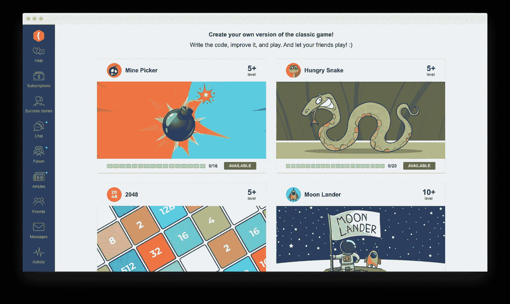
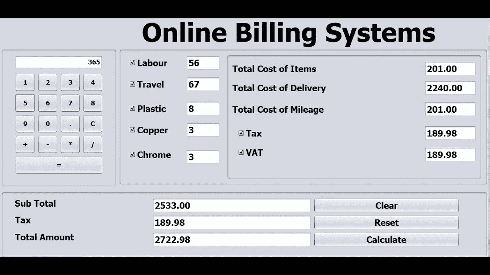
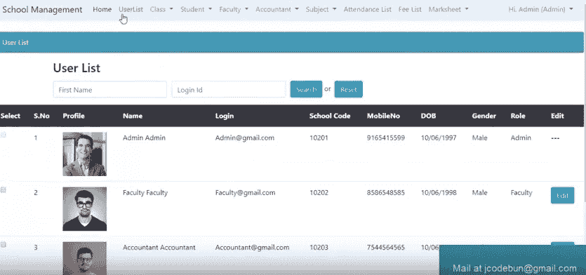

# 初级 Java 开发人员如何提升技能并获得实践经验以申请第一份全职工作？

> 原文：<https://medium.com/javarevisited/how-can-junior-java-developer-upgrade-the-skills-and-gain-practical-experience-to-apply-for-the-39907e6b1ff3?source=collection_archive---------2----------------------->

[Zan](https://unsplash.com/@zanilic?utm_source=unsplash&utm_medium=referral&utm_content=creditCopyText) 在 [Unsplash](https://unsplash.com/s/photos/programmer?utm_source=unsplash&utm_medium=referral&utm_content=creditCopyText) 上的照片

你刚刚毕业或完成一门编程课程，正在寻找一个职位空缺进行申请。然而，看起来没有以前的经验你无法获得工作机会，你陷入了如何成为一名熟练的初级 Java 开发人员并开始职业生涯的思考。

在本帖中，我将分享几个解决动手能力不足的可靠方法。因此，你最终会有一个提高技能的有效方法。让我们看看你能做些什么来获得公司的初级开发人员职位。

# 1.加入独立项目

在掌握[编程语言](/hackernoon/10-best-programming-languages-to-learn-in-2019-e5b05af4a972)的同时获得实践经验的第一步是参与独立项目。我首先推荐为一个开源项目做贡献，然后开始你自己的项目，当它准备好了，在 Github 上分享它。

开始时，避免选择复杂的项目或需要更深刻知识的项目。初级 Java 开发人员需要的一切就是实践。一旦你对自己的技能感到或多或少的自信，是时候接受先进的理念了。你可以通过在简历中列出一些项目来完成大部分项目。这样，你可以向潜在雇主展示你的技能。

尽管大多数职位空缺都以一定年限的经验为特征，但这不是主要要求。招聘经理通常会注意那些对如何使用自己和他人的代码有清晰想法的专家。他们还希望申请人善于使用不同的工具。

以某种方式的硬技能也必须伴随着软技能，如同理心、合作能力和有效的沟通。为了提高你的软技能，要学会和其他程序员一起工作，在项目中应对真正的问题，并要求你遵守真正的期限。

凭借软技能和专业学习与成长的愿望，即使你缺乏特定的技术技能或坚实的理论基础，雇主也会对你感兴趣。

# 2.从事个人项目

当学生开始学习 Java 或任何其他编程语言时，他们通常会被提供构建自己的项目来磨练他们的技能。这些所谓的“宠物”项目表明，未来的程序员正在从事[编程](/javarevisited/top-10-free-interactive-programming-courses-from-educative-for-beginners-to-learn-in-2021-713cbf96d4eb)，并对持续的专业成长感兴趣。除此之外，这些个人项目为专家的简历增色不少。

对于初级 Java 开发人员来说，拥有个人项目通常是他们所期望的，甚至是强制性的。潜在雇主希望他们渴望编码和学习。

所以，在你旅程的开始，我建议尽可能多地写练习项目，这样你就能在[面试](/javarevisited/25-topics-and-resources-to-crack-java-developer-interviews-in-2021-8fbfe317513)时有所展示。考虑一个能为你自己或你认识的人解决现实生活问题的项目。如果它有一些明确的使用案例和/或商业化的想法，它会看起来更好，可能会吸引招聘经理。

这里有一些你可以考虑的项目想法。

*   你自己版本的流行游戏，如扫雷，蛇，2048，井字游戏，甚至超级马里奥兄弟或 Flappy-Bird。你可以尝试使用 [CodeGym 游戏版块](https://codegym.cc/projects/games)来创建前三款游戏的克隆版。该平台包含 15-20 个子任务，构成每个游戏任务。一旦最后一个子任务完成，您的游戏就准备好了，您可以发布它并与其他编码人员共享链接以获得反馈。

*   货币转换器。这个项目将让你[练习 Java](https://javarevisited.blogspot.com/2018/07/top-5-websites-to-learn-coding-in-java.html) 构建一个货币兑换计算器。当转换器准备就绪时，用户将能够输入一种货币，并在选择不同的货币后获得其等价物。

*   计费系统。如果你曾经想过建立一个自动计算账单的系统，这个项目是个不错的选择。在您构建一个之后，一旦用户输入商品、每件商品的价格及其数量，就可以得到账单。

*   学校管理制度。建立 SMS 的想法是将学生与导师联系起来，并允许导师为学院实施资金管理系统。该项目让你有可能掌握 [Java](/javarevisited/10-free-courses-to-learn-java-in-2019-22d1f33a3915?source=collection_home---4------8-----------------------) 和 [OOP 概念](/javarevisited/my-favorite-courses-to-learn-object-oriented-programming-and-design-in-2019-197bab351733?source=---------103------------------)的集合方法。

*   体育管理系统。这个项目将帮助你创建一个系统来安排和处理与体育相关的事件。管理员收集关于事件、运动员和奖品的信息。用户可以访问球员的详细信息并订阅赛事。订阅后，他们将通过电子邮件了解即将举行的体育活动。
*   食谱管理系统。像前面的项目一样，配方管理系统既有用户也有管理员。用户提交他们的食谱进行发布，而管理员决定是否可以将它们添加到系统中。
*   库存管理系统。这是一个帮助企业跟踪库存、产品销售和采购的系统。有了大量内置模块和特性，他们可以对[数据库](/hackernoon/top-5-sql-and-database-courses-to-learn-online-48424533ac61)中的项目进行任何可能的修改。
*   图书馆管理系统。LMS 允许用电子文件建立一个数据库，把所有关于书的信息和借阅记录放在一起。该系统包括多个模块，使图书馆员和学生都可以毫无困难地找到所需的书籍。
*   银行应用。在开发银行程序时，您将通过向用户请求必要的细节来编写相应的操作。您还将学习[扫描器类](http://www.java67.com/2012/11/how-to-read-file-in-java-using-scanner-example.html)、[字符串基础](https://javarevisited.blogspot.com/2013/07/java-string-tutorial-and-examples-beginners-programming.html)、变量、循环和其他概念。

# 3.从事自由职业

事实是初级 Java 开发人员在找全职工作时经常遇到困难。在这种情况下，他们可以从自由职业者网站开始，以获得实际的专业知识，并找到付费项目。

但是，对于自由职业，我还是觉得很暧昧。当 j [unior Java 开发人员](https://javarevisited.blogspot.com/2019/10/the-java-developer-roadmap.html#axzz6N3akNoox)开始独立工作时，在没有监督的情况下，他们更有可能采用糟糕的实践。他们一开始需要的是和一个团队以及一个技术带头人一起做兼职的自由职业者。技术领导通常接受开发人员的任务，审查他们的代码，并给出建设性的反馈。

除此之外，一个好的团队领导会迫使专家们做好计划，在[编码](/javarevisited/7-best-coding-course-to-learn-programming-with-zero-experience-in-2020-52f7d0d9cb80)之前进行研究，进行彻底的测试，并鼓励他们一直学习新的东西。在这个组织良好的工作流程中，写得不好的代码不被允许进入生产，直到它被清理干净。

# 4.选择对等编程

如果你觉得你不能独自完成一个项目，加入一个开发团队。这些专家可能拥有相同的技能和知识水平，也可能拥有更多资格。选择权在你。在团队中工作包括协作和知识交流，这可以让你进步得更快。此外，程序员通常互相支持，这使得团队成员保持积极性。

毫无疑问，团队合作很重要，也很有帮助，但是你仍然应该小心选择你想加入的项目。新手，由于缺乏经验，碰巧彼此分享不好的做法，这可能会损害他们未来的学习。

这就是导师制的发展方向。一个人或一个团队找到一个资深程序员作为他们的导师、监督和指导是很常见的。另一种方法是在社区中分享代码，并寻求反馈。

# 5.只管去做吧！

现在你已经有了文凭或完成的课程认证，以及独立或个人项目和团队合作经验，这是整理你的简历并申请实习生、初级或研究生职位的合适时机。你要做好充分的准备:放上一个做得很好的教育项目，配上 CV，解决一些 leetcode 任务等等。

如果面试中出现问题，不要沮丧——记住那些你很难回答的问题，改正错误，再试一次面试。再试一次，你就会成功。只有那些连试都不试的人才不会成功。

# 包装东西

所以，现在你看到编程都是关于实践的。这意味着你应该定期编写代码，参与尽可能多的项目，以获得招聘人员所要求的实践经验。这些项目可能从团体开源到个人项目都有所不同——选择权在你。

我希望我在这篇文章中提到的所有内容能帮助你解决问题，并选择最适合你的方法。如果你对如何获得实践经验有其他想法，请在评论区分享你的想法。