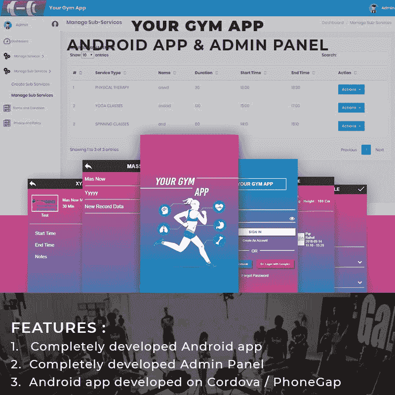
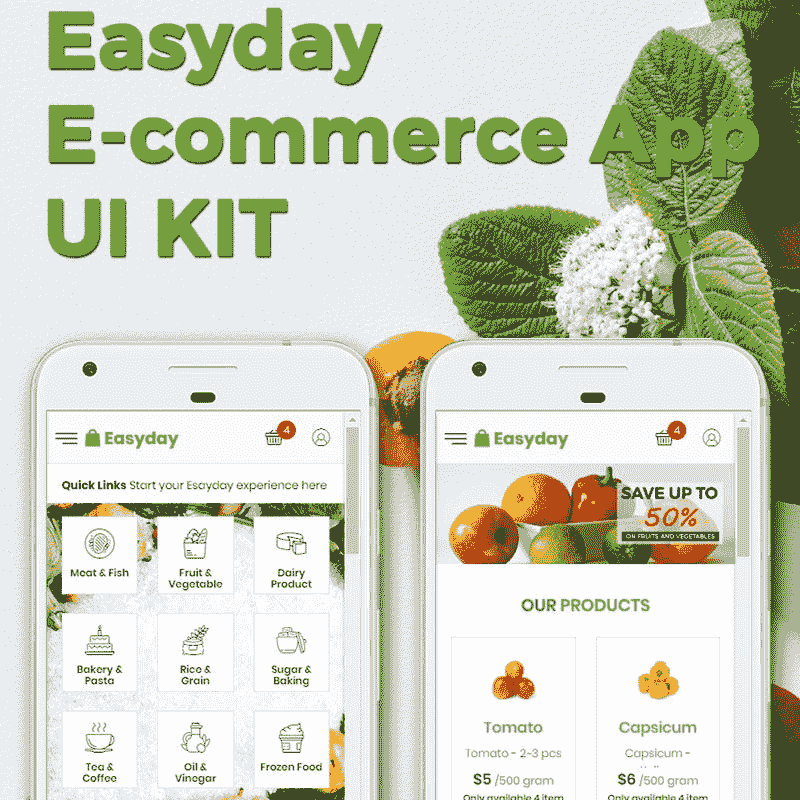
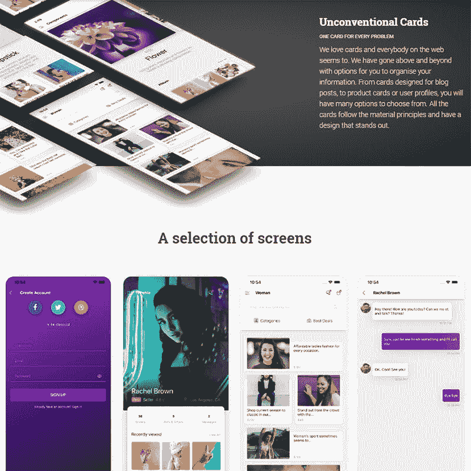
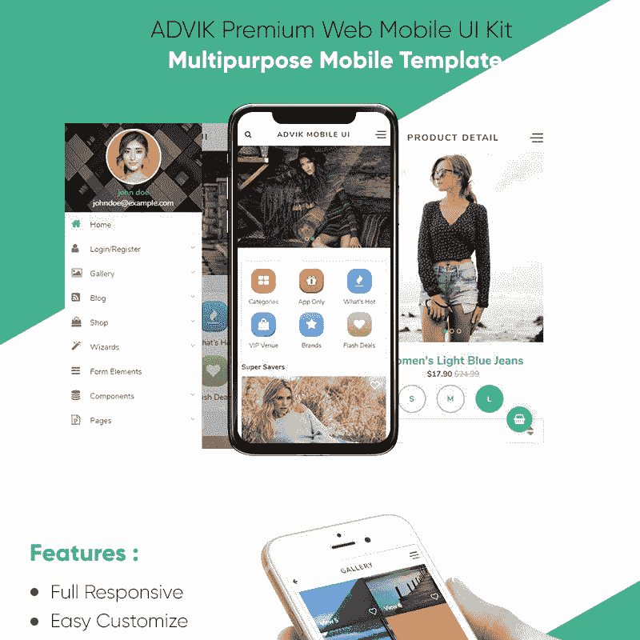
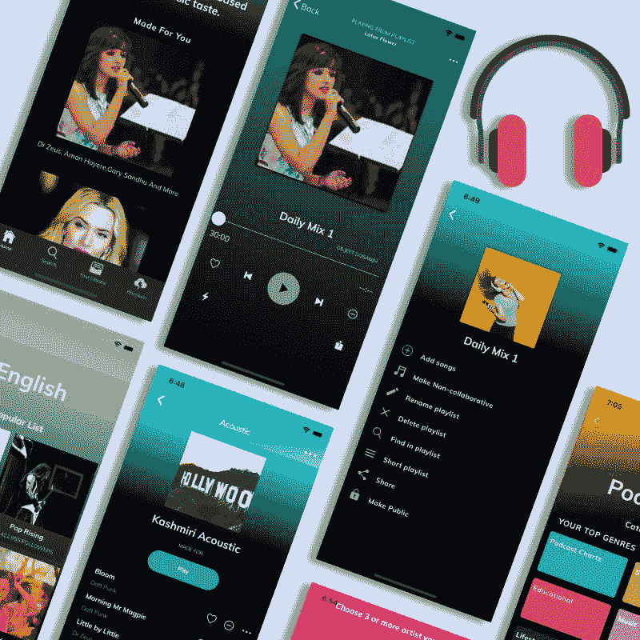
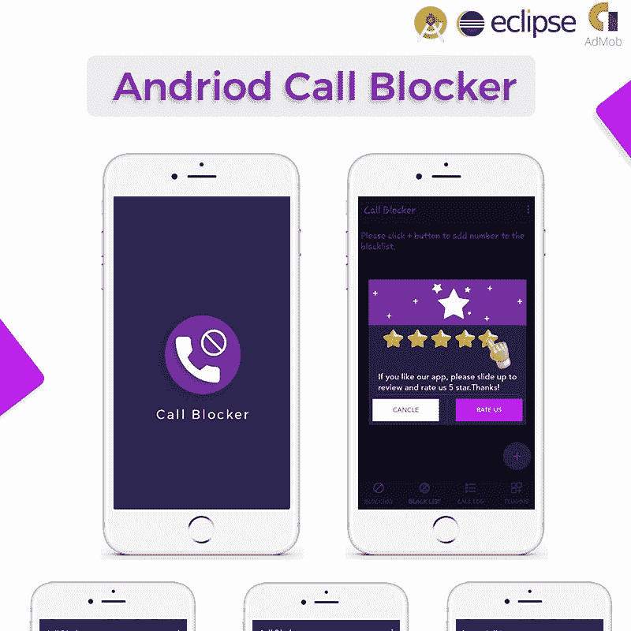

# 移动应用开发者如何从应用模板中获益？

> 原文：<https://medium.com/javarevisited/how-can-mobile-app-developers-benefit-from-app-templates-1b214483bfb8?source=collection_archive---------2----------------------->

如今，移动应用越来越受欢迎。人们出于不同的目的使用它们。他们中的一些人需要一个学习外语的应用程序。其他人更喜欢电子商务应用程序。无论如何，越来越多的公司想到创建移动应用程序。这有助于提高商业利润。这样一来， [**手机 app 开发者**](/javarevisited/10-of-the-most-popular-javascript-frameworks-libraries-for-web-development-in-2019-a2c8cea68094) 就有更多的订单要应付。

从头开始构建任何应用程序都是相当具有挑战性和耗时的。然而，有各种各样的应用程序模板可以使这一过程变得更容易。

# 应用程序模板的优势是什么？

*   这是一个更便宜的选择。app 开发过程非常昂贵已经不是什么秘密了。这可能会花费[高达 10 万美元](https://www.businessofapps.com/insights/how-app-developers-help-startups-and-small-businesses/)。使用应用程序模板，你可以节省 UI 设计和开发的费用。
*   这样的模板有助于加快开发过程。它们包含一个现成的源代码，您可以利用它。
*   他们通常有或多或少的标准代码结构。因此，它需要修复的错误更少。

因此，**应用程序模板**是开始应用程序开发过程的一个很好的选择。让我们来看看一些例子，并分析如何使用它们。

# 为用户提供预约的机会

您是否正在开发一个可以为人们提供这种功能的应用程序？ [**你的健身房 App 模板**](https://www.templatemonster.com/app-templates/your-gym-app-app-template-73376.html?aff=javarevisited&utm_campaign=blog_site_javarevisited&utm_source=app&utm_medium=referral) 是你的绝佳解决方案。这是一个 Android 应用程序，有一个完全开发的管理面板来管理应用程序。除了预约功能，它还提供以下服务:

*   用谷歌和脸书账号登录；
*   多种 UI 颜色可供选择；
*   Android 应用程序的 web APIs
*   创造程序的机会；
*   关于设置和配置的完整指南。

# 使用预先构建的示例屏幕

[**Material Kit PRO React Native**](https://www.creative-tim.com/product/material-kit-pro-react-native)是一款带有材质设计的高级 app 模板。对于电子商务移动应用来说是一个很好的解决方案。它为您提供了启动应用程序开发过程的选择屏幕。你会发现个人资料屏幕，电子商务，聊天屏幕等。选择合适的并做必要的修改。您已经准备好向客户展示原型了。除了屏幕和完全编码的组件，您还会发现其他有用的功能，例如:

*   谷歌字体的美丽排版；
*   全新的谷歌材质设计；
*   博客帖子、产品卡或用户资料的非传统卡片。

此外，您可以只编写一次代码，并享受它被转换为 [**原生 iOS**](/javarevisited/my-favorite-free-courses-to-learn-ios-app-development-f172e7d3ba5d) 和 Android 代码。

# 关注干净的代码

没有必要提及干净编码对于 web 开发的重要性。如果代码是干净的和以读者为中心的，这对开发者和最终用户都有好处。开发者将很容易维护应用程序。客户在使用时不会有任何问题。 [**Easyday 电商 App KIT App 模板**](https://www.templatemonster.com/ui-elements/easyday-e-commerce-app-kit-ui-elements-71442.html?aff=javarevisited&utm_campaign=blog_site_javarevisited&utm_source=app&utm_medium=referral) 包含用干净代码编写的 UI 套件。此外，模板有一个现代和干净的设计。因此，建立数字或其他类型的网上商店是一个很好的选择。

# 利用现成的导航系统

[**Argon React Native**](https://www.creative-tim.com/product/argon-react-native)是一款免费的 React Native app 模板，给你提供了这样一个机会。它的导航系统使用 react-navigation 作为它的主库。它是构建用户界面的最佳选择。因此，将有可能使应用程序对用户友好。除了这一优势，您还会发现以下几点:

*   氩设计系统；
*   开源字体；
*   expo.io 工具链；
*   各种示例屏幕和页面；
*   所有组件的详细文件。

# 向您的应用程序添加高级布局

基本布局，如个人资料或列表，对任何应用程序都非常重要。然而，像 Instagram 或 Tinder 这样的高级布局为应用程序增加了功能。 [**Ionic 4 全 App 模板**](https://www.templatemonster.com/app-templates/ionic-4-full-app-template-84214.html?aff=javarevisited&utm_campaign=blog_site_javarevisited&utm_source=app&utm_medium=referral) 自带多种选项和不同布局。它包含基本和高级布局，供您选择需要的布局。所有的组件都可以立即使用，节省了大量的时间。在这些特性中，您会发现:

*   火基集成；
*   聊天屏幕；
*   漫游滑块；
*   选项卡、段和侧面菜单导航；
*   祝酒词和其他视觉元素。

# 受益于完全编码的组件

想象一下，你有大量的输入、卡片、按钮和其他你不需要从头开始创建的元素。 [**材质套件 React Native**](https://www.creative-tim.com/product/material-kit-react-native) 为您提供 200 多种变化的组件。您可以根据需要修改和组合它们。此外，在全功能代码中使用它们不会有任何问题。此外，您还将获得:

*   示例屏幕；
*   非常规卡；
*   电子商务应用的全编码元素；
*   社区支持。

# 注意具有可扩展设计的模板

可伸缩性是任何成功的 web 应用程序的关键特征之一。[**ADVIK Premium Web Mobile UI Kit App Template**](https://www.templatemonster.com/app-templates/advik-premium-web-mobile-ui-kit-app-template-67114.html?aff=javarevisited&utm_campaign=blog_site_javarevisited&utm_source=app&utm_medium=referral)拥有独特的可扩展设计。除了设计之外，这种多用途移动模板:

*   提供超过 23 页和广泛的组件；
*   很容易根据您的需求进行定制；
*   是完全响应和搜索引擎优化友好；
*   有一个有趣的配色方案，适合各种应用程序；
*   包括吸引人的排版可怕的字体。

# 创建一个出色的音乐流媒体服务

音乐流应用程序在人们中间变得相当流行。 [**Ionic 4 Spotify App 模板**](https://www.templatemonster.com/app-templates/ionic-4-spotify-app-template-83567.html?aff=javarevisited&utm_campaign=blog_site_javarevisited&utm_source=app&utm_medium=referral) 可以让你开发出这样的解决方案。这将帮助您的客户无论身在何处都能欣赏到他们最喜爱的音乐。所有组件都已准备就绪。应用程序模板的主要功能如下。

*   由于采用了 Angular 6 框架，该模板确保了卓越的性能。
*   它包含一个适合不同口味的大型歌曲库。
*   它带有一个高级搜索功能。
*   有 30 多种屏幕可供选择。
*   该模板提供了不同用途的功能页面，如注册页面，播客页面等。

# 考虑使用视频文件的机会

用户非常喜欢让他们观看视频文件的移动应用程序。此外，如果他们可以在社交网络上下载或分享视频，这款应用将会更加成功。 [**WhatsApp 视频状态&带管理面板的视频分享应用模板**](https://www.templatemonster.com/app-templates/whatsapp-video-status-video-sharing-with-admin-panel-app-template-76859.html?aff=javarevisited&utm_campaign=blog_site_javarevisited&utm_source=app&utm_medium=referral) 拥有所有必要的功能，确保为您的客户提供这样的体验。

以下是它附带的主要功能:

*   惊艳的 UI 外观；
*   在应用程序上播放视频；
*   在 WhatsApp 上分享视频；
*   搜索视频状态；
*   用 firebase 推送通知；
*   管理应用程序的设置；
*   PHP 管理面板；
*   Admob 集成。

# 在你的应用中启用阻止功能

有各种各样的原因，人们可能希望阻止不想要的电话，甚至短信或彩信。无论如何，具有该功能的移动应用可能会变得相当有用和流行。如果你想在你的 app 里实现这个功能，没必要多此一举。利用带有 Admob Android Studio 应用程序模板 的 [**呼叫拦截器。它将帮助用户屏蔽无限，以及私人号码。应用程序模板具有以下特性:**](https://www.templatemonster.com/app-templates/call-blocker-with-admob-andriod-studio-app-template-76759.html?aff=javarevisited&utm_campaign=blog_site_javarevisited&utm_source=app&utm_medium=referral)

*   Admob 插播广告；
*   牛逼的用户界面；
*   呼叫阻止日志。

如你所见，**应用模板**拥有*多种有用的特性*，可以在很大程度上简化 [**开发过程**](/javarevisited/how-to-ease-a-work-with-10-free-premium-web-development-resources-bfb20f202ade) 。您可能会发现为这样或那样的目的而设计的不同模板。无论如何，它们都是创建成功的移动应用程序的良好起点。