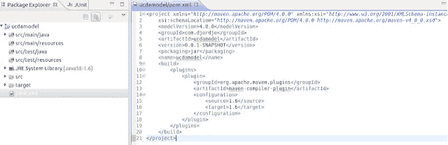
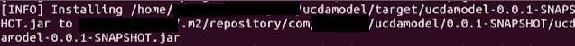

# 如何使用 Maven 将一个项目添加为另一个项目的依赖项？

> 原文：<https://medium.com/javarevisited/how-do-i-add-a-project-as-a-dependency-of-another-project-using-maven-4508283c01d1?source=collection_archive---------0----------------------->

我最近在帮助一个正在学习 Java 编程的人，他说如果可能的话，可以将一个 maven 项目作为一个依赖项添加到另一个 maven 项目中。

我说当然有可能，在这篇文章中我只是展示了一些我在他学生的电脑上做的例子的截图。但在我继续之前，让我给你一点重要的警告:

> 作为一个通用的经验法则，如果依赖关系经常变化，那么将一个项目/应用程序添加为另一个项目/应用程序的依赖关系并不是一个好的设计。例如，我们不应该对领域模型这样做，因为当添加新的特性时，它们经常会改变。如果我们不注意这个建议，我们可能很难在微服务生态系统中进行连续交付，因为我们执行独立发布的能力会被现在的硬连线依赖性削弱。

下面的例子仅仅是为了研究，正如我已经说过的，我不鼓励在频繁变化的库/应用中使用这种技术。所以如果你正在创建微服务，你不应该把它用于域库。我知道我在这一点上坚持了很多，但在我的职业生涯中，我有机会见证，如果不遵循这一建议，特别是在领域中，会导致“*分布式整体结构*”，这很难管理，最终会花费大量资金来维护。如果你的系统已经有这样的东西，建议是执行“[垂直切片](https://www.javacodegeeks.com/2011/11/understanding-vertical-slice.html)”。

不再犹豫，让我们看看如何添加一个依赖项作为另一个项目的依赖项。

请看这张学生电脑的截图:

一个简单的图书馆应用领域模型

这是包含模型的项目，如果我们想确保它可以作为另一个项目的依赖项，我们需要确保它被打包在一个*中。jar* (注意下图中包装标签的内容)。

依赖关系的 pom.xml

当使用 *mvn clean install* 命令构建这个程序时，它将生成一个*。jar* 文件，该文件将存储在本地 maven 存储库中( *~/.m2* )。如果构建过程成功，我们应该会在控制台中看到类似这样的消息(注意消息中说*)。jar* 安装在回购中):

。构建时生成的 jar

现在依赖项已经构建并安装在. m2 repo 中，我们可以在任何项目中声明它，如下所示:

*<依赖>
<groupId>com . UCD</groupId>
<artifactId>ucda</artifactId
<版本>0 . 0 . 1-快照</版本>
</依赖>*

一旦我们构建了我们的项目，我们就会看到*。包含模型的 jar* 在类路径中，我们可以在这个项目中毫无问题地使用它:

项目在其路径中包含依赖项

当然，这只是一个学生的笔记本电脑，但在现实中，持续集成基础设施将建立，包装，增加版本，并推动候选人到您公司的人工制品库。

我希望你发现这是有用的，但是如果你使用微服务，我会再次劝阻你不要使用这种技术，如果你的依赖性经常改变，因为它肯定会影响你的交付时间。