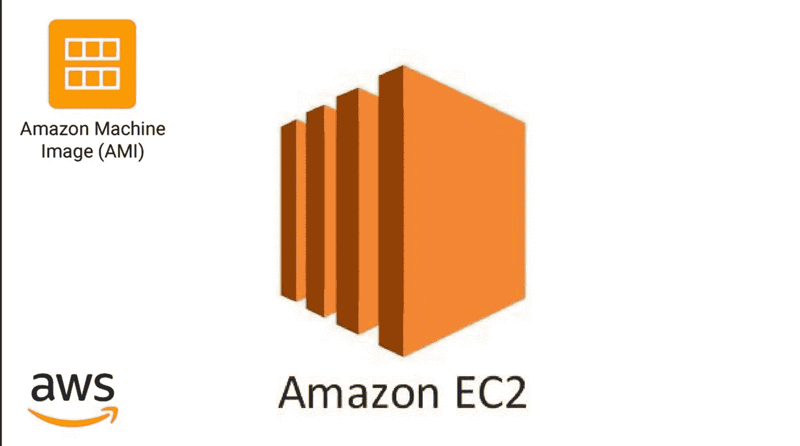

# 我如何在 AWS 中免费使用 MYSQL 部署我的 Java Springboot 应用程序

> 原文：<https://medium.com/javarevisited/how-i-deployed-my-java-springboot-app-with-mysql-in-aws-for-free-ec7a702e69a0?source=collection_archive---------1----------------------->

本教程解释了如何在 AWS 自由层部署 Java Springboot 应用程序

在 Aws ec2 中部署您的应用

之前我们用 Java springboot 创建了一个登录系统，部署在 Digital Ocene 中，也在 Vue.js 中创建了 UI。