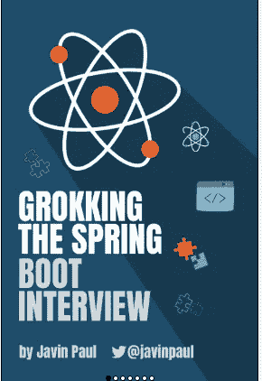

# 作为一名 Java 开发人员，我如何在 3 个月内获得 10 多封 offer 信。

> 原文：<https://medium.com/javarevisited/how-i-got-more-than-10-offer-letters-as-a-java-developer-in-3-months-8d153605ecda?source=collection_archive---------0----------------------->

我将为那些想寻找下一份技术工作的技术人员分享我的准备策略，在 3 个月的时间里，我为一个 [**Java 开发人员角色**](https://javarevisited.blogspot.com/2019/10/the-java-developer-roadmap.html) 做了广泛的准备。它帮我搞定了包括四大公司在内的很多面试。有 0-10 年经验的开发者可以应用这个策略。

***免责声明——本文不是针对 FAANG 公司的，我说的是像跨国公司这样的一般科技公司在印度就业市场的小规模到大规模。***

在这篇文章中，我将详细阐述面试准备以及我的策略，如何最大化你被面试选中的机会。

> 典型的面试形式

1.  **技术回合 1 (L1 回合)**
2.  **技术回合 2 (L2 回合)**
3.  **经理回合**
4.  **HR 回合**

通常情况下，如果你能通过技术轮，你就可以申请聘书，因为经理和人力资源轮主要是讨论。我们只需要准备技术回合

> **技术轮准备步骤**

通常面试会从你的介绍开始，面试官可能会问你关于你一直在做的项目。

第一步。了解你正在做的项目，了解当前的工作。我们应该可以谈论下面的事情。

a.项目功能包括它做什么，它为客户解决什么问题，基本上你应该知道你的项目功能概述。

b.了解您的项目架构和技术堆栈。此外，您可以深入了解端到端的流量。

c.从技术角度谈论项目中使用了什么。比如用哪个前端(angular，react)，用哪个后端(像 Java，Python)，用哪个数据库( [Postgres](/javarevisited/7-best-free-postgresql-courses-for-beginners-to-learn-in-2021-3bf369d73794) ， [DynamoDB](/javarevisited/7-best-aws-s3-and-dynamodb-courses-for-beginners-in-2021-a8a44b6066da) )。

d.这里用的是什么样的 CI-CD 模型，像开发人员大多意识不到的部署部分？

上述与项目相关的东西应该由你彻底研究，这样你就可以在你这边推动面试，这很重要，记住你的答案通常会推动面试。

***第二步。作为一名 Java 开发人员，你应该知道下面的主题，这将增加你被选中的机会。***

1.  **面向对象编程主题包括坚实的原理。(准备遗产拼图)**
2.  **多线程和并发(准备执行器框架和并发 API**
3.  **集合框架(为 HashMap、Concurrent hashmap、HashSet 等每个集合数据结构的内部工作做准备)**
4.  **连载(工作原理)**
5.  **设计模式(准备至少 4-5 种设计模式，如创造、行为和结构模式)**
6.  **垃圾收集**
7.  **Java 泛型**
8.  **Java 8(流和函数式编程-为流上的 Java 8 编码程序做准备)**
9.  **SQL 查询(准备编写关于连接和雇员表的查询，如最高工资和所有数据)**
10.  **编码练习(尽可能多地准备数组和字符串问题)**
11.  **内存管理(了解 Java 8 及以上版本内存管理的变化)**

以上区域是清除面试的必经之地。一般来说， ***候选人是根据他的实际知识被选中的，如果他擅长用 java 编写程序和 SQL 查询，他可以很容易地通过面试。***

> ***准备所用材料***

在面试之前，我会阅读下面的资料

**钻研 Java 面试**

[**搜 Java 面试**](https://gumroad.com/a/669883603/HMOAv) : [点击这里](https://gumroad.com/a/669883603/QqjGH)

我已经亲自买了这些书来加速我的准备。

你可以在这里得到你的样本，检查它的内容，并开始使用它

**搜罗 Java 面试【免费样稿】:** [点击这里](https://gumroad.com/a/669883603/HMOAv)

> 如果你想为 Spring Boot 的面试做准备，你可以阅读这本综合电子书

苦读 Spring Boot 的采访

你可以在这里得到你的副本— [**搜索 Spring Boot 采访:**](https://gumroad.com/a/669883603/hrUXKY)

[**搜罗 Spring Boot 面试**](https://gumroad.com/a/669883603/pfolo) 【免费样稿】:[点击这里](https://gumroad.com/a/669883603/pfolo)

最重要的是，我遵循了一个策略，那就是，保持乐观，尽可能多地接受采访。一开始你可能会被拒绝，但是。我个人的观察是，如果你进行 10 次面试，1-2 次面试通过。尽可能多地接受采访。对我来说也一样。

我一定接受了超过 40-50 次的面试，这帮助我获得了最大的工作机会。

感谢阅读！！保持饥饿！！

[在 Twitter 上关注我](https://twitter.com/ajtheory)