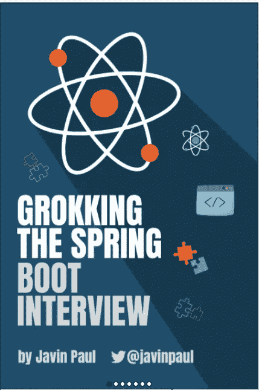

# 我如何通过准备 Java 技术面试来深入学习 Java

> 原文：<https://medium.com/javarevisited/how-i-learned-java-in-depth-by-preparing-for-java-technical-interviews-ac31ece09a8f?source=collection_archive---------0----------------------->

## 这是基于我的个人经验。 **我是如何在准备** [**Java 开发者技术面试**](https://javarevisited.blogspot.com/2015/10/133-java-interview-questions-answers-from-last-5-years.html) **的时候深入学习 Java 的。我会分享我的心得。它帮助我获得了更多的知识，并在更短的时间内使我的工资翻了三倍。因为市场对 Java 专业人员的需求很大。**

我假设我的读者大多是 Java 开发人员或开发人员，他们正在寻求扩展他们的知识库，以便能够在当前或下一个角色中表现出色。

> **我的 Java 面试准备如何帮助我更深入地学习**

在我职业生涯的早期，当我作为一名初级 Java 开发人员开始工作的时候。每当我在做一个任务时，我都会在网上搜索我能找到的每一个编码逻辑。我更像是一个堆栈溢出工程师。

**早期有导师是一件很幸运的事情**。他们可以正确地指导你，而不是花更多的时间去搜索和完成任务。但是在这方面我没那么幸运。

当我开始寻找下一份工作时，我在技术面试中遭到了很多拒绝和羞辱，因为我所学的都是肤浅的。

经过几个月的准备和面对面试，我知道了在技术面试中起决定作用的五件事的价值，那就是，

1.  阅读 Java API 文档有助于理解 JDK 的底层 API。比如它们的内部工作方式，以及当我们在[代码](/javarevisited/10-best-programming-and-coding-books-for-beginners-and-experienced-software-developers-8e47eed3b2e2?source=---------7-----------------------)中使用它们时，它们的时间和空间复杂度。
2.  **阅读 Java 方面的好书像** **Head First Java 和 Effective java** 建立了我的**面向对象编程基础知识** plus 为我的 Java 知识增加了一个基础。我向你保证，这些书肯定会为你的个人资料打下坚实的基础。

*这里是你可以参考的这些书籍的链接——*[*Java 书籍*](https://javarevisited.blogspot.com/2018/07/top-9-java-programming-books-best-must-read.html#axzz7oIJPMLMo)

3.当我们在一个项目中工作时，我们不会注意在编写代码时应该遵循的最佳实践是什么。我们只是专注于完成工作。如果你为非 FAANG 公司工作，我们总是用暴力的方式而不是优化的方式写代码。在一次编码面试中，我总是被问到优化后的代码。

***所以在 leetcode 和 hacker rank 上解决编码难题/问题帮助我写出了更好的代码。***

4. [**设计模式**](/javarevisited/7-best-online-courses-to-learn-object-oriented-design-pattern-in-java-749b6399af59) **和** [**系统设计**](https://faun.pub/top-30-system-design-interview-questions-and-problems-for-programmers-417e89eadd67) 问题被问的最多。当面对面试时，我知道了它们的重要性，我也把它们加入了我的知识库

5.**单元测试的重要性**，有时候面试官会测试你的单元测试知识。因此，我不得不深入学习 Junit 框架**。**

> ****我在准备 java 技术面试时深入了解的话题****

1.  ****核心 Java API** (集合框架，流，Java Lang 包，Java Util 包， [Java Time 包](https://javarevisited.blogspot.com/2015/03/20-examples-of-date-and-time-api-from-Java8.html)，Java IO 包，Java net 包，Java SQL 包)**
2.  ****设计模式**(构建器、工厂、代理、适配器、门面、观察者设计模式)并附有示例。**
3.  ****固体设计原理** s 及其在编码中的实际应用。**
4.  ****阅读 bob 叔叔的 Clean code 和 Clean coder**增加了干净的编码习惯(在那之后我的代码评论中 wtf 更少了:)**
5.  ****Spring 框架、Hibernate 框架、JPA 深度****
6.  ****我了解到的一个单元测试框架**是， **J-UNIT，MOCKITO，POWER MOCK** 。这有助于清除我的管道中的代码覆盖标准。**

**除非我接受了采访，否则我不会深入研究上述主题，这些主题对于开发人员来说非常重要。**

**在从理论和实践的角度学习了所有这些之后，我能够完成更多的技术回合，并且能够在更短的时间内将我的工资提高两倍。另外，**我的下一个角色被认为是一个强大的技术资源**。**

**在我的评估中，我的经理给我的一个评价是。**

## **“Ajay 在技术上非常出色，他能及时提供高质量的代码”。**

**这让我很受鼓舞，你的准备也让你成为了一名优秀的开发人员。我希望这能帮助我的读者朋友们。**

**如果你需要任何关于准备的帮助，你可以关注我的文章**

# **作为一名 Java 开发人员，我是如何在 3 个月内收到 10 多封 offer 信的。**

> *****从我这端推荐一些有所作为的书籍。*****

******

由 [javinpaul](https://medium.com/u/bb36d8439904?source=post_page-----ac31ece09a8f--------------------------------)** 

****:*[***搜罗 Java 面试***](https://gumroad.com/a/669883603/HMOAv)***

******搜罗 Java 面试【免费样稿】:*** [*点击这里*](https://gumroad.com/a/669883603/HMOAv)***

***[***寻访 Spring Boot 采访:***](https://gumroad.com/a/669883603/hrUXKY)***

***[***【Spring Boot 访谈】***](https://gumroad.com/a/669883603/pfolo)**【免费样稿】:* [*点击这里*](https://gumroad.com/a/669883603/pfolo)****

****[***250+弹簧框架练习题***](https://gumroad.com/a/141401299/sygyq)****

****[***在推特上关注我***](https://twitter.com/ajtheory)****