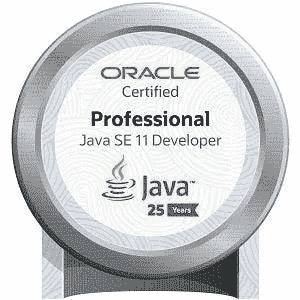

# 我是如何准备 2021 年 OCP Java SE 11 的

> 原文：<https://medium.com/javarevisited/how-i-prepared-for-ocp-java-se-11-2021-4191627709d9?source=collection_archive---------2----------------------->



你好。我叫帕维兹。我想分享一下我获得梦寐以求的 Oracle 认证专家 Java SE 11 头衔的经历。

还因为在 2021 年 4 月 25 日之前的推广期内通过考试获得了限量版徽章！

# 为什么需要认证？

你真的需要它吗？

专业认证的有用性是专业开发人员经常讨论的话题。有些人认为，获得一份体面的工作非常需要一张证书。

其他人说，证书并不发挥重要作用，甚至高等教育文凭可能都不需要——只有技能和工作经验才重要。

获得一个资格证书是组织你的知识和更深入地钻研编程语言(或数据库、云技术等)的好方法。).

# 关于认证之路

以前，要获得 OCP，你必须通过 OCA(甲骨文认证助理)。幸运的是，对于 Java 11，现在你可以通过[1z 0–819—Java SE 11 开发者](https://education.oracle.com/java-se-11-developer/pexam_1Z0-819?ref=hackernoon.com)考试，立即获得 OCP。

此外，问题数量发生了变化；如果以前每次考试有 80 个问题，并且分配了 150 分钟，现在考试时间为 90 分钟，有 50 个问题，涵盖了过去考试的所有主题，及格分数为 68%。

大多数问题都可以有几个正确答案。现在，您可以选择在自己舒适的家中参加考试。在这种情况下，你将在整个考试过程中通过摄像头和麦克风被观察。

房间里应该没有人，你不能和任何人说话，只能看着屏幕，你的互联网连接必须稳定，没有中断。否则，考试取消。我选择了线上选项(考试时收到了两次警告)。

**考试题目复习**

*   使用 Java 数据类型
*   控制程序流程
*   Java 面向对象方法
*   异常处理
*   使用数组和集合
*   使用流和 Lambda 表达式
*   Java 平台模块系统
*   并发
*   Java IO 和 NIO API
*   Java SE 应用程序中的安全编码
*   JDBC 的数据库应用
*   本地化
*   释文

你可以在这里找到更详细的话题列表[。](https://education.oracle.com/java-se-11-developer/pexam_1Z0-819?ref=hackernoon.com)

我想提请你注意这样一个事实，我遇到了很多关于*数据类型、控制流、流、lambdas 和函数接口*的问题。然而，对于其他主题，只有 1-2 个问题。

# 推荐阅读清单

要做好考试题目的准备，就要阅读涵盖题目细微差别的认证书籍。每个人的准备可能需要不同的时间——如果你是一名 java 教师，那么查看主题列表和重复材料需要几天时间。如果不是这样，那么我会分配 1-2 个月的准备时间。

*   [了解 Java 9 模块](https://www.oracle.com/corporate/features/understanding-java-9-modules.html?ref=hackernoon.com)
*   【Java SE 的安全编码指南
*   [OCP 甲骨文认证专家 Java SE 11 程序员 II 学习指南:考试 1z 0–816 和考试 1z 0–817](https://www.wiley.com/en-us/OCP+Oracle+Certified+Professional+Java+SE+11+Programmer+II+Study+Guide%3A+Exam+1Z0+816+and+Exam+1Z0+817-p-9781119617624?ref=hackernoon.com)

# 解答模拟考试

你也应该花很多时间参加模拟考试。我从 [enthuware](https://enthuware.com/java-certification-mock-exams/oracle-certified-professional/ocp-java-11-exam-1z0-819?ref=hackernoon.com) 买了模拟考试。它们有很多有用的功能，包括主题测试、模拟真实考试、笔记等。

# 你可能会遇到什么问题

试着解决这些问题。答案会在最后:

1.  下面的代码会输出什么？

```
outer:
  for ( var i = 0 ; i<3 ; i++ ){
     for ( var j = 0 ; j<2 ; j++ ){
        if ( i == j ){
           continue outer;
        }
        System.out.println( "i=" + i + " , j=" + j );
     }  }
```

2.下面的代码运行时会打印出什么？

```
Deque<Integer> d = new ArrayDeque<>();

d.add(1);
d.add(2);
d.addFirst(3);

System.out.println(d.pollLast());
System.out.println(d.pollLast());
System.out.println(d.pollLast());
```

3.下面的代码片段会打印出什么？

```
Path p1 = Paths.get("photos/goa"); 
Path p2 = Paths.get("/index.html");
Path p3 = p1.relativize(p2);

System.out.println(p3); 
```

4.鉴于:

```
@Target({ElementType.LOCAL_VARIABLE, ElementType.FIELD, ElementType.METHOD}) //1
@Target({ElementType.TYPE})//2
@Retention(RetentionPolicy.RUNTIME)//3
public @interface DebugInfo { //4
   String name() default=""; //5
   String[][] params();//6
   java.util.Date entryTime();//7
}
```

哪一行会导致编译失败？

5.以下哪个接口定义可以使用 Lambda 表达式？

```
//1
interface A{
}

//2
interface A{
   default void m(){};
}

//3
interface A{
   void m(){};
}

//4
interface A{
   default void m1(){};
   void m2();
}

//5
interface A{
   void m1();
   void m2();
}
```

**答案:**

1.  给定代码打印:`*i=1, j=0; i=2, j=0; i=2, j=1*` *。*
2.  它会打印:`*2,1,3*` *。*
3.  它会抛出`*java.lang.IllegalArgumentException*` *。*如果一条路径有根，而另一条没有，那么 relativize 就不能工作，它会抛出一个`IllegalArgumentException`。
4.  `*2,5,6,7*`多行会导致编译失败。
5.  `*4*`

# 摘要

总之，我花了 2-3 周准备考试，并以 70 分的成绩通过了考试。这帮助我组织我的知识，更深入地钻研我的编程语言。那么，为什么我没有像我推荐你的那样准备 1-2 个月呢？因为当时很着急，想得到一枚限量版的 Java 语言徽章 25 周年纪念。

*最初发表于 2021 年 6 月 1 日*[*【https://hackernoon.com】*](https://hackernoon.com/how-i-prepared-for-ocp-java-se-11-2021-uqcx344r)*。*