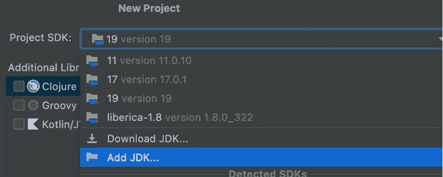
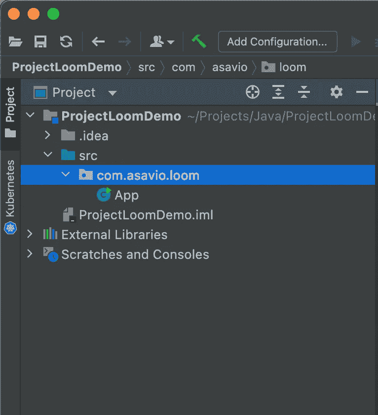
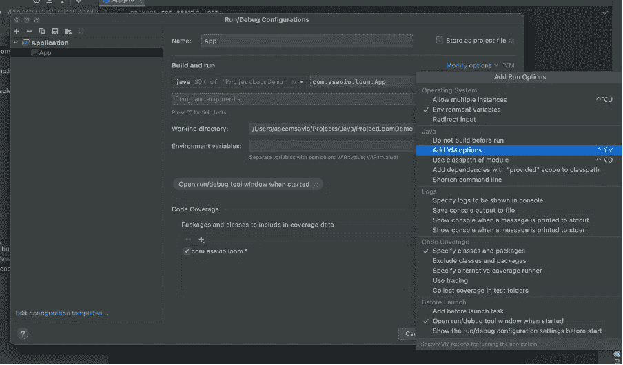
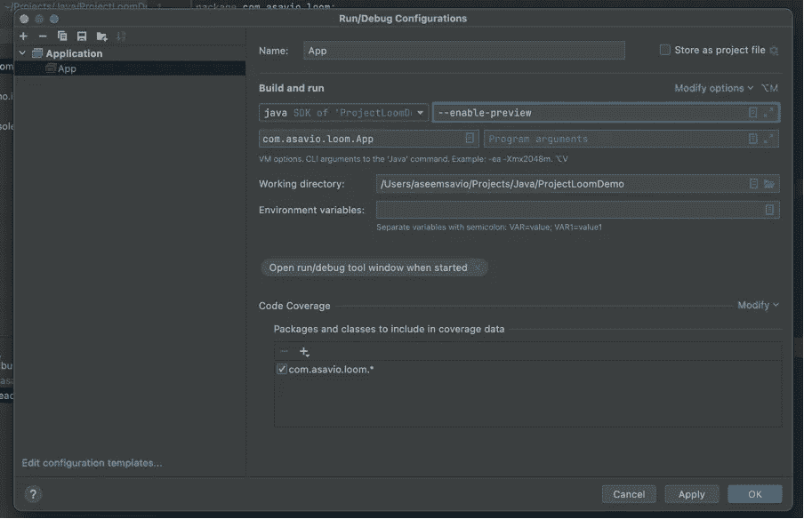
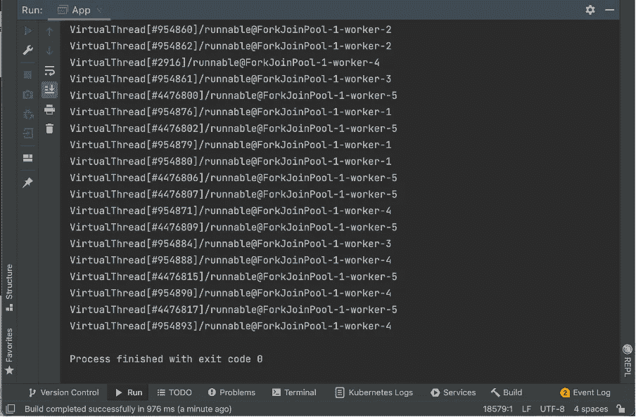
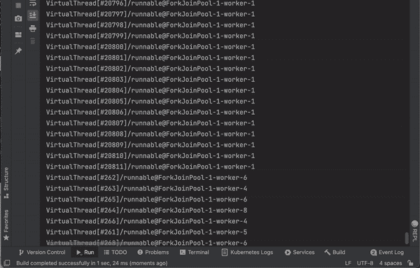

# 我是如何在不停止 JVM 的情况下启动 500 万个虚拟线程的。

> 原文：<https://medium.com/javarevisited/how-i-spun-up-5-million-virtual-threads-without-stalling-the-jvm-1188d806e6bd?source=collection_archive---------0----------------------->

[](https://www.java67.com/2016/08/10-jvm-options-for-java-production-application.html)

你没看错！这篇文章举例说明了我如何在我的 *M1 Macbook Pro* 上启动**500 万个 Java 虚拟线程**，每个线程休眠 *100 毫秒*而不停止 [JVM](/javarevisited/7-best-courses-to-learn-jvm-garbage-collection-and-performance-tuning-for-experienced-java-331705180686) 。项目织机使这成为可能。

我首先从[这里](https://jdk.java.net/19/)下载了 JDK 19 的早期版本(因为截至 2022 年 7 月 17 日该版本尚未发布)。

我更喜欢使用 [Intellij Idea](/javarevisited/7-best-courses-to-learn-intellij-idea-for-beginners-and-experienced-java-programmers-2e9aa9bb0c05) 。我确保我运行的是 Idea 的最新版本。我创建了一个简单的 Java 项目，项目 SDK 设置为 *JDK 19* 。由于这是我第一次使用 JDK 19，我不得不通过按下“`Add JDK`”按钮，然后按下“`Next`”按钮来添加新下载并解压缩的 JDK(已被添加到`/Library/Java/JavaVirtualMachines`目录中)。

[](https://javarevisited.blogspot.com/2018/09/top-5-courses-to-learn-intellij-idea-java-and-android-development.html)

我给这个项目起了一个合适的名字，然后点击了“T3”按钮。

[](https://dev.to/javinpaul/5-best-courses-to-learn-intellij-idea-for-java-developers-5e6n)

我创建了一个项目结构，如下所示。

[](https://www.youtube.com/watch?v=g4rPdPxNb5w)

在`App.java`内部，我借助新的`Thread.startVirtualThread()`函数旋转了**100 万个**虚拟线程(以后会升级到 500 万个)。

```
package com.asavio.loom;

import static java.lang.Thread.*startVirtualThread*;

public class App {

    public static void main(String[] args) {
        *startVirtualThreads*();
    }

    private static void startVirtualThreads() {
        for (int i = 0; i < 1000000; i++) {
            *startVirtualThread*(() -> System.*out*.println(Thread.*currentThread*()));
        }
    }
}
```

当我运行它时，我看到了下面的错误。

```
java: startVirtualThread(java.lang.Runnable) is a preview API and is disabled by default.(use --enable-preview to enable preview APIs)
```

为了解决这个问题，在`Preferences -> Build, Execution, Deployment -> Compiler -> Java Compiler`下，我取消了`Use '--release’`选项，并在`Additional Command Line parameters`文本框中添加了以下内容，点击`Apply`，然后点击`OK`。

```
--enable-preview --source 19
```

[](https://javarevisited.blogspot.com/2011/11/hotspot-jvm-options-java-examples.html)

我进入了`Run/Debug Configurations`菜单，点击了`Modify options`。它揭示了一堆选择。我检查了“T14”下的“T13”

[](https://javarevisited.blogspot.com/2020/05/top-5-courses-to-learn-eclipse-ide-for-java-developers.html)

它添加了一个名为“`VM Options`”的新字段，我在其中添加了以下内容，单击了“`Apply`”和“`OK`”

```
--enable-preview
```

[](https://javarevisited.blogspot.com/2014/07/top-50-java-multithreading-interview-questions-answers.html)

当我重新运行它时，万岁，它旋转了一百万个虚拟线程！

[](https://www.java67.com/2012/08/5-thread-interview-questions-answers-in.html)

为了增加趣味，我让每个虚拟线程休眠 100 毫秒。

```
package com.asavio.loom;

import static java.lang.Thread.*startVirtualThread*;

public class App {

    public static void main(String[] args) {
        *startVirtualThreads*();
    }

    private static void startVirtualThreads() {
        for (int i = 0; i < 1000000; i++) {
            *startVirtualThread*(() -> {
                System.*out*.println(Thread.*currentThread*());
                try {
                    Thread.*sleep*(100);
                } catch (InterruptedException e) {
                    e.printStackTrace();
                }
            });
        }
    }
}
```

以下是我运行它时目睹的情况。



*虚拟线程*在`sleep()`或其他大多数阻塞操作被调用时(例如`Future.get()`)不会阻塞。相反，当它们即将被阻塞时，它们**从正在运行的平台线程上卸载**自己，允许其他虚拟线程将自己安装到平台线程上并运行。当虚拟线程准备好恢复执行时(在这种情况下，当睡眠时间耗尽时)，它们会返回到 JVM 的调度程序。你可以在这里阅读更多关于虚拟线程[的内容。](/javarevisited/is-the-thread-per-request-model-a-good-thing-after-project-loom-6d08012839e8)

默认情况下，虚拟线程是 [**守护线程**](https://javarevisited.blogspot.com/2012/03/what-is-daemon-thread-in-java-and.html) ，这意味着 JVM 不会等待这些线程完成。因此，我收集了线程并`join`它们，让 [JVM](https://www.java67.com/2019/08/best-books-to-learn-java-virtual-machine-in-depth.html) 等待那一百万个线程的完成。找到下面更新的`startVirtualThreads()`功能。

```
package com.asavio.loom;

import java.util.ArrayList;

import static java.lang.Thread.*sleep*;
import static java.lang.Thread.*startVirtualThread*;

public class App {

    public static void main(String[] args) throws InterruptedException {
    System.*out*.println("Main Started");
    *startVirtualThreads*();
    System.*out*.println("Main Ended");
}

    private static void startVirtualThreads() throws InterruptedException {

        var threads = new ArrayList<Thread>(1000000);

        for (int i = 0; i < 1000000; i++) {
            var thread = *startVirtualThread*(() -> {
                System.*out*.println(Thread.*currentThread*());
                try {
                    *sleep*(100);
                } catch (InterruptedException e) {
                    e.printStackTrace();
                }
            });
            threads.add(thread);
        } for (Thread thread : threads) {
            thread.join();
        }
    }

}
```

这将启动并等待创建的所有 100 万个虚拟线程完成。在屏幕上显示“ *Main Ended* ”之前，所有虚拟线程都将完成执行。

我删除了剩余的[打印声明](https://javarevisited.blogspot.com/2022/05/how-to-print-left-triangle-star-pattern.html)，因为它们会分散注意力。我还将线程数增加到了 500 万。

```
private static void startVirtualThreads() throws InterruptedException {

    var threads = new ArrayList<Thread>(5000000);

    for (int i = 0; i < 5000000; i++) {
        var thread = *startVirtualThread*(() -> {
            try {
                *sleep*(100);
            } catch (InterruptedException e) {
                e.printStackTrace();
            }
        });
        threads.add(thread);
    }
    for (Thread thread : threads) {
        thread.join();
    }
}
```

回答是:

```
Main Started
Main EndedProcess finished with exit code 0
```

因此，我能够在我的 M1 机器上运行五百万个虚拟线程。