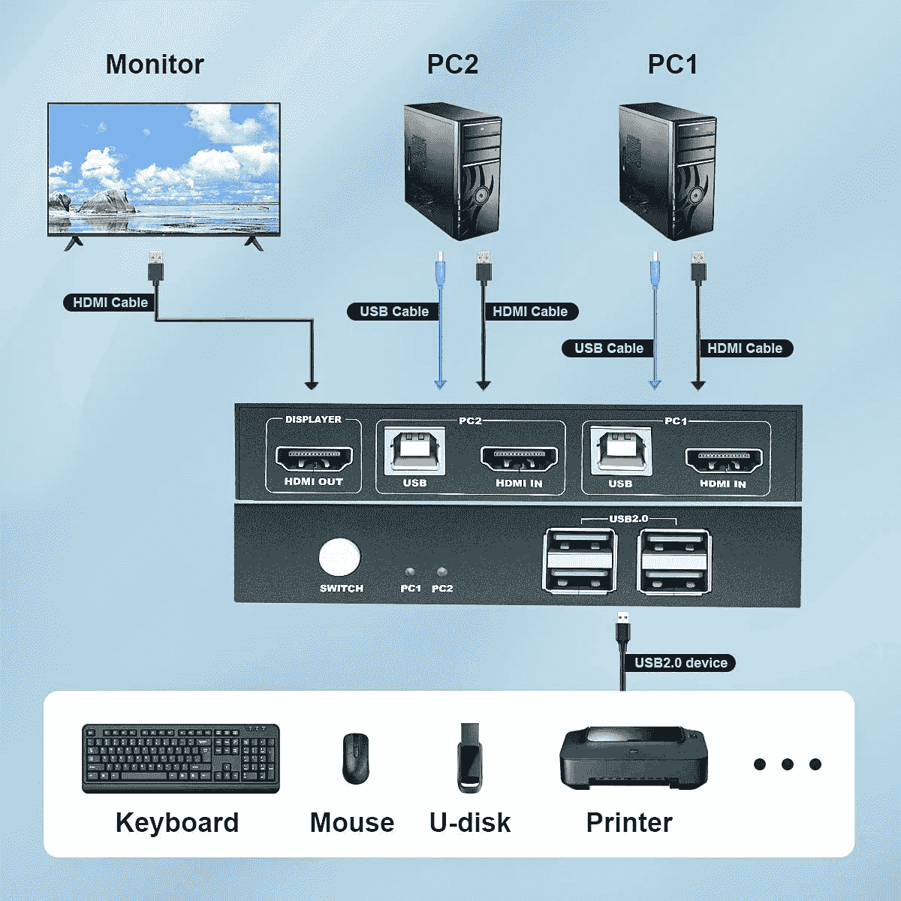
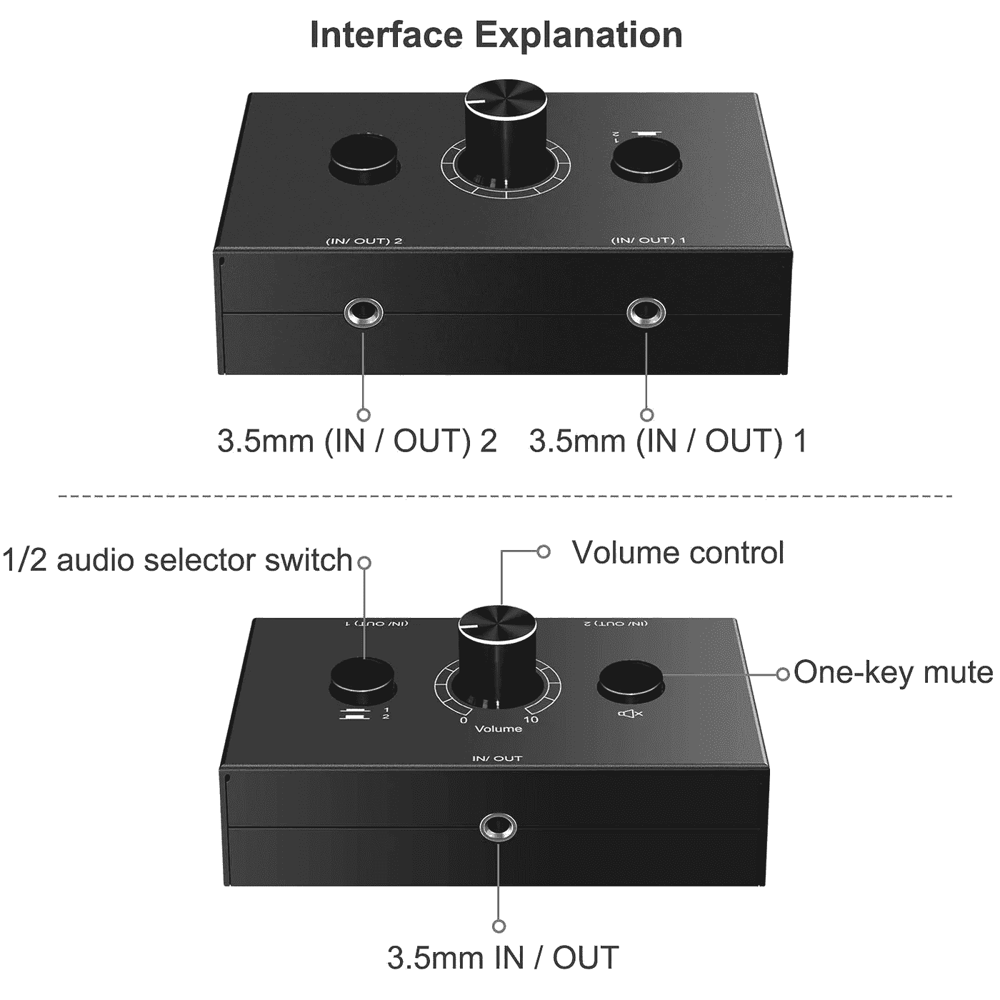

# 我如何在家使用我的游戏设置工作

> 原文：<https://medium.com/javarevisited/how-i-use-my-gaming-setup-to-work-from-home-3afdcfcbd296?source=collection_archive---------1----------------------->

坐在一张可以连续使用几个小时的桌子前是如此美好…光滑的按键，无摩擦的鼠标…甚至还有显示器和它故意的简洁。我喜欢我的家庭游戏设置，虽然我的实际游戏技能还有待提高，但我的桌子却相反。(对我来说)太完美了。

正因为如此，当我听说在可预见的未来，由于新冠肺炎疫情，我们将在家里工作时，我非常兴奋能够使用我的家庭设置来工作。我没想到的是在电脑之间移动会是多么令人沮丧。

每次我需要工作的时候，我都必须把我的 HDMI 电缆、键盘、鼠标和视频摄像头插到我的工作电脑上；每个工作日结束后，我都会经历同样的步骤，这样我就可以玩我的游戏了。每天重复这个仪式两次以上，最终让我开始思考如何让整个过程变得更简单。

在谷歌搜索、论坛搜索和网上购物之后，我终于找到了一个现在对我来说非常好用的系统。只需轻轻一按开关，我就可以在家用电脑和办公电脑之间切换，甚至不需要移动电缆。以下是我为解决自己的问题所做的，希望也能帮到你。

萨姆·帕克在 [Unsplash](https://unsplash.com?utm_source=medium&utm_medium=referral) 上拍摄的照片

# 以下是将您的家庭游戏系统变成一个出色的工作系统所需的主要物品

## KVM 交换机

KVM 切换器的用途是将键盘、显示器和鼠标连接到多台计算机。这个小设备完成了防止你拔掉和重新插上所有设备所需的大部分繁重工作。

要设置它，您首先需要将显示器的 HDMI 电缆、视频摄像头、鼠标和键盘(或您使用的任何其他输入设备)连接到 KVM 切换器的输入插槽。设置好之后，你需要用 HDMI 电缆和 USB-b 电缆将你的工作笔记本电脑和游戏电脑连接到各自的输出插槽。HDMI 电缆用于将电脑的每个显示器连接到您的显示器，而 USB-b 电缆用于为开关本身供电，因此它可以在您需要时执行切换任务。

所有东西都插上后，你应该在显示器上看到你的电脑桌面，你的鼠标和键盘应该在屏幕上工作。要切换到您的另一台计算机，您只需单击 KVM 切换器上的按钮，它就会将您的输入设备从一台计算机切换到另一台计算机，让您轻松地从工作桌面切换到游戏桌面，而无需拔掉任何插头。

来自亚马逊列表的 [GREATHTEK 的 KVM 交换机](https://www.amazon.com/gp/product/B083TKTR24/ref=ppx_yo_dt_b_asin_title_o01_s00?ie=UTF8&psc=1)的产品图片。

有很多 KVM 开关可供选择，但这里有一个[链接指向我在亚马逊](https://www.amazon.com/gp/product/B083TKTR24/ref=ppx_yo_dt_b_asin_title_o01_s00?ie=UTF8&psc=1)上购买的产品，正好符合我的需求。我选择这款设备是因为它的 2 路输出能力和 4k 视频质量；它也有足够的 USB 端口来连接我所有的输入设备。如果您需要在两台以上的计算机或更多的输入端口之间切换，有多种 KVM 交换机可以满足您的需求，只是价格稍贵一些。

这个设备照顾了我们所有的物理输入能力，但是我们的音频呢？对于这个问题，我们需要另一个设备。

## 音频切换器

正如您所期望的，音频切换器的功能与我们的 KVM 切换器完全相同，只是仅适用于您的音频。若要设置此设备，您需要耳机或桌面扬声器的辅助电缆以及另外两条辅助电缆来连接您的工作电脑和家用电脑。

通过将您的耳机插入单辅助端口侧，将您的电脑插入双辅助端口侧，您将能够点击一个按钮，在聆听您的家庭电脑和工作电脑之间切换。我特别选择了[这款设备](https://www.amazon.com/gp/product/B08B4HBGVJ/ref=ppx_yo_dt_b_asin_title_o00_s01?ie=UTF8&psc=1)，因为它便宜，而且能完成我需要的工作。它还有一些额外的功能，如静音按钮和音量控制，这可能证明在未来切换设备时是有益的。

来自 [Diginex 的 3.5 毫米音频切换器](https://www.amazon.com/gp/product/B08B4HBGVJ/ref=ppx_yo_dt_b_asin_title_o00_s01?ie=UTF8&psc=1)的产品图片

请注意，在设置音频切换器时，您可能希望通道 1 与 KVM 切换器上用于通道 1 的设备一致。这样，您可以快速浏览您的交换机，以确保它们使用的是同一台设备。

有了这个解决方案，现在你所要做的就是清除你桌子上的任何杂七杂八的电线，并在一个容易按下的位置设置你的开关。就这样，你摆脱了拔掉插头的疯狂。

在我设置好两个开关后，我上网买了一个非常便宜的壁挂式文件夹，用它来存放我的工作笔记本电脑。现在我的电脑在我桌子下面的地上，我的笔记本电脑挂在旁边的墙上。我还把我的开关安装在桌子的侧面，这样它们既容易够到，又看不见。

有了这个设置，一切都感觉如此干净和易于管理。不再有纠结的电线、混搭的加密狗或令人沮丧的电缆搜索。只需点击一下按钮，我就可以随时切换档位。我希望这能像帮助我一样帮助你。我们都在这个在家工作的地方！让我们确保我们工作得更聪明，而不是更努力。

你对家庭和工作的设置有什么建议吗？请在下面的评论中留下它们。

感谢阅读！

詹娜·帕尔默

## 我的购物清单

如果你想模仿我的设置，这是你可以使用的购物清单。我不是任何这些企业的附属机构，只是一个预算和知道会发生什么的爱好者。

这些开关总共花了我 50 美元；KVM 切换器 30 美元，音频切换器 20 美元。额外的电线和支架又花了 20 美元，但这只是因为我家周围有一些额外的电缆可以使用。

当你寻找自己的开关和电缆时，请记住这个成本。只要该项目完成工作，您就可以:

*   **KVM 开关**——[great tek 的 KVM 开关](https://www.amazon.com/gp/product/B083TKTR24/ref=ppx_yo_dt_b_asin_title_o01_s00?ie=UTF8&psc=1)
*   **USB-B 转 USB-C** — [CableCreation 的 USB 打印机线转 USB-c](https://www.amazon.com/gp/product/B0769DMN7R/ref=ppx_yo_dt_b_asin_title_o01_s00?ie=UTF8&psc=1) (用来通过我工作的 Macbook 给 KVM 切换器供电)
*   **USB-B 转 USB 2.0**—[USB 绿色 USB 2.0 转 USB 打印机电缆](https://www.amazon.com/gp/product/B086ZH1MLV/ref=ppx_od_dt_b_asin_title_s01?ie=UTF8&psc=1)(用于通过我的游戏电脑为 KVM 切换器供电)
*   **HDMI 线缆(x2)** — [AmazonBasic 的 HDMI 线缆](https://www.amazon.com/gp/product/B07S26SMZK/ref=ppx_yo_dt_b_asin_title_o01_s01?ie=UTF8&psc=1)(将工作和游戏笔记本电脑显示器连接到 KVM 切换器)
*   **音频和 KVM 切换器的壁挂支架** — [支架加上商店的流媒体设备支架](https://www.amazon.com/gp/product/B083W2ZTTK/ref=ppx_yo_dt_b_asin_title_o00_s00?ie=UTF8&psc=1)
*   **音频开关**——[Diginex 的 3.5 毫米音频切换器](https://www.amazon.com/gp/product/B08B4HBGVJ/ref=ppx_yo_dt_b_asin_title_o00_s01?ie=UTF8&psc=1)
*   **辅助线缆(x2)** — [OldboyTech 的辅助线缆 3 英尺](https://www.amazon.com/gp/product/B076BFZDG2/ref=ppx_yo_dt_b_asin_title_o00_s01?ie=UTF8&psc=1)(用于连接工作和游戏电脑音频)
*   **辅助电缆分离器** — [绿色耳机分离器](https://www.amazon.com/UGREEN-Splitter-Extension-Earphone-Compatible/dp/B00LM0ZGK6/ref=sr_1_5?dchild=1&keywords=audio+splitter&qid=1606940713&sr=8-5)(用在我的游戏电脑上，因为有一个单独的输入和输出端口)
*   **文件壁挂支架** — [Officemate 牢不可破立式文件夹](https://www.amazon.com/Officemate-Unbreakable-Vertical-Clear-21674/dp/B002VL7YE6/ref=sr_1_28?crid=1U81BAHD8S352&dchild=1&keywords=file+mount+for+wall&qid=1606940600&sprefix=file+mount%2Caps%2C231&sr=8-28)(用来放我的工作用 Macbook，所以它不在我的桌子上)