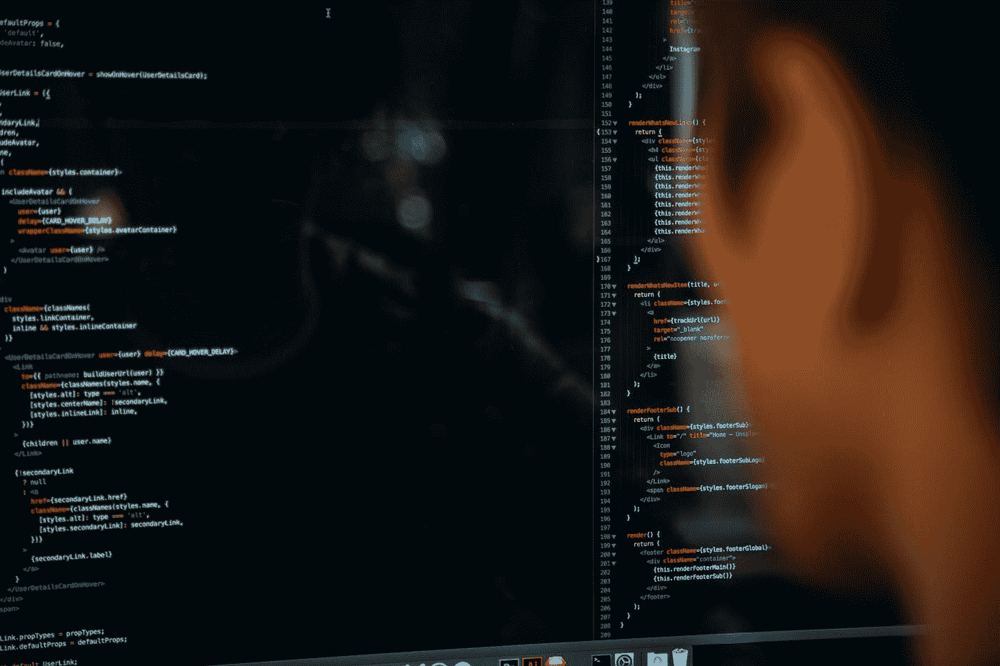

# 在我的“老年时代”，我是如何成为一台编码机器的

> 原文：<https://medium.com/javarevisited/how-ive-become-coding-machine-in-my-older-ages-965e1a9da012?source=collection_archive---------0----------------------->

## 不折不扣地在自己身上努力

查尔斯·德鲁维奥在 [Unsplash](https://unsplash.com?utm_source=medium&utm_medium=referral) 上拍摄的照片

当我 26–27 岁开始编程时，我听说你可以一直编程到 35 岁或最多 40 岁。他们告诉我，在那个年龄，你的大脑并不年轻，不能像年轻的大脑那样快速思考，不能像年轻的大脑那样记忆东西。你开始缓慢地编码，年轻人比你表现得更好。同样，你不能以年轻人的速度学习新事物。

所以[35-40 岁的程序员](/javarevisited/can-you-learn-programming-and-become-a-web-developer-in-the-40s-and-50s-f9e117f32721)的未来是成为某种经理、团队领导之类的。在那里你可以用你的经验为系统决策做贡献，让“孩子”干脏活。

虽然在大多数情况下这可能是真的，但我完全不同意。让我告诉你我的故事。我在五月庆祝了我的 40 岁生日。现在四十多岁了。

我从来没有兴趣用非技术的方式领导别人。停止编码不是我的选择。但是当我年轻的时候，我很放松，更喜欢和朋友出去，而不是花我的空闲时间去学习新的东西。

我是一个普通的开发者。转折点是 3 年前的某个时候，当时我和许多年轻的开发人员一起开发一个新项目。

他们非常有天赋，也非常勤奋，所以即使他们只有几年的经验，他们也很容易比我有更好的表现。

那是决定的时刻。我不想停止编码，但显然，我需要提高自己。我不相信他们更好，因为他们更年轻，他们的大脑工作得更好。

我年轻的时候下过象棋，记得著名的特级大师维克多·科尔奇诺伊(Viktor Korchnoi)，他作为世界级的特级大师玩了 80 年。

因此，有了适当的生活方式，你可以做最具挑战性的思考工作，直到年老。“孩子们”比我强，因为这是一个新项目，他们知道更好的新技术。他们非常敬业，在空闲时间学到了很多东西。他们关注的是 IT 的成功。

我需要变得更好。总的来说，在生活中，我需要一种更严肃的方式来进行编程。首先，我明白我应该是一个努力学习的人。开始不断提升自己。只有在你的空闲时间里，在你的日常工作之前或之后，才能有效地做到这一点。而在周末甚至节假日。

我给自己的目标是每周至少学习 10 个小时的新东西。日常工作也应该以适当的方式完成。

我也有我的家庭生活——小孩和妻子。如你所见，很难找到时间。但是当你专注的时候，你就能找到它。记住，专注于成功是关键！如果你想做大事，你必须集中精力！以下是我为了变得更好而采取的步骤，我也推荐给你。

> 对成功的关注是关键！如果你想做大事，你必须集中精力

# **时间管理**

我需要削减许多不必要的东西。比如我开始少出门了。我不像以前那样看足球和篮球比赛。

在我女儿睡着后，我不是在电视上看电影之类的，而是经常学习。还有，周末开始学。

不是太多，也不是每个周末，但我做了不一致的事情。

# **学习**

算法:我在算法领域解决了很多不同的问题。这是一个被许多程序员低估的领域。他们说这不重要。
然而，如果你申请高科技顶级公司，这是最重要的方面之一。

他们想看你如何做你需要做的事情:编码。他们想知道你是如何思考的，你解决抽象算法问题的能力如何。在这个过程中，你还需要学习一些[基本数据结构](/hackernoon/10-data-structure-algorithms-and-programming-courses-to-crack-any-coding-interview-e1c50b30b927?source=user_profile---------8-----------------------)，如[列表](/javarevisited/top-20-linked-list-coding-problems-from-technical-interviews-90b64d2df093)、[队列](https://javarevisited.blogspot.com/2017/04/difference-between-priorityqueue-and-treeset-in-java.html)、[堆栈](https://www.java67.com/2013/08/ata-structures-in-java-programming-array-linked-list-map-set-stack-queue.html)、[二叉树](/javarevisited/20-binary-tree-algorithms-problems-from-coding-interviews-c5e5a384df30)、图形……

此外，练习算法将提高您的逻辑思维，并帮助您找出现实生活中编程问题的边缘情况。你的大脑保持年轻和敏锐。这就像是你大脑的健身房。

学习资源:Codility 课程,“破解编码面试”这本书，Youtube 资料，HackerRank 课程和问题，Leetcode 问题。你可以看这样的视频:

二叉树解释

我在这方面做了很多工作，尤其是看了不同主题的视频。我没有做练习，也没有举例。或者很少。想要学习和拥有尽可能广泛的即时知识。有许多在线资料——书面的或视频的课程。

Youtube 上也有很多资料。还有很多博客(比如媒体上的)。关于视频课程，我使用 [Udemy](/javarevisited/10-best-udemy-online-courses-for-java-developers-4c9ab70cd01f) 或 [Pluralsight](/javarevisited/pluralsight-or-udemy-d9a94d2e8ee) 。但是更喜欢 Udemy。看视频的时候，我会加快视频的播放速度。

如果对我来说很新鲜，我会用 1.25 的速度。如果它是已知的，但我不是这方面的专家，我用 1.50 的速度。

如果我是这方面的专家，我会用 1.75 甚至 2.00 的速度。但在这些情况下，我也会打开 CC 选项(隐藏字幕——视频的书面版本)。
在选择我所学的课程时，我主要选择畅销书或平均评分最高的课程。但不喜欢太长的课程。

**面向对象设计&系统设计:**对于这些，我主要使用了 Youtube 的资料和 Google 搜索的文字资料。以下是优秀 Youtube 资料的链接:

# 体育运动

我开始在一周内锻炼 2-3 次。做一份固定的工作并且在空闲时间学习是非常累的。你会开始颈部和背部疼痛(尤其是在我这个年龄)。

如果你想长期努力工作，你需要保持良好的状态。它也有助于你身体和大脑的正常运作。每周做 2-3 次运动。

我更喜欢健身房和在跑步机上跑步。在跑步的时候，我还可以看一些电影(有字幕，因为健身房的音乐很响)或者一些足球或篮球比赛——我的健身房在每台跑步机上方都有一台电视。

照片由 [Intenza Fitness](https://unsplash.com/@intenzafitness?utm_source=medium&utm_medium=referral) 在 [Unsplash](https://unsplash.com?utm_source=medium&utm_medium=referral) 上拍摄

# 睡眠充足

我开始尽可能睡足觉。为了身体和大脑的正常运作，你通常需要 7-8 小时的睡眠。总是尽量睡到半夜。

# 吃好

我开始变得更加健康，扔掉快餐或者很少吃快餐。并且，不时地，开始使用不同的补充剂。但这只是健康饮食的一个补充。健康饮食。吃很多鱼。不时补充鱼油、银杏或镁。通过这种方式，你的身体和大脑会为编程工作得到适当的喂养。但是不要在没有间隔的情况下使用这些补充剂(比如说间隔一个月)。

# 结果

经过所有这些步骤，我的技能在短时间内有了巨大的提高。我的表现开始越来越好。六个月后，我换了一份薪水更高的工作。但我一直在用同样的力量努力。我几乎每天都在成长，并在项目中担任关键角色。我觉得我已经为未来几年的大事做好了准备。

# **结论**

编程是一件很难做的事情。如果你想成功，你必须有纪律性、良好的组织性和勤奋。你必须热爱它，对它充满激情。否则，你将无法享受你的工作，也无法达成大的目标。我给了你一堆提升自己的技巧和资源。现在轮到你在编程生涯中实现这一点了。

**祝你好运！要勤快！永不放弃！**