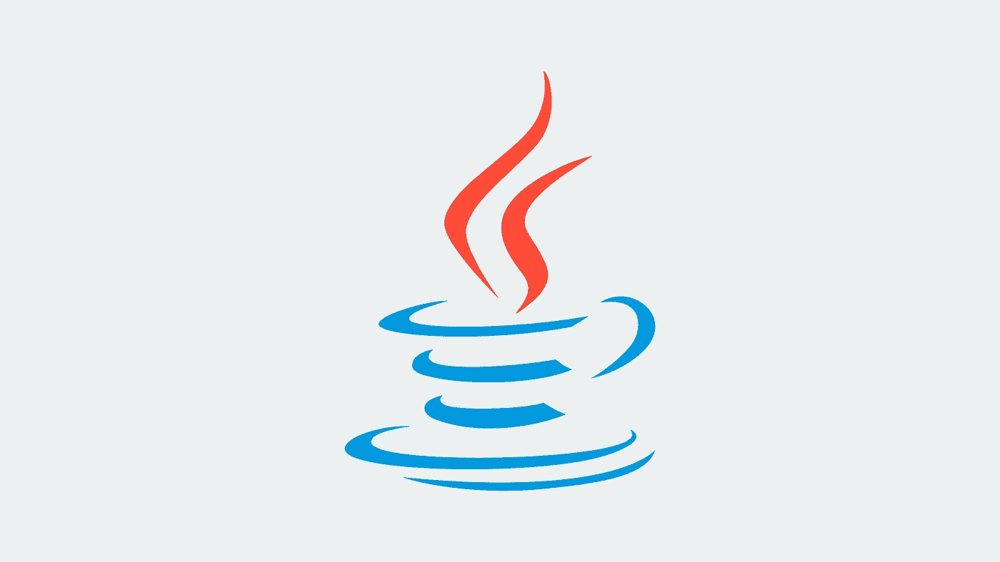
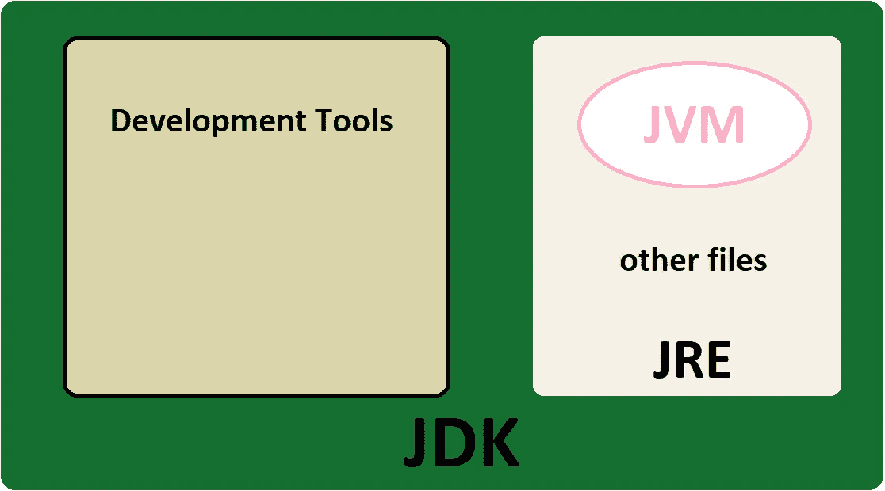

# Java 代码如何编译和运行？

> 原文：<https://medium.com/javarevisited/how-java-code-compiled-and-run-e4702fb83ffa?source=collection_archive---------2----------------------->

关于 Java 编译过程的小故事

读者们好！！如果您是 Java 开发人员，您可能没有注意到 Java 代码是如何编译和运行的，或者由于其复杂性，您可能没有很好地理解整个过程。在本文中，为了更好地理解，我将忽略 JDK 过程的一些复杂性，我将解释 Java 编译和运行过程，并且我还将谈到:

◼关于 JDK、JVM、JRE、JIT 的区别
◼的解释”。 *class"* 文件
验证了类加载器和字节码的◼描述

在我们深入研究编译过程之前，我们必须了解 JDK:

# 什么是 JDK？

JDK，或 **Java 开发工具包**，由我们用来开发和运行 Java 代码的工具组成。在开发和运行 Java 代码之前，您应该将它安装在您计算机或系统中。下图，代表 JDK 的结构:

图片 1。JDK 的结构

如你所见， **JDK** 拥有由 **JRE** 和 **Java 组成的开发工具。
JRE** 或**或 *Java 运行时环境是*** 一个包它提供了一个环境，让**只在你的机器上运行(**不开发)Java 程序(或应用程序)。它只用于运行 Java 程序。

JDT 或 **Java 开发工具**由许多工具组成，如编译器、调试器和其他开发工具。

JDK 和 JRE 最重要的部分是 **JVM** 或 **Java 虚拟机**，它的职责是逐行执行代码。作为翻译也是知道的。接下来，我们将对它有更多的了解。

# JDK 如何编译和运行 Java 代码？

起初，Java 编译器(Javac，即开发工具中的),转换 Java 类(用。java 扩展)转换成字节码。字节码是一个扩展名为*的文件。类别*。
字节码已经在所有操作系统中得到支持(比如 Mac、Windows 和 Linux)。

要运行代码，我们需要 JVM。每个操作系统中的 JVM 是不同的，为了运行 Java，我们需要一个与操作系统兼容的 JVM。
Javac (Java 编译器)通过*。类*文件到 JVM。然后，在 JVM 中，执行三个阶段:

◼类加载器
◼字节码验证
◼ Java 实时编译器

**类加载器**，是一个接受字节码的对象(带有。类扩展)并上传 java 类(不要混淆！！这里，类是指面向对象的类)在堆内存中。

类加载器运行 3 个过程:加载、链接和初始化。加载时，字节码保存在方法区，类加载到内存中。
在链接过程中，类和接口组合成 JVM 的运行时状态，所以它是可执行的。
在初始化过程中，执行上一节中的链接类。

为了更好地说明类加载器的过程，首先它在堆内存中寻找类对象。如果可用，则返回它。但是如果在堆中没有找到，它就寻找*。*类文件。反之，如果*。未找到类*文件，返回异常，否则在堆内存中创建类对象。

然后，通过**字节码验证来检查类加载器。**在此过程中，检查 class loader 的问题和危险**。**例如，如果在程序中，我们使用了一个没有声明的变量，或者如果运行时堆栈溢出，就会抛出异常，编译过程就会停止。

如果我们的代码没有任何问题，**实时(JIT)** 编译器会将其转换为**本机代码**。编译过程完成了！！

> **机器码**是一种低级编程语言，由**机器语言**指令组成，用于控制计算机的中央处理器(CPU)。每条指令都使 CPU 执行一个非常具体的任务，比如加载、存储、跳转或者对 CPU 寄存器或内存中的一个或多个数据单元进行算术逻辑单元(ALU)操作*。*

节点:正如我在文章开头所说的，这些步骤并没有经过运行程序的所有 JDK 步骤。为了更好地理解，我们忽略了一些步骤。编译 Java 代码比这更复杂。这篇文章简要介绍了 JDK 的编译过程。要了解更多，请阅读提到的资源。

资源:

🔹[Java 程序的编译和执行](https://www.geeksforgeeks.org/compilation-execution-java-program/)
🔹[类加载器:Oracle](https://docs.oracle.com/javase/7/docs/api/java/lang/ClassLoader.html)🔹Java 中类装入器的作用是什么？
🔹[机器码:维基百科](https://en.wikipedia.org/wiki/Machine_code)🔹 [JVM 101:简介，类加载器子系统& JIT 编译器(第一部分)](/javarevisited/jvm-101-introduction-classloader-sub-system-jit-compiler-part-1-9e5a6782fa3e)