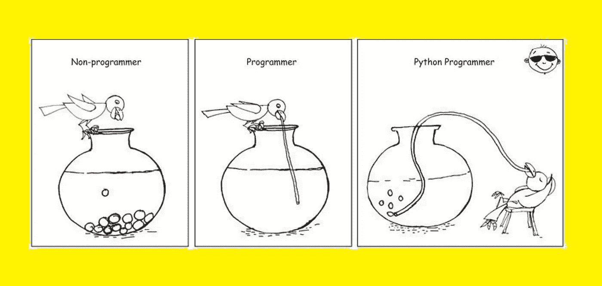
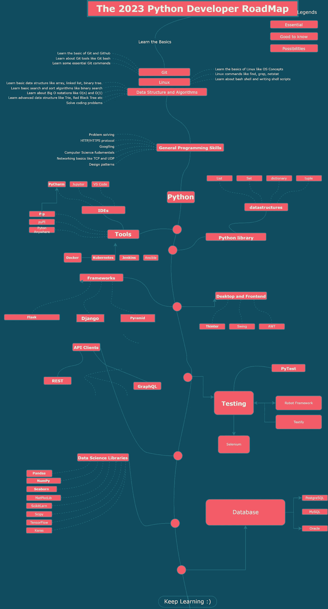
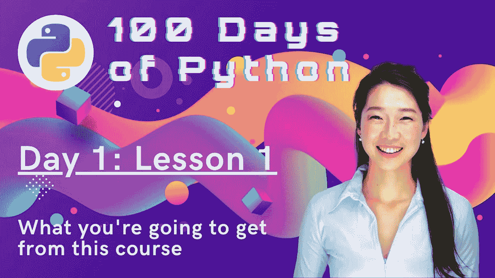
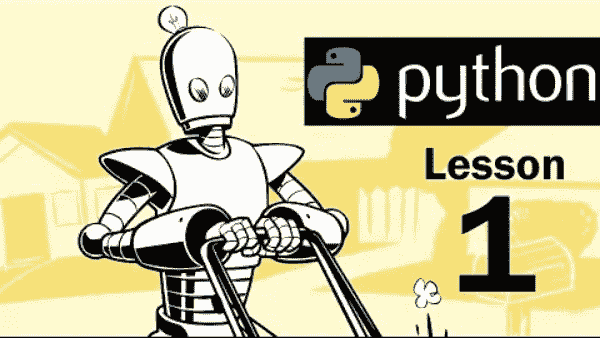
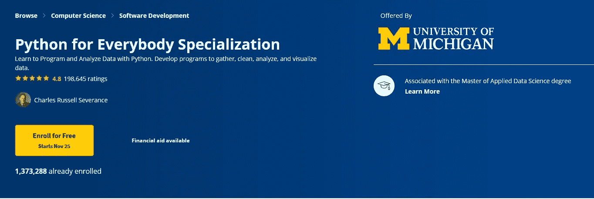
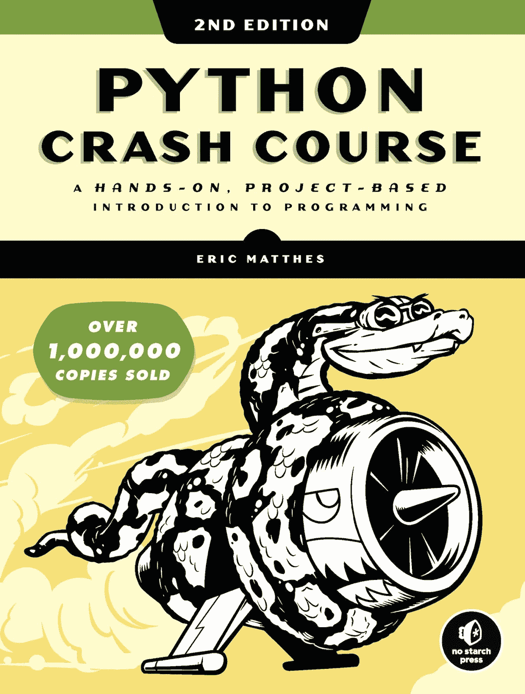

# 学习 Python 编程语言需要多长时间？(带资源)

> 原文：<https://medium.com/javarevisited/how-long-does-it-take-to-learn-python-programming-language-with-resources-2654f5821b59?source=collection_archive---------1----------------------->

## 想知道学习 Python 成为 Python 开发者需要多长时间？这里是你的一步一步的指南，用资源在 100 天内成为 Python 大师

大家好，如果你想知道学习 Python 并成为一名 Python 开发者需要多长时间，或者想知道从哪里开始学习 Python，那么你来对地方了。

早些时候，我已经分享了 [**Python 开发者路线图**](https://javarevisited.blogspot.com/2022/05/the-python-developer-roadmap.html) ，在这篇文章中，我将告诉你如何学习 Python，以及成为一名工作就绪的 Python 开发者需要多长时间。根据你的目标和经验水平，学习和掌握 [Python 编程语言](https://javarevisited.blogspot.com/2018/12/10-free-python-courses-for-programmers.html)可能需要一周到几个月的时间。

例如，如果你来自 Java 背景，想学习 Python 作为你的第二编程语言，在你的开发环境中设置 Python 并编写 hello world 可能需要一两天的时间。

如果你使用像 [Educative](https://www.educative.io/courses/python-101-interactively-learn-how-to-program-with-python-3?affiliate_id=5073518643380224) 、 [CodeCademy](https://bit.ly/learnpython3codecademy) 和 freeCodeCamp 这样的交互式编码平台，你甚至可以在几分钟内开始编写简单的 Python 程序。

与此同时，如果你是零编程经验，这将需要稍长的时间，因为你需要学习编程基础知识，如什么是变量，什么是程序，类，对象，循环，函数等。

但是你不需要担心；在这篇文章中，我将向您详细介绍学习 python 一般需要多长时间，并且将分享最好的资源，如快速学习 Python 的 [**最佳 Python 课程**](https://becominghuman.ai/7-best-python-online-courses-for-beginners-to-learn-programming-abe12cecb1ad)[书籍](/javarevisited/my-favorite-books-to-learn-python-in-depth-77465633b46e)和[项目](/javarevisited/8-projects-you-can-buil-to-learn-python-in-2020-251dd5350d56)。

Python 因其简单易学而得到开发者和公司的认可，并且将成为开始计算机编程之旅的绝佳选择，因为你可以用这种语言开发出奇妙的程序和产品。本文将向您展示学习 python 需要多长时间？你能用这种语言做什么？

还有学习 python 的[最佳课程](/javarevisited/7-best-python-online-courses-for-beginners-to-learn-programming-abe12cecb1ad)像[**100 天代码:Udemy 上的 2023**](https://click.linksynergy.com/deeplink?id=JVFxdTr9V80&mid=39197&murl=https%3A%2F%2Fwww.udemy.com%2Fcourse%2F100-days-of-code%2F) 完整 Python Pro Bootcamp 作者 Angela Yu。如果你刚开始学习 python，这是学习 python 最好最快的方法，但是如果你想成为一名真正的 Python 大师，你将需要不止一门课程，请参见下面的推荐列表。

 [## 2023 年学习 Python 的 10 大课程

### Udemy、Coursera 和 Pluaralsight 上面向初学者和中级程序员的 10 个最佳 Python 课程

better 编程. pub](https://betterprogramming.pub/top-5-courses-to-learn-python-in-2018-best-of-lot-26644a99e7ec) 

# 2023 年从零开始学 Python 需要多久？

如果你对自己创建的语言感到困惑，Python 是最容易学习的编程语言之一。它在 web 应用程序、机器学习、数据科学等领域有着广泛的用途。

因为 python 很容易学，**学习**一般需要几个月，这取决于你学习这种语言的时间，可能**在三到六个月**之间，但是掌握它需要更多甚至几年。

例如，如果你必须学习这个 [*Python 开发者路线图*](/javarevisited/the-2022-python-programmer-roadmap-bafb365071a3) 中的所有内容，那么甚至需要更少的时间，但谢天谢地，你不需要学习这个路线图中的所有内容来成为一名 Python 开发者，只需学习 Python 和必要的软件开发工具，如 [Git](https://javinpaul.medium.com/top-10-free-courses-to-learn-git-and-github-best-of-lot-967aa314ea) 和技能，如[调试](https://javarevisited.blogspot.com/2022/09/java-debugging-interview-questions.html)就足以在 2023 年获得一份 Python 程序员的工作。

# 2023 年如何学习 Python？是不是网上的课程和书籍就足够成为 Python 开发者了？

根据我自己 20 年的编程、学习和教授不同编程语言的经验，学习 Python 或任何编程语言的最好方法是边做边学。这意味着你应该每天开始编码和编码。

显然，这说起来容易做起来难，因为一旦你开始编码，你甚至会挣扎着写第一行代码，你会被毫无意义的错误信息淹没，即使你漏掉了一个分号。这就是为什么学习 Python 编程也需要指导的原因。

虽然 2023 年最好的指导形式来自面对面的互动，但你可以做很多事情；例如，你可以在 Udemy 上加入一个在线 Python 训练营课程，如 [**100 天代码:2023 年**](https://click.linksynergy.com/deeplink?id=JVFxdTr9V80&mid=39197&murl=https%3A%2F%2Fwww.udemy.com%2Fcourse%2F100-days-of-code%2F) 完整的 Python Pro 训练营，然后跟随讲师编写代码并学习 Python。

一旦你获得了信心，你可以阅读 Python 编程的书籍来更深入地学习 Python，因为书籍通常比任何在线课程都更深入地涵盖了这个主题，但同时，它们也不是最容易开始的。

所以，你应该先从网上课程开始，然后再去读一本书。如果你需要推荐， [*用 Python 自动化枯燥的东西*](https://www.amazon.com/Automate-Boring-Stuff-Python-Programming/dp/1593275994?tag=javamysqlanta-20) 是我最喜欢读的 Python 书籍之一，特别是如果你喜欢通过做方法来学习的话。

同时，你也可以建立一个成熟的项目；根据你的目标，它可能与自动化、构建 web 应用程序或创建机器学习模型有关，我们将在下一节中看到。

他们甚至在 Udemy 上有一门同名的课程 [***用 Python***](https://click.linksynergy.com/deeplink?id=JVFxdTr9V80&mid=39197&murl=https%3A%2F%2Fwww.udemy.com%2Fautomate%2F) 自动化枯燥的东西，你可以和这本书一起加入。

# 2023 年如何成为 Python 开发者？

这也取决于你的目标；如果你想 [*学习 python*](/javarevisited/18-coursera-courses-you-can-join-in-2020-to-learn-from-the-worlds-top-tech-companies-google-74af46967d1e) 来制作一个简单的桌面应用程序，那么你不需要像开发机器学习模型的人或想获得数据科学家工作的人那样多的时间。

让我们来看一些你需要知道的因素，如果你打算估计你需要花在学习这门语言上的时间:

**2.1。以往经验:**如果你学过一些编程语言，例如 [C/C++](https://becominghuman.ai/10-best-c-courses-for-beginners-and-experienced-developers-fd2401c07f50) 或 [Java](https://www.java67.com/2022/02/top-5-courses-to-learn-java-online-for.html) ，并且知道机器逻辑，你就不会觉得这种语言很难学，因为它比其他语言容易。

**2.2。你的目标:**如果你想创建一个简单的程序，比方说为了自动化任务，那么与机器学习模型相比，你不需要在学习上花那么多时间，你需要在 [python](/javarevisited/10-free-python-tutorials-and-courses-from-google-microsoft-and-coursera-for-beginners-96b9ad20b4e6) 上做到近乎专业。

**2.3。时间:**如果你规定每天 2 小时学习这门语言，那么相比之下可能需要四个多月才能达到中级水平，多花几个小时时间就会少一些。

 [## Python for Everybody 课程回顾 2022—真的有那么好吗？

### 我对 Coursera 的最佳 Python 认证的评论，来自密歇根大学的 Python for Everybody。如果你想…

medium.com](/javarevisited/python-for-everybody-course-review-is-it-really-that-good-bf84af24e28) 

# 2023 年你能用 Python 做什么？

正如我前面提到的，Python 几乎可以做你想做的任何事情，因为它是开源的，社区总是为这种精彩的语言做出贡献。所以我会说 python 中的一些著名行业在其中扮演了重要角色:

**3.1。数据可视化:**你可以使用 python 库，比如 matplotlib、plotly、dash 等等，制作漂亮的图形和图表。

**3.2。机器学习:**你可以基于之前的数据进行预测，比如房屋定价或者使用库对图像进行分类，比如 [scikit-learn](https://javarevisited.blogspot.com/2021/10/top-5-courses-to-learn-scikit-learn.html) 、 [NumPy](/javarevisited/6-best-online-courses-to-learn-numpy-for-beginners-60120f611e06) 和 scipy。

**3.3。Web 开发:**你可以使用 python 语言，使用 [Django](https://javarevisited.blogspot.com/2020/07/top-5-courses-to-learn-django-in-2020.html) 和 [Flask](/javarevisited/5-best-python-flask-courses-for-beginners-2f262f8e23da) 框架来开发 web 应用的后端。

**3.4。数据科学:** python 在数据科学行业扮演着重要的角色，因为它被用于[数据可视化](/javarevisited/8-best-data-visualization-tools-and-libraries-data-analysts-and-scientists-can-learn-d2734371df16)，处理数据，做出预测，收集数据，等等。

 [## 2022 年数据科学、数据分析和数据可视化十大 Coursera 认证…

### 你好，伙计们，如果你渴望在数据科学、数据分析和数据可视化领域开始你的职业生涯…

javarevisited.blogspot.com](https://javarevisited.blogspot.com/2020/08/top-10-coursera-certifications-to-learn-Data-Science-Visualization-and-Data-Analysis.html) 

# 5.2023 年成为 Python 大师的最佳 Python 书籍和课程

现在，您已经了解了 python 语言的能力，它可以用于每个行业，并且很容易学习。你可能想开始学习这门语言，却对寻找优质课程感到困惑。好吧，以下是开始这一旅程的一些最佳课程:

**4.1。** [**Python 为大家准备的**](https://coursera.pxf.io/c/3294490/1164545/14726?u=https%3A%2F%2Fwww.coursera.org%2Fspecializations%2Fpython)

这是由密歇根大学开发的 python 专门化，将帮助你从初学者学习这门语言，直到中级。在学习 python 的基础知识之前，您将开始学习技术基础和互联网历史，例如数据类型、变量、for & while 循环、存储多个值。然后，您将学习使用 python 访问 web，与数据库交互，等等。

顺便说一下，当谈到参加这个课程时，你有两个选择，你可以单独参加这个课程，每个月花费大约 39 美元进行专业化，你也可以参加 [**Coursera Plus**](https://coursera.pxf.io/c/3294490/1164545/14726?u=https%3A%2F%2Fwww.coursera.org%2Fcourseraplus) 每个月花费 59 美元，这是 Coursera 的一个订阅计划，它可以让你无限制地访问他们最受欢迎的课程、专业化、专业证书和指导项目。

**他们现在也在提供 100 美元的优惠，但是只限于这个** [**特殊链接**](https://coursera.pxf.io/c/3294490/1164545/14726?u=https%3A%2F%2Fwww.coursera.org%2Fcourseraplus%2Fspecial%2Fcoursera-annual-cyber-2022) **只对黑色星期五有效。**

 [## Coursera Plus |无限制访问 7，000 多门在线课程

### 获得 7，000 多门世界一流的课程、实践项目和就业准备证书计划的无限访问权-从领先的…

coursera.pxf.io](https://coursera.pxf.io/c/3294490/1164545/14726?u=https%3A%2F%2Fwww.coursera.org%2Fcourseraplus%2Fspecial%2Fcoursera-annual-cyber-2022) 

**4.2。** [**100 天代码:2023 年**](https://click.linksynergy.com/deeplink?id=JVFxdTr9V80&mid=39197&murl=https%3A%2F%2Fwww.udemy.com%2Fcourse%2F100-days-of-code%2F) 完成 Python Pro Bootcamp

这是帮助你从初级到中级水平学习 python 的另一个很好的课程。在这 29 小时的视频内容中，您将学习这门语言的基础知识，例如数据类型、循环、比较运算符、方法和函数以及错误处理。

稍后，您将从理解类&面向对象编程和开发一些简单的 python 程序的中级水平开始。

**4.3。** [**Python 速成班**](https://www.amazon.com/Python-Crash-Course-Eric-Matthes-ebook-dp-B07J4521M3/dp/B07J4521M3?tag=javamysqlanta-20)

如果你有一些钱来投资自己，或者也许你不是从视频中学习的大粉丝，那么我推荐阅读这本书，从“Hello World”程序的初学者开始，直到你将掌握面向对象编程、类、继承和构建程序、数据可视化、2D 游戏等等。\

## 结论

就这些了**2023 年学 Python 要多久？有了 Java 或 Ruby 等其他编程语言的一些经验，学习 Python 并不难。我几周前才开始用 Python 编程，一点也不难。**

说到缩进，Python 和 [Haskell](https://javarevisited.blogspot.com/2021/12/top-5-courses-to-learn-haskell-for.html) 有很多相似之处。所以对这些语言的一些经验肯定会有帮助。

对于其他人来说，如果你是从零开始学习 Python，可能需要几周到几个月的时间，因为你需要学习 Python 和[编程](/javarevisited/7-best-courses-to-learn-recursion-for-programming-and-coding-interviews-1f8b0bcfd44)和[编码](https://javarevisited.blogspot.com/2018/02/10-courses-to-prepare-for-programming-job-interviews.html)的基础知识。但是，如果你想成为一名专业的 Python 程序员，可能需要几个月到一年的时间，因为你不仅需要学习 Python 编程，还需要学习工具、ide 和其他相关技术。

类似地，根据您使用 Python 进行 web 开发或使用 Python 进行数据科学和机器学习的目标，您需要学习相应的库，如 [Django](/javarevisited/my-favorite-courses-to-learn-django-for-beginners-2020-ac172e2ab920) 或 [Pandas，](https://becominghuman.ai/5-best-courses-to-learn-pythons-pandas-libary-for-data-analysis-and-data-science-34b62abb0e96)，这可能需要几天的学习时间和几周的掌握时间。

考虑到所有这些，如果你每天能花 3 到 4 个小时，你可以在一周内学会 Python，并且在一个月的练习后，你将处于学习高级 Python 概念的良好状态。

如果你把 Python 放在简历中，它是一项很好的技能，但仅仅是 python 开发人员并不会让你在竞争中脱颖而出，因为你还需要了解如何使用它的包来制作机器学习模型或数据可视化之类的东西。

您可能喜欢的其他 **Python 文章和教程**:

*   [5 个免费学习 Python 编码的网站](https://javarevisited.blogspot.com/2019/09/5-websites-to-learn-python-for-free.html)
*   [2023 年学习 Python 的 10 个理由](https://javarevisited.blogspot.com/2018/05/10-reasons-to-learn-python-programming.html)
*   [2023 年可以构建的 8 个 Python 项目](/javarevisited/8-projects-you-can-buil-to-learn-python-in-2020-251dd5350d56)
*   [Python vs Java？从哪个开始比较好？](https://hackernoon.com/java-vs-python-which-is-better-to-learn-for-beginners-in-2020-yq1t3y58)
*   [面向数据科学和机器学习的 8 大 Python 库](https://javarevisited.blogspot.com/2018/10/top-8-python-libraries-for-data-science-machine-learning.html)
*   [面向程序员的 10 本免费 Python 编程书籍](http://www.java67.com/2017/05/top-7-free-python-programming-books-pdf-online-download.html)
*   [5 Python 中的数据科学与机器学习课程](https://javarevisited.blogspot.com/2018/03/top-5-data-science-and-machine-learning-online-courses-to-learn-online.html)
*   [初学者学习 Python 的 5 大课程](https://hackernoon.com/top-5-courses-to-learn-python-in-2018-best-of-lot-26644a99e7ec)
*   [Python 开发者的五大 Web 开发框架](https://javarevisited.blogspot.com/2019/04/top-5-python-web-development-frameworks.html)
*   Python 和 JavaScript，从哪个开始比较好？
*   [深入学习 Python 的 10 门免费在线课程](https://javarevisited.blogspot.com/2018/12/10-free-python-courses-for-programmers.html)
*   [哈佛和 IBM 的 9 门数据科学课程](https://becominghuman.ai/9-data-science-and-machine-learning-courses-by-harvard-ibm-udemy-and-others-12a0c7c23ec1)
*   [Python vs . Java——2023 年学哪种编程语言？](https://javarevisited.blogspot.com/2018/06/java-vs-python-which-programming-language-to-learn-first.html)
*   [2023 年学习数据科学 Python 的前 5 本书](https://javarevisited.blogspot.com/2019/08/top-5-python-books-for-data-science-and-machine-learning.html)
*   [深入学习 Python 的 10 门免费课程](https://hackernoon.com/10-free-python-programming-courses-for-beginners-to-learn-online-38312f3b9912)
*   [为什么 Python 是数据科学的最佳编程语言](https://javarevisited.blogspot.com/2020/05/why-python-is-best-programming-language.html)

感谢您阅读本文。如果你喜欢我对 100 天内学会 Python 并成为 Python 高手需要多少时间的体验和评估，以及我的建议和推荐的 Python 学习资源，请分享给你的朋友和同事。如果您有任何问题或反馈，请留言。

**P. S.** —如果你是 Python 编程新手，想从头开始学习 Python，并寻找最好的免费课程开始学习，不要担心。Udemy 上有很多免费的 Python 课程，其中很多你可以在上面的文章中找到。如果你很着急，我建议从[**Python 编程入门**](http://bit.ly/2D5vvnV) 课程开始；加入 Udemy 是完全免费的。

 [## 2023 年初学者学习编程的 6 大免费 Python 课程——最好的

### 大家好，如果你是一个初学者，正在寻找最好的免费 Python 资源来开始你的编程之旅，比如书籍…

www.java67.com](https://www.java67.com/2018/02/5-free-python-online-courses-for-beginners.html)