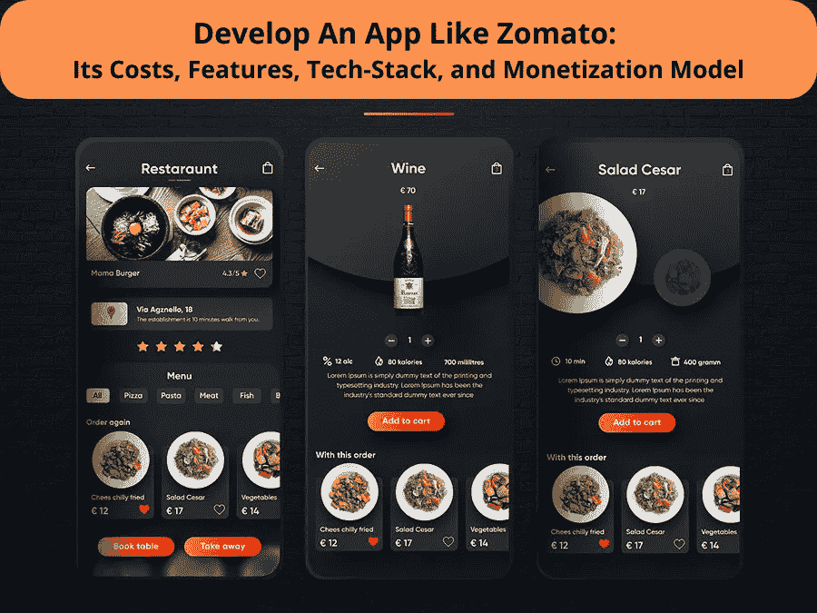
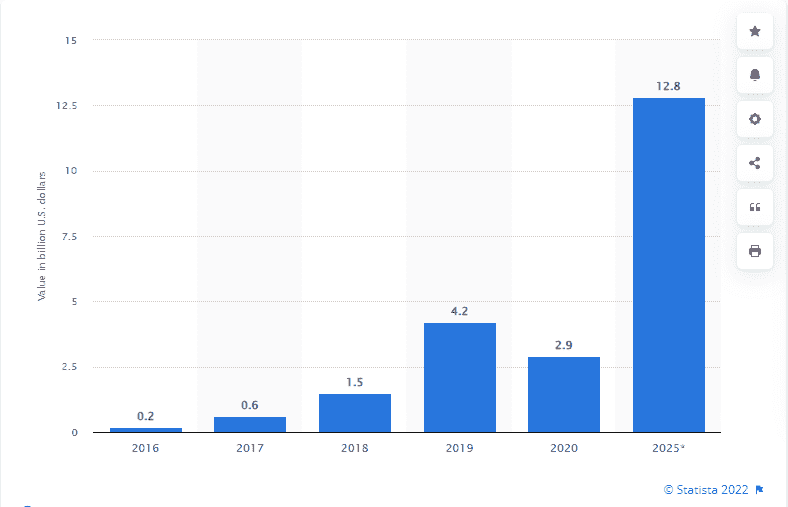

# 创建一个像 Zomato 这样的送餐 App 需要多少成本？

> 原文：<https://medium.com/javarevisited/how-much-does-it-cost-to-create-a-food-delivery-app-like-zomato-d178696c808c?source=collection_archive---------4----------------------->

## 创建一个像 Zomato 一样的应用程序:它的成本、功能、技术和盈利模式

***快速总结*** *:如果你正在寻找创建一个执行类似 Zomato 功能的应用程序，那么你来对地方了！在本文中，我们将涵盖你需要知道的关于开发一个像 Zomato 这样的应用程序的所有内容，到最后，你将完全掌握你自己开始工作所需要的知识！*

Zomato 已经席卷了全世界，而且看起来不会很快放缓。在过去的几年里，世界各地的餐馆和咖啡馆都在 Zomato 上添加了他们的菜单，这样客户就可以直接从应用程序或网站上浏览和订购食物。

由于它可以在任何时候将用户与他们附近的数千种食物和饮料联系起来，它已经成为世界上增长最快的应用程序之一。此外，Zomato 等食品配送应用程序在全球安卓和 iOS 设备上获得了数百万次下载。

由于应用程序只需轻点几下，轻轻一扫，就可以即时获取任何类型的食物，这些应用程序肯定会受到任何人群的欢迎。

凭借其不可预测的增长，Zomato 点燃了整个食品行业。它激励了来自餐馆和食品配送行业的创业公司和企业家。要成为食品行业的领导者，首先要有一个程序员团队和餐厅合作。这将允许你为你的客户提供特殊和多样的食物，这将使你的应用程序成为最好的食品交付应用程序。

你不必相信我们的话……以下是市场统计数据:

## **zoma to Like 送餐 App 市场份额及统计**

Zomato 是一个餐厅发现应用程序，最近出现在新闻中，当时它以近 6.6 亿美元的估值从红杉资本(Sequoia Capital)筹集了约 6000 万美元。

这款应用由两名亚马逊前员工创建，在印度非常受欢迎，拥有 200 万用户，并且还在增加。有一些类似的应用程序，比如 Zomato，它们凭借自己的能力变得非常成功——我想到了 Swiggy，但还有其他一些应用程序。

*据统计，2020 年在线食品交付市场价值约为 29 亿美元，预计到 2025 年将恢复 35%的增长，达到近*[*130 亿美元*](https://www.statista.com/statistics/744350/online-food-delivery-market-size-india/) *。*

[图像来源](https://www.statista.com/statistics/744350/online-food-delivery-market-size-india/)

*zom ATO 和它的竞争对手 Swiggy 都在网上食品配送业务中占有*[*90-95%的市场份额*](https://www.businessinsider.in/stock-market/news/zomato-posted-a-1222-crore-loss-but-its-stock-gained-18-reasons-behind-the-surge/articleshow/91766080.cms#:~:text=customer%20delivery%20charges.-,Zomato%20and%20its%20rival%20Swiggy%20together%20hold%2090%2D95%25%20market,2022%2C%20and%20316%2C000%20delivery%20partners.) *。*

*目前，Zomato 的业务遍及全球 23 个国家，包括印度、美国和澳大利亚。*

但在你对成为这个蓬勃发展的行业的一部分感到好奇之前，你应该知道创建一个像 Zomato 这样的应用程序到底需要什么。需要雇佣专门的开发团队吗？搭建一个按需送餐 app 要花多少钱？如果你正在考虑开发一个类似 Zomato 的应用程序，你可能想先从这个指南中获得一些灵感！

这篇文章涵盖了你需要知道的关于开发一个像 Zomato 这样的应用程序的一切，帮助你开始你自己的商业冒险。

**以下是博客的主要亮点:**

*   *像 Zomato 这样的按需送餐应用是如何工作的？*
*   *创建 Zomato 等按需送餐应用的功能*
*   *创建一个像 Zomato 这样的送餐 App 需要多少成本？*
*   *选择最佳盈利策略，从 Zomato Like App 中获利*
*   *结论:创建一个像 Zomato* 一样的送餐应用

让我们进入这个博客的细节:

# 像 Zomato 这样的按需送餐应用程序是如何工作的？

像 Zomato 和 Swiggy 这样的按需送餐应用程序的基本功能是允许用户从餐馆订购食物并将其送到家门口。该应用程序显示了附近餐馆的列表，以及菜单和价格。

为了了解这些应用程序是如何工作的，让我们来分解一下通过 Zomato 这样的应用程序订购食品的过程。虽然这个过程看起来很简单，但它需要一个强大的后端来确保订单的无缝处理。因此，首先，你需要 [**雇佣一个移动应用开发者**](https://www.appsdevpro.com/hire-developers/hire-mobile-app-developers.html) ，他可以帮助你为应用的处理建立一个良好的机制。它们还集成了能够确保应用程序无缝功能的技术。此外，更好地了解如何为后端开发选择正确的技术。

## 现在让我们回到应用程序的机制:

*   用户打开应用程序并登录，即可开始使用。
*   该应用程序将开始显示附近地区的餐厅列表。一旦你找到你想吃的东西，你可以查看菜单并选择要添加到你的购物车的东西。
*   *只需轻点几下，用户就可以快速将商品添加到购物车中。*
*   *该应用程序然后计算总费用，包括任何送货费，用户可以确认他们的订单。*
*   *准备好结账后，您将手动或使用 GPS 输入您的送货地址。*
*   *最后，应用程序会询问支付信息。*
*   *确认付款后，该应用程序会将你与附近的司机联系起来，司机会为你取食物并送货上门。*
*   *一旦下了订单，订单就会被送到餐厅，餐厅会准备好订单，然后由司机送到用户手中。*
*   *该应用程序还提供关于取车时间和大概距离的信息。*
*   你所要做的就是等他们！如果一切顺利，交易从开始到结束应该需要 10 分钟左右。

这就是像 Zomato 这样的按需送餐应用程序的工作方式。但是如果你打算创建一个像 Zomato 这样的应用程序，那么你需要了解这个应用程序背后的特性和功能。功能的选择将决定你的应用程序的成功。因为功能集成是最大的成本驱动因素，所以你需要小心选择合适的功能集，既满足用户的需求，又不会从你的预算中节省太多。

# **创建 Zomato 等按需送餐应用的功能**

当涉及到开发按需送餐应用程序时，您需要理解这种类型的应用程序与客户、餐厅和管理面板一起工作。每个面板都包含特殊的特性和功能。因此，让我们了解一下您需要集成到每个面板中的具体功能。

## **创建送餐应用用户面板的功能**

为您的送餐应用程序创建用户面板对于提供出色的用户体验至关重要。

这里有一些创建用户面板时需要考虑的特性-

*   **应用程序注册:**允许用户使用各种方法注册应用程序，包括电子邮件 ID 或手机号码。
*   **用户资料:**添加创建用户资料的功能，允许用户添加联系方式或送货地点。
*   **搜索菜单:**确保你的应用有搜索框，用户可以在里面找到各种菜品或餐厅。为了使他们的搜索更容易和更快，他们允许用户使用各种过滤器。
*   查看详情:一旦他们选择了一道菜或一家餐馆，他们就可以查看每家餐馆的详细信息，包括菜单和价格。
*   **定价计算:**定价可以用货币显示，也可以用重量显示，以方便用户为准。你可以 [**雇佣 react 原生开发者**](https://www.appsdevpro.com/hire-developers/hire-react-native-developers.html) 如果你在开发跨平台的 app。他们将帮助您以一种无缝地在多个平台上工作的方式构建这个特性。
*   **添加到购物车:**通过该功能，用户可以一键将他们想要的商品从菜单添加到购物车，从而轻松快速地下订单。
*   **订单历史:**添加该功能可以让用户查看他们的订单历史，并在必要时管理过去的订单，包括取消或更改错误的订单。
*   **设置:**你应该允许用户更改设置，如语言、每天递送次数和位置，而不必联系客户服务。
*   **通知:**通知有助于提醒客户未完成的订单，以免他们忘记。他们还应该让他们了解最新的事件，如新菜单或特价商品。保存地址:保存地址使得回头客订购更快，因为他们知道自己想要什么。
*   **接单:**在您的应用中添加一项功能，跟踪接单和送货司机的位置。
*   **点评和评级:**基于经验，这允许用户分享他们有价值的反馈，并为司机和餐厅提供评级。
*   **支付整合:**为用户提供多种支付选择。通过多支付集成功能，允许用户使用在线支付方式(如 Google Pay、PayPal 等)进行支付。
*   注销按钮:应用程序上应该总是有一个注销按钮，这样人们可以很容易地从你的数据库中删除自己。

用户档案为你的应用提供了个性，并通过向用户显示他们使用应用的频率来促进使用，这已被证明可以激励人们更频繁地使用应用。重要的是，设计不仅要好看，还要实用，满足目标受众的需求。

## **创建 Zomato 等送餐应用的餐厅面板的功能**

如果你想开发一个像 Zomato 这样的送餐应用，你需要在你的餐馆面板中加入一些关键特性。

*   **注册:**允许餐馆使用管理面板提供的凭证在应用程序上注册。
*   **上传菜单:**通过这个功能，餐厅可以上传自己的菜单。这可以通过简单的表单或与 POS 系统集成来完成。
*   **跟踪交付:**您需要集成一些功能，为餐馆提供一种跟踪订单和管理交付的方式。这可以通过订单管理系统或与第三方交付服务集成来实现。
*   **接受支付:**通过多种支付方式的集成，餐馆能够接受支付。这可以通过支付网关或与第三方支付处理器集成来实现。
*   **接受/拒绝订单:**根据员工的空闲情况，餐厅可以接受或拒绝订单。
*   **客户支持:**确保你在餐厅面板上有一个功能，为餐厅提供客户支持。这可以通过实时聊天、电子邮件或电话支持来完成。

最后，您需要在地图上包含每个餐厅的位置信息。这些功能将帮助您的应用从优秀走向卓越！

## **创建送餐应用管理面板的功能**

如果你正在考虑开发一个像 Zomato 这样的送餐应用程序，你需要在应用程序的管理面板中加入一些关键功能。

*   **管理订单和交付:**管理面板应该有一个功能，提供一个更好的方式来管理订单和跟踪交付进度。
*   **管理菜单细节:**管理员应该有权添加和编辑餐厅和菜单项。管理交货时间:允许管理员管理司机和交货时间。如果订单被餐厅拒绝，管理员应立即将订单转交给其他餐厅。
*   **跟踪付款:**管理员需要设置一个支付网关，以便客户可以支付他们的订单。
*   **跟踪业绩:**在应用程序中有一个功能，管理员可以分析餐厅的业绩，并能够在应用程序上相应地管理他们的位置。

这些是要集成到送餐应用程序中的基本功能。但是如果你要和 Zomato 竞争一个功能丰富的应用，那么确保你雇佣了一个可以帮助你利用高级功能的网络开发者 。然而，这将很快增加您的成本和开发时间。因此，如果你正在用移动应用程序启动食品配送业务，那么更喜欢用 MVP 解决方案启动你的旅程。

## **创建一个像 Zomato 这样的送餐 App 需要多少成本？**

创建一个像 Zomato 这样的按需送餐 app 需要多少成本？这肯定是企业主最常问的问题。但遗憾的是，这个问题没有标准答案。

开发一个像 Zomato 这样的应用程序，你需要考虑各种因素，比如应用程序的类型、功能、构建平台，最重要的是成本。

让我们看看创建一个像 Zomato 这样的送餐应用程序需要多少成本。

开发的总成本可能在 10，000 美元到 25，000 美元之间，这取决于你是想内部开发应用程序还是外包给应用程序开发公司。接下来，你需要决定你的业务需要多复杂的应用结构。不同的业务需求会增加开发成本。

例如，建立一个只有一个功能的食品配送应用程序——基于位置的搜索和菜单集成——比你想把自己的餐馆列表与订单跟踪功能等集成在一起更便宜。

所需的移动操作系统类型也对定价有影响；例如，Android 开发成本高于 iOS，因为 Android 提供了更广泛的功能。

外包项目时，构建一个像 Zomato 这样的食品交付应用程序的成本可能在 10，000 美元到 15，000 美元之间。即便如此，与其他企业软件项目相比，这仍然相对便宜，在其他企业软件项目中，团队通常按小时计费，每月的聘用费通常更高。

app 开发成本并没有到此为止。这里不要上当。我们只是提到了开发成本。

除了前期设计和开发成本之外，运营应用业务还会产生不可忽视的额外运营费用:

*   建立服务器托管环境(2000 美元)，
*   获得域名(1000 美元)，
*   进行市场调查(1000 美元)，
*   广告活动(2000 美元)，
*   长期维护应用(月收入的 10%)

所有这些加起来每年大约 20，000 多美元！然而，Grubhub 和 Seamless 等食品配送应用每年的收入高达 6 亿美元。

如果你真的想开发一个像 Zomato 这样的应用，不要让这些数字吓跑你。这些钱中的很大一部分用于市场营销——成功的公司每年都会在这方面投入大量资金。同样的道理，新创公司的营销预算总是比老牌公司少。

## **开发像 Zomato 这样的按需送餐应用:成功秘诀**

创建一个成功的应用需要的不仅仅是一个好主意。你需要对你的应用有一个清晰的愿景，并且你需要能够完美地执行这个愿景。此外，你需要雇佣一名应用程序开发人员，他拥有将你的想法成功转化为强大产品的合适技能。这里有一些提示可以帮助你开始。创建一个成功的应用程序需要大量仔细的计划和执行。以下是一些帮助你开始的提示:

*   **做研究:**创建一个应用程序需要很多东西，所以清楚地了解市场和用户的需求非常重要。
*   **有一个坚实的商业计划。**这将有助于你规划发展流程并跟踪你的进展。
*   **选择合适的平台。**如果你正在开发一个 iOS 应用程序，确保你的开发者有使用苹果编程语言 Swift 的经验。对于安卓应用，确保你 [**雇佣懂 Java 的安卓应用开发者**](https://www.appsdevpro.com/hire-developers/hire-android-developers.html) 。如果他们的团队中没有这些技能，那就去别处看看，否则你会浪费宝贵的时间等待他们掌握诀窍。
*   **合理设定预算:**开发一款应用的成本可能在 1 万美元到 5 万美元之间。你花费的金额取决于你想要多少功能，以及你是否聘请了专业设计师。请记住，如果您选择不这样做，可能还会有额外的营销和广告费用；甚至像可口可乐这样的大品牌也有专门为此目的而设立的独立营销部门！此外，不要忘记维护。

## **选择最佳盈利策略，从 Zomato Like App 中获利**

Zomato 是一款流行的食品配送和餐厅发现应用程序。如果你想开发一个像 Zomato 这样的送餐应用，你可能会想知道成本。好消息是它没有你想象的那么贵。有很多方法可以将一款送餐应用货币化，下面我们将介绍一些最流行的方法:

*   **广告:**由于送餐应用通常会为所在地区的餐厅提供优惠券和促销活动，广告可以帮助产生收入，而不必直接向顾客收费。
*   **便利费:**PayPal 或 Stripe 等第三方应用收取的费用是公司从其服务中赚钱的常见方式。以 grb-hub 为例，每当有人通过他们的应用程序点餐时，他们都会向顾客和餐馆收费。
*   **应用内购买:**另一种从你的应用中赚钱的方式是在应用本身内销售商品。例如，Subway 允许用户使用 Subway 官方应用程序直接从智能手机上订购三明治。

# **底线**

如果你正在考虑开发一个像 Zomato 这样的送餐应用，那么首先你需要有一个关于功能的绝妙想法。你必须清楚地了解你想在应用程序中包含的功能。你也可以选择 [**雇佣一个移动应用开发者**](https://www.appsdevpro.com/hire-developers/hire-mobile-app-developers.html) ，因为这是一个巨大的成功和成本驱动因素。他们将与您密切合作，设计一款完美反映您的品牌形象并确保出色用户体验的应用。

所以，无论你有一个从零开始开发 Zomato 这样的 app 的绝妙想法，还是需要升级现有的 app，你需要的只是专业开发者的正确选择。如果您还没有任命任何开发人员，您可以联系我们，讨论您的细节和无与伦比的优质解决方案。