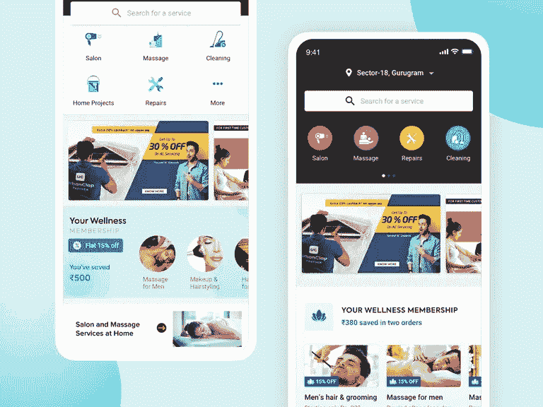

# 创建一个像 UrbanClap 这样的应用程序需要多少成本

> 原文：<https://medium.com/javarevisited/how-much-does-it-cost-to-create-an-app-like-urbanclap-40db4b9fb61b?source=collection_archive---------2----------------------->

## 创建一个像 UrbanClap 一样的应用程序:它的成本、功能、盈利模式和开发团队

[图像来源](https://dribbble.com/)

urban clip 应用程序自上市以来一直在掀起波澜，如果你是一名寻求建立类似东西的企业家，那么你需要知道开发一个像 urban clip 这样的应用程序需要多少成本。

嗯，有许多因素会影响应用程序的整体成本，所以这里有一个你可以预期支付的概要，这个过程是如何工作的，以及哪些因素会影响应用程序的开发成本。

UrbanClap 是印度最成功的按需创业公司之一，现在以 Urban Company 的名字越来越受欢迎，已经筹集了 2400 万美元的资金。这家初创公司在过去几年中以指数速度增长，为印度的 1000 多个城市和其所有平台上的 1000 多万用户提供服务。

这个应用克隆的快速增长速度对数百家计划通过开发像 UrbanClap 这样的多服务应用来启动业务的初创公司来说是相当鼓舞人心的。

现在，如果你想创建一个像 UrbanClap 这样的应用程序，你的关键问题可能是它要花多少钱？需要多长时间？

在你分解从头创建一个类似于 urban clip 的应用程序的价格之前，重要的是要考虑你的潜在目标市场，并决定你的企业是否应该投资一个类似于 urban clip 的应用程序。

**以下是这篇博客的主要亮点，涵盖了从市场数据和事实到开发成本的方方面面。**

*   *了解 UrbanClap(城市公司)的概念及其市场统计*
*   *Urban clip(城市公司)是如何运作的？*
*   *像 UrbanClap 这样的应用提供哪些关键服务？*
*   *构建像 UrbanClap(城市公司)这样的应用程序所需的基本特性和功能*
*   *应用程序开发团队需要构建一个城市公司应用程序*
*   *城市公司创收的最佳货币化策略*
*   *打造一个像 Urban Company 这样成熟的服务提供 App 需要多少成本？*
*   *结论*

让我们进入每一点的细节…

## **1。了解 UrbanClap(城市公司)的概念及其市场统计**

如今，按需服务随处可见。技术的进步使得一切都变得超级简单快捷，只需在移动应用程序屏幕上轻轻一点。从预约沙龙到请专业人士来修理你的管道问题，再到雇佣专业人士来修理你的空调，许多不同的家庭服务已经成为管理的主要障碍。

除此之外，有越来越多的家庭服务的需求，如空调，烤箱维修，洗衣机维修，需要专业服务。

这就是 UrbanClap 或 Urban Company 对人们来说恰到好处的地方，它填补了这一空白，并在蓬勃发展的按需交付服务市场中占据了一席之地。这个应用程序克隆不仅可以帮助人们即时预订各种专业服务，还可以节省您的时间和金钱，同时还能完成高质量的工作。

这种应用程序类型的最大好处是，它为企业家带来了一个中央高收入的创收模式。为了规范这个蓬勃发展的按需市场，许多企业开始投资共享经济。如果你仍然不知道雇佣一个移动应用程序开发者来创建一个像 UrbanClap 这样的应用程序是否是一个值得的决定，那么相信我，这是一个通过推出一个功能丰富的全方位平台来满足用户多种需求的绝佳时机。

***下面是几个***[***urban clip App 人气的市场统计***](https://expandedramblings.com/index.php/urbanclap-statistics-and-facts/)***:***

*   *根据市场统计，大约有 500 万用户使用过这款应用。*
*   *目前，UrbanClap 上大约有 107 项服务。*
*   *urban clip 每天关闭超过 45 万个服务请求。*
*   UrbanClap 的平均评分是 4.2 分。
*   *20 万服务提供商支持 UrbanClap 应用。*
*   *urban clip 上大约有 5000 个客户请求。*
*   UrbanClap 有 75 个服务类别。
*   该公司有 7 个行业巨头作为投资伙伴。

希望这些统计数据能够激励你投资 UrbanClap 的应用克隆，但在你进一步前进之前，你必须想知道 Urban Company 品牌下捆绑的所有服务是什么，它们到底是如何工作的。

那么就让我们来了解一下 UrbanClap 移动应用的服务和机制吧…

## **2。UrbanClap(城市公司)是如何运作的？**

Urbanclap 是一款连接服务专业人员和需要他们服务的客户的应用程序。客户可以通过该应用浏览服务提供商列表、阅读评论和预约。一旦他们找到满意的服务提供商，他们就可以安排服务的时间和日期。

此外，支付也通过应用程序处理，因此客户可以确保他们得到了他们所支付的东西。该应用程序已被下载超过 1 亿次，其网络上有超过 15 万个服务提供商。

如果你打算创建一个像 UrbanClap 这样的应用程序，那么雇佣一个移动应用程序开发者 是值得的，他可以根据你的位置或邮政编码进行搜索，并选择你正在寻找的服务类型。无论您是需要有人来安装您的新洗碗机还是搭建您的梦想平台，UrbanClap 都会有人在附近帮助您！

> 这种应用模式有两种工作方式:

> **客户端分步指南**

**第一步:**它帮助客户从 app store 下载应用程序，并使用它来预订任何内部专业服务。

**步骤 2:** 一旦他们选择了服务，屏幕上会出现一个弹出窗口，其中包含有关服务套餐的所有基本信息。

**步骤 3:** 选择服务套餐后，将要求他们根据自己的舒适度选择时间和日期。

**第 4 步:**管理员确认用户服务后，用户将被分配到专业服务提供商。

**第五步:**最后，客户可以利用多支付模块通过应用程序进行支付，并分享反馈和评论。

> **专业人员分步指南**

**第一步:**由于它是双向的，所以如果有人想参加培训，它允许专业人士在平台上注册。

**第二步:**当客户选择任何服务时，app 会通知该地区的服务商。根据他们的可用性，他们可以接受或拒绝服务请求。

**步骤 3:** 如果服务提供商接受服务请求，将通知客户和服务提供商。

# **3。像 UrbanClap 这样的应用程序提供了哪些关键服务？**

UrbanClap 在一个地方提供多种服务。如果你想知道他们的应用程序到底提供什么，那么看看这个应用程序的热门服务类别:

## **1。清洁和维修服务**

*   电工和水管工
*   洗衣机维修
*   喷泉/热水器维修
*   木匠和家装
*   电视和冷冻修复
*   家庭深层清洁

## **3。移位和移动服务**

*   包装工和搬运工
*   害虫防治
*   浴室和厨房
*   沙发和地毯
*   水箱

## **4。室内设计和装饰服务**

*   建筑师
*   模块化厨房
*   画家
*   闭路电视摄像头

## **5。活动策划和餐饮服务**

*   婚礼策划
*   生日甚至装饰
*   婚前拍摄
*   婚礼拍摄
*   婚纱摄影
*   聚会组织
*   餐饮服务

## **6。美容和健康服务**

*   婚礼化妆
*   即时沙龙预订
*   化妆预约
*   消息预订

## 7 .**。孩子们**

*   婴儿组合摄影师
*   家庭教师
*   鼓类
*   在家上吉他课

它为您提供了各种类别下的大量服务，可以根据您的业务需求和预算进行完全定制。但是，要让这个 app 模块顺利工作，你需要 [**雇佣一个跨平台的手机 app 开发者**](https://www.appsdevpro.com/hire-developers/hire-cross-platform-app-developers.html) 并考虑实现那套功能。

也就是说，要雇佣一个跨平台的程序员，要确保你的应用可以在多个平台上下载，而不必投资开发原生应用。

# **构建像 UrbanClap(城市公司)这样的应用程序所需的基本特性和功能**

开发一个 UrbanClap 应用的本质特征是什么？嗯，功能集成的选择会对应用的成功产生巨大的影响。因此，如果你计划创建一个像 Urban Company 或 UrbanClap 这样的应用程序，那么你需要构建三个应用程序面板，包括客户、供应商和管理面板。

## **为 UrbanClap 应用创建客户面板的功能**

- **注册/登录:**允许客户创建一个帐户，这样他们就可以登录并访问他们的预订和帐户详情，

- **主页:**展示 UrbanClap 提供的不同服务，确保这些服务在各自的部分下进行良好的分类，以确保无缝的用户体验。

- **搜索:**允许客户搜索他们需要的服务类型，或者使他们能够使用过滤器对他们的搜索进行排序。

- **服务提供商:**在安排服务时，确保您的应用程序展示了 UrbanClap 上针对相应服务的不同服务提供商。

- **预订详情:**一旦服务提供商确认了预订，请确保您拥有与客户分享预订详情的功能。

- **设置:**用户面板应该能够登录和退出，查看他们的个人资料，并编辑他们的个人资料信息。

- **应用程序设置:**用户还应该能够查看可用服务的列表，预约和取消预约。

- **短信提醒:**推送通知应该提醒用户即将到来的约会、优惠和折扣交易。

- **应用内聊天:**应用内消息应该允许用户与服务提供商交流。

- **付款:**允许客户为他们预订的服务付款。

- **评论和评级:**允许客户为他们使用过的服务提供商留下评论和评级。你可以 [**雇佣一名 React 原生应用开发者**](https://www.appsdevpro.com/hire-developers/hire-react-native-developers.html) 在客户体验期间创建反馈按钮，这些按钮可以在多个平台上无缝工作。

## **为 UrbanClap 应用程序创建供应商面板的功能**

- **登录/注册:**urban clip 的供应商面板应该包括一个注册/登录页面，供应商可以在其中输入他们的信息。

- **跟踪约会:**urban clip 的供应商面板应该包括一个日历来跟踪和管理约会。

- **沟通:**此外，供应商面板应允许 UrbanClap 供应商向客户发送消息并查看客户联系信息。

- **订单接受/拒绝**:根据服务提供商的可用性，供应商可以灵活地接受或拒绝服务请求。

- **供应商列表:**还应该有一个搜索功能，以便客户可以找到他们需要的合适的供应商。

- **产品分类:**应用程序也应该允许供应商张贴他们的服务和价格。

- **评论和评级:**如果该应用程序允许客户对供应商进行评级和评论，以便其他用户可以做出明智的决定，这将是很有帮助的。

- **应用程序内聊天:**应用程序应该有一个消息传递功能，以便供应商和客户可以直接沟通。

## **为 UrbanClap 应用程序创建管理面板的功能**

- **管理服务提供商:**显示服务提供商所在位置的地图界面。

- **管理短信提醒:**向服务提供商发送消息和推送通知的能力。

- **付款跟踪:**通过多个平台管理付款和开具发票的系统。

- **控制评审和评级:**跟踪服务提供商的表现

- **客户支持:**客户支持界面

- **反馈:**一个报告系统，用于跟踪应用程序的使用情况，并确定需要改进的地方

这些是你在为你的企业开发像 UrbanClap 这样的应用时需要考虑的基本功能。但如果你打算推出一款功能丰富的应用来与市场巨头竞争，那么雇佣一名 [**iOS 应用开发者**](https://www.appsdevpro.com/hire-developers/hire-iphone-developers.html) 是值得的，他可以帮助你整合平台特定的功能，让你的应用创意在市场中脱颖而出。但现在的核心问题是，创建一个应用程序需要哪些技术和应用程序开发..

## **应用程序开发团队需要构建一个城市公司应用程序**

为了建立一个像 Urbanclap 这样的应用程序，你需要有一个熟悉该平台的经验丰富的开发人员团队。这种应用程序的成本将根据您包括的功能和完成项目所需的小时数而有所不同。

一般来说，你可以在像 Urbanclap 这样的应用程序上花费 15，000 美元到 50，000 美元。但这完全取决于应用程序开发团队的选择。虽然 UrbanClap 是一个庞大的应用程序，涉及复杂的特性和功能，但您需要雇佣一个由以下人员组成的团队:

*   项目管理人
*   Android/iOS 应用开发者
*   UI/UX 设计器
*   质量保证工程师
*   应用部署专家
*   促销营销团队

## **城市公司创收的最佳盈利策略**

无论你是一家初创企业还是领先企业，你最关心的问题总是围绕着如何从应用程序中赚钱。

虽然有多种赚钱策略，但我们在这里分享一些潜在的赚钱方法，Urbanclap 正在使用这些方法来赚钱。

以下是 Urban Company 用来创收的几种最佳盈利策略:

*   他们提供基于订阅的服务，允许用户预约和获得独家折扣。
*   他们有一个会员计划，让用户访问独家内容和功能。
*   他们向当地企业出售平台上的广告空间。
*   他们提供付费使用的高级功能。
*   他们有一个奖励计划，为完成特定任务或活动的用户提供积分。
*   他们通过网上商店销售商品。
*   他们为那些想要开发自己的城市拍手类应用的企业提供咨询服务。

## **打造一个像 Urban Company 这样成熟的服务提供 App 需要多少成本？**

现在是时候回答最常被问到的问题了，即建立一个像 UrbanClap 这样的应用程序需要多少成本？这个问题没有简单的答案。

开发一个像 Urbanclap 这样的应用程序的成本取决于许多因素，包括你想要包含的功能，你想要构建的平台，以及你的团队规模。一般来说，你可以期望在开发上花费数万美元到五万美元。

但是现在，你一定想知道为什么定价会有如此大的差异。背后的简单逻辑是，复杂的应用程序开发项目需要更长的时间来构建和集成高级功能。因此，你需要雇佣在编码和最新技术知识方面优秀的 Android 开发者或其他程序员。因此，根据他们的技能和经验，他们的时薪从 25 美元到 75 美元不等。

然而，如果你和一个小团队一起工作，或者想降低成本，你可以少花钱。请记住，一个应用程序的成本还受到持续维护、营销和测试等因素的影响。

总而言之，在确定 UrbanClap 的应用程序开发成本时，具有基本功能的简单应用程序版本将花费 15，000 美元至 20，000 美元+，包含现代功能的中等应用程序版本将花费 20，000 美元至 25，000 美元+，具有复杂功能的高级应用程序版本将花费 30，000 美元左右。尽管如此，在您将这些估算视为最终成本之前，还是有必要分享一下应用程序需求。根据不同的需求，应用程序开发成本可能会有很大差异。

## **结论**

开发一个 urban clip 是一项复杂的任务，所以希望你已经在这篇博客中找到了关于开发一个像 urban clip 这样的应用程序的问题的答案。但是随着技术和趋势的发展，是时候 [**雇佣一个移动应用开发者**](https://www.appsdevpro.com/hire-developers/hire-mobile-app-developers.html) 来帮助你构建一个拥有所有新特性和功能的应用了。

专业的应用程序开发人员可以帮助您创建具有最新功能的应用程序，使您能够在竞争激烈的市场中树立标杆。因此，如果您有任何应用程序的想法，并寻找应用程序开发团队将其转化为强大的产品，那么你可以在下面提出疑问或联系我们！