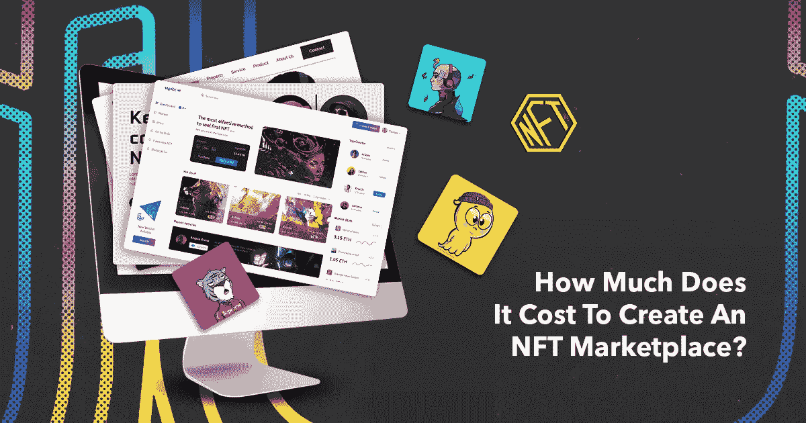

# 发展一个 NFT 市场需要多少钱？

> 原文：<https://medium.com/javarevisited/how-much-will-it-cost-to-develop-an-nft-marketplace-acce15544968?source=collection_archive---------4----------------------->

即使你是 NFT 市场的新手，你也可能听说过名人拥抱 NFT 市场来推出他们的数字资产。从印度演员阿米特巴·巴强到美国媒体名人，每个名人都在利用当前不可替代代币(NFT)的热潮，推出他们的数字作品。

值得注意的是，阿米特巴·巴强自己的收藏，被命名为 Madhushala，已经收到了该国迄今为止最高的出价。在 NFT 拍卖的第一天，Madhushala、亲笔签名的海报和收藏品的出价高达 52 万美元。

这是否足以说明对 NFTs 的炒作程度很高？是的，当然。在当今这一代，利用当前的年龄趋势，通过启动 NFT 市场来深入研究 NFT，即，提供一个空间来为交易者买卖不可替代的代币。这篇文章解释了 [**开发 NFT 市场**](https://www.inoru.com/nft-development-services) 的关键方面及其成本。看着吧！

## **NFT 及其特点**

让我们从对 NFT 的基本理解和它们的特征开始这篇文章。NFT 缺少一种不可替代的代币，这种代币只不过是一种数字资产，是不可分割的。

每个 [NFT](https://savingsfunda.blogspot.com/2022/05/top-10-online-courses-to-learn-nfts-non-fun.html) 都有其独特的一组值，因此不能互相交换。也就是只能交易法定货币或者加密货币。NFT 通常使用区块链技术构建。

不可否认的是，NFT 因其独特的属性而广受欢迎。一些关键特征包括以下内容。检查这个列表。

*   稀缺
*   独特性
*   不可分割
*   透明度
*   互用性

## **NFT 市场及其功能**

通过对什么是 NFT 及其重要特征的简短解释，我们将在这一部分继续学习 NFT 市场的概念。

无意中听到关于 OpenSea，Rarible，Axie Infinity，Foundation，NBA Top Shot，和分散地？这些都是一些受欢迎的 NFT 市场，已经授权 NFT 爱好者交易任何类型的非功能性交易。现在，什么是 NFT 市场？对于交易者来说，这是一个出售和购买不可替代代币的阶段，代币将包括数字物品甚至收藏品。这个平台是使用区块链技术创建的。一些流行的包括[以太坊](https://www.courserevisited.com/2022/03/top-10-ethereum-courses-learn-trade.html)、TRON、Polygon、Polkadot、币安智能链(BSC)、Cardano 和 Solana。

下面是 NFT 市场的运作方式，以获得清晰理解的步骤来解释。请查看这些内容以获得真知灼见。

**注册账户**

注册是第一步，在这一步中，想要进行 T2 交易的用户应该使用有效的凭证进行注册，并继续验证过程。也就是说，要执行 KYC/反洗钱合规。这是为了确保个人用户帐户得到验证，防止没有恶意活动。

**连接钱包和资金**

创建帐户后不久，用户需要将他们的加密钱包链接或集成到创建的帐户。此后，为了进行交易，他们的钱包里应该有足够的资金。

**NFT 创作**

一般来说，NFT 铸造是将数字文件(可能是艺术品或其他此类文件)转化为不可替代的令牌的过程。创建者和他们的 NFT 可以在平台上列出它们，指定所需的细节，如描述、名称、NFT 的价格等。向不可替代代币的用户或销售者提供让交易对手或购买者以买价或出价购买代币的选项。

**购买或投标**

为了更清楚地理解，当销售者已经指定以固定价格出售他们的代币时，购买者将能够在代币被出售后不久购买代币。在柜台的情况下，当卖家提到出价时，有兴趣购买代币的人必须参与拍卖。拍卖时，几乎很多人开始出价。但是拍卖结束时出价最高的人将获得 NFTs。

**转售已购买的 NFT**

支付交易处理完成后，NFT 将被转入相关个人的账户。一旦个人抓住了一个特定的 NFT，他就拥有了所有权。然后，他们可以通过在 NFT 市场上市来转售购买的 NFT。

## **NFT 市场中的常用功能列表**

我们已经在前一部分看到了 NFT 市场的功能。现在，有了相关的知识，让我们来了解使交易执行更有效的重要特征。让我们来看看 NFT 市场中更重要的功能列表。

*   店面
*   创建列表
*   钱包整合
*   拍卖和购买
*   评级和评论
*   即时通知

## **打算开发 NFT 市场？这里是要经历的步骤**

从零开始创建 NFT 市场是一个相当乏味且耗时的过程。除此之外，您还可以选择使用 [**白标 NFT 市场解决方案**](https://www.inoru.com/white-label-nft-marketplace) 进行创建。它拥有即时启动、成本效益和完全定制等优势。完成以下需要给予最高重视的步骤。

**明确你的目标**

NFT 市场并不局限于一个特定的利基市场。它广泛存在于各个领域，如艺术、音乐、游戏、体育、时尚、娱乐、房地产等等。所以，你首先要决定专注于哪一部分。例如，NBA Top Shot 是专为交易体育收藏品而设计的，特别是，它完全是关于购买和出售关于足球的时刻和纪念品。

**选择区块链网络&功能**

一旦你确定了你的目标和动机，下一步就是选择用于 NFT 市场发展的区块链技术。突出的区块链有以太坊，创，多边形，波尔卡多特，币安智能链，索拉纳，卡尔达诺等。以太坊是其他区块链的前身。每个区块链都有其独特的优点和缺点。当谈到特性集集成时，应该以一种更无缝地定义功能的方式来选择。

**选择&联系 NFT 市场发展公司**

在事先决定了你希望 NFT 交易平台是什么样的之后，现在是时候去寻找最适合的 NFT 市场开发公司，它精通于平台的设计。

走近该公司，获得为您量身定制的白色标签 NFT 市场解决方案，使用户能够无障碍地交易数字资产和收藏品。确保开发的 NFT 交易平台已经通过了要求的测试。完成后，推出面向 NFT 爱好者的平台，并通过营销活动获得更好的知名度和认知度。

## **热门的现成 NFT 商场可供选择**

在这篇文章中，您可能已经遇到了术语**NFT 白标市场**。它只不过是一个现成的平台，让像你这样有抱负的企业家能够在几周内启动 NFT 市场。下面列出了一些现成的 NFT 市场。

*   OpenSea 克隆
*   超稀有克隆
*   稀有克隆
*   NBA 顶级射手克隆
*   漂亮的网关克隆
*   基础克隆

## **影响 NFT 市场开发成本的因素一览**

几乎，NFT 市场发展需要考虑的每一个方面都在这篇文章中得到了简要的介绍。在继续之前，让我们先了解一下成本。

NFT 市场开发成本取决于许多因素，如已包括的功能，区块链技术，直观的界面，区块链开发人员的技能，以及许多其他因素。简而言之，开发时考虑基本要素。当从头开始创建时，与选择现成的 NFT 市场相比，所涉及的成本相当高，因为这只需要定制。

无论如何，NFT 市场开发的平均成本将在 7 万到 30 万美元左右。为了获得开发 NFT 交易平台的准确价格，请从您选择的公司获得直接报价。

## **结果**

得出的结论是，NFTs 是一个新时代的趋势，这是正确的时间为技术企业家利用这个机会推出他们的 NFT 市场。从走近右边[NFT 市场发展公司](https://www.inoru.com/nft-marketplace-development) 开始。