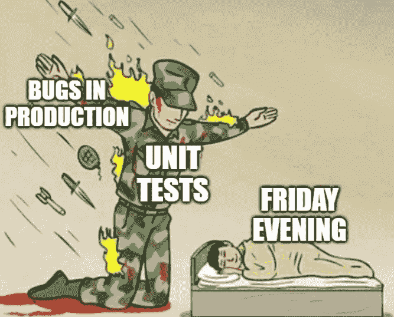

# 你的单元测试有多可靠？

> 原文：<https://medium.com/javarevisited/how-solid-are-your-unit-tests-392b437ac310?source=collection_archive---------1----------------------->

确保你的单元测试遵循单一责任原则的四条规则——S . o . l . I . d 中的“S”。

## **1。每个测试都有一个对生产代码**的调用

我们可能犯的第一个错误是用单一测试来检查不同的东西。当用例范围扩大，我们没有花时间[重构](/javarevisited/7-best-courses-to-learn-refactoring-and-clean-coding-in-java-47bea3c67006)测试或中断时，这种情况经常发生…