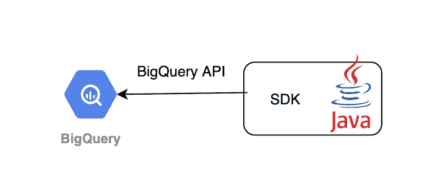

# 如何用 Java 访问 BigQuery 数据仓库

> 原文：<https://medium.com/javarevisited/how-to-access-bigquery-data-warehouse-with-java-f1d1db38a11e?source=collection_archive---------3----------------------->

## 使用 BigQuery Java SDK 执行查询

> 最初发表于

## **介绍**

*   **[Java](/javarevisited/top-5-java-online-courses-for-beginners-best-of-lot-1e1e240a758) 无疑是世界上最流行的语言，所有流行的产品都提供了通过 Java 访问它的 SDK**
*   **BigQuery 是目前流行的云数据仓库产品**