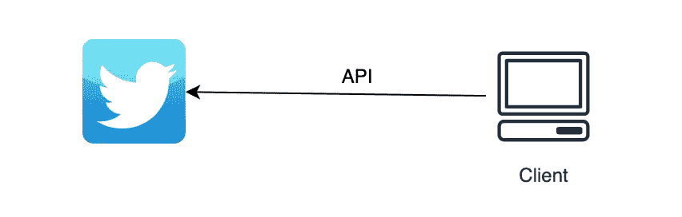

# 如何用 Java 访问 Twitter V2 API

> 原文：<https://medium.com/javarevisited/how-to-access-twitter-v2-api-with-java-6d707003e43e?source=collection_archive---------1----------------------->

## 使用 Java 客户端访问 Twitter V2 API

> 最初发表于<https://asyncq.com/how-to-access-twitter-v2-api-with-java>

## **介绍**

*   **在本文中，我们构建 Java 客户端来访问任何 twitter 用户的 twitter 追随者计数。**
*   **Twitter API v2 提供了访问必要信息的完整端点列表，例如…**