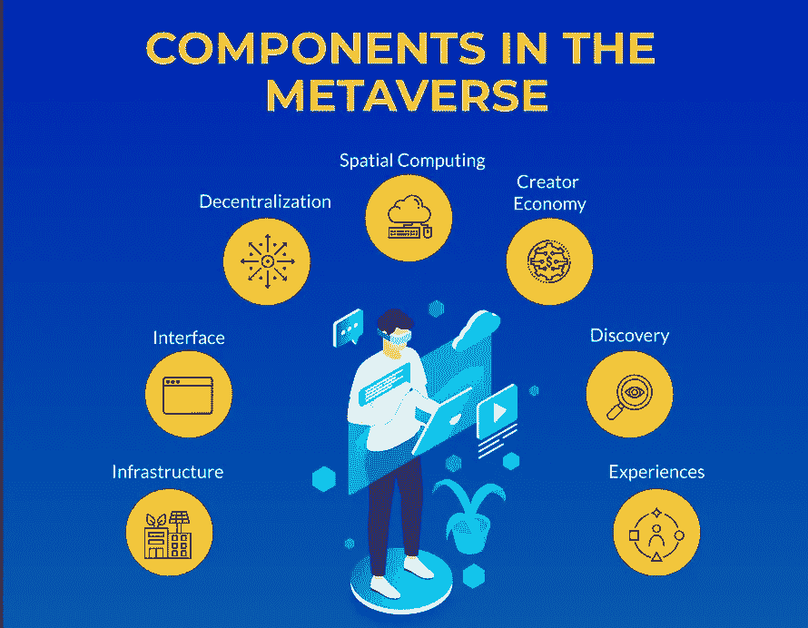
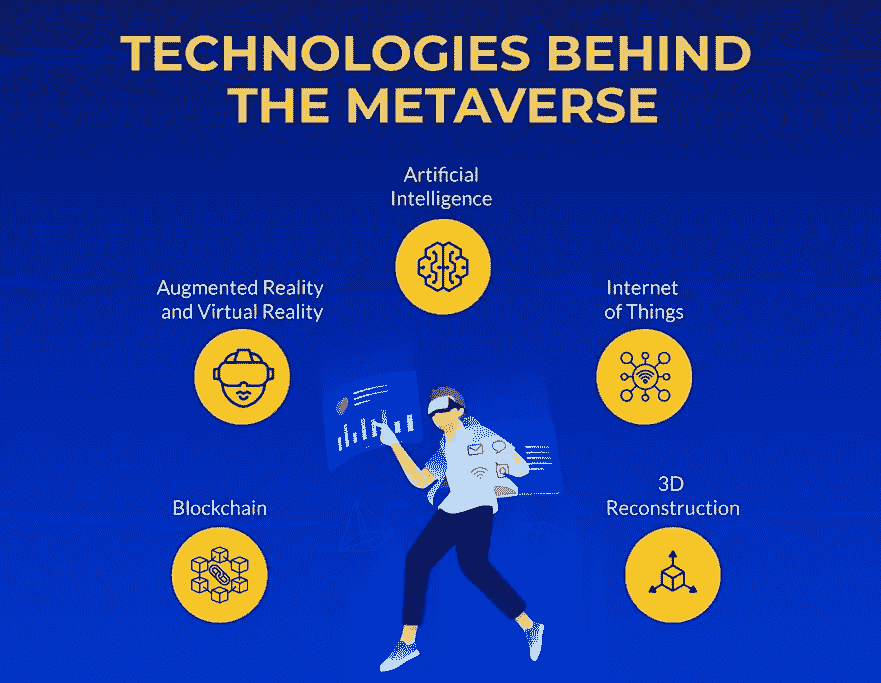
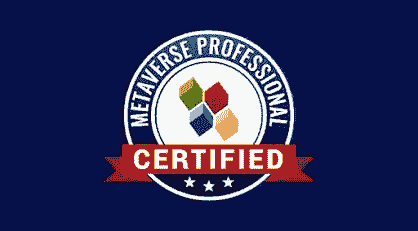
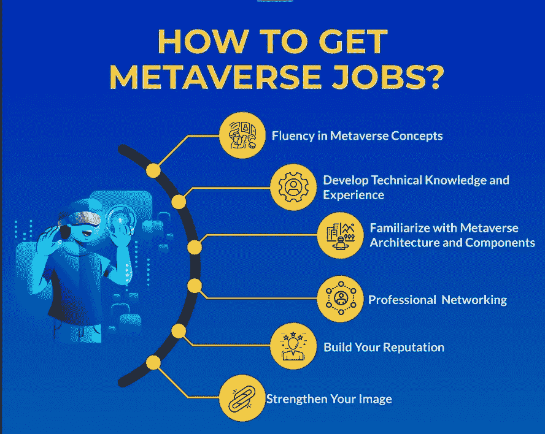

# 如何在 2022 年成为元宇宙职业球员？区块链 101 元宇宙认证值得吗？[综述]

> 原文：<https://medium.com/javarevisited/how-to-become-a-metaverse-professional-46961d3f1baf?source=collection_archive---------1----------------------->

## 这是你在 2022 年学习元宇宙并成为元宇宙认证专家的完整指南

你好，伙计们，如果你想了解元宇宙，并在 2022 年成为元宇宙的专业人士，并寻找最好的在线资源，那么你来对地方了。在…里

早些时候，我已经分享了[最佳元宇宙在线课程](https://javarevisited.blogspot.com/2022/06/best-courses-to-learn-metaverse-online.html)，在这篇文章中，我将回顾一个流行的元宇宙认证， [**认证的元宇宙专业认证**](https://shareasale.com/r.cfm?b=1696402&u=880419&m=105464&urllink=https%3A%2F%2F101blockchains%2Ecom%2Fcertification%2Fcertified%2Dmetaverse%2Dprofessional%2F&afftrack=) ，来自 101 区块链，区块链、Web3、NFT 和元宇宙培训的领先门户之一。

元宇宙是下一个大事件，你肯定听过无数次了，就像许多科技爱好者一样。元宇宙的多样元素有可能吸引地球上每个人的注意力。许多大公司已经在元宇宙投资。

因此，很明显，元宇宙专业认证将有助于职业发展。有趣的是，元宇宙的职业发展机会近年来翻了一番。

如果你想知道元宇宙认证专家(CMP)在 101 区块链值得吗？那么下面的讨论帮助你找到 101 区块链 的 [**元宇宙认证是否是你在元宇宙认证中的最佳选择。**](https://shareasale.com/r.cfm?b=1696402&u=880419&m=105464&urllink=https%3A%2F%2F101blockchains%2Ecom%2Fcertification%2Fcertified%2Dmetaverse%2Dprofessional%2F&afftrack=)

# 为什么元宇宙认证对学习元宇宙很重要？

在深入探讨 [*元宇宙认证的重要性之前，让我们先了解一下区块链 101*](https://shareasale.com/r.cfm?b=1696402&u=880419&m=105464&urllink=https%3A%2F%2F101blockchains%2Ecom%2Fcertification%2Fcertified%2Dmetaverse%2Dprofessional%2F&afftrack=)。元宇宙与当今时代有什么关系？您可以在元宇宙的定义中找到问题的答案。

这是一个开放和共享的虚拟世界，任何时候都可以访问，就像真实世界的虚拟副本一样工作。

想象一下，当你戴上虚拟现实眼镜时，你最喜欢的餐馆或购物商店的虚拟副本。人们已经开始寻求最好的元宇宙认证和培训，以跟上炒作。

然而，重要的是要知道 ***为什么元宇宙现在如此值钱*** 。有趣的是，元宇宙的独特之处为每个数字公民提供了完美的价值证明。以下是元宇宙的显著特征。

*   分散
*   个性化内容
*   创造者经济
*   经历

所有这些因素都推动了元宇宙周围的炒作，你现在在网上寻找元宇宙课程是正确的。元宇宙最棒的一点是它可以在任何时候使用，并且可以不受用户限制运行。

元宇宙的未来愿景是推动元宇宙培训课程和认证受欢迎的一个强大因素， [**元宇宙 101 认证区块链**](https://shareasale.com/r.cfm?b=1696402&u=880419&m=105464&urllink=https%3A%2F%2F101blockchains%2Ecom%2Fcertification%2Fcertified%2Dmetaverse%2Dprofessional%2F&afftrack=) **可以教你在这一领域成就事业所需的一切？**

# 元宇宙专业认证的 5 大优势

任何个人寻找一个可行的机会，成为元宇宙专业人士，将结束与分散的资源分类。区块链 101 针对元宇宙专业人士的 [*新认证*](https://shareasale.com/r.cfm?b=1696402&u=880419&m=105464&urllink=https%3A%2F%2F101blockchains%2Ecom%2Fcertification%2Fcertified%2Dmetaverse%2Dprofessional%2F&afftrack=) 为每一位学习者提供了一系列精选的好处。

作为一名 web3 或区块链的专业人士，简单地提及元宇宙知识会给你的投资组合带来很大的帮助。最重要的是，像元宇宙认证这样的独特证书可以让找工作更容易。

这里有一些其他的好处，你可以注意到由 101 区块链 CMP 认证。

## 1.向最好的人学习

101 区块链认证元宇宙的第一个好处是，它有现在最好的元宇宙在线课程。你可以从区块链的 [101 培训课程或证书中找到多种优势。](http://shrsl.com/349rm)

首先，您有一个模块化的认证培训课程，为考生准备与元宇宙相关的每一个概念。您可以了解元宇宙的基本原理、使用案例，最重要的是，元宇宙的未来前景。

## 2.未来科技

说到未来，你可以试着把元宇宙认证专家证书放在你的文件夹里，成为未来的一部分。你应该开始了解元宇宙，这样你在未来几年就不会有任何困难。

许多组织正在元宇宙尝试大规模的举措，认证专业人员是当务之急。

如果一些领先的公司现在接管，许多其他公司将加入。在这种情况下，对元宇宙专业人士的需求将大幅增加。该认证让你成为这场技术革命的一部分，并创造你自己作为 NFT 专家的身份。

## 3.综合学习

由 101 区块链认证的[元宇宙专家证书的另一个显著特点是学习体验的质量。在这门课中，你不会得到对元宇宙的随意介绍和一些例子。](https://shareasale.com/r.cfm?b=1696402&u=880419&m=105464&urllink=https%3A%2F%2F101blockchains%2Ecom%2Fcertification%2Fcertified%2Dmetaverse%2Dprofessional%2F&afftrack=)

101 区块链的认证培训课程包括从基础的[区块链](/javarevisited/the-blockchain-developer-architect-roadmap-d212d3bbbb00)和 [NFTs](/javarevisited/5-best-websites-to-learn-nft-non-fungible-tokens-305a0570729a) 到元宇宙和 web3 的关系。

通过 认证预备课程，你可以对 [**认证元宇宙专家相关的不同因素之间的相互作用有一个清晰的概念。除此之外，在认证课程中，关于投资元宇宙的真知灼见，参考了元宇宙代币、即玩即赚游戏和元宇宙广告等顶级选项。**](https://shareasale.com/r.cfm?b=1696402&u=880419&m=105464&urllink=https%3A%2F%2F101blockchains%2Ecom%2Fcertification%2Fcertified%2Dmetaverse%2Dprofessional%2F&afftrack=)

## 4.练习，练习，再练习

你还会发现区块链 101 大学颁发的最佳元宇宙认证是一种积极主动的学习工具。每个模块提供的互动练习和演示是强化学习成果的重要工具。

这些练习展示了学习成果在现实生活中的实施方式。

例如，元宇宙体验的演示可以帮助你知道如何穿越元宇宙。同时，通过利用 web3，你也可以使用这些知识来构建你自己的元宇宙体验。

拥有 101 区块链认证的[元宇宙在线课程的优势因实践元素而加倍。](https://shareasale.com/r.cfm?b=1696402&u=880419&m=105464&urllink=https%3A%2F%2F101blockchains%2Ecom%2Fcertification%2Fcertified%2Dmetaverse%2Dprofessional%2F&afftrack=)

# 元宇宙认证专业课程适合我吗？作为初学者？

对于普通的软件开发人员或技术专业人员来说，元宇宙的概念可能显得有些牵强。因此，初学者更容易对在元宇宙就业的可行性产生各种疑虑。然而，这不应该成为你利用 101 区块链的[最佳元宇宙认证的障碍。](https://shareasale.com/r.cfm?b=1696402&u=880419&m=105464&urllink=https%3A%2F%2F101blockchains%2Ecom%2Fcertification%2Fcertified%2Dmetaverse%2Dprofessional%2F&afftrack=)

认证培训课程的设计特别关注您理解元宇宙所需的基本概念。您可以利用培训课程的一系列子主题来强化您的元宇宙基础知识。

初学者可以建立一个强大的基础，学习他们需要的一切，开始在*元宇宙*的基础训练。专业人士会发现最好的元宇宙课程，用于培训使用元宇宙的理想方法。

您可以思考元宇宙的不同使用案例，同时探索在元宇宙投资的各种途径。有效的主题组织以及无缝的学习体验可确保初学者和专业人员都能轻松接受认证培训。

## 成为元宇宙开发者需要什么技能？

为了成为一名元宇宙开发者，你需要以下技能，这些也是元宇宙背后的技术，一旦你知道这些技能，你就很容易理解和开发元宇宙应用程序

以下是成为元宇宙开发者所需的关键技能:

1.  [人工智能](/javarevisited/7-best-courses-to-learn-artificial-intelligence-in-2020-26d59d62f6fe)
2.  [区块链](/javarevisited/7-best-places-to-learn-blockchain-technology-online-for-free-89cfbeab669a)
3.  [物联网](/javarevisited/my-favorite-courses-to-learn-internet-of-things-iot-in-2020-best-of-lot-8517aa9fc838)
4.  增强现实和虚拟现实
5.  三维重建

你可以通过探索 [**101 区块链课程**](https://www.shareasale.com/r.cfm?b=1713885&u=880419&m=105464&urllink=&afftrack=) 轻松获得所有这些技能，在那里他们解释了[区块链](/javarevisited/7-free-courses-to-learn-blockchain-in-2020-764e66b47ebe)和[物联网](/javarevisited/my-favorite-courses-to-learn-internet-of-things-iot-in-2020-best-of-lot-8517aa9fc838)以及 Web3 和元宇宙，你只需一个 [***101 区块链会员***](https://www.shareasale.com/u.cfm?d=763122&m=105464&u=880419) 就可以获得所有这些技能，你现在还可以使用我的优惠券 BCHAIN30 获得 30%的折扣。

## 我能按时完成元宇宙认证吗？

初学者通常对完成认证培训课程和获得考试资格的时间框架感到好奇。然而， [*CMP 认证*](https://shareasale.com/r.cfm?b=1696402&u=880419&m=105464&urllink=https%3A%2F%2F101blockchains%2Ecom%2Fcertification%2Fcertified%2Dmetaverse%2Dprofessional%2F&afftrack=) 的好处是你可以在 4 周的时间内完成。

候选人可以每周花三到四个小时来完成培训课程模块中的所有主题。

相反，像专家一样深入每个模块和子主题来了解元宇宙也很重要。例如，流行的元宇宙平台的演示和元宇宙的用例可以提高您对元宇宙和相关概念的实际理解。

101 区块链在[元宇宙认证中提供的灵活学习对每个学习者来说都是一个明显的优势，可以加强他们的元宇宙专业知识。](https://shareasale.com/r.cfm?b=1696402&u=880419&m=105464&urllink=https%3A%2F%2F101blockchains%2Ecom%2Fcertification%2Fcertified%2Dmetaverse%2Dprofessional%2F&afftrack=)

## 如何充分利用区块链 101 上的元宇宙课程？

对于任何想成为元宇宙专业人士的人来说，在线获取可靠的元宇宙课程的便利性显然是由 [*101 区块链*](https://www.shareasale.com/u.cfm?d=763121&m=105464&u=880419) 认证的一个吸引人的细节。

候选人可以使用该课程，并在专家的指导下提高他们的元宇宙技能和知识。另一方面，你可以有更好的成功机会使用元宇宙课程的以下最佳实践。

*   任何培训课程取得成功的第一步都是概述课程所提供的内容。对于课程中的课程或模块，以及它们是否有助于你实现预期目标，你必须有一个清晰的想法。
*   看一看元宇宙课程每个模块中提供的所有资源。这将有助于确保你利用课程的每一点优势。
*   将互动练习和演示确定为增强您使用元宇宙的实践知识的合适工具。
*   了解有关元宇宙使用案例的更多信息，以增强信心并详细了解元宇宙的功能。

新的元宇宙认证是一个有价值的学习资源，可以证明你在元宇宙方面的技能和知识。如何利用与元宇宙相关的长期利益？探索专业认证对元宇宙专家的价值，以自己的方式实现卓越。

## 如何得到元宇宙的工作？

如果你想知道如何找到一份元宇宙开发者或创造者的工作，那么这里有一份很好的元宇宙开发者工作路线图，由 [**101 区块链**](http://shrsl.com/349rm) 提供，它告诉你如何在 2022 年和 2023 年找到元宇宙的工作

## 结论

关于由 101 区块链 认证的 [**元宇宙专业认证的总体印象表明这是一个值得信赖的选择。首先，你在认证考试目标上有内容宽泛的优势。**](https://shareasale.com/r.cfm?b=1696402&u=880419&m=105464&urllink=https%3A%2F%2F101blockchains%2Ecom%2Fcertification%2Fcertified%2Dmetaverse%2Dprofessional%2F&afftrack=)

你可以发现元宇宙专业人士在 101 区块链的新认证中为模块添加正确副标题的精确性。

此外，区块链 101 作为一家培训课程提供商，在分散技术领域拥有丰富的专业知识。因此，你不必担心元宇宙的新认证会让你感觉像一条离开水的鱼。

你可能喜欢的其他**区块链文章和教程**:

*   [如何从零开始学习 2022 年的元宇宙？](https://javarevisited.blogspot.com/2022/07/how-to-learn-metaverse-from-scratch-is.html)
*   [101 区块链认证区块链开发者值得吗？](https://javarevisited.blogspot.com/2022/05/review-is-certified-enterprise-blockchain-professional-certification-worth.html)
*   [开发者的 10 门最佳区块链课程](/javarevisited/best-blockchain-courses-and-certification-in-2020-63729f8f04d0)
*   [用区块链学习 HyperLedger Fabric 的 5 门课程](https://javarevisited.blogspot.com/2022/02/top-5-courses-to-learn-hyperledger-blockchain.html)
*   [2022 年免费学习区块链的 5 个最佳地点](https://javarevisited.blogspot.com/2022/06/top-5-websites-to-learn-blockchain-in.html)
*   [3 门 Coursera 课程让你在 2022 年成为区块链开发者](https://javarevisited.blogspot.com/2022/06/best-coursera-courses-for-blockchain.html)
*   [2022 年 10 门元宇宙在线初学者课程](https://javarevisited.blogspot.com/2022/06/best-courses-to-learn-metaverse-online.html)
*   [认证 NFT 专业认证值得吗？](https://javarevisited.blogspot.com/2022/06/review-is-certified-nft-certification-worth-it.html)
*   [我最喜欢的学习以太坊的在线课程](https://javarevisited.blogspot.com/2021/11/top-5-courses-to-learn-ethereum-for.html)
*   [2022 年十大区块链认证](https://javarevisited.blogspot.com/2020/07/top-5-online-courses-to-learn-blockchain.html)
*   [2022 年区块链 5 门最佳 Coursera 课程](https://javarevisited.blogspot.com/2022/01/5-best-blockchain-certifications-and.html)
*   [我最喜欢的学习不可替换代币的课程](https://javarevisited.blogspot.com/2021/12/top-5-courses-to-learn-about-nfts-non.html)
*   [2022 年学习区块链的前 5 本书](https://javarevisited.blogspot.com/2022/06/top-5-books-to-learn-blockchain-for.html)
*   [20 大区块链面试问题及答案](https://javarevisited.blogspot.com/2022/07/blockchain-interview-questions-answers.html)
*   [2022 年 10 门免费 NFT 初学者课程](https://javarevisited.blogspot.com/2022/07/free-nft-non-fungible-tokens-courses.html)
*   [深度学习区块链的 6 大网站](https://dev.to/javinpaul/6-best-websites-to-become-a-blockchain-developer-in-2022-3han)

每个学习者在学习过程中得到的支持对他们职业生涯的形成起着至关重要的作用。当世界逐渐开始进入虚拟维度时，它已经准备好向未来迈出第一步。现在是学习元宇宙的好时机，如果你想成为一名元宇宙专业人士，那么这里有 [**的链接，加入 101 区块链**](https://shareasale.com/r.cfm?b=1696402&u=880419&m=105464&urllink=https%3A%2F%2F101blockchains%2Ecom%2Fcertification%2Fcertified%2Dmetaverse%2Dprofessional%2F&afftrack=) 的元宇宙认证。您还可以使用折扣代码 BCHAIN30 在有限的时间内获得 30%的折扣。

<https://javarevisited.blogspot.com/2022/07/how-to-learn-metaverse-from-scratch-is.html> 